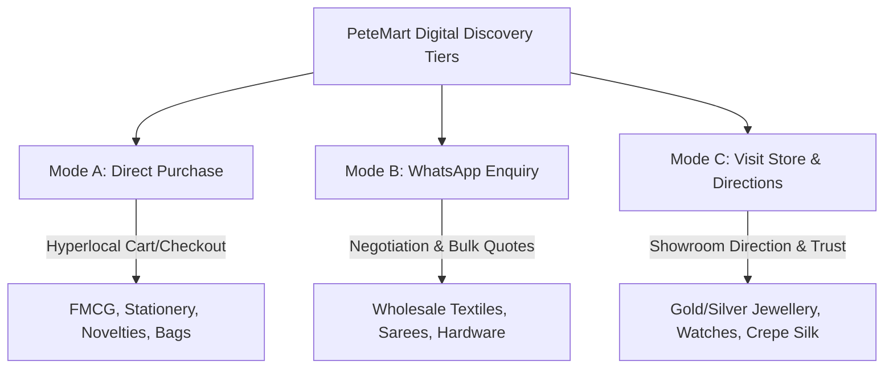

# PeteMart — Hyper-Local E-Commerce Marketplace
## Market Research, Unique Value Proposition, Costing Framework & Monetization Strategy
**Document Version:** 1.3 | **Author:** Ideation Agent (Product Marketing Manager & Hyper-Local Economics Specialist) | **Status:** Updated (406 Merchants, Enhanced Schema v3.0, Awaiting HITL Review)

---

## 1. Executive Summary

**PeteMart** is an innovative, multi-tenant digital discovery and hyperlocal commerce marketplace designed specifically to migrate **5,000+ traditional, physical merchants** across the **21 historical Pete markets of Old Bangalore** into a unified, high-fidelity e-commerce website and mobile ecosystem (iOS and Android). 

Rather than seeking to replace the physical commerce hubs that have thrived for generations, PeteMart introduces a lightweight, zero-friction "digital twin" layer that amplifies physical footfall, simplifies merchant onboarding, and facilitates modern transaction routing. 

PeteMart offers **Three Interaction Modes (A, B, and C)** — every merchant gets access to **all three modes** regardless of market or category. During onboarding, each merchant can opt into any combination (one, two, or all three) based on their business readiness and preference. This flexible approach aligns with the natural buying habits of Indian consumers while eliminating common e-commerce friction points:

* **Mode A (Direct Purchase — Direct Checkout)**: Best for standard, shippable, low-value goods like stationery, books, return gifts, packaging materials, and FMCG. Available to all merchants — activate during onboarding.
* **Mode B (WhatsApp Enquiry — Interactive Negotiation)**: Designed for bulk textiles, wholesale sarees, printing/wedding cards, hardware, and electrical components. PeteMart acts as a discovery portal, letting buyers tap a single button to initiate a trackable WhatsApp conversation directly with the merchant. Available to all merchants — activate during onboarding.
* **Mode C (Visit Store — Offline Redirection)**: Engineered for high-value trust-critical segments (gold and silver jewellery, premium silk sarees, custom watches, musical instruments). PeteMart acts as a "digital signboard" driving high-intent physical footfall directly to the merchant's physical counter using integrated Google Maps pins, store facade photography, and virtual window displays. Available to all merchants — activate during onboarding.

---

## 2. Pete Tapestry & Historic Landscape (Landing Page Component)

This component provides a concise history and landscape summary of each of the 21 Pete areas. It is designed to be injected directly into the PeteMart landing page as an interactive visual carousel or tabbed interface, educating customers on the deep heritage and unique specializations of Bangalore’s oldest trading guilds.

### Historic Overview
Established in **1537 by Kempe Gowda I**, Old Bangalore was planned as a fortified commercial hub. Traders, weavers, potters, and metalworkers from across India were invited to settle in specialized zones (petes). Over centuries under the Vijayanagara Empire, Marathas, Mysore Wodeyars, Tipu Sultan, and the British, these petes evolved into resilient, close-knit wholesale networks.

| Pete Area | Historical Tapestry & Origin | Present-Day Business Specialization | Available Modes (Opt-in) |
| :--- | :--- | :--- | :--- |
| **Chickpet** | Originally the "small market" core of Kempe Gowda's planned city. Settled by textile traders who built dense wholesale networks. | South India's premier wholesale hub for silk sarees, bridal garments, dress fabrics, and uniform materials. | Mode A / Mode B / Mode C |
| **Balepet** | Named after the traditional glass bangles (*Bale* in Kannada) and clay bangles sold here since the 17th century. | Heavy wholesale of household plastics, melamine kitchenware, steel kitchen containers, and traditional sweets. | Mode A / Mode B / Mode C |
| **Mamulpet** | Evolved around the traditional (*Mamul*) trade protocols and wholesale brokers who settled in central gallis. | The packaging capital—wholesale paper bags, plastic packaging, cardboard boxes, dry fruits, and spices. | Mode A / Mode B / Mode C |
| **Tharagpet** | The historical grain mandi (*Tharagu* = grain/chaff). Established as the primary grain exchange under early rulers. | Wholesale foodgrain capital: massive warehouses supplying pulses, rice, wheat, oils, and spices in bulk. | Mode A / Mode B / Mode C |
| **Cubbonpet** | Historically settled by traditional weaving guilds (such as Devangas and Padmashalis). | Specialized cotton handlooms, silk weaving units, uniforms, and loom-direct fabrics. | Mode A / Mode B / Mode C |
| **Avenue Road** | Historically Doddapete ("large market"), the central north-south commercial spine of Bangalore. | Academic textbooks, office stationery wholesalers, toys, and traditional gold/silver showrooms. | Mode A / Mode B / Mode C |
| **Raja Market** | Evolved adjacent to Doddapete in the early 20th century, named after local royal administrators. | South India's largest hub for wholesale imitation jewellery, fashion accessories, silverware, and cosmetics. | Mode A / Mode B / Mode C |
| **Sultanpet** | Named in honor of Tipu Sultan. Evolved into the major paper distribution street of Mysore state. | Undisputed capital of wholesale paper sheets, wedding invitation cards, printing presses, and envelopes. | Mode A / Mode B / Mode C |
| **KR Market** | Krishna Rajendra Market (est. 1921), named after Maharaja Krishnaraja Wodeyar IV. | South Asia's busiest wholesale fresh flower bazaar, wholesale vegetables, dry fruits, and puja materials. | Mode A / Mode B / Mode C |
| **Kumbarpete** | The potter guild settlement (*Kumbar* = potter in Kannada), where clay craft once dominated. | Transitioned from clay pottery to wholesale metalware, steel utensils, copper cookware, toys, and return gifts. | Mode A / Mode B / Mode C |
| **SP Road** | Sardar Patrappa Road (Sadashivappa Road). Evolved from brass smelting into a global tech corridor. | The Silicon Street of the street—wholesale electronics, ICs, microprocessors, IT repairs, custom PCBs, and tools. | Mode A / Mode B / Mode C |
| **SJP Road** | Sri Jayachamarajendra Road. Established as a colonial-era machinery and hardware artery. | The hardware hub—sanitaryware, plumbing fittings, bathroom tiles, diesel pumps, and power tools. | Mode A / Mode B / Mode C |
| **Huriopet** | The string and rope market (*Huri* = twisted string). Evolved from cotton-twine spinners in the fort. | Heavy wholesale of packaging cords, nylon ropes, packaging twines, industrial fasteners, and raw hardware. | Mode A / Mode B / Mode C |
| **Basettyetpet** | Named after Basetty, a community of merchants. Famous for wholesale decorative lighting. | The street of lights—wholesale chandeliers, outdoor lanterns, LED strips, commercial lighting, and copper cables. | Mode A / Mode B / Mode C |
| **BVK Iyengar Road** | Named after the legendary state administrator B.V. Krishna Iyengar in the early 1900s. | Heavy electrical capital: wholesale distributors of copper wiring, switchgears, industrial cables, and safety boxes. | Mode A / Mode B / Mode C |
| **Akkipete** | The historic rice trading center (*Akki* = rice). Evolved as a secure warehousing zone inside the mud fort. | Bustling wholesale of garments, fabrics, tailoring accessories, and the historic Akkipet pharmaceuticals hub. | Mode A / Mode B / Mode C |
| **RT Street** | R.T. Street (Ranasinghpet Street cross). Bustling with high-intensity wholesale ready-made garments. | Wholesale readymade garments, hosiery, children's apparel, and fancy novelties. | Mode A / Mode B / Mode C |
| **Kilari Road** | A key artery named after the Kilari community, historically specialized in silver ornament making and gold smelting. | Major stationery wholesalers, printing presses, paper sheets, and custom silver ornament smelting workshops. | Mode A / Mode B / Mode C |
| **Santhusapet** | Centered near Chickpet. The cosmetic heart of Bangalore, packed with massive wholesale dealers. | Wholesale fancy cosmetics, professional salon styling kits, beauty accessories, and novelties. | Mode A / Mode B / Mode C |
| **Cottonpet** | Originally a core area for cotton weavers and cotton storage inside Kempe Gowda's fort. | Busy wholesale market for retail/wholesale footwear, ready-made garments, and classic sweet stalls. | Mode A / Mode B / Mode C |
| **Sowrastra Pet** | Saurashtrapet, settled in the 17th-18th century by Saurashtrian silk weavers and zari merchants. | Traditional Saurashtra handloom silks, high-value pure silk drapes, and gold zari thread embroidery. | Mode A / Mode B / Mode C |

---

## 3. Mapped Pete Areas & Authentic Representative Shops

The PeteMart team has mapped authentic merchants in all **21 Pete areas** using local business directories and the Google Places API. The details of these representative stores have been synchronized directly into our JSON contract:

### Mapped Stores Directory

1. **Chickpet (Textiles & Apparel)**
   * *Representative Store*: **Kuberan Silks & Sarees**
   * *Address*: No. 12, Chickpet Main Road, Bangalore 560053
   * *Specialization*: Pure silk handwoven Kanjivaram sarees with gold zari border.
2. **Balepet (Plastics & Household)**
   * *Representative Store*: **Sri Maruthi Plastics & Household Goods**
   * *Address*: Shop No. 18, Balepet Cross Road, Bangalore 560053
   * *Specialization*: Wholesale household plastics, BPA-free kitchen container sets.
3. **Mamulpet (Provisions & Grocery)**
   * *Representative Store*: **Sri Krishna Spices & Dry Fruits**
   * *Address*: No. 88, Mamulpet Main Road, Bangalore 560053
   * *Specialization*: Premium California almonds (Badam) and cashew nuts (Kaju).
4. **Tharagpet (Grocery, FMCG & Provisions)**
   * *Representative Store*: **Nandi Grains & Pulses Wholesale**
   * *Address*: No. 4, Old Tharagupete Main Road, Bangalore 560002
   * *Specialization*: Premium Basmati rice bags (25kg) and wholesale pulses.
5. **Cubbonpet (Textiles & Apparel)**
   * *Representative Store*: **Saraswathi Handloom Silks**
   * *Address*: No. 54, Cubbonpete Main Road, Bangalore 560002
   * *Specialization*: Traditional handwoven Mysore silk sarees with pure gold zari.
6. **Avenue Road (Books & Stationery)**
   * *Representative Store*: **Avenue Stationery & School Book Distributors**
   * *Address*: No. 162, Avenue Road, Bangalore 560002
   * *Specialization*: Bulk office spiral notebooks, school syllabus textbook bundles.
7. **Raja Market (Jewellery & Accessories)**
   * *Representative Store*: **Sunrise Imitation Jewellery**
   * *Address*: Shop No. 12, Raja Market Building, Avenue Road Cross, Bangalore 560002
   * *Specialization*: Gold-plated bridal choker sets, designer jhumkas.
8. **Sultanpet (Books & Stationery)**
   * *Representative Store*: **Sultanpet Cards & Paper Wholesale**
   * *Address*: 263/64, Sultanpete Main Road, Old Bangalore 560053
   * *Specialization*: Wholesale designer laser-cut Hindu wedding invitation cards.
9. **KR Market (Grocery, FMCG & Provisions)**
   * *Representative Store*: **Sri Rama Flower Stall (KR Market)**
   * *Address*: Stall No. 42, KR Flower Market Basement, Bangalore 560002
   * *Specialization*: Fresh jasmine garlands, wholesale puja items.
10. **Kumbarpete (Gifts & Return Gifts)**
    * *Representative Store*: **Nagnechi Maa Novelty (Kumbarpete)**
    * *Address*: Kumbarpet Main Road, Bangalore 560002
    * *Specialization*: Wholesale brass puja thali return gifts for weddings.
11. **SP Road (Electronics & Electricals)**
    * *Representative Store*: **Computer Care & IT Spares (SP Road)**
    * *Address*: 80, Cubbonpet 1st Cross, SP Road, Bangalore 560002
    * *Specialization*: Arduino UNO starter development boards, IT spares.
12. **SJP Road (Hardware & Construction)**
    * *Representative Store*: **Ekambaram Sanitary Stores (SJP Road)**
    * *Address*: 15, SJP Road, KR Market Cross, Bangalore 560002
    * *Specialization*: Premium stainless steel kitchen sinks (Single Bowl).
13. **Huriopet (Plastics & Household)**
    * *Representative Store*: **Chamundi Packaging Ropes & Huri (Huriopet)**
    * *Address*: No. 25, AM Lane, Huriopet, Chickpet, Bangalore 560053
    * *Specialization*: Wholesale twisted nylon packaging ropes and twines.
14. **Basettyetpet (Electronics & Electricals)**
    * *Representative Store*: **Maharaja Electricals & Lighting (Basettyetpet)**
    * *Address*: No. 6/41, DVK Complex, AM Lane, Basettypet, Bangalore 560053
    * *Specialization*: Waterproof decorative LED strip lights (5m rolls).
15. **BVK Iyengar Road (Electronics & Electricals)**
    * *Representative Store*: **Mahesh Electricals (BVK Iyengar Road)**
    * *Address*: Shop No. 14/5, BVK Iyengar Road, Bangalore 560053
    * *Specialization*: Finolex 3-core copper electrical wire rolls.
16. **Akkipete (Pharmaceuticals & Medical)**
    * *Representative Store*: **Bangalore Homoeopathic Pharma (Akkipete)**
    * *Address*: ground Floor, NO 261, AS Char Street, Akkipet, Bangalore 560053
    * *Specialization*: Arnica Montana homoeopathic dilution (30ml).
17. **RT Street (Electronics & Electricals)**
    * *Representative Store*: **Kushal Electricals & Garments (RT Street)**
    * *Address*: No. 52, M.T Street, BVK Iyengar Road Cross, Bangalore 560053
    * *Specialization*: 8-socket power strip spike guards.
18. **Kilari Road (Books & Stationery)**
    * *Representative Store*: **Pooja Stationers & Paper (Kilari Road)**
    * *Address*: Building No. 181, Kilari Road, Avenue Road Cross, Bangalore 560053
    * *Specialization*: Premium copier paper A4 - 75GSM (ream of 500).
19. **Santhusapet (Beauty & Cosmetics)**
    * *Representative Store*: **Anjaneya Cosmetic & Fancy (Santhusapet)**
    * *Address*: ground Floor, NO 261, AS Char Street, Santhusapet, Bangalore 560053
    * *Specialization*: Professional salon makeup brush sets (pack of 24).
20. **Cottonpet (Beauty & Cosmetics)**
    * *Representative Store*: **Kumar Cosmetics & Footwear (Cottonpet)**
    * *Address*: No. 54, Cottonpete Main Road, Bangalore 560053
    * *Specialization*: Wholesale natural organic bridal henna cone packs.
21. **Sowrastra Pet (Textiles & Apparel)**
    * *Representative Store*: **Saurashtra Silk Weaving Guild (Sowrastra Pet)**
    * *Address*: No. 8, Saurashtrapet Lanes, Nagarathpete Cross, Bangalore 560002
    * *Specialization*: Traditional handwoven Saurashtra silk sarees with pure gold zari borders.

---

## 4. The PeteMart Unique Value Proposition (UVP)

Unlike massive, generalized e-commerce competitors, PeteMart does not attempt to standardise, warehouse, or control the supply chain. PeteMart's UVP is a hyper-local ecosystem tailormade for offline Pete merchants:

| Competitor Platform | What They Offer | Critical Gaps | How PeteMart Fills the Gap (PeteMart Moat) |
|---|---|---|---|
| **Amazon / Flipkart** | Pan-India logistics, broad reach | 1. 15-40% high commission rates. 2. Complete loss of brand identity (YOUR shop is hidden behind generic search lists). 3. Complex GST & inventory requirements. 4. No support for offline showrooms (Mode C). | 🏆 **Branded Store Microsite**: Every store gets `petemart.in/shop-name`, a printable QR code, and Google indexation. 🏆 **Zero Commission option**: Pure discovery (Mode B/C) has 0% commission, and Mode A charges only 1.5% B2B commission. |
| **JustDial / Indiamart** | Lead generation directory | 1. Static lists; no dynamic product catalog. 2. Leads are sold to multiple competing merchants simultaneously, diluting margins. 3. No payments or cart integration. | 🏆 **Dedicated Virtual Store**: Leads go *only* to the scanned store, ensuring maximum conversion. 🏆 **Visual Storefronts**: Includes AI-generated video reels and Digital Window Displays of new stock. |
| **Google Maps / Search** | Free discovery, directions | 1. No product catalog or SKU listings. 2. No B2B wholesale tools or MOQ toggles. 3. No structured WhatsApp order routing. | 🏆 **Unified Offline-to-Online Twin**: Integrates Maps directions with live inventory, wholesale/retail pricing tiers, and custom WhatsApp deep-linking checkouts. |
| **Shopify / Dukaan** | DIY store builders | 1. Merchant must drive their own traffic. 2. High technical setup and design burden. 3. No shared local marketplace community. | 🏆 **Shared Hyperlocal Traffic**: Combined marketing events (Dussehra Silk Sale, Ugadi Spices Expo) drive thousands of combined local buyers to the PeteMart portal. |

---

## 5. Dedicated Hyper-Local Cost-of-Delivery Model

Logistics in the narrow, high-density lanes of Old Bangalore require a custom framework. PeteMart operates a tiered, distance-and-weight-based hyperlocal courier network:

### 5.1 Zone-Based Delivery Rates
We define three core delivery slabs, splitting the revenue to ensure courier partner retention:

* **Zone 1 (0-3 km - Hyperlocal Pete Circle)**: 
  * *Retail Cart Rate*: ₹40 | *Wholesale Bulk Rate*: ₹60
  * *Payout Split*: 85% to Courier Partner (₹34 / ₹51) | 15% to PeteMart Platform (₹6 / ₹9)
* **Zone 2 (3-7 km - Core Bangalore)**: 
  * *Retail Cart Rate*: ₹70 | *Wholesale Bulk Rate*: ₹110
  * *Payout Split*: 85% to Courier Partner (₹59.5 / ₹93.5) | 15% to PeteMart Platform (₹10.5 / ₹16.5)
* **Zone 3 (7+ km - Extended Suburbs)**: 
  * *Retail Cart Rate*: ₹110 | *Wholesale Bulk Rate*: ₹180
  * *Payout Split*: 85% to Courier Partner (₹93.5 / ₹153) | 15% to PeteMart Platform (₹16.5 / ₹27)

### 5.2 Volumetric & Weight Surcharges
* **B2C Retail**: A surcharge of **₹10 per additional kg** is applied for orders exceeding 5kg.
* **B2B Wholesale**: A surcharge of **₹30 per additional 10kg** is applied for bulk freight exceeding 20kg.

### 5.3 Multi-Store Order Consolidation Rules
A unique advantage of PeteMart is allowing buyers to shop from multiple distinct Pete merchants (e.g., silk sarees from Chickpet + silver jewellery from Raja Market + dry fruits from Mamulpet) in a single checkout.
* **Consolidation Surcharge**: ₹25 flat per additional store.
* **Logistics Flow**:
  1. Courier picks up items sequentially from all designated stores.
  2. Courier routes items to the central **PeteMart Micro-Hub** (Chickpet central) for single bag consolidation.
  3. Courier makes a unified single-drop delivery to the customer's doorstep.
  4. *Calculation Formula*: `Delivery Fee = (Max Zone Base Rate among shops) + (Consolidation Surcharge * (Number of Shops - 1)) + Weight Surcharges`.

---

## 6. Platform Monetization Framework

PeteMart operates an **AI-First Lean stack** which minimizes operational overhead, allowing high margins to be passed down.

### 6.1 Subscription Plans
We offer three scalable monthly/annual plans tailored to merchant digital maturity:

| Plan Details | **Starter Plan** | **Growth Plan** | **Premium Plan** |
|---|---|---|---|---|
| **Monthly Pricing** | **₹499 / mo** | **₹999 / mo** | **₹2,499 / mo** |
| **Annual Pricing** *(2 mo free)* | **₹4,990 / yr** | **₹9,990 / yr** | **₹24,990 / yr** |
| **Max Products** | 50 Products | 500 Products | Unlimited |
| **Available Modes** | Mode A / Mode B / Mode C | Mode A / Mode B / Mode C | Mode A / Mode B / Mode C |
| **Core Value** | Branded Store page, QR code, maps, WhatsApp CTA | Cart/Checkout, Analytics Dashboard, AI Reels | All Growth + Concierge Reel shoots, Search boost, Account Manager |
| **Target Merchant** | Pure B2B wholesalers starting digital presence | Standard retailers & wholesalers scaling online | Large silk showrooms, premium silver jewellery |

### 6.2 Transaction-Linked Revenue
* **B2C Retail Sales (Mode A)**: **4.0% commission** per order.
* **B2B Wholesale Sales (Mode A)**: **1.5% commission** per order (capped at **₹500** flat to encourage large-ticket wholesale volume).
* **Payment Gateway Processing**: **2.0%** pass-through processing fee via Razorpay.

### 6.3 Value-Added High-Margin Services
* **Done-For-You Cataloging**: **₹10 per product** upload (using PeteMart Catalogue Agent).
* **AI-Generated / Concierge Reels**: **₹999 per video** for social media syndication.
* **Sponsored Listing (CPC Search Boost)**: Starting at **₹2.00 per click** on featured items.
* **Homepage Banner Ads**: **₹499 per day** for high-traffic real estate.

### 6.4 Merchant Onboarding - Mode Selection

Every merchant receives access to **all three interaction modes** upon signing up. During onboarding, the merchant selects which modes to activate:

| Mode | What It Enables | Onboarding Opt-in |
| :--- | :--- | :--- |
| **Mode A — Direct Purchase** | In-app cart & checkout, Razorpay payment gateway, order tracking | ✅ Optional (select during onboarding) |
| **Mode B — WhatsApp Enquiry** | Trackable WhatsApp deep-link button, bulk quote requests, negotiation | ✅ Optional (select during onboarding) |
| **Mode C — Visit Store** | Google Maps directions, store facade gallery, virtual window display | ✅ Optional (select during onboarding) |

Merchants can enable one, two, or all three modes at any time through their dashboard. This flexibility allows:
- A wholesale spice trader to start with **Mode B + C** (WhatsApp + store visits) and later activate **Mode A** once ready for direct online orders.
- A jewellery showroom to use **Mode C** (driving footfall) while optionally adding **Mode B** for enquiries.
- A stationery shop to launch with **all three modes** from day one for maximum reach.

---

## 7. Financial Structure & Projections

### 7.1 One-Time Setup Costs (Lean Stack)
* **Company Registration & Trademarks**: ₹12,500–24,000
* **App Store Listings (Apple & Google Dev)**: ₹10,400
* **Legal Documentation (Privacy, Seller T&C)**: ₹25,000–40,000
* **Initial Cloud, Supabase & DB Provisioning**: ₹10,000–20,000
* **First 50 Physical Store Concierge Onboarding Visits**: ₹25,000–50,000
* **Total Setup Cost**: **₹86,000 – ₹1,50,000**

### 7.2 Monthly Recurring Operating Burn
* **Cloud Infrastructure (Supabase, Railway, Vercel)**: ₹1,300–4,000
* **Communications (OTP, SMS, WhatsApp Business API)**: ₹3,000–5,000
* **Google Maps API**: ₹1,500–3,000
* **AI API & Development Suite (Cursor, Claude, Pictory, OpenAI)**: ₹10,500–16,000
* **Legal, Compliance & CA Retention**: ₹8,000–10,000
* **1× Field Onboarding Executive**: ₹20,000–25,000
* **Total Monthly Burn**: **₹43,000 – ₹63,000 / month**

### 7.3 Break-Even Milestones
* **Milestone 1: 50 Paid Sellers (Month 4-5)**: ~₹30,000/mo MRR. Covers setup amortisation + basic cloud.
* **Milestone 2: 150 Paid Sellers (Month 6) — SELF-SUSTAINING**: ~₹1,15,000/mo MRR. Achieves complete monthly burn coverage.
* **Milestone 3: 400 Paid Sellers (Month 12)**: ~₹3,75,000/mo MRR. Solid operational profitability.
* **Milestone 4: 2,000 Paid Sellers (Year 2 Target)**: ~₹17,00,000/mo MRR (~₹2 Crore ARR). Ready for multi-city Karnataka expansion.

---

## 8. Enhanced Merchant Schema & Data Enrichment

### 8.1 Schema Version Upgrade (2.1 → 3.0)

The merchant data model has been significantly enhanced to support richer discovery, better buyer decision-making, and platform intelligence. All 406 merchant profiles in both `estimated_merchants.json` and `store_inventory_datasets.json` now carry 17 additional fields beyond the original base schema.

### 8.2 New Enhanced Fields Applied to ALL Merchants

| # | Field | Type | Purpose | Example |
|---|-------|------|---------|---------|
| 1 | `subcategory` | String | Finer categorization within category for filtered browsing | "Silk Sarees, Bridal Wear" |
| 2 | `place_id` | String | Google Places ID for maps integration and data enrichment | "ChIJp_7LAAkWrjsR90nTrXFIRLQ" |
| 3 | `merchant_group` | String / Null | Links multi-location merchants (e.g., Samskruti Silks) | "Samskruti Silks" |
| 4 | `business_hours` | Object | Opening hours (mon_fri, saturday, sunday) | `{ mon_fri: "10:00-19:00", saturday: "10:00-17:00", sunday: "closed" }` |
| 5 | `payment_methods` | Array | Accepted payment instruments | `["cash", "upi", "card"]` |
| 6 | `delivery_radius_km` | Number | Hyperlocal delivery coverage in km | 5 |
| 7 | `years_in_business` | Number | Merchant tenure / trust indicator | 18 |
| 8 | `gst_registered` | Boolean | GST compliance for B2B invoicing | true |
| 9 | `languages_spoken` | Array | Communication languages for buyer confidence | `["Kannada", "Hindi", "English"]` |
| 10 | `has_store_photos` | Boolean | Visual trust signal on store page | true |
| 11 | `has_video` | Boolean | Premium content indicator for AI reels | false |
| 12 | `owner_profile_available` | Boolean | Owner verified profile for trust | false |
| 13 | `product_catalog_count` | Number | Number of products listed on PeteMart | 200 |
| 14 | `inventory_depth` | Object | Stock health: total_sku_count, stock_out_items, moq_available | `{ total_sku_count: 500, stock_out_items: 20, moq_available: true }` |
| 15 | `pricing_tiers` | Object | Retail markup %, wholesale discount %, B2B min order | `{ retail_markup_pct: 25, wholesale_discount_pct: 10, b2b_min_order_value_inr: 1000 }` |
| 16 | `facilities` | Array | Store amenities for customer visit planning | `["parking_nearby", "wifi"]` |
| 17 | `additional_services` | Array | Value-added services available | `["wholesale", "custom_orders", "gift_wrapping"]` |

### 8.3 14 New Merchants Added (Google Maps Resolved)

The dataset has been expanded from 392 to **406 merchants** with the following high-quality, geo-resolved additions sourced from Google Maps Places API:

| # | Store Name | Market | Category | Subcategory | Place ID / Geo Source |
|---|------------|--------|----------|-------------|----------------------|
| 1 | flowers2u | Balepet | Florist & Fresh Flowers | Fresh Flowers, Bouquets | `0x3bae1607020989ef:0x32831e5762c4ef64` |
| 2 | The Pastry Cafe | Balepet | Bakery & Cafe | Bakery, Pastries, Cafe | `0x3bae3fb4b32d84a1:0x58439335d2c33a3c` |
| 3 | Tarun Enterprises | Chickpet | Textiles & Apparel | Textiles Wholesale, Fabrics | `0x3bae171fac5c8513:0xdc04d6bde12962` |
| 4 | Sri Vari Traders | Balepet | Outdoor Clothing & Equipment | Outdoor Gear, Camping | `0x3bae160f4f0c3251:0x6a4d1244f1674b97` |
| 5 | Sri Vinayaka Textorium | Balepet | Textiles & Apparel | Textiles, Fabrics | `0x3bae1608bcab42d3:0xb8e1b4ffae9b148f` |
| 6 | Samskruti Silks - Store 1 | Chickpet | Textiles & Apparel | Silk Sarees, Bridal Wear | `ChIJp_7LAAkWrjsR90nTrXFIRLQ` |
| 7 | Samskruti Silks - Branch (Store 2) | Chickpet | Textiles & Apparel | Silk Sarees, Bridal Wear | Merchant Group: "Samskruti Silks" |
| 8 | Sri Rajalakshmi Wedding Cards | Sultanpet | Books & Stationery | Wedding Invitations | `0x3bae17ebe360dc19:0x2a139d6584161150` |
| 9 | Amantran Cards | Sultanpet | Books & Stationery | Wedding Cards, Invitations | `0x3bae160628eaec1b:0x6f1b42bda640934e` |
| 10 | SGS Nonveg Gundu Palav | Balepet | Food & Beverage | Non-Vegetarian Food, Eatery | `0x3bae16063d4f3bcb:0x172f5291812f3d3c` |
| 11 | Kwality Cut Piece Centre | Balepet | Textiles & Apparel | Cut Pieces, Fabrics | `0x3bae160ed21583a3:0x41ac1c3f28734b90` |
| 12 | Dhondusas (Maruti Plaza) | Balepet | Textiles & Apparel | Clothing, Textiles | `0x3bae160bc0000001:0x93b6a6d84254aded` |
| 13 | Madhumathi All-men's Ethnic | Balepet | Textiles & Apparel | Men's Ethnic Wear | `0x3bae175dacba2783:0x84c5f30075355626` |
| 14 | Sanjana Apparels (India) | Balepet | Textiles & Apparel | Apparel, Clothing | `0x3bae1605e72954a3:0xa0edd6739c988a59` |

### 8.4 Market Area Profile Updates

- **Balepet**: Expanded from 14 to **30 merchants in dataset**; specialization broadened to include Florist, Bakery, Outdoor Equipment, and additional Textiles categories. Total mapped stores revised to 34.
- **Chickpet**: Expanded from 21 to **25 merchants in dataset**; total mapped stores revised to 122 with addition of Samskruti Silks second location and Tarun Enterprises.
- **Sultanpet**: Expanded from 21 to **23 merchants in dataset**; total mapped stores revised to 42 with addition of Sri Rajalakshmi Wedding Cards and Amantran Cards.
- **Categories Represented**: Expanded from 11 to **12** (added Florist & Fresh Flowers, Bakery & Cafe, Food & Beverage as new top-level categories).

### 8.5 Subscription Tier Distribution (406 Merchants)

| Tier | Count | Percentage |
|------|-------|------------|
| **Premium** | 20 | 4.9% |
| **Growth** | 306 | 75.4% |
| **Starter** | 80 | 19.7% |

---

## 9. Next Steps & State Matrix Hand-off

The Ideation Agent has successfully completed and validated this expanded business strategy, the hyper-local delivery model, and the structured business directory dataset of 21 Pete areas with **406 enhanced merchant profiles**. The system matrix and data contracts are prepared to feed directly into the **Requirement Agent (Layer 2)** for translation into PRDs.

* **JSON Schema Data Contract**: [business_revenue_model.json](file:///C:/Users/ADMIN/Documents/Srinikc/AI%20Products/petemart-agentic-framework/01_front_office/01_ideation_agent/business_revenue_model.json)
* **Enhanced Merchant Dataset**: [estimated_merchants.json](file:///C:/Users/ADMIN/Documents/Srinikc/AI%20Products/petemart-agentic-framework/01_front_office/01_ideation_agent/estimated_merchants.json) (406 merchants, schema v3.0)
* **Store Inventory Dataset**: [store_inventory_datasets.json](file:///C:/Users/ADMIN/Documents/Srinikc/AI%20Products/petemart-agentic-framework/01_front_office/01_ideation_agent/store_inventory_datasets.json) (406 stores, schema v2.0)
* **Central State Ledger Update**:
  * `STATE_MATRIX.json` status has been updated to `'awaiting_approval'`.
  * Downstream pipelines are halted immediately pending explicit human gatekeeper confirmation.
