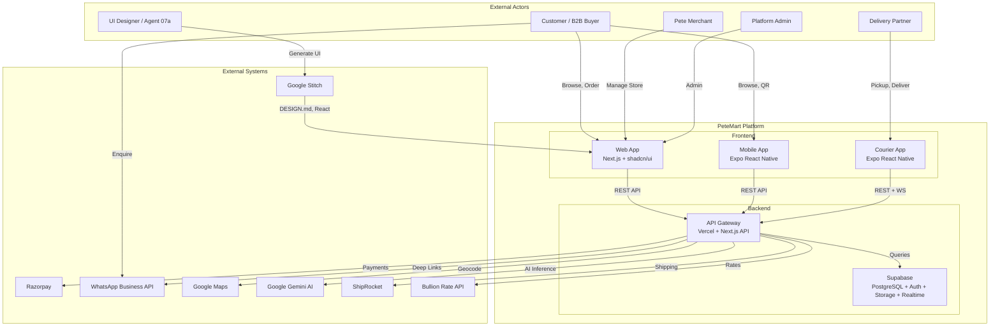
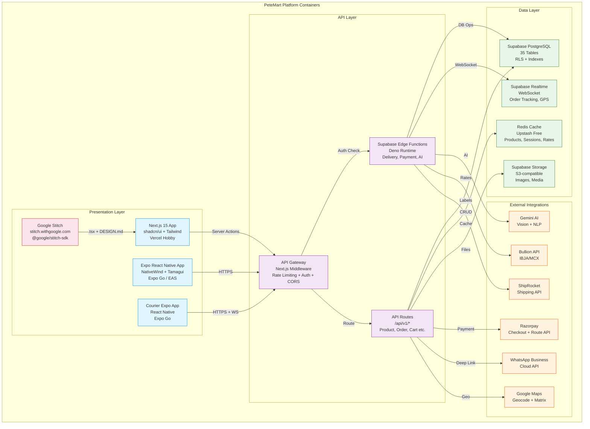
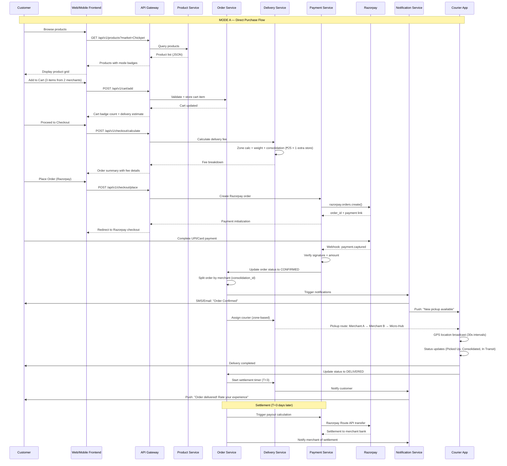
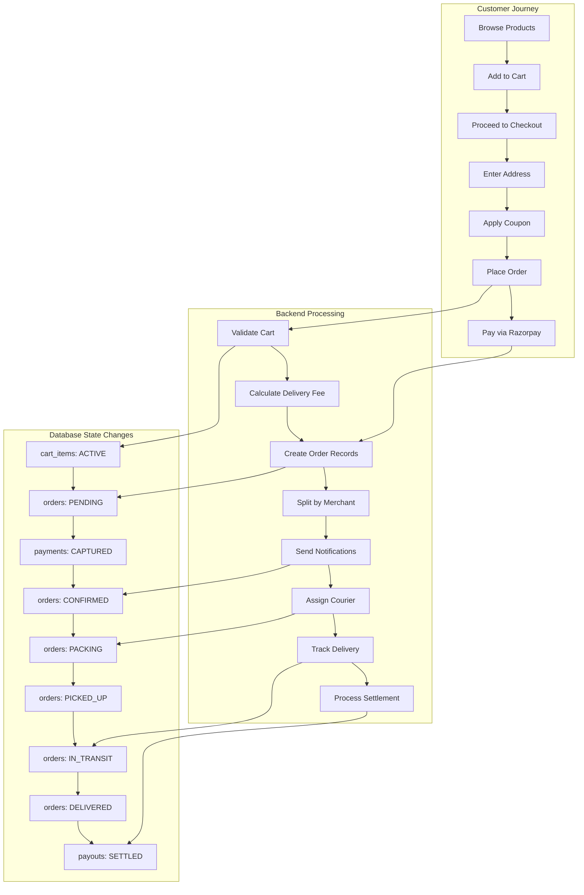
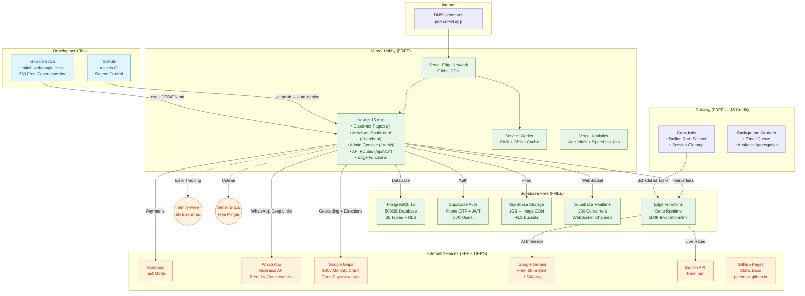
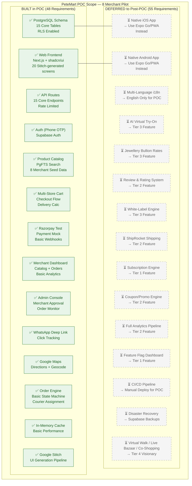
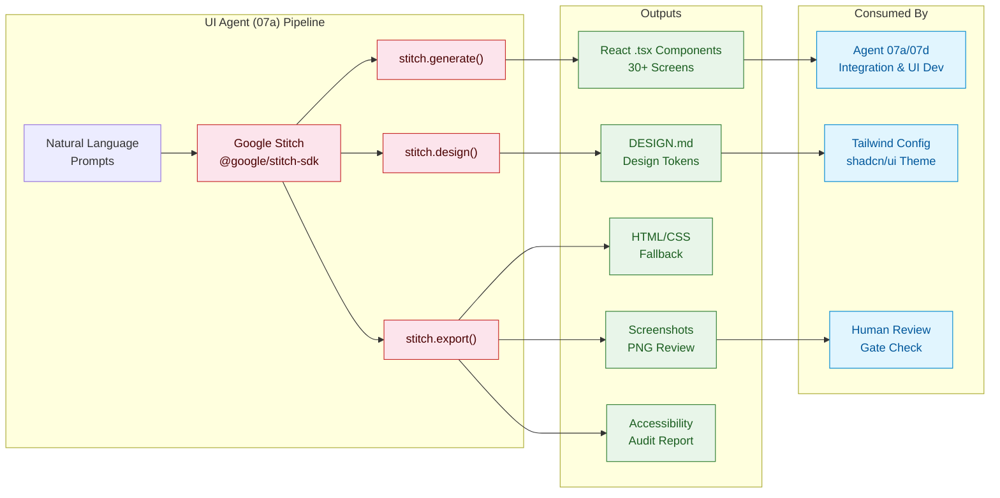
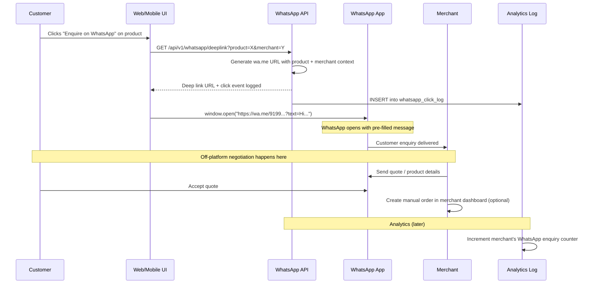
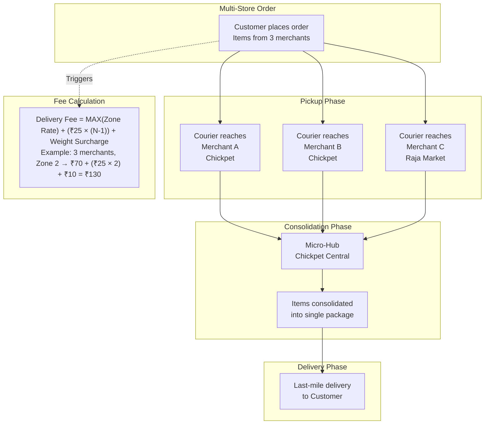

# PeteMart — Architecture Diagrams

**Generated:** 2026-05-30 | **Tooling:** Mermaid.js + PlantUML | **Source:** Open-source, embeddable

---

## 1. System Context Diagram (C4 Level 1)

> Diagram type: `mermaid` — C4 System Context
> Shows: PeteMart platform interacting with 5 user types and 5 external systems

```mermaid
C4Context
  title System Context diagram for PeteMart Hyperlocal Commerce Platform

  Person(customer, "Customer / B2B Buyer", "End-user browsing and purchasing from Pete merchants via Web, Mobile, or WhatsApp")
  Person(merchant, "Pete Merchant", "Physical store owner managing their digital storefront")
  Person(delivery, "Delivery Partner", "Courier partner handling pickups and deliveries")
  Person(admin, "Platform Admin", "PeteMart operator managing merchants, orders, and platform config")
  Person(stitch_designer, "UI Designer (Agent 07a)", "Uses Google Stitch to generate UI screens programmatically")

  System_Boundary(petemart, "PeteMart Platform") {
    System(web_app, "Web Application", "Next.js 15 + shadcn/ui — Customer Marketplace, Merchant Dashboard, Admin Console")
    System(mobile_app, "Mobile Application", "Expo React Native — Customer App (iOS/Android)")
    System(courier_app, "Courier App", "Expo React Native — Delivery Partner App")
    System(backend, "Backend Services", "Supabase (Postgres + Auth + Storage + Realtime) + Edge Functions + Next.js API")
  }

  System_Ext(razorpay, "Razorpay", "Payment Gateway — Checkout, Subaccounts, Route API")
  System_Ext(whatsapp, "WhatsApp Business API", "Deep links, message templates, click tracking")
  System_Ext(google_maps, "Google Maps Platform", "Geocoding, Directions, Distance Matrix, Maps Embed")
  System_Ext(gemini, "Google Gemini API", "AI/ML — Virtual Try-On, Review Moderation, Search")
  System_Ext(shiprocket, "ShipRocket", "Pan-India shipping — Labels, Tracking, COD")
  System_Ext(bullion_api, "Bullion Rate API", "Live gold/silver rates from IBJA/MCX")
  System_Ext(stitch, "Google Stitch", "AI-powered UI generation tool — MCP SDK integration")

  Rel(customer, web_app, "Browses, orders, tracks via HTTPS")
  Rel(customer, mobile_app, "Browses, orders, scans QR via HTTPS")
  Rel(customer, whatsapp, "Enquires about products")
  Rel(merchant, web_app, "Manages catalog and orders")
  Rel(delivery, courier_app, "Receives pickup routes, updates status")
  Rel(admin, web_app, "Approves merchants, monitors platform")
  Rel(stitch_designer, stitch, "Generates UI screens programmatically via @google/stitch-sdk")

  Rel(web_app, backend, "REST API calls /api/v1/*")
  Rel(mobile_app, backend, "REST API calls /api/v1/*")
  Rel(courier_app, backend, "REST API + WebSocket (Supabase Realtime)")
  Rel(backend, razorpay, "Payment processing + settlement via Razorpay API")
  Rel(backend, whatsapp, "Deep link generation + click tracking")
  Rel(backend, google_maps, "Geocoding + distance matrix + maps embed")
  Rel(backend, gemini, "AI inference for try-on + moderation")
  Rel(backend, shiprocket, "Shipping label generation + tracking")
  Rel(backend, bullion_api, "Fetch live gold/silver rates")

  UpdateLayoutConfig($c4ShapeInRow="3", $c4BoundaryInRow="1")
```

**Alternative Mermaid.js C4-style block diagram (more readable in docs):**

---

## 2. Container Diagram (C4 Level 2)

> Diagram type: `mermaid` — Container decomposition
> Shows: All containers within PeteMart with technology stack and interactions

---

## 3. Data Flow Diagram — Order Lifecycle (End-to-End)

> Diagram type: `mermaid` — Sequence diagram
> Shows: Full order lifecycle from browse to delivery for Mode A (Direct Purchase)

**Alternative Data Flow Diagram (PlantUML style in Mermaid):**

---

## 4. Deployment Diagram

> Diagram type: `mermaid` — Deployment topology (FREE TIER)
> Shows: Zero-cost deployment across Vercel Hobby + Supabase Free + Railway + GitHub Pages

---

## 5. POC Scope Diagram

> Diagram type: `mermaid` — POC vs Production scope
> Shows: Which containers/components are built in POC (green) vs deferred (grey)

---

## 6. Additional Diagrams

### 6.1 Google Stitch Integration Pipeline

### 6.2 WhatsApp Integration Flow

### 6.3 Consolidated Delivery Flow

---

## 7. Component Relationship Matrix

| Frontend Screen | Backend Service | Database Table | External Integration | Google Stitch? |
|---|---|---|---|---|
| Landing Page | Product Service, Merchant Service | markets, merchants | — | ✅ Yes |
| Product Search | Search Engine (PgFTS) | products | — | ✅ Yes |
| Product Detail | Product Service | products, product_variants | — | ✅ Yes |
| Cart | Cart Service | cart_items | — | ✅ Yes |
| Checkout | Order Service, Payment Service | orders, order_items | Razorpay | ✅ Yes |
| Order Tracking | Order Service, Realtime | orders, order_status_log | Google Maps (GPS) | ✅ Yes |
| Merchant Microsite | Merchant Service, Product Service | merchants, products | WhatsApp (deep link) | ✅ Yes |
| Merchant Dashboard | Merchant Service, Analytics | merchants, orders, payouts | — | ✅ Yes |
| Admin Console | Admin Service, Analytics | merchants, orders, config | — | ✅ Yes |
| AI Try-On | AI Service (Gemini) | try_on_cache | Google Gemini | ❌ (Custom) |
| Jewellery w/ Bullion | Bullion Service | jewellery_details, bullion_rates | Bullion API | ❌ (Custom) |
| Review System | Review Service | reviews, review_moderation | — | ✅ Yes |
| Courier App | Delivery Service, Realtime | courier_routes, courier_gps_log | Google Maps (Nav) | ❌ (Custom) |
| Virtual Walk | Virtual Street CMS | virtual_storefronts | — | ❌ (Custom) |
| Configuration UI | Config Service | feature_flags, dynamic_config | — | ✅ Yes |

---

*End of DIAGRAMS.md — All diagrams are open-source (Mermaid.js) and can be rendered in any Mermaid-compatible viewer (GitHub, Notion, Mermaid Live Editor)*
