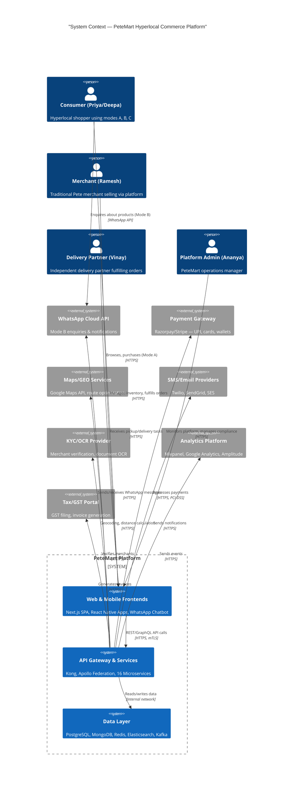
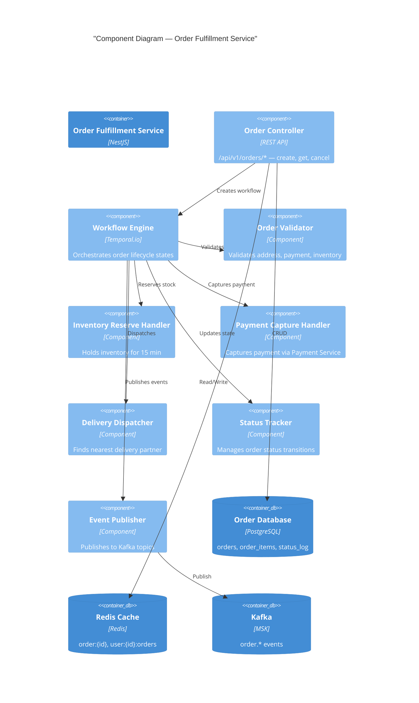
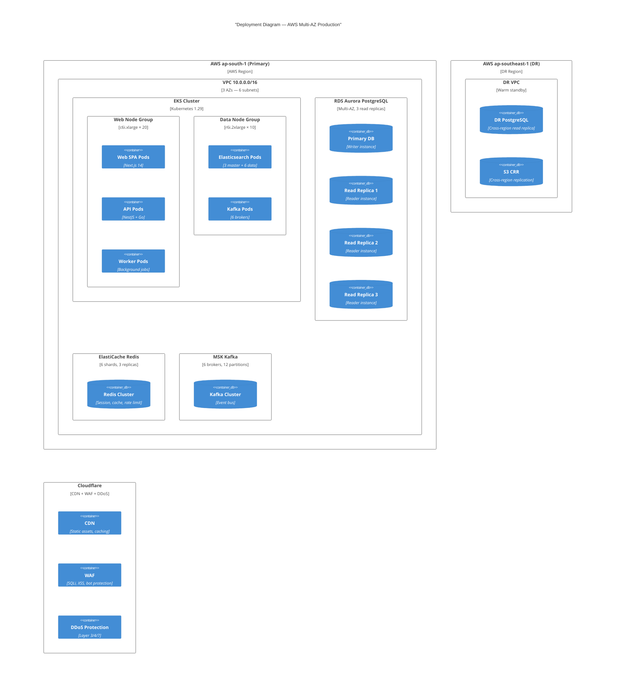
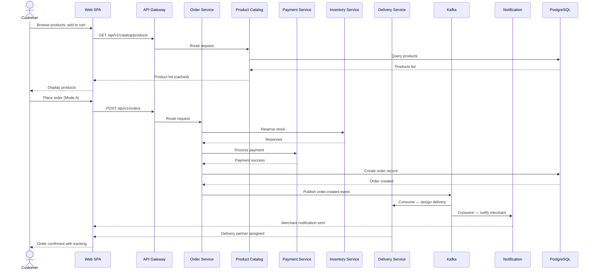
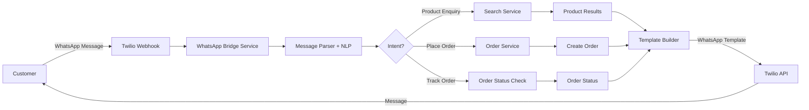

# PeteMart C4 Architecture Diagrams (Mermaid.js)

## C4 Context Diagram (Level 1)


```mermaid
C4Context
  title "System Context — PeteMart Hyperlocal Commerce Platform"
  
  Person(customer, "Consumer (Priya/Deepa)", "Hyperlocal shopper using modes A, B, C")
  Person(merchant, "Merchant (Ramesh)", "Traditional Pete merchant selling via platform")
  Person(delivery, "Delivery Partner (Vinay)", "Independent delivery partner fulfilling orders")
  Person(admin, "Platform Admin (Ananya)", "PeteMart operations manager")
  
  System_Boundary(petemart, "PeteMart Platform") {
    System(web, "Web & Mobile Frontends", "Next.js SPA, React Native Apps, WhatsApp Chatbot")
    System(api, "API Gateway & Services", "Kong, Apollo Federation, 16 Microservices")
    System(data, "Data Layer", "PostgreSQL, MongoDB, Redis, Elasticsearch, Kafka")
  }
  
  System_Ext(whatsapp, "WhatsApp Cloud API", "Mode B enquiries & notifications")
  System_Ext(payments, "Payment Gateway", "Razorpay/Stripe — UPI, cards, wallets")
  System_Ext(maps, "Maps/GEO Services", "Google Maps API, route optimization")
  System_Ext(sms, "SMS/Email Providers", "Twilio, SendGrid, SES")
  System_Ext(kyc, "KYC/OCR Provider", "Merchant verification, document OCR")
  System_Ext(analytics, "Analytics Platform", "Mixpanel, Google Analytics, Amplitude")
  System_Ext(tax, "Tax/GST Portal", "GST filing, invoice generation")
  
  Rel(customer, web, "Browses, purchases (Mode A)", "HTTPS")
  Rel(customer, whatsapp, "Enquires about products (Mode B)", "WhatsApp API")
  Rel(merchant, web, "Manages inventory, fulfills orders", "HTTPS")
  Rel(delivery, web, "Receives pickup/delivery tasks", "HTTPS")
  Rel(admin, web, "Monitors platform, manages compliance", "HTTPS")
  
  Rel(web, api, "REST/GraphQL API calls", "HTTPS, mTLS")
  Rel(api, data, "Reads/writes data", "Internal network")
  Rel(api, whatsapp, "Sends/receives WhatsApp messages", "HTTPS")
  Rel(api, payments, "Processes payments", "HTTPS, PCI-DSS")
  Rel(api, maps, "Geocoding, distance calculation", "HTTPS")
  Rel(api, sms, "Sends notifications", "HTTPS")
  Rel(api, kyc, "Verifies merchants", "HTTPS")
  Rel(api, analytics, "Sends events", "HTTPS")
  Rel(api, tax, "Generates invoices", "HTTPS")
```

## C4 Container Diagram (Level 2)


```mermaid
C4Container
  title "Container Diagram — PeteMart Platform"
  
  Person(customer, "Consumer", "Priya / Deepa")
  Person(merchant, "Merchant", "Ramesh")
  Person(delivery, "Delivery Partner", "Vinay")
  Person(admin, "Admin", "Ananya")
  
  System_Boundary(client, "Client Tier") {
    Container(web_spa, "Web SPA", "Next.js 14 + TypeScript", "Customer browsing, B2B orders, merchant dashboard, admin panel")
    Container(mobile_customer, "Mobile App (Customer)", "React Native + Expo", "Browse, purchase, track, WhatsApp handoff")
    Container(mobile_merchant, "Mobile App (Merchant)", "React Native", "Inventory, orders, analytics")
    Container(mobile_delivery, "Mobile App (Delivery)", "React Native", "Route, POD, earnings")
    Container(whatsapp_bot, "WhatsApp Chatbot", "Node.js + Twilio", "Mode B enquiries, support")
    Container(microsite, "Merchant Microsite", "Next.js ISR", "Mode C storefronts")
  }
  
  System_Boundary(gateway, "API Gateway Tier") {
    Container(kong, "Kong API Gateway", "Kong Enterprise 3.6", "Rate limiting, auth, routing, observability")
    Container(apollo, "GraphQL BFF", "Apollo Federation 4.0", "Schema stitching, unified API")
    Container(istio, "Istio Service Mesh", "Istio 1.22", "mTLS, traffic mgmt, circuit breaking")
    Container(nginx, "NGINX Ingress", "NGINX + Cloudflare", "SSL termination, WAF, DDoS")
  }
  
  System_Boundary(services, "Backend Services (16 Microservices)") {
    Container(user_svc, "User Service", "NestJS", "Profile mgmt, auth")
    Container(product_svc, "Product Catalog", "NestJS", "Product CRUD, categories")
    Container(order_svc, "Order Fulfillment", "NestJS + Temporal", "Order lifecycle, workflow")
    Container(payment_svc, "Payment Service", "Go", "Payments, wallet, settlements")
    Container(inventory_svc, "Inventory Service", "NestJS", "Stock tracking")
    Container(merchant_svc, "Merchant Service", "NestJS", "Onboarding, subscriptions")
    Container(delivery_svc, "Delivery Service", "Go", "Route optimization, dispatch")
    Container(whatsapp_svc, "WhatsApp Bridge", "NestJS", "Msg handling, templates")
    Container(search_svc, "Search Service", "NestJS + ES", "Full-text search")
    Container(recommend_svc, "Recommendation", "Python + ML", "Personalization")
    Container(notif_svc, "Notification Service", "NestJS", "Push, email, SMS")
    Container(analytics_svc, "Analytics Service", "Python + ClickHouse", "Real-time analytics")
    Container(pricing_svc, "Pricing Service", "NestJS", "Dynamic pricing, promos")
    Container(auth_svc, "Auth Service", "Keycloak + NestJS", "OAuth2/OIDC, RBAC")
    Container(admin_svc, "Admin Service", "NestJS", "Platform administration")
    Container(commission_svc, "Commission Service", "Go", "B2B/B2C commission calculation")
  }
  
  System_Boundary(data, "Data Tier") {
    ContainerDb(pg, "PostgreSQL (Aurora)", "RDS Aurora PostgreSQL 16", "Users, orders, payments")
    ContainerDb(mongo, "MongoDB (Atlas)", "MongoDB 7.0", "Product catalog, attributes")
    ContainerDb(redis, "Redis (ElastiCache)", "Redis 7.2", "Cache, sessions, rate limiting")
    ContainerDb(es, "Elasticsearch", "Elasticsearch 8.12", "Search, analytics")
    ContainerDb(kafka, "Apache Kafka (MSK)", "Kafka 3.7", "Event bus, async workflows")
    ContainerDb(s3, "S3 / MinIO", "Object Storage", "Images, docs, backups")
  }
  
  Rel(customer, web_spa, "HTTPS")
  Rel(customer, mobile_customer, "HTTPS")
  Rel(customer, whatsapp_bot, "WhatsApp")
  Rel(merchant, web_spa, "HTTPS")
  Rel(merchant, mobile_merchant, "HTTPS")
  Rel(merchant, microsite, "HTTPS")
  Rel(delivery, mobile_delivery, "HTTPS")
  Rel(admin, web_spa, "HTTPS")
  
  Rel(web_spa, kong, "REST/GraphQL", "HTTPS")
  Rel(mobile_customer, kong, "REST/GraphQL", "HTTPS")
  Rel(mobile_merchant, kong, "REST/GraphQL", "HTTPS")
  Rel(mobile_delivery, kong, "REST/GraphQL", "HTTPS")
  Rel(microsite, kong, "REST/GraphQL", "HTTPS")
  
  Rel(kong, apollo, "Route", "HTTPS")
  Rel(apollo, user_svc, "GraphQL", "gRPC internal")
  Rel(apollo, product_svc, "GraphQL", "gRPC internal")
  Rel(kong, order_svc, "REST", "HTTPS")
  Rel(kong, payment_svc, "REST", "HTTPS")
  
  Rel(user_svc, pg, "Read/Write")
  Rel(product_svc, mongo, "Read/Write")
  Rel(order_svc, pg, "Read/Write")
  Rel(payment_svc, pg, "Read/Write")
  Rel(inventory_svc, mongo, "Read/Write")
  
  Rel(product_svc, redis, "Cache")
  Rel(order_svc, redis, "Cache")
  Rel(search_svc, es, "Index/Search")
  
  Rel(order_svc, kafka, "Publish order events")
  Rel(payment_svc, kafka, "Publish payment events")
  Rel(delivery_svc, kafka, "Publish delivery events")
  Rel(kafka, notif_svc, "Consume for notifications")
  Rel(kafka, analytics_svc, "Consume for analytics")
```

## C4 Component Diagram (Level 3) — Order Fulfillment Service


```mermaid
C4Component
  title "Component Diagram — Order Fulfillment Service"
  
  Container(order_svc, "Order Fulfillment Service", "NestJS")
  
  Component(order_controller, "Order Controller", "REST API", "/api/v1/orders/* — create, get, cancel")
  Component(workflow_engine, "Workflow Engine", "Temporal.io", "Orchestrates order lifecycle states")
  Component(order_validator, "Order Validator", "Component", "Validates address, payment, inventory")
  Component(inventory_reserve, "Inventory Reserve Handler", "Component", "Holds inventory for 15 min")
  Component(payment_capture, "Payment Capture Handler", "Component", "Captures payment via Payment Service")
  Component(delivery_dispatcher, "Delivery Dispatcher", "Component", "Finds nearest delivery partner")
  Component(status_tracker, "Status Tracker", "Component", "Manages order status transitions")
  Component(event_publisher, "Event Publisher", "Component", "Publishes to Kafka topics")
  
  ContainerDb(order_db, "Order Database", "PostgreSQL", "orders, order_items, status_log")
  ContainerDb(cache, "Redis Cache", "Redis", "order:{id}, user:{id}:orders")
  ContainerDb(event_bus, "Kafka", "MSK", "order.* events")
  
  Rel(order_controller, workflow_engine, "Creates workflow")
  Rel(workflow_engine, order_validator, "Validates")
  Rel(workflow_engine, inventory_reserve, "Reserves stock")
  Rel(workflow_engine, payment_capture, "Captures payment")
  Rel(workflow_engine, delivery_dispatcher, "Dispatches")
  Rel(workflow_engine, status_tracker, "Updates state")
  Rel(workflow_engine, event_publisher, "Publishes events")
  
  Rel(order_controller, order_db, "CRUD")
  Rel(order_controller, cache, "Read/Write")
  Rel(event_publisher, event_bus, "Publish")
```

## C4 Deployment Diagram (Level 4)


```mermaid
C4Deployment
  title "Deployment Diagram — AWS Multi-AZ Production"
  
  Deployment_Node(aws_mumbai, "AWS ap-south-1 (Primary)", "AWS Region") {
    Deployment_Node(vpc, "VPC 10.0.0.0/16", "3 AZs — 6 subnets") {
      Deployment_Node(eks, "EKS Cluster", "Kubernetes 1.29") {
        Deployment_Node(web_nodes, "Web Node Group", "c6i.xlarge × 20") {
          Container(web_pods, "Web SPA Pods", "Next.js 14")
          Container(api_pods, "API Pods", "NestJS + Go")
          Container(worker_pods, "Worker Pods", "Background jobs")
        }
        Deployment_Node(data_nodes, "Data Node Group", "r6i.2xlarge × 10") {
          Container(es_pods, "Elasticsearch Pods", "3 master + 6 data")
          Container(kafka_pods, "Kafka Pods", "6 brokers")
        }
      }
      Deployment_Node(rds, "RDS Aurora PostgreSQL", "Multi-AZ, 3 read replicas") {
        ContainerDb(primary_db, "Primary DB", "Writer instance")
        ContainerDb(read_db1, "Read Replica 1", "Reader instance")
        ContainerDb(read_db2, "Read Replica 2", "Reader instance")
        ContainerDb(read_db3, "Read Replica 3", "Reader instance")
      }
      Deployment_Node(elasticache, "ElastiCache Redis", "6 shards, 3 replicas") {
        ContainerDb(redis_cluster, "Redis Cluster", "Session, cache, rate limit")
      }
      Deployment_Node(msk, "MSK Kafka", "6 brokers, 12 partitions") {
        ContainerDb(kafka_cluster, "Kafka Cluster", "Event bus")
      }
    }
  }
  
  Deployment_Node(aws_singapore, "AWS ap-southeast-1 (DR)", "DR Region") {
    Deployment_Node(dr_vpc, "DR VPC", "Warm standby") {
      ContainerDb(dr_pg, "DR PostgreSQL", "Cross-region read replica")
      ContainerDb(dr_s3, "S3 CRR", "Cross-region replication")
    }
  }
  
  Deployment_Node(cloudflare, "Cloudflare", "CDN + WAF + DDoS") {
    Container(cdn, "CDN", "Static assets, caching")
    Container(waf, "WAF", "SQLi, XSS, bot protection")
    Container(ddos, "DDoS Protection", "Layer 3/4/7")
  }
```

## Sequence Diagram — Mode A (Direct Purchase)


```mermaid
sequenceDiagram
  actor Customer
  participant Web as Web SPA
  participant Kong as API Gateway
  participant Order as Order Service
  participant Product as Product Catalog
  participant Payment as Payment Service
  participant Inventory as Inventory Service
  participant Delivery as Delivery Service
  participant Kafka as Kafka
  participant Notif as Notification
  participant DB as PostgreSQL
  
  Customer->>Web: Browse products, add to cart
  Web->>Kong: GET /api/v1/catalog/products
  Kong->>Product: Route request
  Product->>DB: Query products
  DB-->>Product: Products list
  Product-->>Web: Product list (cached)
  Web-->>Customer: Display products
  
  Customer->>Web: Place order (Mode A)
  Web->>Kong: POST /api/v1/orders
  Kong->>Order: Route request
  
  Order->>Inventory: Reserve stock
  Inventory-->>Order: Reserved
  
  Order->>Payment: Process payment
  Payment-->>Order: Payment success
  
  Order->>DB: Create order record
  DB-->>Order: Order created
  
  Order->>Kafka: Publish order.created event
  
  Kafka->>Delivery: Consume — assign delivery
  Kafka->>Notif: Consume — notify merchant
  
  Notif-->>Web: Merchant notification sent
  Delivery-->>Web: Delivery partner assigned
  
  Web-->>Customer: Order confirmed with tracking
```

## Data Flow Diagram — WhatsApp Ordering (Mode B)


```mermaid
flowchart LR
  A[Customer] -->|WhatsApp Message| B[Twilio Webhook]
  B --> C[WhatsApp Bridge Service]
  C --> D[Message Parser + NLP]
  D --> E{Intent?}
  E -->|Product Enquiry| F[Search Service]
  E -->|Place Order| G[Order Service]
  E -->|Track Order| H[Order Status Check]
  F --> I[Product Results]
  G --> J[Create Order]
  H --> K[Order Status]
  I --> L[Template Builder]
  J --> L
  K --> L
  L -->|WhatsApp Template| M[Twilio API]
  M -->|Message| A
```

## Network Topology Diagram

```mermaid
graph TB
  subgraph "Internet"
    CDN[Cloudflare CDN + WAF]
  end
  
  subgraph "AWS Cloud"
    subgraph "VPC — Public Subnets"
      ALB[Application Load Balancer]
    end
    
    subgraph "VPC — Private App Subnets"
      K8S[EKS Kubernetes Cluster]
      K8S --> Pods1[Web Pods]
      K8S --> Pods2[API Pods]
      K8S --> Pods3[Worker Pods]
    end
    
    subgraph "VPC — Private Data Subnets"
      RDS[RDS Aurora PostgreSQL]
      ES[Elasticsearch]
      MSK[MSK Kafka]
      EC[ElastiCache Redis]
      S3[S3 Buckets]
    end
    
    subgraph "Monitoring"
      PROM[Prometheus]
      GRAF[Grafana]
      ELK[ELK Stack]
      JAEG[Jaeger]
    end
  end
  
  CDN --> ALB
  ALB --> K8S
  K8S --> RDS
  K8S --> ES
  K8S --> MSK
  K8S --> EC
  K8S --> S3
  K8S --> PROM
  PROM --> GRAF