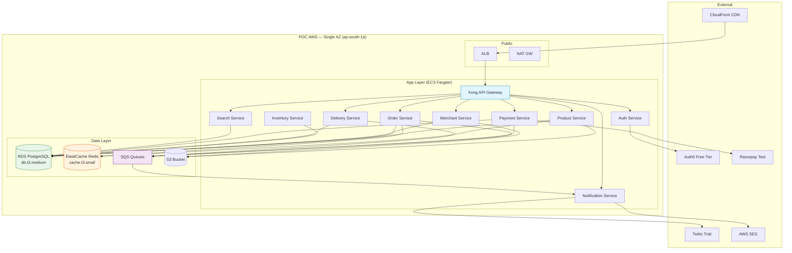

# PeteMart — 8-Merchant Pilot Architecture (POC Scope)

> **Document Version:** 1.0  
> **Purpose:** Define the architecture, scope, and configuration for the initial 8-merchant pilot in a single Pete market (e.g., Chickpet).  
> **Duration:** 8 weeks  
> **Target:** Validate core commerce workflows, merchant onboarding, delivery logistics, and WhatsApp integration at small scale before full launch.

---

## 1. POC Objectives

| # | Objective | Success Criteria |
|---|-----------|-----------------|
| 1 | Validate end-to-end order flow (Mode A) | 50+ successful orders placed, paid, delivered |
| 2 | Validate merchant onboarding & microsite | 8 merchants onboarded with live product listings |
| 3 | Validate WhatsApp enquiry flow (Mode B) | 20+ WhatsApp enquiries handled |
| 4 | Validate delivery partner assignment & tracking | 30+ deliveries tracked in real-time |
| 5 | Validate platform admin dashboard | Admin can view orders, merchants, deliveries |
| 6 | Validate basic search & discovery | Customers can find products by name/category |

---

## 2. POC Architecture (Simplified Production Subset)

### 2.1 Infrastructure (Single AZ, Reduced Capacity)

```
┌──────────────────────────────────────────────────────────────┐
│                      POC AWS Environment                     │
├──────────────────────────────────────────────────────────────┤
│                                                              │
│  ┌────────────────────────────────────────────────────────┐ │
│  │  VPC (10.0.0.0/20) — Single AZ (ap-south-1a)          │ │
│  │                                                        │ │
│  │  ┌── Public Subnet ───────────────────────────────┐   │ │
│  │  │  • ALB (Application Load Balancer)              │   │ │
│  │  │  • NAT Gateway                                 │   │ │
│  │  │  • Bastion Host                                │   │ │
│  │  └───────────────────────────────────────────────┘   │ │
│  │                                                        │ │
│  │  ┌── Private App Subnet ─────────────────────────┐   │ │
│  │  │  • ECS Fargate (all services min=1)            │   │ │
│  │  │  • Kong API Gateway (single instance)          │   │ │
│  │  └───────────────────────────────────────────────┘   │ │
│  │                                                        │ │
│  │  ┌── Private Data Subnet ────────────────────────┐   │ │
│  │  │  • RDS PostgreSQL (db.t3.medium, single-AZ)   │   │ │
│  │  │  • ElastiCache Redis (cache.t3.small, 1 node) │   │ │
│  │  │  • SQS (instead of RabbitMQ for POC)          │   │ │
│  │  └───────────────────────────────────────────────┘   │ │
│  │                                                        │ │
│  │  ┌── Private Storage ────────────────────────────┐   │ │
│  │  │  • S3 Bucket (images + docs)                   │   │ │
│  │  └───────────────────────────────────────────────┘   │ │
│  └────────────────────────────────────────────────────┘ │
│                                                              │
│  CI/CD: GitHub → GitHub Actions → ECR → ECS Fargate       │
│  Monitoring: CloudWatch + Sentry (Free Tier)                │
│  CDN: CloudFront (1 distribution, basic WAF)               │
└──────────────────────────────────────────────────────────────┘
```

### 2.2 POC Service Configuration (Minimal Viable)

| Service | Min Instances | CPU | Memory | Purpose |
|---------|--------------|-----|--------|---------|
| API Gateway (Kong) | 1 | 512 | 1GB | Routing, rate limiting |
| Auth Service | 1 | 256 | 512MB | JWT, user registration |
| Product Service | 1 | 512 | 1GB | Product CRUD |
| Order Service | 1 | 512 | 1GB | Order lifecycle |
| Merchant Service | 1 | 256 | 512MB | Merchant management |
| Inventory Service | 1 | 256 | 512MB | Simple stock tracking |
| Delivery Service | 1 | 256 | 512MB | Dispatch, basic tracking |
| Payment Service | 1 | 256 | 512MB | Payment integration |
| Notification Service | 1 | 256 | 512MB | SMS/email/WhatsApp |
| Search Service | 1 | 512 | 1GB | Basic product search |
| **Total** | **10** | **3.5 vCPU** | **7.5 GB** | |

### 2.3 Database (Single-AZ, Minimal)

| Component | Spec | Storage | Backup |
|-----------|------|---------|--------|
| RDS PostgreSQL | db.t3.medium (2 vCPU, 4GB) | 50GB gp3 | Weekly snapshot |
| ElastiCache Redis | cache.t3.small (1 vCPU, 1.37GB) | N/A | No persistence |
| S3 | Standard | 10GB | N/A |

### 2.4 POC Services Deployed

| Service | Technology | Scope (POC) |
|---------|-----------|-------------|
| Web App | Next.js 14 (App Router) | Buyer browse, cart, checkout; Merchant dashboard |
| Mobile App | React Native 0.76+ | Buyer app (limited features) |
| Auth | Node.js + Auth0 (Free Tier) | Email/phone login |
| Products | Node.js | CRUD for 8 merchants × 50 products |
| Orders | Node.js | Create, track, cancel orders |
| Payments | Node.js + Razorpay (Test Mode) | Initiate, verify, refund |
| Merchants | Node.js | KYC, microsite generation |
| Inventory | Node.js | Stock management, reservations |
| Delivery | Node.js | Manual dispatch, basic status |
| Notifications | Node.js + Twilio (Trial) | SMS, email via SES, WhatsApp |
| Search | Node.js + PostgreSQL (LIKE/ILIKE) | Basic product search, no Elasticsearch |
| Reports | Node.js | Basic sales CSV export |

### 2.5 POC Message Queue Configuration

For POC, we'll use **AWS SQS** (fully managed, free tier eligible) instead of RabbitMQ.

| Queue Name | Type | Purpose | POC Config |
|-----------|------|---------|------------|
| order-placed | Standard | New order notification | 1 consumer |
| payment-completed | Standard | Payment confirmation | 1 consumer |
| delivery-status | Standard | Delivery updates | 1 consumer |
| notification-send | Standard | Outbound notifications | 1 consumer |

---

## 3. POC Data Model (Simplified)

### 3.1 Tables (Subset of Production)

| Table | POC Columns | Notes |
|-------|------------|-------|
| `users` | id, email, phone, name, role, password_hash, created_at | 5 roles |
| `merchants` | id, user_id, business_name, gst, tier, commission_rate, geo_location, is_active | 8 rows |
| `products` | id, merchant_id, category_id, name, description, price, images, is_active | ~400 rows |
| `product_variants` | id, product_id, sku, name, price_modifier, stock_quantity | ~800 rows |
| `categories` | id, name, slug, parent_id | ~50 rows |
| `orders` | id, order_id, user_id, merchant_id, status, subtotal, total, created_at | ~200 rows |
| `order_items` | id, order_id, product_id, variant_id, quantity, unit_price | ~600 rows |
| `payments` | id, order_id, transaction_id, gateway, amount, status, paid_at | ~200 rows |
| `deliveries` | id, order_id, partner_id, status, pickup_location, drop_location, estimated_delivery | ~150 rows |
| `cart_items` | id, user_id, product_id, variant_id, quantity | ~100 rows |

---

## 4. POC Workflows to Validate

| Workflow ID | Name | Description | POC Validation |
|------------|------|-------------|----------------|
| WF-BROWSE-001 | Browse Products | Search, filter, view product details | ✅ Full |
| WF-ORDER-A-001 | Place Order (Mode A) | Cart → Checkout → Pay → Confirm | ✅ Full |
| WF-ORDER-B-001 | Place Order (Mode B) | WhatsApp enquiry → Link → Pay | ✅ Full |
| WF-MER-ONBOARD-001 | Merchant Onboarding | Register → KYC → Create listing | ✅ Full |
| WF-MER-INV-001 | Manage Inventory | Add stock, update quantities | ✅ Full |
| WF-DELIVERY-001 | Delivery Dispatch | Assign partner → Pickup → Deliver | ✅ Full |
| WF-ADM-DASH-001 | Admin Dashboard | View orders, merchants, reports | ✅ Basic |
| WF-NOTIF-001 | Notifications | Order confirmation SMS/Email | ✅ Full |

---

## 5. POC Success Metrics & Exit Criteria

| Metric | Target | Measurement |
|--------|--------|-------------|
| Merchants Onboarded | 8 | Admin dashboard count |
| Products Listed | 400 (50/merchant) | Total products in DB |
| Orders Completed | 50+ | Orders with status=delivered |
| WhatsApp Enquiries | 20+ | Enquiry logs |
| Delivery Partners | 5+ | Delivery partner profiles |
| Platform Uptime | 99.5% | CloudWatch |
| API Latency (P95) | < 500ms | CloudWatch metrics |
| Page Load Time | < 3s | Lighthouse |
| Customer Support Tickets | < 10 | Admin tickets logged |
| Critical Bugs | 0 | Open bug count at end of POC |

---

## 6. POC Free-Tier & Minimal Cost Breakdown

| Category | Service | Spec | Monthly Cost (INR) | Monthly Cost (USD) |
|----------|---------|------|-------------------:|-------------------:|
| **Compute** | ECS Fargate | 10 tasks × 0.5 vCPU × 1GB | ₹12,000 | $150 |
| **Database** | RDS PostgreSQL | db.t3.medium (2vCPU, 4GB) + 50GB | ₹4,000 | $50 |
| **Cache** | ElastiCache Redis | cache.t3.small (1.37GB) | ₹1,600 | $20 |
| **Queue** | SQS Standard | 100K requests/month | Free Tier | $0 |
| **Storage** | S3 Standard | 10GB + Transfer | ₹400 | $5 |
| **CDN** | CloudFront | 50GB transfer + 1M requests | ₹800 | $10 |
| **DNS** | Route 53 | 1 hosted zone | ₹400 | $5 |
| **Auth** | Auth0 | Free Tier (7K MAU) | Free | $0 |
| **Payments** | Razorpay | Test Mode | Free | $0 |
| **Notifications** | Twilio SMS | Trial credits | Free | $0 |
| **SES** | AWS SES | 1000 emails/month | Free Tier | $0 |
| **Monitoring** | CloudWatch | Basic metrics | ₹1,200 | $15 |
| **CI/CD** | GitHub Actions | Free Tier (2000 min/month) | Free | $0 |
| **Container Registry** | ECR | 500MB | Free Tier | $0 |
| **Load Balancer** | ALB | 1 ALB + 1 rule | ₹1,600 | $20 |
| **NAT Gateway** | NAT GW | 1 per AZ | ₹2,400 | $30 |
| **Total Estimated** | | | **₹24,400** | **$305** |

### 6.1 POC 8-Week Budget

| Item | Cost |
|------|-----:|
| Infrastructure (AWS) | $610 (2 months × $305) |
| Developer Time (2 engineers × 8 weeks) | $24,000 |
| QA (1 engineer × 6 weeks) | $9,000 |
| Domain & SSL | $15 |
| **Total POC Budget** | **~$33,625** |

---

## 7. POC Architecture Diagram



---

## 8. POC Risks & Mitigations

| Risk | Impact | Likelihood | Mitigation |
|------|--------|------------|------------|
| Single AZ failure | Medium | Low | Manual recovery from snapshot; acceptable for POC |
| SQS vs RabbitMQ differences | Medium | Medium | Design abstractions to swap later |
| No Elasticsearch in POC | Low | Low | PostgreSQL ILIKE sufficient for 400 products |
| Mobile app delays | High | Medium | Start with PWA; mobile app can come in Phase 2 |
| Merchant tech literacy | Medium | High | Invest in onboarding support, video tutorials, phone support |
| Payment gateway sandbox limitations | Medium | Low | Use actual test mode; manual order creation fallback |
| WhatsApp Business API approval | High | Medium | Apply early; have SMS fallback |

---

## 9. POC Timeline (8 Weeks)

| Week | Sprint | Focus | Deliverables |
|------|--------|-------|-------------|
| 1 | Sprint 1 | Foundation | Monorepo setup, CI/CD, Auth, DB schema, Kong |
| 2 | Sprint 1 | Core APIs | Product, Cart, Order, Payment services + APIs |
| 3 | Sprint 2 | Web App | Browse, Cart, Checkout UI components |
| 4 | Sprint 2 | Merchant Tools | Merchant dashboard, product listing, inventory UI |
| 5 | Sprint 3 | Delivery | Delivery dispatch, tracking, partner app |
| 6 | Sprint 3 | Notifications | SMS, Email, WhatsApp integration |
| 7 | Sprint 4 | Testing & QA | E2E testing, UAT, bug fixes |
| 8 | Sprint 4 | Go-Live | 8 merchant onboarding, live orders, monitoring |

---

## 10. POC Go-Live Checklist

- [ ] 8 merchants registered and KYC verified
- [ ] Minimum 400 products listed with images
- [ ] Payment gateway in live/test mode with successful transactions
- [ ] 5 delivery partners onboarded
- [ ] WhatsApp Business API approved and configured
- [ ] Admin dashboard functional
- [ ] Monitoring (CloudWatch + Sentry) active
- [ ] Backup strategy implemented
- [ ] Security scan completed (basic OWASP)
- [ ] Load test conducted (50 concurrent users)
- [ ] Rollback plan documented
- [ ] Support team trained
- [ ] Onboarding documentation ready for merchants