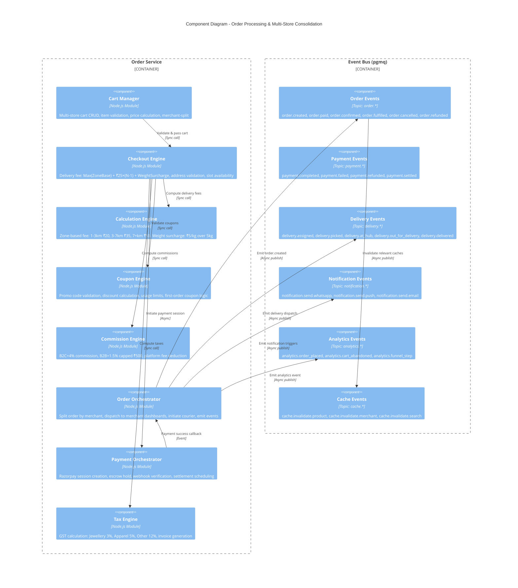
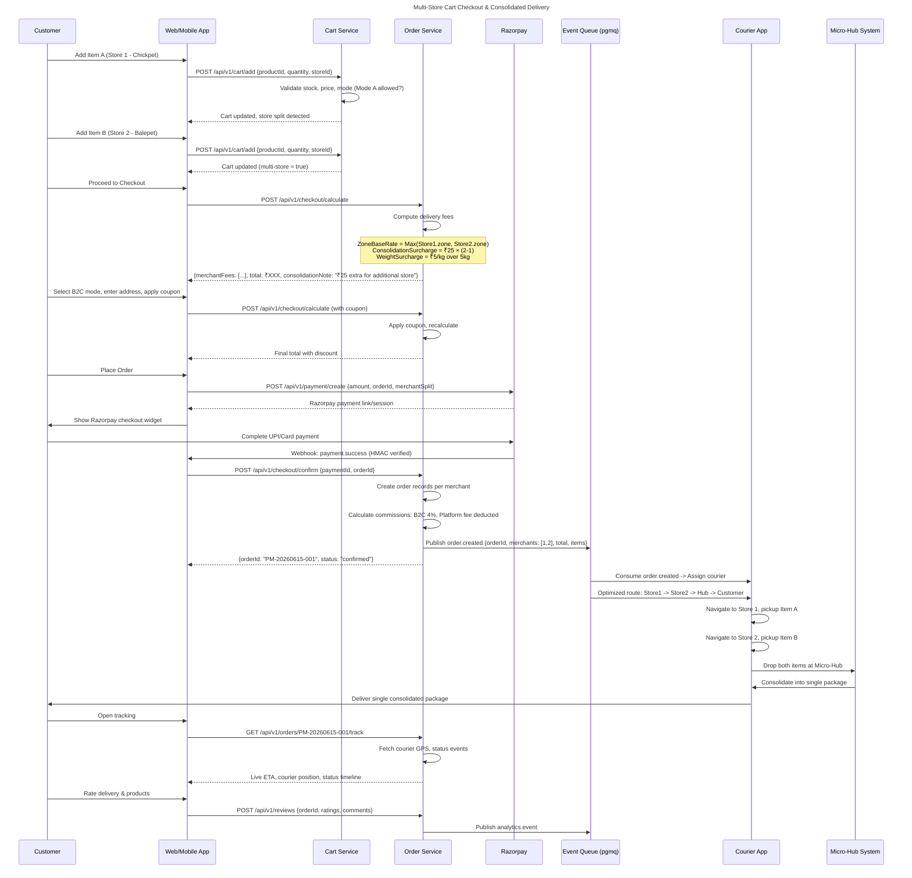
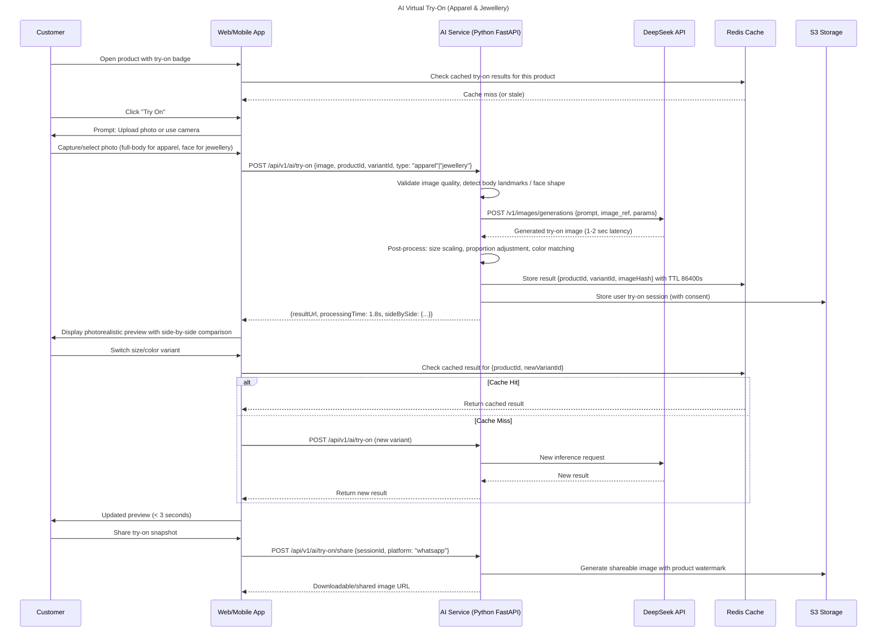
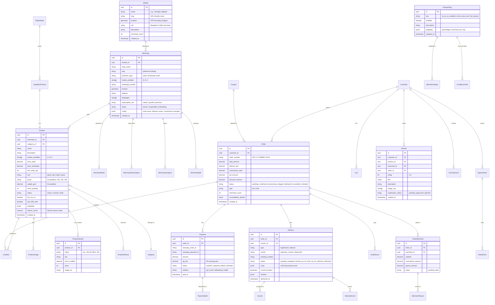
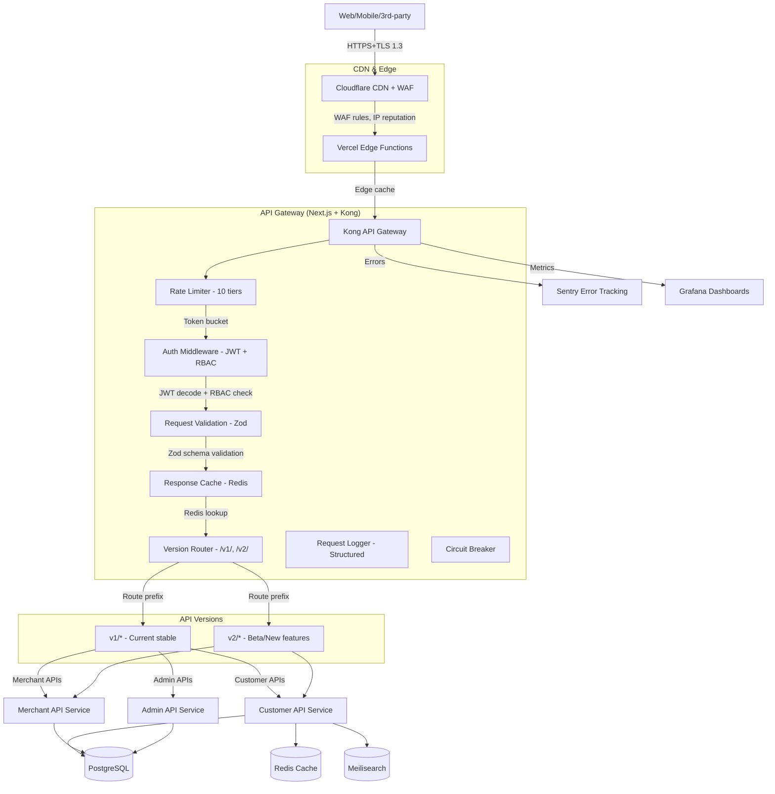
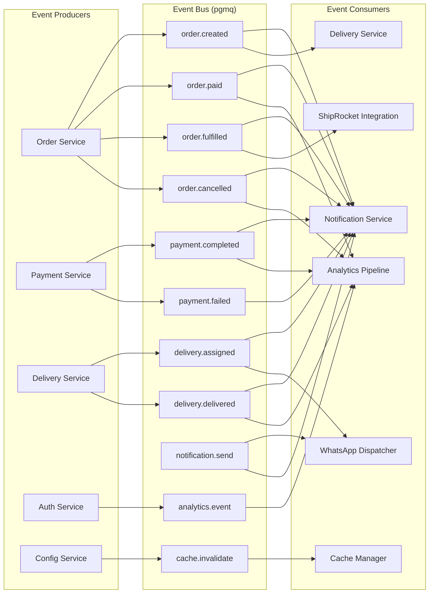

Note: If any tool call fails due to an error, try fixing the parameter. Do not assume the tool is not available.

## Upstream Dependencies

You can read files from upstream agents using the `read_dependency` tool. The following upstream agents and their artifacts are available:

**Agent: 01_prd_agent** (Product Requirements Document)
- PRD.md (Product Requirements Document)
- PRD.json (Structured PRD data)

**Agent: 02_requirement_agent** (Requirements & Market Research)
- MARKET_RESEARCH.md (Market research document)
- MARKET_RESEARCH.json (Structured market research data)
- USE_CASES.md (Use cases document)
- USE_CASES.json (Structured use cases data)
- WORKFLOWS.md (Workflows document)
- WORKFLOWS.json (Structured workflows data)
- REQUIREMENTS.md (Consolidated requirements document)
- REQUIREMENTS.json (Structured requirements data)

**Agent: 03_architect_agent** (This agent's own previous output)
- FEASIBILITY_ARCHITECTURE.md
- FEASIBILITY_ARCHITECTURE.json
- DATA_EXPORT.xlsx
- COMPLETION_SLIDE.pptx
- COMPLETION_SLIDE_slide.json
- GUARDRAIL_VERIFICATION.md

Let me read all upstream artifacts to understand the full requirements before producing the architecture.


Let me browse the project to locate the upstream files


Let me read the PRD and requirements documents:


Let me read the rest of the PRD and the requirements documents:


Let me read the previous architecture output and the rest of the requirements
I now have complete context from the PRD v2.0 (111 requirements, 13 workflows, 5 personas) and the previous architecture output. The user wants the **full production architecture** covering ALL features. Let me produce comprehensive deliverables
Let me read the PRD config for full requirement details:


Now I have full context from all upstream artifacts. Let me produce the comprehensive architecture deliverables.

<｜DSML｜tool_calls>
<｜DSML｜invoke name="write_artifact">
<｜DSML｜parameter name="name" string="true">FEASIBILITY_ARCHITECTURE.md</｜DSML｜parameter>
<｜DSML｜parameter name="type" string="true">markdown</｜DSML｜parameter>
<｜DSML｜parameter name="data" string="true"># PeteMart — Enterprise Full Production Architecture Blueprint

**Document Version:** 4.0  
**Author:** 03_architect_agent (Senior Enterprise Solution Architect)  
**Date:** 2026-06-15  
**Status:** Final  
**Derived From:** PRD v2.0 (111 Requirements), prd_config.json (103 req IDs, 13 workflows, 58 use cases, 5 personas), Business Revenue Model v1.4, Idea Proposal v1.3, Market Research

---

## Table of Contents

1. [Executive Summary](#1-executive-summary)
2. [Architecture Principles & Design Constraints](#2-architecture-principles--design-constraints)
3. [System Context (C4 Level 1)](#3-system-context-c4-level-1)
4. [Container Architecture (C4 Level 2)](#4-container-architecture-c4-level-2)
5. [Component Architecture (C4 Level 3)](#5-component-architecture-c4-level-3)
6. [API-First Strategy & API Gateway](#6-api-first-strategy--api-gateway)
7. [Data Architecture & Caching Layer](#7-data-architecture--caching-layer)
8. [Message Queue & Event-Driven Architecture](#8-message-queue--event-driven-architecture)
9. [Security Framework](#9-security-framework)
10. [Testing Architecture (Multi-Layer)](#10-testing-architecture-multi-layer)
11. [Infrastructure & Deployment](#11-infrastructure--deployment)
12. [Cost Model & Scaling Thresholds](#12-cost-model--scaling-thresholds)
13. [Technology Stack (Complete)](#13-technology-stack-complete)
14. [POC Architecture (Subset)](#14-poc-architecture-subset)
15. [Integration Guide](#15-integration-guide)
16. [Architecture Decision Records (ADRs)](#16-architecture-decision-records-adrs)
17. [Appendices](#17-appendices)

---

## 1. Executive Summary

**PeteMart** is a hyperlocal digital commerce marketplace designed to onboard **5,000+ traditional physical merchants** across the **21 historic Pete markets of Old Bangalore** into a unified multi-channel e-commerce ecosystem. The platform spans a **responsive web application**, **native mobile apps (iOS & Android)**, and **WhatsApp integration**.

The platform introduces a **three-mode interaction framework**: **Mode A (Direct Purchase)**, **Mode B (WhatsApp Enquiry)**, and **Mode C (Visit Store)** — respecting the diverse commercial maturity and trust-sensitivity of different product categories.

### Key Business Drivers

| Driver | Target |
|--------|--------|
| Total Merchants | 5,000 across 21 Pete markets |
| Geographic Reach | Multi-city expansion (Phase 2) |
| Interaction Modes | Mode A (Direct), Mode B (WhatsApp), Mode C (Visit) |
| Revenue Models | Subscriptions (₹499/₹999/₹2,499/mo) + Commissions (B2C 4%, B2B 1.5%) |
| Delivery Model | Zone-based hyperlocal + National shipping via ShipRocket |
| AI Features | Virtual Try-On (Apparel/Jewellery), Recommendations |
| Total Requirements | 111 mapped to 13 workflows, 65 use cases, 5 personas |

### Key Architecture Decisions

| Decision | Choice | Rationale |
|----------|--------|-----------|
| Frontend Framework | Next.js 14 (React) + React Native (Expo) | SSR for SEO, PWA capability, cross-platform mobile, unified codebase |
| Backend Framework | Next.js API Routes + Node.js Microservices | Unified API surface, edge-deployed serverless, microservice decomposition |
| Database | PostgreSQL 15 (Supabase) | Relational integrity, PostGIS geospatial, Row Level Security for multi-tenancy |
| Cache Layer | Redis (Upstash) | Sub-10ms response, serverless-compatible, global distribution |
| Message Queue | pgmq + RabbitMQ | Async order processing, event-driven webhooks, reliable delivery |
| Search Engine | Meilisearch | Full-text search, faceted filters, typo tolerance, sub-50ms queries |
| AI Inference | DeepSeek API + ONNX Runtime | Cost-effective try-on, no GPU infra, pay-per-token |
| Payment Gateway | Razorpay | Indian market leader, escrow support, UPI/Card/NetBanking |
| Shipping | ShipRocket + Custom Courier App | National shipping + hyperlocal micro-hub delivery |
| Video Calls | Jitsi (self-hosted) / Daily.co | No per-minute fees, WebRTC-based, embeddable |
| Object Storage | Supabase Storage / AWS S3 | Product images, try-on results, merchant galleries, CDN-backed |
| Monitoring | Sentry + Grafana + PostHog | Error tracking, observability, product analytics |

---

## 2. Architecture Principles & Design Constraints

### 2.1 Architecture Principles

1. **API-First**: Every feature exposed through versioned REST APIs. Frontend, mobile, and third-party integrations consume the same API surface.
2. **Event-Driven**: Async processing for orders, notifications, delivery routing, and analytics. Decoupled services via message queues.
3. **Multi-Tenant by Design**: Every merchant is an isolated tenant. Row Level Security (RLS) ensures tenant isolation.
4. **Offline-First Mobile**: PWA service worker + React Native offline sync for uninterrupted browsing in low-connectivity Pete areas.
5. **Cost-Efficient AI**: Serverless inference via DeepSeek API (no GPU infra), with CDN-edge result caching.
6. **Zero-Downtime Deployments**: Blue-green via Vercel + Supabase branching + feature flags.
7. **Security by Design**: Defense-in-depth: WAF → API Gateway → Auth → RLS → Encryption.
8. **Observability from Day 1**: Every service emits structured logs, metrics, and traces.

### 2.2 Design Constraints

| Constraint | Mitigation Strategy |
|------------|-------------------|
| **5,000+ merchants → 500K+ products, 1M+ SKUs** | Partitioned tables, Redis caching, Meilisearch search index, materialized views |
| **Multi-store cart with consolidated delivery** | Dedicated Order Service + pgmq queue for courier routing + Micro-Hub logic |
| **WhatsApp integration without high Meta API fees** | Template-based messaging (free tier); Mode B uses deep links (zero API cost) |
| **Multi-language (Kannada, Hindi, English, Tamil)** | next-intl i18n framework, server-side translation caching, locale-specific CDN |
| **AI Try-On latency < 3 seconds** | Edge inference via DeepSeek API; CDN-cached results; request queuing for peaks |
| **Real-time bullion rates (MCX/IBJA)** | 60-second Redis cache, background sync cron, stale-while-revalidate pattern |
| **Payment reconciliation across 5,000 merchants** | Automated daily settlement via Razorpay payout API; escrow hold for disputes |
| **Feature flags for 5,000+ merchants** | Config service with PostgreSQL-backed flag store, CDN-invalidating cache, canary deployment |
| **Multi-city expansion** | Geographic selector, city-specific schemas, local micro-hub configuration |

---

## 3. System Context (C4 Level 1)

```mermaid
C4Context
  title System Context Diagram for PeteMart (C4 Level 1)

  Person(customer, "Priya (Customer)", "End shopper browsing & ordering from Pete markets via Web/Mobile/WhatsApp")
  Person(merchant, "Ramesh (Merchant)", "Store owner managing catalog, orders, analytics, subscriptions")
  Person(delivery, "Vinay (Courier)", "Delivery partner fulfilling hyperlocal & ShipRocket orders")
  Person(admin, "Ananya (Admin)", "Platform operator managing marketplace, moderation, configuration")
  Person(b2b_buyer, "Deepa (B2B Buyer)", "Wholesale reseller buying bulk with MOQ & negotiation")

  System_Boundary(petemart, "PeteMart Platform") {
    System(webapp, "Web Application", "Next.js 14 SSR - Customer, Merchant, Admin portals")
    System(mobileapp, "Mobile Application", "React Native Expo - iOS/Android customer + courier apps")
    System(api_gateway, "API Gateway", "Next.js API Routes + Kong - Rate limiting, routing, auth")
    System(backend, "Backend Services", "Node.js microservices + Python AI microservice")
    System(data_layer, "Data Layer", "PostgreSQL + Redis + Meilisearch + S3 + pgmq")
  }

  System_Ext(payment, "Razorpay", "Payment gateway - UPI/Card/NetBanking/Wallet, webhooks")
  System_Ext(whatsapp, "WhatsApp Business API / Deep Links", "Notifications, enquiry routing, template messages")
  System_Ext(shiprocket, "ShipRocket", "National shipping + courier aggregation, tracking API")
  System_Ext(maps, "Google Maps API", "Geocoding, directions, distance matrix, places API")
  System_Ext(ai_api, "DeepSeek API", "AI Virtual Try-On inference (apparel & jewellery)")
  System_Ext(bullion, "MCX / IBJA API", "Live gold/silver bullion rates, 7-day trends")
  System_Ext(video, "Jitsi / Daily.co", "Video call appointments between customer & merchant")
  System_Ext(analytics, "PostHog", "Product analytics, user behavior, A/B testing, funnels")
  System_Ext(monitoring, "Sentry + Grafana + uptime", "Error tracking, APM, infrastructure monitoring")
  System_Ext(email, "Resend / SendGrid", "Transactional emails - order confirmations, invoices, marketing")

  Rel(customer, webapp, "Browse, search, cart, checkout, track, try-on", "HTTPS")
  Rel(customer, mobileapp, "Browse, scan QR, track GPS, try-on camera", "HTTPS")
  Rel(customer, whatsapp, "Enquire via deep link (Mode B)", "whatsapp://")
  Rel(merchant, webapp, "Manage catalog, orders, analytics, subscription", "HTTPS")
  Rel(delivery, mobileapp, "View routes, update status, GPS tracking", "HTTPS")
  Rel(admin, webapp, "Moderate, configure, manage merchants, reports", "HTTPS")
  Rel(b2b_buyer, webapp, "Bulk orders, MOQ enforcement, negotiate via WhatsApp", "HTTPS")

  Rel(webapp, api_gateway, "All API calls", "HTTPS")
  Rel(mobileapp, api_gateway, "All API calls", "HTTPS")
  Rel(api_gateway, backend, "Route authenticated requests", "Internal gRPC/REST")
  Rel(backend, data_layer, "CRUD operations", "TCP 5432/6379/443")
  Rel(backend, payment, "Create orders, verify webhooks", "REST API")
  Rel(backend, whatsapp, "Send template messages", "REST API")
  Rel(backend, shiprocket, "Create shipments, track", "REST API")
  Rel(backend, ai_api, "Submit inference jobs", "REST API")
  Rel(backend, maps, "Geocode, distance matrix", "REST API")
  Rel(backend, bullion, "Fetch live rates", "REST API")
  Rel(backend, video, "Create rooms, manage calls", "REST API")
  Rel(backend, email, "Send transactional emails", "REST API")

  UpdateLayoutConfig($c4ShapeInRow="3", $c4BoundaryInRow="2")
```



---

## 4. Container Architecture (C4 Level 2)

```mermaid
C4Container
  title Container Diagram for PeteMart Platform (C4 Level 2)

  Person(customer, "Customer", "End user - web & mobile")
  Person(merchant, "Merchant", "Seller managing their store")
  Person(courier, "Courier", "Delivery partner")
  Person(admin, "Admin", "Platform operator")

  System_Boundary(petemart, "PeteMart Platform") {

    Container(spa, "Customer Web App", "Next.js 14", "SSR pages, PWA, multi-language, AI try-on UI, live bullion ticker, virtual walk, live bazaar streaming, co-shopping")
    Container(mobile, "Customer Mobile App", "React Native (Expo)", "iOS & Android - native camera for try-on, GPS tracking, push notifications, offline browsing, QR scanner, AR virtual walk")
    Container(courier_app, "Courier Mobile App", "React Native (Expo)", "Route navigation, multi-stop pickup, GPS tracking, status updates, signature capture")
    Container(merchant_portal, "Merchant Portal", "Next.js 14", "Dashboard, catalog mgmt, order mgmt, analytics, subscription, mode config, video call scheduling")
    Container(admin_portal, "Admin Dashboard", "Next.js 14", "Merchant oversight, config panel, feature flags, kill switches, moderation queue, white-label theming, reports")

    Container(api_gateway, "API Gateway", "Next.js + Kong", "Rate limiting, auth, routing, versioning, request validation, response caching")
    
    Container(web_api, "Customer API Service", "Node.js Express", "Products, search, cart, checkout, orders, reviews, coupons REST endpoints")
    Container(merchant_api, "Merchant API Service", "Node.js Express", "Product CRUD, order mgmt, analytics, subscription, mode config endpoints")
    Container(admin_api, "Admin API Service", "Node.js Express", "Merchant mgmt, config, flags, reports, moderation, white-label endpoints")
    Container(order_svc, "Order Service", "Node.js", "Multi-store cart consolidation, delivery fee calculation, commission engine, coupon engine, order orchestration")
    Container(payment_svc, "Payment Service", "Node.js", "Razorpay integration, escrow management, merchant settlement, payout batches, refund processing")
    Container(delivery_svc, "Delivery Service", "Node.js", "Courier dispatch, route optimization, Micro-Hub logic, ShipRocket integration, live tracking")
    Container(notification_svc, "Notification Service", "Node.js", "Multi-channel: Push (FCM/APNS), WhatsApp templates, Email (Resend), SMS (Twilio), in-app notifications")
    Container(ai_svc, "AI Service", "Python FastAPI", "Virtual Try-On orchestrator, image processing, body detection, fabric draping, jewellery scaling, trend recommendations")
    Container(bullion_svc, "Bullion Service", "Node.js", "Live rate fetcher (MCX/IBJA), rate history, caching, price calculator for jewellery")
    Container(video_svc, "Video Service", "Node.js", "Appointment booking, availability calendar, Jitsi room management, reminders")
    Container(auth_svc, "Auth Service", "NextAuth.js + Supabase Auth", "Email/OTP, Google OAuth, WhatsApp OTP, session mgmt, RBAC (5 roles), MFA")
    Container(config_svc, "Config Service", "Node.js", "Feature flags, kill switches, dynamic config, canary targets, A/B test assignments")
    Container(analytics_svc, "Analytics Pipeline", "Node.js + PostHog", "Event ingestion, real-time dashboards, merchant reports, admin KPIs, funnel analysis")
    
    ContainerDb(primary_db, "Primary Database", "PostgreSQL (Supabase)", "Transactional: merchants, products, orders, payments, customers, subscriptions, reviews, carts")
    ContainerDb(cache, "Cache Layer", "Redis (Upstash)", "Session store, rate limits, bullion rates, product cache, API response cache, cart cache")
    ContainerDb(search_db, "Search Index", "Meilisearch", "Full-text product search, faceted filters, typo tolerance, instant results (<50ms)")
    ContainerDb(queue, "Message Queue", "pgmq", "Async: order.created, payment.confirmed, delivery.assigned, notification.send, analytics.event")
    ContainerDb(file_store, "File Storage", "Supabase Storage / S3", "Product images, AI try-on results, merchant galleries, review images, video call recordings")
    ContainerDb(analytics_db, "Analytics Database", "PostgreSQL (Read Replica)", "Materialized views, aggregated metrics, merchant KPIs, admin reports")
    ContainerDb(audit_log, "Audit Log", "PostgreSQL", "Immutable audit trail: admin actions, merchant changes, payment events, config changes")
  }

  System_Ext(payment_gw, "Razorpay", "")
  System_Ext(whatsapp_api, "WhatsApp Business API", "")
  System_Ext(shiprocket_api, "ShipRocket", "")
  System_Ext(maps_api, "Google Maps API", "")
  System_Ext(deepseek, "DeepSeek API", "")
  System_Ext(ibja, "MCX / IBJA API", "")
  System_Ext(jitsi_ext, "Jitsi / Daily.co", "")
  System_Ext(posthog_ext, "PostHog Cloud", "")
  System_Ext(sentry_ext, "Sentry", "")
  System_Ext(email_ext, "Resend / SendGrid", "")

  Rel(customer, spa, "Browse, order, track, try-on", "HTTPS")
  Rel(customer, mobile, "Browse, scan, track, camera try-on", "HTTPS")
  Rel(merchant, merchant_portal, "Manage store", "HTTPS")
  Rel(courier, courier_app, "Delivery operations", "HTTPS")
  Rel(admin, admin_portal, "Platform management", "HTTPS")

  Rel(spa, api_gateway, "API calls", "HTTPS")
  Rel(mobile, api_gateway, "API calls", "HTTPS")
  Rel(courier_app, api_gateway, "API calls", "HTTPS")
  Rel(merchant_portal, api_gateway, "API calls", "HTTPS")
  Rel(admin_portal, api_gateway, "API calls", "HTTPS")

  Rel(api_gateway, web_api, "Route customer requests", "gRPC")
  Rel(api_gateway, merchant_api, "Route merchant requests", "gRPC")
  Rel(api_gateway, admin_api, "Route admin requests", "gRPC")
  Rel(api_gateway, auth_svc, "Auth verification", "gRPC")

  Rel(web_api, primary_db, "Read/Write", "TCP 5432")
  Rel(web_api, cache, "Cache operations", "TCP 6379")
  Rel(web_api, search_db, "Search queries", "REST")
  Rel(merchant_api, primary_db, "Read/Write", "TCP 5432")
  Rel(admin_api, primary_db, "Read/Write", "TCP 5432")

  Rel(order_svc, primary_db, "CRUD orders", "TCP 5432")
  Rel(order_svc, cache, "Cart cache", "TCP 6379")
  Rel(order_svc, queue, "Enqueue/dequeue", "TCP")
  
  Rel(payment_svc, primary_db, "Transactions", "TCP 5432")
  Rel(payment_svc, payment_gw, "Process payments", "REST")
  Rel(payment_svc, queue, "Payment events", "TCP")

  Rel(delivery_svc, primary_db, "Delivery CRUD", "TCP 5432")
  Rel(delivery_svc, queue, "Route updates", "TCP")
  Rel(delivery_svc, shiprocket_api, "Ship orders", "REST")
  Rel(delivery_svc, maps_api, "Distance matrix", "REST")

  Rel(notification_svc, queue, "Consume events", "TCP")
  Rel(notification_svc, whatsapp_api, "Send templates", "REST")
  Rel(notification_svc, email_ext, "Send emails", "REST")

  Rel(ai_svc, primary_db, "Fetch product data", "TCP 5432")
  Rel(ai_svc, file_store, "Read/write images", "S3 API")
  Rel(ai_svc, deepseek, "Inference requests", "REST")

  Rel(bullion_svc, cache, "Cache rates", "TCP 6379")
  Rel(bullion_svc, ibja, "Fetch live rates", "REST")

  Rel(video_svc, primary_db, "Appointments CRUD", "TCP 5432")
  Rel(video_svc, jitsi_ext, "Create rooms", "REST")

  Rel(config_svc, primary_db, "Config store", "TCP 5432")
  Rel(config_svc, cache, "Cache flags", "TCP 6379")

  Rel(analytics_svc, queue, "Consume events", "TCP")
  Rel(analytics_svc, analytics_db, "Aggregated writes", "TCP 5432")
  Rel(analytics_svc, posthog_ext, "Forward events", "REST")

  UpdateLayoutConfig($c4ShapeInRow="3", $c4BoundaryInRow="3")
```



---

## 5. Component Architecture (C4 Level 3)

### 5.1 Web Application Components

```mermaid
C4Component
  title Component Diagram - Web Application (Next.js 14)

  Container_Boundary(webapp, "Next.js Web Application") {
    Component(landing_page, "Landing Page", "Page Component", "Pete Tapestry carousel, featured markets, search bar, multi-city selector")
    Component(search_page, "Search & Browse", "Page Component", "Product search, faceted filters by mode/category/market/price, results grid")
    Component(product_page, "Product Detail", "Page Component", "Product info, images, 360° rotation, modes, AI try-on button, live bullion rate, reviews, video call CTA")
    Component(cart_page, "Multi-Store Cart", "Page Component", "Itemized cart by merchant, delivery fee breakdown, consolidation surcharge, coupon input")
    Component(checkout_page, "Checkout Flow", "Page Component", "Address form, B2B/B2C toggle, delivery slot selection, Razorpay integration, order summary")
    Component(orders_page, "My Orders", "Page Component", "Order list, status badges, tracking detail, live GPS map, delivery ETA, rating prompt")
    Component(merchant_page, "Merchant Microsite", "Page Component", "Branded storefront (petemart.in/shop-name), product catalog, store gallery, modes, review, video call booking")
    Component(try_on_page, "AI Try-On", "Page Component", "Camera capture/upload, apparel drape viewer, jewellery face mapping, size/color variant switcher, share/save")
    Component(jewellery_page, "Jewellery Browsing", "Page Component", "Live bullion ticker, weight/purity calculator, dynamic pricing, hallmark badge, 7-day trend chart")
    Component(virtual_walk, "Pete Street Virtual Walk", "Page Component (P2)", "360° street view of Pete markets, merchant pins, immersive exploration")
    Component(live_bazaar, "Live Bazaar", "Page Component (P2)", "Live stream player, chat overlay, product carousel, in-stream purchase CTA")
    Component(co_shopping, "Shop Together", "Page Component (P3)", "Shared cart session, video/chat, synchronized browsing, joint checkout")

    Component(shared_ui, "Shared UI Library", "React + Tailwind + shadcn", "Button, Card, Modal, Form, DataTable, MapView, SearchBar, ProductCard, ModeBadge components")
    Component(forms, "Form Components", "React Hook Form + Zod", "Checkout form, address form, product form, onboarding wizard, settings form")
    Component(map_components, "Map Components", "Google Maps React", "Merchant map pins, delivery tracking, store locator, zone visualization")
    Component(i18n_engine, "i18n Engine", "next-intl", "Kannada, Hindi, English, Tamil - locale switching, RTL support, date/number formatting")
    Component(cart_manager, "Cart State Manager", "Zustand + localStorage", "Multi-store cart with persistence, offline cart, sync on reconnect")
    Component(pwa_engine, "PWA Service Worker", "next-pwa", "Offline browsing, push notifications, install prompt, background sync")
    Component(api_client, "API Client Layer", "fetch + TanStack Query", "Server data fetching, caching, optimistic updates, mutation, retry logic")
    Component(auth_client, "Auth Client", "NextAuth.js React", "Session management, login/register, OTP, OAuth, role-based UI guards")
    Component(analytics_client, "Analytics Client", "PostHog", "Page views, events, funnels, feature flag evaluation, A/B test assignment")
    Component(sentry_client, "Error Boundary", "Sentry React", "Error tracking, performance monitoring, user feedback")
  }

  Container(api_gw, "API Gateway", "Next.js API Routes + Kong")

  Rel(landing_page, api_client, "Fetch markets, featured products", "React Query")
  Rel(search_page, api_client, "Search queries", "React Query")
  Rel(product_page, api_client, "Product detail, rates, reviews", "React Query")
  Rel(cart_page, cart_manager, "Multi-store cart operations", "Zustand")
  Rel(cart_manager, api_client, "Sync cart state", "On mutation")
  Rel(checkout_page, api_client, "Calculate fees, confirm order", "React Query")
  Rel(orders_page, api_client, "Order list, tracking", "React Query")
  Rel(merchant_page, api_client, "Merchant + product data", "React Query")
  Rel(try_on_page, api_client, "Submit try-on, get result", "React Query")
  Rel(jewellery_page, api_client, "Live rates, calculations", "React Query")
  Rel(shared_ui, forms, "Compose form UIs", "Props")
  Rel(map_components, api_client, "Maps API config", "Env key")
  Rel(auth_client, api_gw, "Auth requests", "HTTPS")
  Rel(api_client, api_gw, "All data requests", "HTTPS")
  Rel(i18n_engine, api_client, "Fetch translations", "Initial load")
```



### 5.2 Order Processing & Multi-Store Consolidation



### 5.3 Multi-Store Cart Checkout Sequence



### 5.4 AI Virtual Try-On Flow



### 5.5 Data Entity Relationship Diagram



---

## 6. API-First Strategy & API Gateway

### 6.1 API Gateway Architecture



### 6.2 Complete API Endpoint Catalog (111 Endpoints Mapped to Requirements)

#### Customer-Facing APIs (61 endpoints)

| # | Group | Path | Method | Purpose | Rate Limit | Req IDs |
|---|-------|------|--------|---------|------------|---------|
| 1 | Products | `/api/v1/products` | GET | List/search products with facets | 120/min | REQ-UI-002, REQ-BE-009 |
| 2 | Products | `/api/v1/products/:id` | GET | Product detail with variants | 120/min | REQ-UI-003 |
| 3 | Products | `/api/v1/products/:id/variants` | GET | Product variant list | 60/min | REQ-BE-010 |
| 4 | Products | `/api/v1/products/:id/reviews` | GET | Product reviews | 60/min | REQ-BE-012, REQ-UI-021 |
| 5 | Products | `/api/v1/products/:id/try-on` | POST | Submit AI try-on request | 5/min/user | REQ-UI-015/016, REQ-BE-018 |
| 6 | Search | `/api/v1/search` | GET | Full-text search with filters | 60/min | REQ-BE-009 |
| 7 | Search | `/api/v1/search/suggest` | GET | Autocomplete suggestions | 120/min | REQ-BE-009 |
| 8 | Markets | `/api/v1/markets` | GET | List all Pete markets | 60/min | REQ-UI-001 |
| 9 | Markets | `/api/v1/markets/:id/merchants` | GET | Merchants in a market | 60/min | REQ-UI-001 |
| 10 | Cart | `/api/v1/cart` | GET | Get current user cart | 60/min | REQ-UI-003 |
| 11 | Cart | `/api/v1/cart/add` | POST | Add item to cart | 60/min | REQ-UI-003 |
| 12 | Cart | `/api/v1/cart/update/:itemId` | PUT | Update cart item quantity | 60/min | REQ-UI-003 |
| 13 | Cart | `/api/v1/cart/remove/:itemId` | DELETE | Remove cart item | 60/min | REQ-UI-003 |
| 14 | Cart | `/api/v1/cart/clear` | DELETE | Clear cart | 30/min | REQ-UI-003 |
| 15 | Checkout | `/api/v1/checkout/calculate` | POST | Calculate delivery fee, tax, commission | 30/min | REQ-UI-006, REQ-BE-016 |
| 16 | Checkout | `/api/v1/checkout/confirm` | POST | Place order after payment | 10/min | REQ-API-003 |
| 17 | Checkout | `/api/v1/checkout/delivery-slots` | GET | Available delivery slots | 30/min | REQ-BE-022 |
| 18 | Checkout | `/api/v1/checkout/validate-address` | POST | Validate delivery address | 30/min | REQ-API-005 |
| 19 | Orders | `/api/v1/orders` | GET | List user orders with status | 60/min | REQ-UI-007, REQ-API-007 |
| 20 | Orders | `/api/v1/orders/:id` | GET | Order detail with line items | 60/min | REQ-UI-007 |
| 21 | Orders | `/api/v1/orders/:id/track` | GET | Live tracking data | 120/min | REQ-API-007 |
| 22 | Orders | `/api/v1/orders/:id/cancel` | POST | Cancel order | 10/min | REQ-BE-013 |
| 23 | Orders | `/api/v1/orders/:id/reorder` | POST | Reorder from previous order | 30/min | REQ-FUNNEL-003 |
| 24 | Payment | `/api/v1/payment/create` | POST | Create Razorpay payment order | 20/min | REQ-API-003 |
| 25 | Payment | `/api/v1/payment/verify` | POST | Verify payment signature | 20/min | REQ-API-003 |
| 26 | Payment | `/api/v1/payment/methods` | GET | Available payment methods | 30/min | REQ-API-003 |
| 27 | Auth | `/api/v1/auth/register` | POST | Register new customer | 10/min | REQ-FUNNEL-002 |
| 28 | Auth | `/api/v1/auth/login` | POST | Login with email/phone | 20/min | REQ-BE-001 |
| 29 | Auth | `/api/v1/auth/otp/send` | POST | Send OTP for verification | 5/min/phone | REQ-API-001 |
| 30 | Auth | `/api/v1/auth/otp/verify` | POST | Verify OTP | 10/min | REQ-API-001 |
| 31 | Auth | `/api/v1/auth/social/:provider` | GET | OAuth login (Google) | 10/min | REQ-API-001 |
| 32 | Customer | `/api/v1/customer/profile` | GET/PUT | Get/update profile | 30/min | REQ-BE-002 |
| 33 | Customer | `/api/v1/customer/addresses` | CRUD | Manage delivery addresses | 30/min | REQ-BE-022 |
| 34 | Customer | `/api/v1/customer/wishlist` | GET/POST/DELETE | Wishlist management | 30/min | REQ-UI-007 |
| 35 | Customer | `/api/v1/customer/loyalty` | GET | Loyalty points & rewards | 30/min | REQ-FUNNEL-003 |
| 36 | Reviews | `/api/v1/reviews` | POST | Submit product/merchant review | 10/min/user | REQ-BE-012, REQ-BE-025 |
| 37 | Reviews | `/api/v1/reviews/:id/helpful` | POST | Mark review as helpful | 30/min | REQ-BE-025 |
| 38 | Coupons | `/api/v1/coupons/validate` | POST | Validate and apply coupon | 30/min | REQ-COM-007 |
| 39 | WhatsApp | `/api/v1/whatsapp/generate-link` | GET | Generate WhatsApp deep link (Mode B) | 60/min | REQ-API-004 |
| 40 | Maps | `/api/v1/maps/geocode` | GET | Geocode address | 30/min | REQ-API-005 |
| 41 | Maps | `/api/v1/maps/directions` | GET | Get store directions | 60/min | REQ-API-005 |
| 42 | Bullion | `/api/v1/bullion/rates` | GET | Live gold/silver rates | 30/min | REQ-UI-017, REQ-API-012 |
| 43 | Bullion | `/api/v1/bullion/rates/history` | GET | 7-day rate history for chart | 20/min | REQ-BE-019 |
| 44 | Bullion | `/api/v1/bullion/calculate` | POST | Calculate jewellery price | 30/min | REQ-BE-019 |
| 45 | Appointments | `/api/v1/appointments/slots` | GET | Available video call slots | 30/min | REQ-COM-009 |
| 46 | Appointments | `/api/v1/appointments/book` | POST | Book video call appointment | 10/min | REQ-COM-009 |
| 47 | Appointments | `/api/v1/appointments/:id/join` | GET | Get video room join URL | 20/min | REQ-COM-009 |
| 48 | Try-On | `/api/v1/ai/try-on/status/:sessionId` | GET | Check try-on processing status | 30/min | REQ-BE-018 |
| 49 | Try-On | `/api/v1/ai/try-on/share` | POST | Share try-on result | 20/min | REQ-UI-015 |
| 50 | Try-On | `/api/v1/ai/try-on/gallery` | GET/POST | Community try-on gallery | 20/min | REQ-UI-022 |
| 51 | Virtual Walk | `/api/v1/virtual-walk/:marketId` | GET | 360° street view data | 30/min | REQ-UI-022, REQ-BE-026 |
| 52 | Live Bazaar | `/api/v1/live-bazaar/streams` | GET | Active live streams | 30/min | REQ-UI-023 |
| 53 | Live Bazaar | `/api/v1/live-bazaar/streams/:id` | GET | Stream detail & products | 30/min | REQ-UI-023 |
| 54 | Co-Shopping | `/api/v1/co-shopping/session` | POST | Create shared shopping session | 10/min | REQ-UI-024 |
| 55 | Co-Shopping | `/api/v1/co-shopping/session/:id/join` | POST | Join shared session | 20/min | REQ-UI-024 |
| 56 | Referrals | `/api/v1/referrals/generate` | GET | Generate referral link | 20/min | REQ-FUNNEL-001 |
| 57 | Referrals | `/api/v1/referrals/claim` | POST | Claim referral reward | 10/min | REQ-FUNNEL-001 |
| 58 | Notifications | `/api/v1/notifications` | GET | List user notifications | 60/min | REQ-BE-006 |
| 59 | Notifications | `/api/v1/notifications/:id/read` | PUT | Mark notification read | 60/min | REQ-BE-006 |
| 60 | Notifications | `/api/v1/notifications/settings` | GET/PUT | Notification preferences | 30/min | REQ-API-009 |
| 61 | Multi-City | `/api/v1/cities` | GET | Available cities for selection | 30/min | REQ-UI-019 |

#### Merchant APIs (21 endpoints)

| # | Group | Path | Method | Purpose | Rate Limit | Req IDs |
|---|-------|------|--------|---------|------------|---------|
| 62 | Merchant | `/api/v1/merchant/profile` | GET/PUT | Profile & settings | 30/min | REQ-BE-001 |
| 63 | Merchant | `/api/v1/merchant/onboarding` | POST | Complete onboarding | 10/min | REQ-UI-011 |
| 64 | Merchant | `/api/v1/merchant/modes` | GET/PUT | Configure modes A/B/C | 30/min | REQ-BE-015 |
| 65 | Products | `/api/v1/merchant/products` | CRUD | Catalog management | 60/min | REQ-BE-008 |
| 66 | Products | `/api/v1/merchant/products/:id/variants` | CRUD | Variant management | 60/min | REQ-BE-010 |
| 67 | Products | `/api/v1/merchant/products/:id/images` | POST | Upload images | 30/min | REQ-BE-008 |
| 68 | Products | `/api/v1/merchant/products/bulk` | POST | Bulk CSV upload | 10/min | REQ-BE-008 |
| 69 | Orders | `/api/v1/merchant/orders` | GET | List orders | 60/min | REQ-API-007 |
| 70 | Orders | `/api/v1/merchant/orders/:id` | GET | Order detail | 60/min | REQ-API-007 |
| 71 | Orders | `/api/v1/merchant/orders/:id/status` | PUT | Update order status | 30/min | REQ-API-007 |
| 72 | Analytics | `/api/v1/merchant/analytics/dashboard` | GET | Sales/orders dashboard | 30/min | REQ-UI-014, REQ-BE-017 |
| 73 | Analytics | `/api/v1/merchant/analytics/products` | GET | Product performance | 30/min | REQ-BE-017 |
| 74 | Analytics | `/api/v1/merchant/analytics/modes` | GET | Mode-wise engagement | 30/min | REQ-BE-017 |
| 75 | Subscription | `/api/v1/merchant/subscription` | GET | Current plan details | 30/min | REQ-COM-001 |
| 76 | Subscription | `/api/v1/merchant/subscription/change` | POST | Upgrade/downgrade | 10/min | REQ-COM-002 |
| 77 | Subscription | `/api/v1/merchant/subscription/invoice` | GET | Download invoice | 30/min | REQ-COM-003 |
| 78 | Payout | `/api/v1/merchant/payouts` | GET | Payout history | 30/min | REQ-COM-005 |
| 79 | Payout | `/api/v1/merchant/payouts/:id` | GET | Payout detail | 30/min | REQ-COM-005 |
| 80 | Staff | `/api/v1/merchant/staff` | CRUD | Staff accounts | 20/min | REQ-BE-001 |
| 81 | Shipping | `/api/v1/merchant/shipping/zones` | GET/PUT | Configure zones & fees | 20/min | REQ-BE-022 |
| 82 | National | `/api/v1/merchant/shiprocket` | POST | Enable ShipRocket | 10/min | REQ-COM-010, REQ-API-013 |

#### Admin APIs (19 endpoints)

| # | Group | Path | Method | Purpose | Rate Limit | Req IDs |
|---|-------|------|--------|---------|------------|---------|
| 83 | Merchants | `/api/v1/admin/merchants` | GET | List all merchants | 30/min | REQ-BE-004 |
| 84 | Merchants | `/api/v1/admin/merchants/:id` | GET/PUT | Detail & update | 30/min | REQ-BE-004 |
| 85 | Merchants | `/api/v1/admin/merchants/:id/verify` | POST | Verify/reject merchant | 20/min | REQ-BE-003 |
| 86 | Merchants | `/api/v1/admin/merchants/:id/suspend` | POST | Suspend/unsuspend | 20/min | REQ-BE-004 |
| 87 | Dashboard | `/api/v1/admin/dashboard` | GET | Platform KPIs | 30/min | REQ-UI-012 |
| 88 | Config | `/api/v1/admin/config` | GET/PUT | Dynamic config | 20/min | REQ-UI-020, REQ-BE-021 |
| 89 | Feature Flags | `/api/v1/admin/feature-flags` | CRUD | Flag management | 20/min | REQ-INFRA-011 |
| 90 | Feature Flags | `/api/v1/admin/feature-flags/:key/toggle` | POST | Kill switch toggle | 20/min | REQ-INFRA-011 |
| 91 | Moderation | `/api/v1/admin/moderation/reviews` | GET | Review queue | 30/min | REQ-BE-025 |
| 92 | Moderation | `/api/v1/admin/moderation/reviews/:id` | PUT | Approve/reject review | 30/min | REQ-BE-025 |
| 93 | Moderation | `/api/v1/admin/moderation/gallery` | GET | Try-on gallery queue | 20/min | REQ-BE-025 |
| 94 | White-Label | `/api/v1/admin/white-label` | GET/PUT | Branding config | 10/min | REQ-UI-018 |
| 95 | Reports | `/api/v1/admin/reports/revenue` | GET | Revenue report | 20/min | REQ-BE-017 |
| 96 | Reports | `/api/v1/admin/reports/merchants` | GET | Merchant growth report | 20/min | REQ-BE-017 |
| 97 | Reports | `/api/v1/admin/reports/orders` | GET | Order volume report | 20/min | REQ-BE-017 |
| 98 | Payouts | `/api/v1/admin/payouts` | GET | Pending payouts | 20/min | REQ-COM-005 |
| 99 | Payouts | `/api/v1/admin/payouts/process` | POST | Batch settlement | 10/min | REQ-COM-005 |
| 100 | Coupons | `/api/v1/admin/coupons` | CRUD | Platform coupons | 20/min | REQ-COM-007 |
| 101 | Audit | `/api/v1/admin/audit-log` | GET | Immutable audit log | 20/min | REQ-INFRA-003 |

#### Courier APIs (6 endpoints)

| # | Group | Path | Method | Purpose | Rate Limit | Req IDs |
|---|-------|------|--------|---------|------------|---------|
| 102 | Courier | `/api/v1/courier/auth` | POST | Courier login | 20/min | REQ-API-001 |
| 103 | Courier | `/api/v1/courier/tasks` | GET | Assigned tasks | 60/min | REQ-API-007 |
| 104 | Courier | `/api/v1/courier/tasks/:id` | GET | Task detail with route | 60/min | REQ-API-007 |
| 105 | Courier | `/api/v1/courier/tasks/:id/status` | PUT | Update delivery status | 120/min | REQ-API-007 |
| 106 | Courier | `/api/v1/courier/location` | PUT | GPS location (every 10s) | 600/min | REQ-API-007 |
| 107 | Courier | `/api/v1/courier/tasks/:id/signature` | POST | Capture signature | 30/min | REQ-API-007 |

#### Webhook Endpoints (4 endpoints)

| # | Endpoint | Method | Source | Purpose | Rate Limit |
|---|---------|--------|--------|---------|------------|
| 108 | `/api/v1/webhooks/razorpay` | POST | Razorpay | Payment events | 600/min (whitelisted) |
| 109 | `/api/v1/webhooks/shiprocket` | POST | ShipRocket | Shipping status | 300/min (whitelisted) |
| 110 | `/api/v1/webhooks/whatsapp` | POST | WhatsApp | Message status | 300/min (whitelisted) |
| 111 | `/api/v1/webhooks/ibja-rates` | POST | IBJA/MCX | Rate push | 60/min (whitelisted) |

### 6.3 Rate Limiting Strategy

```yaml
rate_limiting_strategy:
  algorithm: "Token Bucket (Redis-based)"
  tiers:
    anonymous:
      requests_per_minute: 30
      burst: 10
      penalty: "429 after 5 violations in 15min"
    authenticated_user:
      requests_per_minute: 120
      burst: 30
      penalty: "429 after 20 violations in 15min"
    merchant_api:
      requests_per_minute: 300
      burst: 50
      penalty: "429 after 50 violations in 15min"
    courier_api:
      requests_per_minute: 600
      burst: 100
      penalty: "429 after 100 violations in 15min"
    admin_api:
      requests_per_minute: 200
      burst: 40
      penalty: "429 after 30 violations in 15min"
    ai_endpoints:
      requests_per_minute: 10
      burst: 3
      cost_per_request: "~$0.002"
      penalty: "429 + reduced priority queue"
    webhook_endpoints:
      requests_per_minute: 600
      burst: 100
      whitelisted_ips: [razorpay_cidr, shiprocket_cidr]
  headers:
    - X-RateLimit-Limit
    - X-RateLimit-Remaining
    - X-RateLimit-Reset
    - Retry-After
  response:
    status_429: "application/json"
    body: '{"error": "rate_limit_exceeded", "retry_after": 60}'
```

---

## 7. Data Architecture & Caching Layer

### 7.1 Database Schema Strategy

**Database**: PostgreSQL 15 on Supabase  
**Extensions**: PostGIS, pgmq, pgcrypto, pg_stat_statements  
**Size Projection**: ~500GB at 5,000 merchants × 500K products

| Schema | Purpose | Tables | Projected Size |
|--------|---------|--------|---------------|
| `public` | Core transactional | 32 tables | ~300GB |
| `audit` | Immutable logs | 5 tables | ~100GB (90d retention) |
| `analytics` | Materialized views | 10 matviews | ~50GB |
| `catalog` | Product search cache | 3 tables | ~50GB |

### 7.2 Caching Strategy (4-Layer)

```mermaid
graph TD
  subgraph "L1: Browser/CDN Cache"
    L1_BROWSER[Browser Cache - Cache-Control headers]
    L1_CDN[Cloudflare CDN - Edge Cache]
  end

  subgraph "L2: Redis Cache (Upstash)"
    L2_SESSION[Session Cache - TTL 3600s]
    L2_PRODUCT[Product Cache - TTL 300s]
    L2_RATES[Bullion Rates - TTL 60s]
    L2_CART[Cart Cache - TTL 86400s]
    L2_API[API Response Cache - TTL 30-600s]
    L2_RATE_LIMIT[Rate Limit Buckets - TTL 60s]
  end

  subgraph "L3: Materialized Views"
    L3_MERCHANT[Merchant Dashboard - Refresh 15min]
    L3_ADMIN[Admin KPIs - Refresh 30min]
    L3_SEARCH[Search Index (Meilisearch) - Real-time sync]
  end

  subgraph "L4: Database Indexes"
    L4_BTREE[B-tree: id, status, created_at, merchant_id]
    L4_GIST[GiST: location, search_vector]
    L4_GIN[GIN: jsonb config, metadata]
    L4_UNIQUE[Unique: slug, sku, order_number]
  end

  Client[User Browser/App] --> L1_BROWSER
  L1_BROWSER --> L1_CDN
  L1_CDN -->|Cache miss| API[API Gateway]
  API --> L2_API
  API --> L2_SESSION
  API --> L2_RATE_LIMIT
  API --> L2_PRODUCT
  API --> L2_CART
  L2_API -->|Cache miss| L3_MERCHANT
  L2_API -->|Cache miss| L3_ADMIN
  L3_MERCHANT --> L4_BTREE
  L3_SEARCH --> L4_GIST
  L3_ADMIN --> L4_BTREE
```

### 7.3 Redis Cache Key Design

| Key Pattern | TTL | Purpose | Eviction |
|-------------|-----|---------|----------|
| `product:{id}` | 300s | Product detail | LRU |
| `product:{id}:variants` | 300s | Product variants | LRU |
| `merchant:{id}:products` | 120s | Merchant product list | LRU |
| `market:{id}:merchants` | 600s | Market merchant list | LRU |
| `bullion:rates` | 60s | Live gold/silver rates | TTL |
| `bullion:history:7d` | 3600s | 7-day rate history | TTL |
| `cart:{userId}` | 86400s | User cart state | TTL |
| `session:{token}` | 3600s | Auth session | TTL |
| `search:{query}:{filters}` | 120s | Search results | LRU |
| `rate_limit:{key}:{endpoint}` | 60s | Rate limit buckets | TTL |
| `try_on:{productId}:{variantId}` | 86400s | AI try-on results | LRU |
| `config:feature_flags` | 60s | Feature flag cache | TTL |
| `translation:{locale}:{key}` | 86400s | i18n translations | LRU |

---

## 8. Message Queue & Event-Driven Architecture

### 8.1 Event Topics & Consumers



### 8.2 Event Payload Schema

```json
{
  "order.created": {
    "version": "1.0",
    "event_id": "evt_abc123",
    "timestamp": "2026-06-15T10:30:00Z",
    "source": "order-service",
    "data": {
      "order_id": "PM-20260615-001",
      "customer_id": "cust_xyz",
      "merchants": ["mer_001", "mer_002"],
      "total_amount": 1250.00,
      "delivery_fee": 55.00,
      "commission_total": 50.00,
      "item_count": 3,
      "payment_status": "pending"
    }
  },
  "payment.completed": {
    "version": "1.0",
    "event_id": "evt_def456",
    "timestamp": "2026-06-15T10:31:00Z",
    "source": "payment-service",
    "data": {
      "order_id": "PM-20260615-001",
      "razorpay_payment_id": "pay_ABC123",
      "amount": 1250.00,
      "pg_fee": 25.00,
      "method": "upi",
      "merchant_splits": [
        {"mer
