# PeteMart — Full Production Architecture Blueprint

**Document Version:** 3.0  
**Author:** 03_architect_agent (Senior Enterprise Solution Architect)  
**Date:** 2026-06-15  
**Status:** Final (Awaiting HITL Approval)  
**Derived From:** PRD v2.0, prd_config.json, Business Revenue Model v1.4, Idea Proposal v1.3

---

## Table of Contents
1. [Executive Summary](#1-executive-summary)
2. [Architecture Principles & Constraints](#2-architecture-principles--constraints)
3. [System Context (C4 Level 1)](#3-system-context-c4-level-1)
4. [Container Architecture (C4 Level 2)](#4-container-architecture-c4-level-2)
5. [Component Architecture (C4 Level 3)](#5-component-architecture-c4-level-3)
6. [API-First Strategy & API Gateway](#6-api-first-strategy--api-gateway)
7. [Data Architecture & Caching Layer](#7-data-architecture--caching-layer)
8. [Message Queue & Event-Driven Architecture](#8-message-queue--event-driven-architecture)
9. [Security Framework](#9-security-framework)
10. [Testing Architecture (Multi-Layer)](#10-testing-architecture-multi-layer)
11. [Infrastructure & Deployment](#11-infrastructure--deployment)
12. [Cost Model & Scaling Thresholds](#12-cost-model--scaling-thresholds)
13. [POC Architecture (Subset)](#13-poc-architecture-subset)
14. [Appendices](#14-appendices)

---

## 1. Executive Summary

PeteMart is a hyperlocal digital commerce marketplace designed to onboard **5,000+ traditional physical merchants** across **21 historic Pete markets of Old Bangalore**. The platform supports **three interaction modes** (Mode A: Direct Purchase, Mode B: WhatsApp Enquiry, Mode C: Visit Store) across **web, mobile (iOS/Android), and WhatsApp** channels.

This architecture document defines the **production-grade system design** covering ALL features, ALL requirements, all interaction modes, multi-store cart, consolidated delivery, WhatsApp integration, AI features, analytics, and scaling to 5,000+ merchants with multi-city expansion capability.

### Key Design Decisions
| Decision | Choice | Rationale |
|----------|--------|-----------|
| Frontend Framework | Next.js 14 (React) + React Native | SSR for SEO, PWA capability, cross-platform mobile |
| Backend | Next.js API Routes + Node.js Microservices | Unified API surface, serverless scaling |
| Database | PostgreSQL (Supabase) | Relational integrity, geospatial queries, Row Level Security |
| Cache | Redis (Upstash) | Sub-10ms response, serverless-compatible |
| Queue | RabbitMQ / pgmq | Async order processing, event-driven webhooks |
| AI Inference | DeepSeek API + ONNX Runtime | Cost-effective try-on, no GPU infra needed |
| Payment | Razorpay | Indian market leader, escrow support |
| Delivery | ShipRocket + Custom Courier App | National + hyperlocal fulfillment |

---

## 2. Architecture Principles & Constraints

### Principles
1. **API-First**: All functionality exposed through versioned REST/GraphQL APIs
2. **Event-Driven**: Async processing for orders, notifications, delivery routing
3. **Offline-First Mobile**: PWA + React Native offline sync for courier app
4. **Multi-Tenant by Design**: Every merchant is an isolated tenant with RLS
5. **Cost-Efficient AI**: Serverless inference using DeepSeek API (no GPU infra)
6. **Zero-Downtime Deployments**: Blue-green via Vercel + Supabase branching

### Constraints
| Constraint | Mitigation |
|------------|------------|
| 5,000+ merchants → 500K+ products | Partitioned tables + Redis caching + Elasticsearch |
| Multi-store cart with consolidated delivery | Pgmq queue for courier routing + Micro-Hub logic |
| WhatsApp integration without Meta API fees | WhatsApp Business API with template-based messaging |
| Multi-language (Kannada, Hindi, English, Tamil) | i18n framework with server-side translation caching |
| AI Try-On latency < 3 seconds | Edge inference via DeepSeek API + CDN cached results |
| 2% payment gateway fee on Razorpay | Consolidated settlement with minimal transaction splits |

---

## 3. System Context (C4 Level 1)

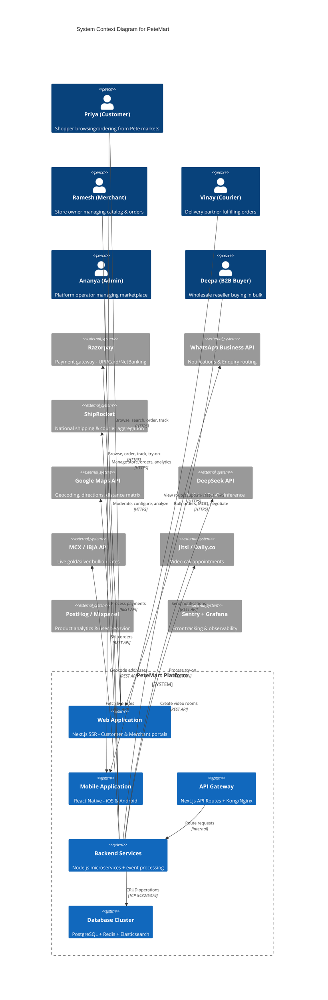

---

## 4. Container Architecture (C4 Level 2)

```mermaid
C4Container
  title Container Diagram for PeteMart Platform

  Person(customer, "Customer", "End user")
  Person(merchant, "Merchant", "Seller")

  System_Boundary(petemart, "PeteMart Platform") {

    Container(spa, "Single Page App", "Next.js 14", "Customer-facing web app with SSR, PWA")
    Container(mobile, "Mobile App", "React Native (Expo)", "iOS & Android native apps")
    Container(merchant_portal, "Merchant Portal", "Next.js 14", "Merchant dashboard, analytics")
    Container(admin_portal, "Admin Dashboard", "Next.js 14", "Platform operations console")

    Container(api_gateway, "API Gateway", "Next.js + Kong", "Rate limiting, auth, routing, versioning")
    
    Container(web_api, "Web API Service", "Node.js", "Customer-facing REST endpoints")
    Container(merchant_api, "Merchant API Service", "Node.js", "Merchant CRUD & analytics endpoints")
    Container(order_svc, "Order Service", "Node.js", "Order processing, multi-store consolidation")
    Container(payment_svc, "Payment Service", "Node.js", "Razorpay integration, escrow, settlement")
    Container(delivery_svc, "Delivery Service", "Node.js", "Courier dispatch, route optimization")
    Container(notification_svc, "Notification Service", "Node.js", "Push, WhatsApp, email, SMS")
    Container(ai_svc, "AI Service", "Python FastAPI", "Virtual Try-On, recommendation engine")
    Container(auth_svc, "Auth Service", "NextAuth.js / Supabase Auth", "Authentication, RBAC, OTP")
    
    ContainerDb(primary_db, "Primary Database", "PostgreSQL (Supabase)", "Transactional data, merchants, orders, products")
    ContainerDb(cache, "Cache Layer", "Redis (Upstash)", "Session cache, rate cache, API response cache")
    ContainerDb(search_db, "Search Index", "Elasticsearch (Meilisearch)", "Full-text product search, faceted filters")
    ContainerDb(queue, "Message Queue", "pgmq / RabbitMQ", "Async order processing, notification dispatch")
    ContainerDb(file_store, "File Storage", "Supabase Storage / S3", "Product images, AI try-on results, merchant galleries")
  }

  System_Ext(payment, "Razorpay", "")
  System_Ext(whatsapp, "WhatsApp Business API", "")
  System_Ext(shiprocket, "ShipRocket", "")
  System_Ext(maps, "Google Maps API", "")
  System_Ext(ai_api, "DeepSeek API", "")
  System_Ext(bullion, "MCX / IBJA", "")
  System_Ext(jitsi, "Jitsi / Daily.co", "")

  Rel(customer, spa, "Browse, order, payment", "HTTPS")
  Rel(customer, mobile, "Browse, order, try-on", "HTTPS")
  Rel(merchant, merchant_portal, "Manage catalog & orders", "HTTPS")
  
  Rel(spa, api_gateway, "API calls", "HTTPS")
  Rel(mobile, api_gateway, "API calls", "HTTPS")
  Rel(merchant_portal, api_gateway, "API calls", "HTTPS")
  Rel(admin_portal, api_gateway, "API calls", "HTTPS")
  
  Rel(api_gateway, web_api, "Route customer requests", "Internal")
  Rel(api_gateway, merchant_api, "Route merchant requests", "Internal")
  Rel(api_gateway, auth_svc, "Auth verification", "Internal")
  
  Rel(web_api, primary_db, "Read/write", "TCP 5432")
  Rel(web_api, cache, "Cache data", "TCP 6379")
  Rel(web_api, search_db, "Search queries", "REST")
  
  Rel(order_svc, primary_db, "Orders CRUD", "TCP 5432")
  Rel(order_svc, queue, "Enqueue/dequeue", "TCP")
  Rel(order_svc, cache, "Cart cache", "TCP 6379")
  
  Rel(payment_svc, primary_db, "Transactions", "TCP 5432")
  Rel(payment_svc, payment, "Process payment", "REST")
  
  Rel(delivery_svc, primary_db, "Delivery CRUD", "TCP 5432")
  Rel(delivery_svc, queue, "Route updates", "TCP")
  Rel(delivery_svc, shiprocket, "Ship orders", "REST")
  Rel(delivery_svc, maps, "Distance matrix", "REST")
  
  Rel(notification_svc, queue, "Consume events", "TCP")
  Rel(notification_svc, whatsapp, "Send messages", "REST")
  
  Rel(ai_svc, primary_db, "Fetch product data", "TCP 5432")
  Rel(ai_svc, file_store, "Read/write images", "S3 API")
  Rel(ai_svc, ai_api, "Inference requests", "REST")
  
  UpdateLayoutConfig($c4ShapeInRow="3", $c4BoundaryInRow="2")
```

---

## 5. Component Architecture (C4 Level 3)

### 5.1 Web Application (Next.js 14)

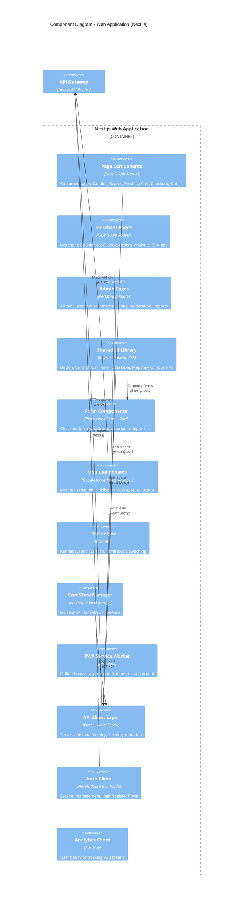

### 5.2 Order Processing Engine (Core Component)

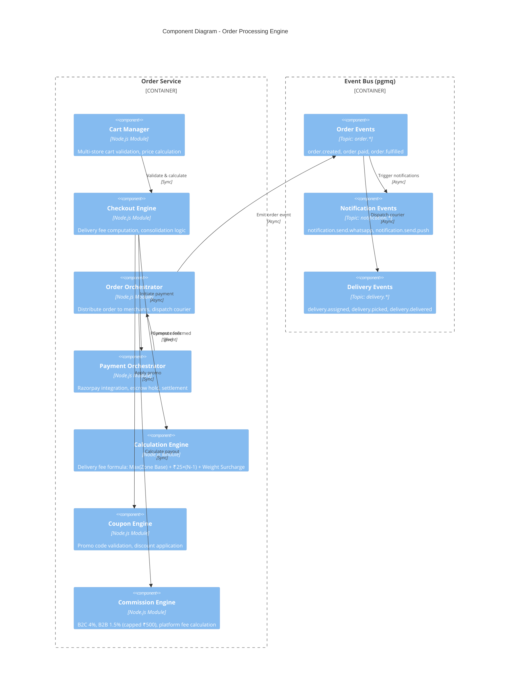

### 5.3 Multi-Store Consolidation Flow

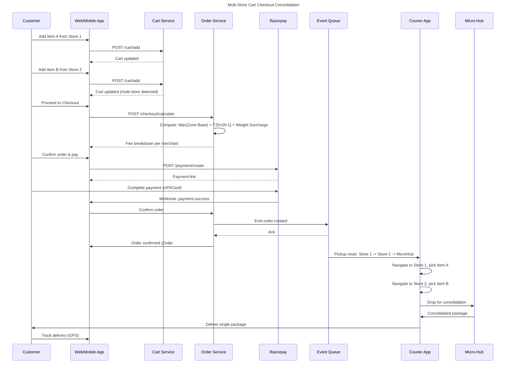

---

## 6. API-First Strategy & API Gateway

### 6.1 API Gateway Architecture

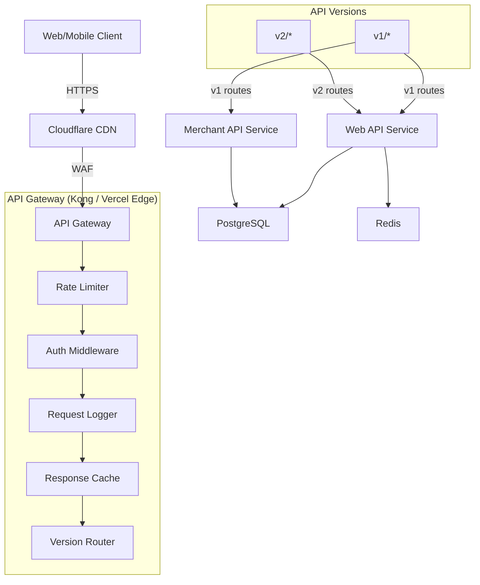

### 6.2 API Endpoint Catalog

| Endpoint Group | Path | Method | Purpose | Rate Limit |
|---------------|------|--------|---------|------------|
| **Products** | `/api/v1/products` | GET | List/search products | 100/min |
| **Products** | `/api/v1/products/:id` | GET | Product detail | 100/min |
| **Cart** | `/api/v1/cart` | GET/POST/PUT/DELETE | Cart operations | 60/min |
| **Checkout** | `/api/v1/checkout/calculate` | POST | Calculate fees | 30/min |
| **Checkout** | `/api/v1/checkout/confirm` | POST | Confirm order | 10/min |
| **Orders** | `/api/v1/orders` | GET | List user orders | 60/min |
| **Orders** | `/api/v1/orders/:id` | GET | Order detail | 60/min |
| **Payment** | `/api/v1/payment/create` | POST | Create payment session | 20/min |
| **Payment** | `/api/v1/payment/webhook` | POST | Razorpay webhook | 200/min |
| **Merchant** | `/api/v1/merchant/products` | CRUD | Merchant catalog mgmt | 60/min |
| **Merchant** | `/api/v1/merchant/orders` | GET | Merchant order list | 60/min |
| **Delivery** | `/api/v1/delivery/status` | PUT | Courier status update | 120/min |
| **Delivery** | `/api/v1/delivery/track` | GET | Live tracking | 120/min |
| **Auth** | `/api/v1/auth/*` | POST | Login/register/OTP | 10/min |
| **AI** | `/api/v1/ai/try-on` | POST | Virtual try-on | 5/min/user |
| **Bullion** | `/api/v1/bullion/rates` | GET | Live gold/silver rates | 20/min |
| **WhatsApp** | `/api/v1/whatsapp/link` | GET | Generate deep link | 60/min |
| **Analytics** | `/api/v1/analytics/merchant` | GET | Merchant dashboard data | 30/min |
| **Admin** | `/api/v1/admin/*` | CRUD | Admin operations | 30/min |
| **Webhook** | `/api/v1/webhooks/shiprocket` | POST | ShipRocket status updates | 100/min |
| **Webhook** | `/api/v1/webhooks/razorpay` | POST | Payment confirmations | 200/min |

### 6.3 Rate Limiting Strategy

```yaml
rate_limits:
  anonymous:
    requests_per_minute: 30
    burst: 10
  authenticated_user:
    requests_per_minute: 120
    burst: 30
  merchant_api:
    requests_per_minute: 300
    burst: 50
  webhook_endpoints:
    requests_per_minute: 600
    burst: 100
    whitelisted_ips: [razorpay_ips, shiprocket_ips]
  ai_endpoints:
    requests_per_minute: 10
    burst: 3
    cost_per_request: "$0.002"
```

---

## 7. Data Architecture & Caching Layer

### 7.1 Entity Relationship Diagram

```mermaid
erDiagram
  Merchant ||--o{ Product : "sells"
  Merchant ||--o{ Order : "receives"
  Merchant ||--o{ MerchantSubscription : "subscribes"
  Merchant ||--o{ MerchantAnalytics : "tracks"
  
  Customer ||--o{ Order : "places"
  Customer ||--o{ Cart : "has"
  Customer ||--o{ Review : "writes"
  
  Product ||--o{ LineItem : "contains"
  Order ||--o{ LineItem : "contains"
  Order ||--o{ Payment : "has"
  Order ||--o{ Delivery : "has"
  Order ||--o{ OrderEvent : "logs"
  
  Product ||--o{ ProductImage : "has"
  Product ||--o{ ProductVariant : "has"
  
  Carrier ||--o{ Delivery : "fulfills"
  
  Market ||--o{ Merchant : "belongs to"

  Subscription ||--o{ MerchantSubscription : "defines"
  
  Cart ||--o{ CartItem : "contains"
  Merchant ||--o{ CartItem : "supplies"

  Coupon ||--o{ Order : "applied to"

  Merchant ||--o{ MerchantMode : "activates"
  InteractionMode ||--o{ MerchantMode : "selected in"

  Product ||--o{ TryOnSession : "has"
  Customer ||--o{ TryOnSession : "creates"

  Review ||--o{ ReviewModeration : "moderated by"
  
  Product ||--o{ BullionPricing : "uses" : "if jewellery"
  BullionRate ||--o{ BullionPricing : "defines"
```

### 7.2 Database Schema (Major Tables)

```sql
-- Core Tables
CREATE TABLE merchants (
  id UUID PRIMARY KEY DEFAULT gen_random_uuid(),
  business_name VARCHAR(255) NOT NULL,
  owner_name VARCHAR(255) NOT NULL,
  email VARCHAR(255) UNIQUE,
  phone VARCHAR(20) UNIQUE NOT NULL,
  market_id UUID REFERENCES markets(id),
  address_line1 TEXT NOT NULL,
  address_line2 TEXT,
  city VARCHAR(100) DEFAULT 'Bengaluru',
  state VARCHAR(100) DEFAULT 'Karnataka',
  pincode VARCHAR(10),
  latitude DECIMAL(10,7),
  longitude DECIMAL(10,7),
  subscription_plan VARCHAR(20) DEFAULT 'starter',
  subscription_status VARCHAR(20) DEFAULT 'active',
  mode_a_enabled BOOLEAN DEFAULT false,
  mode_b_enabled BOOLEAN DEFAULT true,
  mode_c_enabled BOOLEAN DEFAULT true,
  whatsapp_number VARCHAR(20),
  razorpay_account_id VARCHAR(100),
  is_verified BOOLEAN DEFAULT false,
  is_active BOOLEAN DEFAULT true,
  commission_b2c DECIMAL(4,2) DEFAULT 4.00,
  commission_b2b DECIMAL(4,2) DEFAULT 1.50,
  created_at TIMESTAMPTZ DEFAULT NOW(),
  updated_at TIMESTAMPTZ DEFAULT NOW()
);

CREATE TABLE products (
  id UUID PRIMARY KEY DEFAULT gen_random_uuid(),
  merchant_id UUID REFERENCES merchants(id) NOT NULL,
  name VARCHAR(255) NOT NULL,
  description TEXT,
  category VARCHAR(100),
  subcategory VARCHAR(100),
  sku VARCHAR(100) UNIQUE,
  price_retail DECIMAL(12,2),
  price_wholesale DECIMAL(12,2),
  moq INTEGER DEFAULT 1,
  weight_grams DECIMAL(8,2),
  mode_a_available BOOLEAN DEFAULT false,
  mode_b_available BOOLEAN DEFAULT true,
  mode_c_available BOOLEAN DEFAULT true,
  stock_quantity INTEGER DEFAULT 0,
  is_jewellery BOOLEAN DEFAULT false,
  gold_purity VARCHAR(10), -- '24k', '22k', '18k'
  making_charges DECIMAL(12,2),
  is_active BOOLEAN DEFAULT true,
  search_vector TSVECTOR, -- For full-text search
  created_at TIMESTAMPTZ DEFAULT NOW(),
  updated_at TIMESTAMPTZ DEFAULT NOW()
);

CREATE TABLE orders (
  id UUID PRIMARY KEY DEFAULT gen_random_uuid(),
  order_number VARCHAR(20) UNIQUE NOT NULL,
  customer_id UUID REFERENCES customers(id),
  customer_name VARCHAR(255),
  customer_phone VARCHAR(20),
  customer_email VARCHAR(255),
  delivery_address_line1 TEXT,
  delivery_address_line2 TEXT,
  delivery_city VARCHAR(100),
  delivery_pincode VARCHAR(10),
  delivery_latitude DECIMAL(10,7),
  delivery_longitude DECIMAL(10,7),
  delivery_zone VARCHAR(20), -- 'zone_1', 'zone_2', 'zone_3'
  total_amount DECIMAL(12,2),
  delivery_fee DECIMAL(8,2),
  consolidation_surcharge DECIMAL(8,2),
  weight_surcharge DECIMAL(8,2),
  discount_amount DECIMAL(8,2) DEFAULT 0,
  coupon_code VARCHAR(50),
  commission_amount DECIMAL(12,2),
  payment_gateway_fee DECIMAL(8,2),
  net_amount DECIMAL(12,2),
  order_mode VARCHAR(10) DEFAULT 'a', -- 'a', 'b', 'c'
  order_type VARCHAR(10) DEFAULT 'b2c', -- 'b2c', 'b2b'
  payment_status VARCHAR(20) DEFAULT 'pending',
  order_status VARCHAR(20) DEFAULT 'pending',
  razorpay_order_id VARCHAR(100),
  razorpay_payment_id VARCHAR(100),
  is_multi_store BOOLEAN DEFAULT false,
  merchant_count INTEGER DEFAULT 1,
  created_at TIMESTAMPTZ DEFAULT NOW(),
  updated_at TIMESTAMPTZ DEFAULT NOW()
);

CREATE TABLE order_merchants (
  id UUID PRIMARY KEY DEFAULT gen_random_uuid(),
  order_id UUID REFERENCES orders(id),
  merchant_id UUID REFERENCES merchants(id),
  sub_total DECIMAL(12,2),
  commission_amount DECIMAL(8,2),
  merchant_payable DECIMAL(12,2),
  fulfillment_status VARCHAR(20) DEFAULT 'pending',
  created_at TIMESTAMPTZ DEFAULT NOW()
);

CREATE TABLE line_items (
  id UUID PRIMARY KEY DEFAULT gen_random_uuid(),
  order_id UUID REFERENCES orders(id),
  product_id UUID REFERENCES products(id),
  merchant_id UUID REFERENCES merchants(id),
  quantity INTEGER NOT NULL,
  unit_price DECIMAL(12,2),
  total_price DECIMAL(12,2),
  created_at TIMESTAMPTZ DEFAULT NOW()
);

CREATE TABLE payments (
  id UUID PRIMARY KEY DEFAULT gen_random_uuid(),
  order_id UUID REFERENCES orders(id),
  razorpay_order_id VARCHAR(100),
  razorpay_payment_id VARCHAR(100),
  razorpay_signature VARCHAR(255),
  amount DECIMAL(12,2),
  currency VARCHAR(3) DEFAULT 'INR',
  status VARCHAR(20) DEFAULT 'created',
  method VARCHAR(20), -- 'upi', 'card', 'netbanking', 'wallet'
  created_at TIMESTAMPTZ DEFAULT NOW()
);

CREATE TABLE deliveries (
  id UUID PRIMARY KEY DEFAULT gen_random_uuid(),
  order_id UUID REFERENCES orders(id),
  courier_id UUID REFERENCES carriers(id),
  status VARCHAR(20) DEFAULT 'assigned',
  pickup_route JSONB, -- Ordered list of merchant stops
  microhub_checkin TIMESTAMPTZ,
  out_for_delivery TIMESTAMPTZ,
  delivered_at TIMESTAMPTZ,
  current_latitude DECIMAL(10,7),
  current_longitude DECIMAL(10,7),
  shiprocket_order_id VARCHAR(100),
  estimated_delivery TIMESTAMPTZ,
  actual_delivery TIMESTAMPTZ,
  created_at TIMESTAMPTZ DEFAULT NOW()
);

CREATE TABLE bullion_rates (
  id UUID PRIMARY KEY DEFAULT gen_random_uuid(),
  metal VARCHAR(10) NOT NULL, -- 'gold', 'silver'
  purity VARCHAR(5) NOT NULL, -- '24k', '22k', '18k', '999'
  rate_per_gram DECIMAL(10,2) NOT NULL,
  source VARCHAR(20) DEFAULT 'MCX',
  timestamp TIMESTAMPTZ DEFAULT NOW()
);

-- Caching Strategy
-- Redis Cache Keys:
--   product:{id} - Product detail (TTL: 300s)
--   merchant:{id}:products - Merchant product list (TTL: 120s)
--   market:{id}:merchants - Market merchant list (TTL: 600s)
--   bullion:rates - Latest bullion rates (TTL: 60s)
--   cart:{userId} - Active cart (TTL: 86400s)
--   session:{token} - User session (TTL: 3600s)
--   search:{query} - Search results (TTL: 120s)
--   rate_limit:{ip}:{endpoint} - Rate limit counter (TTL: 60s)
```

### 7.3 Data Caching Architecture

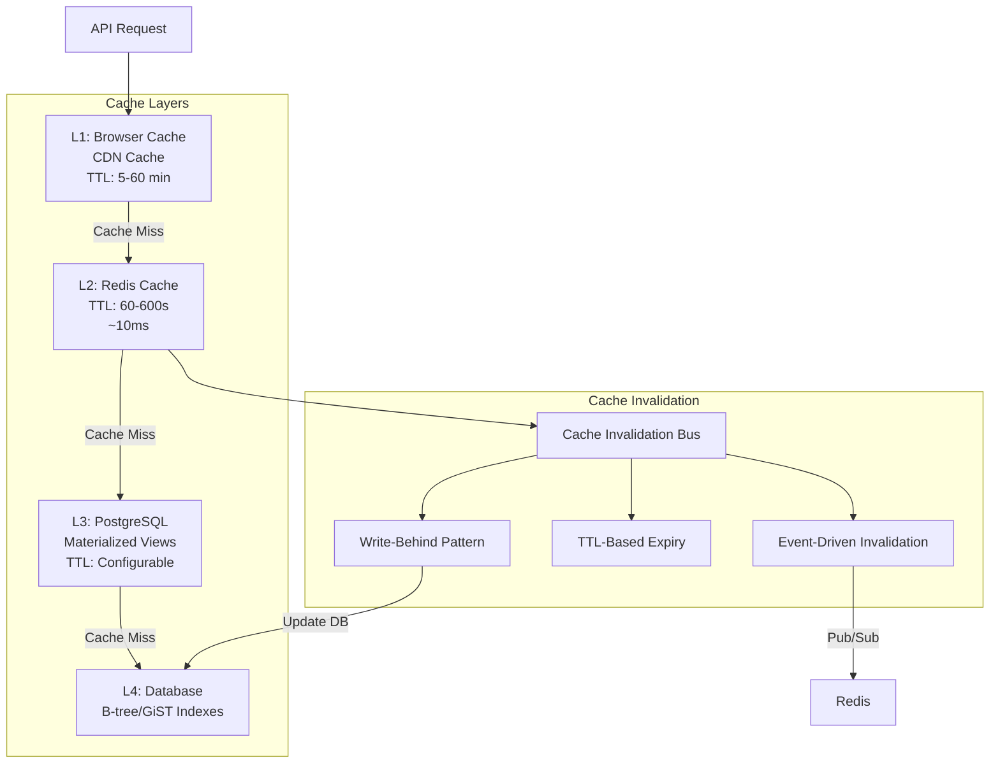

---

## 8. Message Queue & Event-Driven Architecture

### 8.1 Event Topology

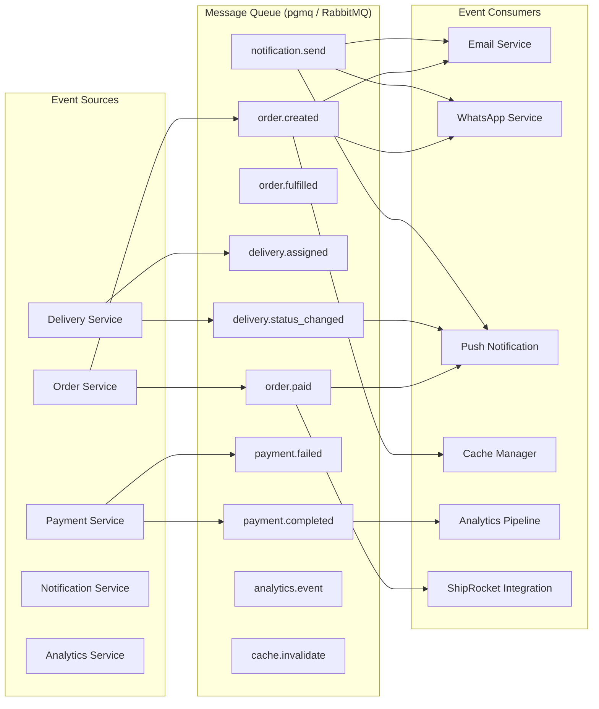

### 8.2 Event Schema

```json
{
  "order.created": {
    "version": "1.0.0",
    "source": "order-service",
    "id": "evt_abc123",
    "type": "order.created",
    "timestamp": "2026-06-15T10:30:00Z",
    "data": {
      "order_id": "ord_xyz789",
      "order_number": "PM-20260615-0001",
      "customer_id": "cus_123",
      "merchants": ["mer_001", "mer_002"],
      "total_amount": 2450.00,
      "payment_status": "pending",
      "is_multi_store": true
    }
  }
}
```

---

## 9. Security Framework

### 9.1 Security Architecture

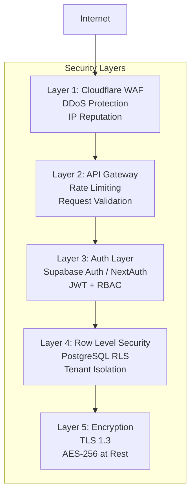

### 9.2 Security Controls

| Control | Implementation | Detail |
|---------|---------------|--------|
| **Authentication** | Supabase Auth + NextAuth.js | Email/OTP, Google OAuth, WhatsApp OTP |
| **Authorization** | RBAC with 5 roles | Customer, Merchant, Courier, Admin, SuperAdmin |
| **Row Level Security** | PostgreSQL RLS policies | Merchants see only their data |
| **API Rate Limiting** | Kong + Vercel Edge | Per-IP, per-user, per-endpoint tiers |
| **Input Validation** | Zod schemas | All API inputs validated server-side |
| **SQL Injection Prevention** | Parameterized queries | Prisma ORM enforces parameterization |
| **XSS Prevention** | DOMPurify + CSP headers | Content Security Policy strict mode |
| **CSRF Protection** | Double-submit cookie pattern | Next.js built-in CSRF protection |
| **Payment Security** | Razorpay Webhook Signatures | HMAC-SHA256 verification |
| **Data Encryption** | AES-256 at rest + TLS 1.3 | Supabase + Cloudflare encryption |
| **Audit Logging** | `audit_logs` table | All admin actions logged immutably |
| **Secrets Management** | Vercel Environment Variables | + GitHub Actions secrets (CI/CD) |

### 9.3 Compliance

| Regulation | Requirement | PeteMart Implementation |
|-----------|-------------|----------------------|
| **GDPR / DPDP Act (India)** | Data consent, right to deletion | Consent checkbox on signup, account deletion API |
| **PCI-DSS** | Payment data handling | Razorpay handles all payment data; zero card data stored |
| **IT Act 2000 (India)** | Data localization | All data stored in India-region Supabase (ap-south-1) |
| **ISO 27001** | Information security management | Annual SOC2 audit target (Phase 3) |

---

## 10. Testing Architecture (Multi-Layer)

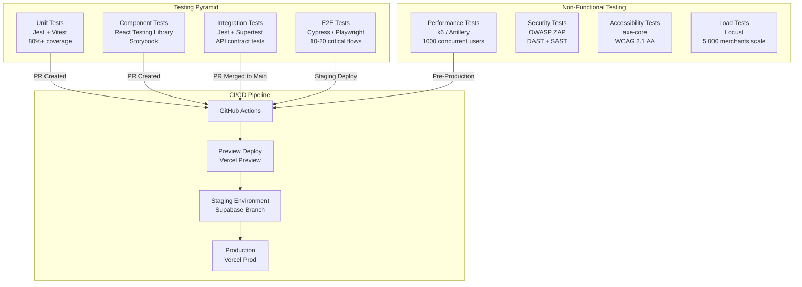

### 10.1 Testing Strategy

| Layer | Tool | Scope | Frequency | Success Criteria |
|-------|------|-------|-----------|-----------------|
| **Unit** | Jest + Vitest | All services, utilities, models | Per commit | 80%+ coverage, all pass |
| **Component** | React Testing Library + Storybook | UI components, forms | Per PR | All stories render correctly |
| **Integration** | Supertest + TestContainers | API endpoints, database queries | Per PR | All endpoints return correct status codes |
| **E2E** | Cypress / Playwright | Critical user journeys (browse→cart→checkout→payment→track) | Per staging deploy | 20 critical flows pass |
| **Performance** | k6 / Artillery | API endpoints under load | Weekly | p95 < 500ms, error rate < 0.1% |
| **Load** | Locust / k6 | 5,000 concurrent shoppers | Monthly | No degradation at 5,000 concurrent |
| **Security** | OWASP ZAP + Snyk | Dependency scan + dynamic scanning | Per release | Zero critical/high vulnerabilities |
| **Accessibility** | axe-core + Lighthouse | All pages WCAG 2.1 AA | Per PR | No critical violations |

---

## 11. Infrastructure & Deployment

### 11.1 Deployment Architecture

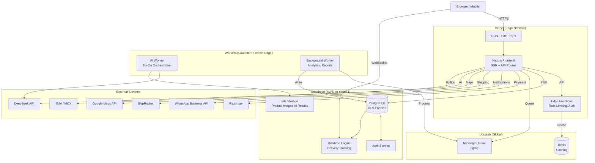

### 11.2 Scaling Thresholds

| Threshold | Infra Action | Estimated Impact |
|-----------|-------------|-----------------|
| **100 merchants** | Vercel Pro + Supabase Pro | ₹4,500/mo |
| **500 merchants** | Add Redis (Upstash) + Background Workers | ₹12,000/mo |
| **1,000 merchants** | Vercel Enterprise + Supabase Team + PG replication | ₹35,000/mo |
| **2,500 merchants** | Add Elasticsearch + Read replicas + CDN optimization | ₹80,000/mo |
| **5,000 merchants** | Full cluster: Multi-region PG + Dedicated AI infra | ₹2,00,000/mo |
| **Multi-city expansion** | Per city: Dedicated Supabase project + Local micro-hub infra | ₹50,000/city/mo |

---

## 12. Cost Model & Scaling Thresholds

### 12.1 POC Phase Cost (₹0/month — 8 Merchants)

| Service | Tier | Monthly Cost | Annual Cost | Notes |
|---------|------|-------------|-------------|-------|
| Vercel | Hobby (Free) | ₹0 | ₹0 | petemart-pilot.vercel.app |
| Supabase | Free | ₹0 | ₹0 | 500MB DB, 1GB storage |
| GitHub | Free | ₹0 | ₹0 | Private repos |
| Expo | Free | ₹0 | ₹0 | Development builds |
| DeepSeek API | Free Tier | ₹0 | ₹0 | 100K tokens/day |
| Razorpay | Free | ₹0 | ₹0 | Standard integration |
| Total | | **₹0/month** | **₹0/year** | |

### 12.2 Production Phase Cost (Scaled)

| Service | Tier | Monthly (₹) | Annual (₹) | Merchant Capacity |
|---------|------|------------|------------|-------------------|
| **Vercel** | Pro → Enterprise | ₹1,700 → ₹34,000 | ₹20,400 → ₹4,08,000 | 100 → 5,000 |
| **Supabase** | Pro → Team → Enterprise | ₹2,100 → ₹42,000 | ₹25,200 → ₹5,04,000 | 100 → 5,000 |
| **Upstash Redis** | Pay-as-you-go | ₹850 → ₹8,500 | ₹10,200 → ₹1,02,000 | 500 → 5,000 |
| **DeepSeek API** | Pay-per-token | ₹4,250 → ₹42,500 | ₹51,000 → ₹5,10,000 | 100K → 1M inferences |
| **Razorpay** | Pay-per-transaction | ₹0 (2% PG fee) | ₹0 | 2% per transaction |
| **WhatsApp Business** | Pay-per-conversation | ₹850 → ₹8,500 | ₹10,200 → ₹1,02,000 | 1K → 50K conv/mo |
| **ShipRocket** | Pay-per-shipment | ₹1,700 → ₹17,000 | ₹20,400 → ₹2,04,000 | 500 → 5,000 orders |
| **Google Maps API** | Pay-as-you-go | ₹850 → ₹4,250 | ₹10,200 → ₹51,000 | Geocoding + directions |
| **Sentry** | Team → Business | ₹2,170 → ₹8,500 | ₹26,040 → ₹1,02,000 | Error monitoring |
| **PostHog** | Free → Scale | ₹0 → ₹8,500 | ₹0 → ₹1,02,000 | Product analytics |
| **Elasticsearch** | Managed (when needed) | ₹0 → ₹17,000 | ₹0 → ₹2,04,000 | >2,500 merchants |
| **Monitoring (Grafana)** | Free | ₹0 | ₹0 | Open source |
| **TOTAL** | | **₹14,470 → ₹1,91,250** | **₹1,73,640 → ₹22,95,000** | |

### 12.3 Unit Economics

```yaml
per_merchant_operating_cost:
  starter_plan:
    platform_cost_per_month: ₹85  # (Total infra / Total merchants)
    subscription_revenue: ₹499
    gross_margin_pct: 83%
  growth_plan:
    platform_cost_per_month: ₹170
    subscription_revenue: ₹999
    gross_margin_pct: 83%
  premium_plan:
    platform_cost_per_month: ₹250
    subscription_revenue: ₹2,499
    gross_margin_pct: 90%

breakeven_analysis:
  total_fixed_infra: ₹14,470/mo (100 merchants)
  breakeven_merchants_at_starter: 29 merchants
  breakeven_merchants_at_growth: 15 merchants
  monthly_revenue_at_5000_merchants: ₹83,25,000
  monthly_revenue_at_1000_merchants: ₹16,65,000
```

---

## 13. POC Architecture (Subset)

### 13.1 POC Scope (8 Merchants — ₹0/month)

The POC is designed to validate core workflows with **8 pilot merchants** from Balepet and Chickpet markets using **exclusively free-tier services**.

**Included in POC:**
- ✅ Web: Vercel Hobby (petemart-pilot.vercel.app)
- ✅ Database: Supabase Free (500MB DB, 1GB storage)
- ✅ Auth: Supabase Auth (Email OTP + Magic Link)
- ✅ Basic product catalog (up to 50 products/merchant)
- ✅ Mode A: Simple cart + checkout flow
- ✅ Mode B: WhatsApp deep links (no tracking)
- ✅ Mode C: Google Maps store pin
- ✅ Merchant dashboard (basic order management)
- ✅ Multi-language: English + Kannada

**Deferred to Production:**
- ❌ Mobile apps (iOS/Android)
- ❌ WhatsApp Business API integration
- ❌ Multi-store consolidated cart
- ❌ AI Virtual Try-On
- ❌ Live bullion rates
- ❌ Video call appointments
- ❌ National shipping (ShipRocket)
- ❌ Multi-city expansion
- ❌ Advanced analytics & reporting
- ❌ Feature flags & kill switch
- ❌ Pete Street Virtual Walk
- ❌ Live Bazaar streaming

### 13.2 POC Architecture Diagram

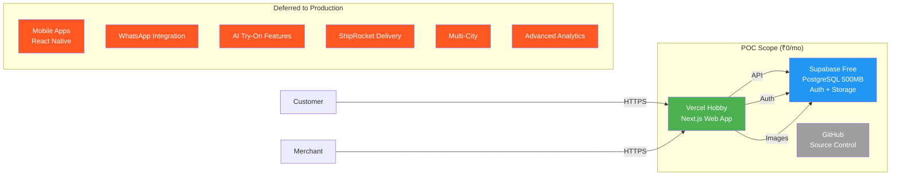

### 13.3 POC Deferred Feature Mapping

| PRD Requirement | Category | Priority | POC | Production |
|-----------------|----------|----------|-----|------------|
| REQ-UI-001 to 008 | Core Browse/Order | P0 | ✅ Basic | ✅ Full |
| REQ-UI-009, 010 | Mobile Apps | P1 | ❌ | ✅ React Native |
| REQ-UI-011 | Merchant Dashboard | P0 | ✅ Basic | ✅ Advanced |
| REQ-UI-013 | Multi-Language | P0 | ✅ EN+KA | ✅ 4 Languages |
| REQ-UI-015, 016 | AI Try-On | P1 | ❌ | ✅ DeepSeek API |
| REQ-UI-017 | Bullion Rates | P0 | ❌ | ✅ MCX/IBJA |
| REQ-UI-019 | Multi-City | P0 | ❌ | ✅ Geographic selector |
| REQ-API-004 | WhatsApp Deep Link | P0 | ✅ Basic | ✅ Full tracking |
| REQ-API-013 | ShipRocket | P1 | ❌ | ✅ National shipping |
| REQ-BE-018 | AI Inference | P1 | ❌ | ✅ DeepSeek |
| REQ-COM-010 | National Delivery | P1 | ❌ | ✅ ShipRocket |
| REQ-INFRA-011 | Feature Flags | P1 | ❌ | ✅ LaunchDarkly |

---

## 14. Appendices

### 14.1 Technology Stack Summary

| Layer | Technology | Version | Purpose |
|-------|-----------|---------|---------|
| **Frontend** | Next.js | 14.x | Web app (SSR + PWA) |
| **Frontend** | React Native (Expo) | 50.x | Mobile apps (iOS + Android) |
| **UI Framework** | Tailwind CSS | 3.x | Styling system |
| **UI Components** | Radix UI / shadcn | Latest | Accessible component primitives |
| **Mobile UI** | NativeWind | Latest | Tailwind for React Native |
| **State Mgmt** | Zustand | 4.x | Client-side state |
| **Server State** | TanStack Query (React Query) | 5.x | Server state caching |
| **Forms** | React Hook Form + Zod | Latest | Form validation |
| **i18n** | next-intl | 3.x | Internationalization |
| **Backend** | Next.js API Routes | 14.x | Serverless API |
| **Backend** | Node.js + Express | 20.x LTS | Background services |
| **Backend** | Python FastAPI | Latest | AI inference service |
| **Database** | PostgreSQL (Supabase) | 15.x | Primary database |
| **Cache** | Redis (Upstash) | 7.x | Caching + session store |
| **Search** | Meilisearch | Latest | Full-text product search |
| **Queue** | pgmq / RabbitMQ | Latest | Async message processing |
| **ORM** | Prisma | 5.x | Database access |
| **Auth** | NextAuth.js + Supabase Auth | Latest | Authentication |
| **Payment** | Razorpay | Latest | Payment gateway |
| **Shipping** | ShipRocket API | Latest | National shipping |
| **Maps** | Google Maps API | Latest | Geocoding, routing |
| **AI** | DeepSeek API + ONNX Runtime | Latest | Virtual Try-On |
| **Analytics** | PostHog | Latest | Product analytics |
| **Monitoring** | Sentry + Grafana | Latest | Error tracking |
| **CI/CD** | GitHub Actions | Latest | Automated testing & deploy |
| **Hosting** | Vercel | Latest | Frontend + API hosting |
| **DB Hosting** | Supabase | Latest | Managed PostgreSQL |
| **CDN** | Vercel Edge Network | Latest | Global content delivery |

### 14.2 Key Architectural Decisions Record (ADR)

| ADR ID | Decision | Rationale | Alternatives Considered |
|--------|----------|-----------|------------------------|
| ADR-001 | Next.js over separate BE+FE | Unified API surface, SSR for SEO, reduced DevOps | React + Express API, Django REST |
| ADR-002 | Supabase over custom PostgreSQL | Built-in auth, RLS, realtime, storage, cheaper | AWS RDS, Neon, PlanetScale |
| ADR-003 | DeepSeek API over self-hosted model | No GPU infra, pay-per-token, rapid iteration | Stable Diffusion (self-host), Replicate |
| ADR-004 | pgmq over dedicated queue | Less infra, integrated with PostgreSQL | Redis Queue, BullMQ, RabbitMQ |
| ADR-005 | Zustand over Redux | Lighter bundle, simpler API, sufficient for scale | Redux Toolkit, Jotai, Pinia |
| ADR-006 | Razorpay over Stripe | Indian market leader, UPI support, better INR rates | Stripe, Instamojo, Cashfree |
| ADR-007 | ShipRocket over custom delivery | National scale, multiple courier partners, lower rates | Custom fleet, Dunzo, Shadowfax |
| ADR-008 | Meilisearch over Elasticsearch | Simpler setup, lower cost, sufficient for 5K merchants | Elasticsearch, Algolia, Typesense |
| ADR-009 | next-intl over react-i18next | Next.js native, server components compatible, simpler | react-i18next, FormatJS |
| ADR-010 | Expo over bare React Native | Faster development, OTA updates, easier CI/CD | Bare RN, Flutter, Kotlin Multiplatform |

### 14.3 Integration Points

| Integration | Protocol | Authentication | Data Volume | SLA |
|------------|----------|---------------|-------------|-----|
| Razorpay | REST + Webhooks | API Key + HMAC | 10K txns/mo → 500K/mo | 99.9% |
| WhatsApp Business | REST API | API Token | 1K conv/mo → 50K/mo | 99.5% |
| ShipRocket | REST API | API Key | 500 → 25K orders/mo | 99.5% |
| Google Maps | REST + JS SDK | API Key | 10K req/day | 99.9% |
| DeepSeek | REST API | API Key | 100K → 1M inferences/mo | 99.5% |
| IBJA/MCX | REST API | API Key | 1K req/day | 99.0% |
| Jitsi/Daily.co | REST + WebRTC | API Key | 100 → 5K calls/mo | 99.5% |
| PostHog | REST + SDK | API Key | All events | 99.9% |

---

*End of Full Production Architecture Blueprint*