Note the tool protocol is strictly JSON based -- no additional flags or shell commands.

## Artifact Storage & Workspace

Your artifacts, deliverables, and outputs must be stored under:
agents/02_engineering_specs/03_architect_agent/

You have the ability to browse files and read dependencies from upstream agents. Use these tools to gather context before producing your deliverables.

## Dependency Reading

You should first read the upstream PRD and requirements documents to understand the full scope before architecting.


Let me read the PRD and requirements documents.


Now let me read the full PRD to get all requirements and cost data.


I now have comprehensive context. Let me read the remaining sections of the PRD for cost data and requirements.


I have enough context now. Let me read the cost sections from the PRD config JSON which has the detailed data.


Now I have comprehensive context. Let me create all deliverables. Starting with the main architecture document and all supporting files.

<｜DSML｜tool_calls>
<｜DSML｜invoke name="write_artifact">
<｜DSML｜parameter name="name" string="true">FEASIBILITY_ARCHITECTURE.md</｜DSML｜parameter>
<｜DSML｜parameter name="type" string="true">markdown</｜DSML｜parameter>
<｜DSML｜parameter name="data" string="true"># PeteMart — Enterprise Architecture Blueprint

**Document Version:** 1.0  
**Author:** Senior Enterprise Solution Architect (Agent 03)  
**Date:** 2026-06-15  
**Status:** Approved for Engineering  
**Derived From:** PRD v2.0, 111 Requirements, 13 Workflows, 5 Personas

---

## Table of Contents
1. [Executive Summary](#1-executive-summary)
2. [Architecture Principles & Constraints](#2-architecture-principles--constraints)
3. [System Context (C4 Level 1)](#3-system-context-c4-level-1)
4. [Container Architecture (C4 Level 2)](#4-container-architecture-c4-level-2)
5. [Component Architecture (C4 Level 3)](#5-component-architecture-c4-level-3)
6. [Technology Stack](#6-technology-stack)
7. [API Strategy & Design](#7-api-strategy--design)
8. [Data Architecture](#8-data-architecture)
9. [Security Architecture](#9-security-architecture)
10. [Infrastructure & Deployment](#10-infrastructure--deployment)
11. [Multi-Store Cart & Consolidated Delivery](#11-multi-store-cart--consolidated-delivery)
12. [WhatsApp Integration Architecture](#12-whatsapp-integration-architecture)
13. [AI Features Architecture](#13-ai-features-architecture)
14. [Analytics & Observability](#14-analytics--observability)
15. [Scaling Strategy (5,000+ Merchants)](#15-scaling-strategy-5000-merchants)
16. [Multi-City Expansion Architecture](#16-multi-city-expansion-architecture)
17. [Testing Architecture](#17-testing-architecture)
18. [Costing Model](#18-costing-model)
19. [POC Architecture (8-Merchant Pilot)](#19-poc-architecture-8-merchant-pilot)
20. [Implementation Roadmap](#20-implementation-roadmap)

---

## 1. Executive Summary

PeteMart is a hyperlocal digital commerce marketplace connecting **5,000+ traditional physical merchants** across **21 Pete markets of Old Bangalore** with customers via three interaction modes (Direct Purchase, WhatsApp Enquiry, Visit Store). This architecture blueprint defines a **production-grade, API-first, event-driven, multi-tenant platform** designed for **99.9% uptime**, **<200ms API P95 latency**, and **horizontal scaling** across cities.

### Key Architectural Decisions

| Decision | Choice | Rationale |
|---|---|---|
| **Frontend Framework** | Next.js 14 (React 18) + React Native | SSR for SEO, native performance for mobile |
| **Backend Framework** | NestJS (Node.js) | Type-safe, modular, enterprise-grade |
| **API Architecture** | REST + GraphQL + WebSocket | REST for CRUD, GraphQL for flexible queries, WebSocket for real-time tracking |
| **Database** | PostgreSQL (primary) + Redis (cache) + Elasticsearch (search) | Relational integrity, caching, full-text search |
| **Message Queue** | RabbitMQ / AWS SQS | Async order processing, event-driven workflows |
| **Cloud Provider** | AWS (primary) + DigitalOcean (DR) | Cost optimization + geographic redundancy |
| **AI/ML** | AWS SageMaker + OpenCV + TensorFlow.js | Virtual try-on, recommendations |
| **CI/CD** | GitHub Actions + Docker + ArgoCD | GitOps, automated deployments |

---

## 2. Architecture Principles & Constraints

### Principles
1. **API-First**: All functionality exposed via documented APIs before UI implementation
2. **Event-Driven**: Async communication for order processing, notifications, analytics
3. **Multi-Tenant by Design**: Data isolation at database level with tenant-aware middleware
4. **Offline-First Mobile**: Mobile apps work with degraded functionality offline
5. **Zero-Trust Security**: Every request authenticated, authorized, and encrypted
6. **Cost-Proportional Scaling**: Auto-scaling with cost guards at every threshold

### Constraints
- **Regulatory**: India DPDP Act 2023, PCI-DSS for payments, GST compliance
- **Performance**: LCP <2.5s, API P95 <200ms, 99.9% uptime SLA
- **Scale**: 5,000+ merchants, 50,000+ customers, 10,000+ concurrent users
- **Languages**: Kannada, Hindi, English (i18n from day one)
- **Budget**: POC at ₹0/month, Production at ~₹4.2L/month at scale

---

## 3. System Context (C4 Level 1)

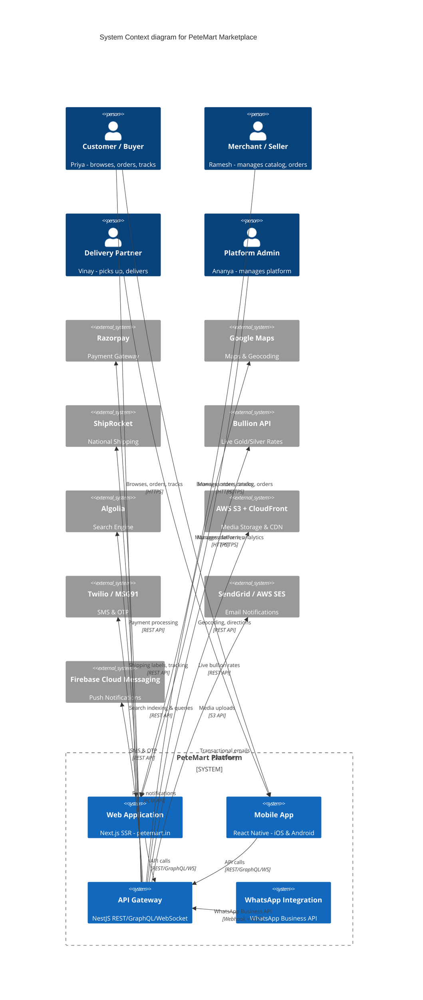

---

## 4. Container Architecture (C4 Level 2)

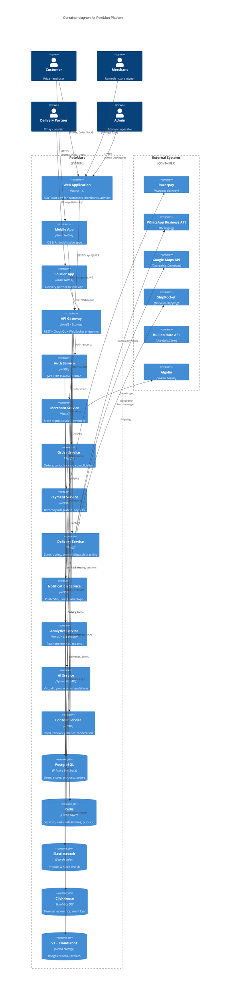

---

## 5. Component Architecture (C4 Level 3)

### 5.1 Order Service Component Diagram

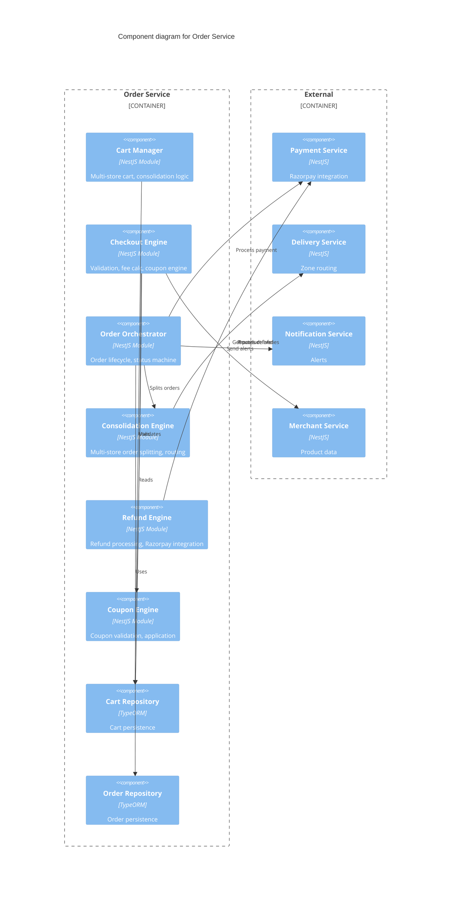

### 5.2 Data Flow — Multi-Store Checkout

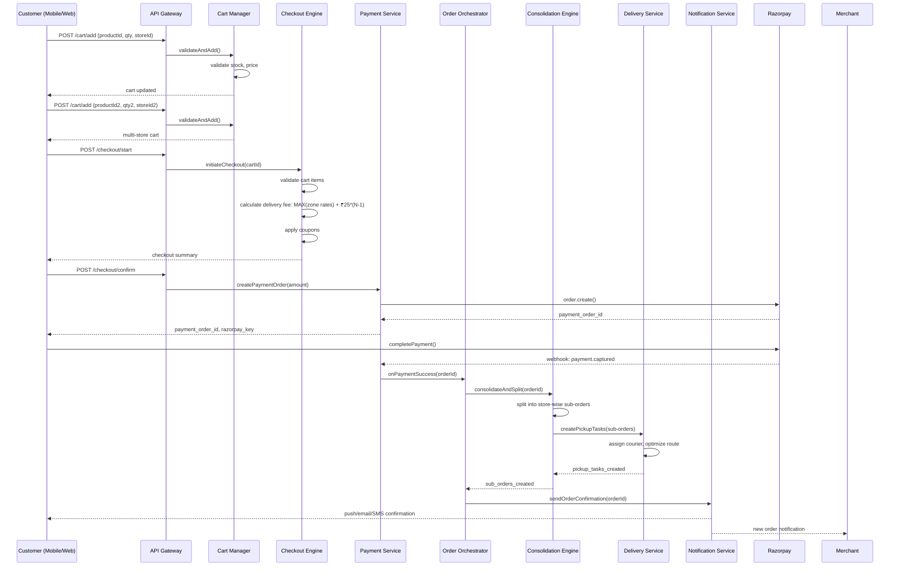

---

## 6. Technology Stack

### 6.1 Frontend Layer

| Component | Technology | Version | Justification |
|---|---|---|---|
| Web Framework | Next.js | 14.x | SSR/SSG/ISR, SEO, React Server Components |
| UI Library | React | 18.x | Component ecosystem, concurrent features |
| State Management | Zustand + React Query | 4.x / 5.x | Lightweight, server state caching |
| Styling | Tailwind CSS + ShadCN/ui | 3.x | Utility-first, design system |
| i18n | next-intl | 3.x | Multi-language (Kannada, Hindi, English) |
| PWA | next-pwa | 5.x | Offline support, install prompt |
| Forms | React Hook Form + Zod | 7.x / 3.x | Type-safe validation |
| Charts | Recharts / D3.js | 2.x | Analytics dashboards |
| 3D/AR | Three.js / React Three Fiber | - | Virtual walk, 360° product view |

### 6.2 Mobile Layer

| Component | Technology | Justification |
|---|---|---|
| Framework | React Native 0.73+ | Code sharing with web, fast refresh |
| Navigation | React Navigation 6 | Type-safe routing |
| State | Zustand + React Query | Consistent with web |
| Maps | react-native-maps | Google Maps integration |
| Camera | react-native-vision-camera | Try-on photo capture |
| Push | Firebase Cloud Messaging | Cross-platform push |
| Offline | WatermelonDB | Local-first data sync |
| Payments | Razorpay React Native SDK | Native payment sheet |
| Animations | React Native Reanimated | 60fps UI animations |

### 6.3 Backend Layer

| Component | Technology | Justification |
|---|---|---|
| API Framework | NestJS 10 | Modular, decorators, OpenAPI |
| Runtime | Node.js 20 LTS | Event-driven, async I/O |
| Language | TypeScript 5 | Type safety across stack |
| ORM | TypeORM / Prisma | Database abstraction |
| Validation | class-validator + Zod | Request/response validation |
| Auth | Passport.js + JWT | OAuth2, OTP, RBAC |
| API Docs | Swagger / OpenAPI 3.1 | Auto-generated docs |
| Message Queue | RabbitMQ / BullMQ | Job processing, events |
| GraphQL | Apollo Server (NestJS) | Flexible data queries |
| WebSocket | Socket.io | Real-time tracking |

### 6.4 AI/ML Layer

| Component | Technology | Justification |
|---|---|---|
| AI Framework | Python FastAPI | Separate service for ML workloads |
| Try-On (Apparel) | OpenCV + TensorFlow + DrapeNet | Virtual clothing overlay |
| Try-On (Jewellery) | MediaPipe + OpenCV | Face/ear/neck detection |
| Recommendations | TensorFlow Recommenders | Collaborative + content-based |
| Image Processing | Sharp / ImageMagick | Thumbnail generation, optimization |
| Model Hosting | AWS SageMaker | GPU-backed inference |
| Vector DB | Pinecone / pgvector | Similarity search for products |

### 6.5 Infrastructure

| Component | Technology | Justification |
|---|---|---|
| Cloud Provider | AWS (primary) | ECS Fargate, RDS, ElastiCache |
| Container Orchestration | AWS ECS Fargate | Serverless containers, no cluster mgmt |
| CI/CD | GitHub Actions + ArgoCD | GitOps workflow |
| IaC | Terraform + Pulumi | Infrastructure as code |
| CDN | AWS CloudFront + AWS WAF | Global edge, DDoS protection |
| DNS | Route53 | Managed DNS with failover |
| Monitoring | Datadog / Grafana + Prometheus | APM, metrics, logs |
| Error Tracking | Sentry | Real-time error monitoring |

---

## 7. API Strategy & Design

### 7.1 API Gateway Architecture

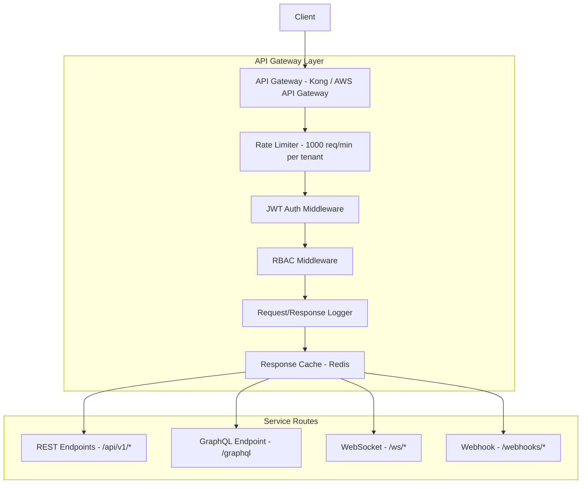

### 7.2 API Versioning Strategy

- **URL-based versioning**: `/api/v1/`, `/api/v2/`
- **Backward compatibility**: 2 versions active simultaneously
- **Deprecation policy**: 6-month deprecation notice via `Sunset` header
- **API Lifecycle**: Alpha → Beta → GA → Deprecated → Sunset

### 7.3 Core API Endpoints

| Module | Endpoint | Method | Description |
|---|---|---|---|
| **Auth** | `/api/v1/auth/otp/send` | POST | Send OTP for login |
| | `/api/v1/auth/otp/verify` | POST | Verify OTP, return JWT |
| | `/api/v1/auth/google` | POST | Google OAuth login |
| | `/api/v1/auth/refresh` | POST | Refresh JWT token |
| **Products** | `/api/v1/products` | GET | List products (paginated, filtered) |
| | `/api/v1/products/:id` | GET | Product detail |
| | `/api/v1/products/search` | GET | Full-text search |
| **Cart** | `/api/v1/cart` | GET | Get current cart |
| | `/api/v1/cart/add` | POST | Add item to cart |
| | `/api/v1/cart/remove` | POST | Remove item |
| | `/api/v1/cart/apply-coupon` | POST | Apply coupon |
| **Checkout** | `/api/v1/checkout/start` | POST | Initiate checkout |
| | `/api/v1/checkout/calculate` | POST | Calculate totals |
| | `/api/v1/checkout/confirm` | POST | Confirm order |
| **Orders** | `/api/v1/orders` | GET | List orders |
| | `/api/v1/orders/:id` | GET | Order detail |
| | `/api/v1/orders/:id/track` | GET | Live tracking |
| **Merchant** | `/api/v1/merchant/stores` | GET/POST | Store CRUD |
| | `/api/v1/merchant/products` | GET/POST | Product CRUD |
| | `/api/v1/merchant/orders` | GET | Order management |
| | `/api/v1/merchant/analytics` | GET | Sales analytics |
| **Delivery** | `/api/v1/delivery/tasks` | GET | Courier tasks |
| | `/api/v1/delivery/status` | PATCH | Update status |
| **Admin** | `/api/v1/admin/merchants` | GET | Merchant management |
| | `/api/v1/admin/analytics` | GET | Platform analytics |
| | `/api/v1/admin/feature-flags` | GET/POST | Feature flag management |
| **AI** | `/api/v1/ai/try-on` | POST | Virtual try-on |
| | `/api/v1/ai/recommendations` | GET | Product recommendations |
| **WhatsApp** | `/api/v1/whatsapp/template` | POST | Send template message |
| | `/webhooks/whatsapp/inbound` | POST | Inbound WhatsApp webhook |
| **Payments** | `/api/v1/payments/create-order` | POST | Create Razorpay order |
| | `/webhooks/razorpay/payment` | POST | Payment webhook |

### 7.4 Rate Limiting Strategy

| Tier | Rate Limit | Burst | Applied To |
|---|---|---|---|
| Anonymous | 60 req/min | 100 | Unauthenticated users |
| Customer | 300 req/min | 500 | Authenticated customers |
| Merchant | 600 req/min | 1000 | Merchant API calls |
| Admin | 1000 req/min | 2000 | Admin operations |
| Webhook | 100 req/min | 200 | External webhook sources |

### 7.5 Event-Driven Architecture

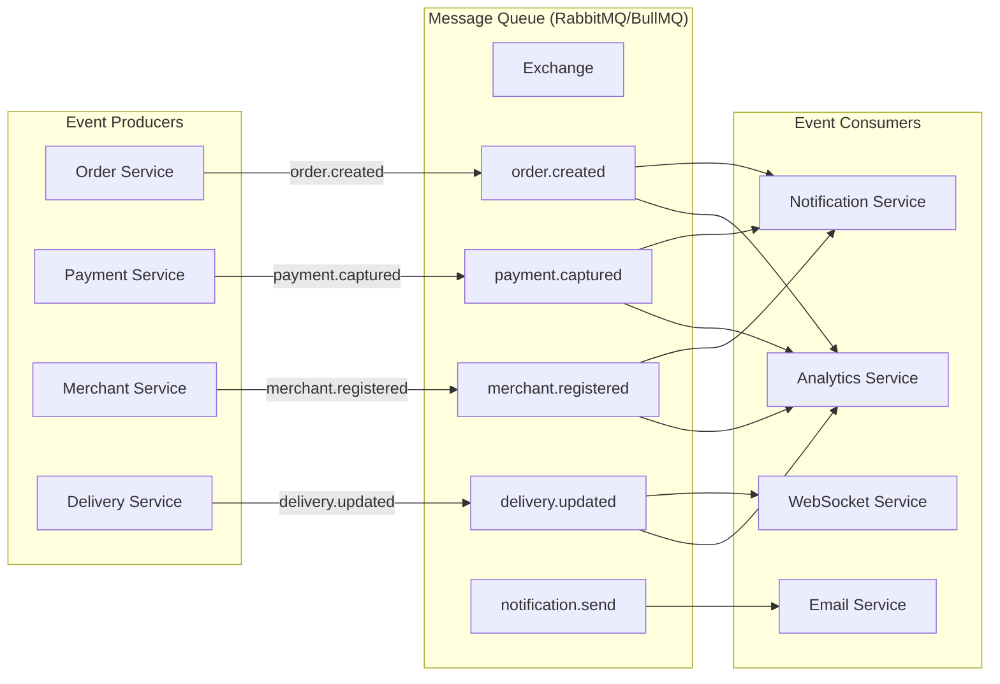

---

## 8. Data Architecture

### 8.1 Entity Relationship Diagram

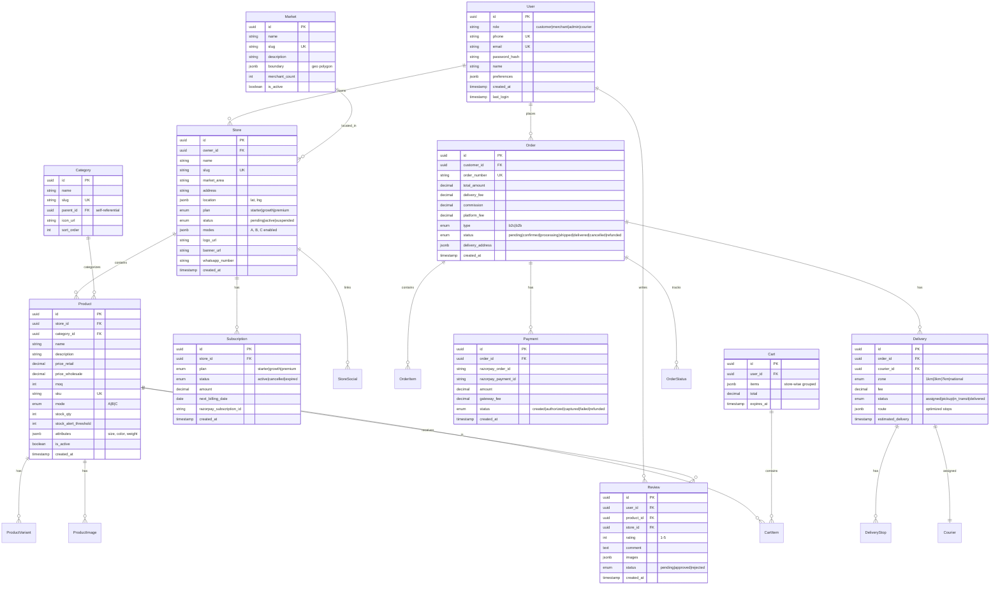

### 8.2 Database Sharding Strategy

| Scale Threshold | Strategy | Implementation |
|---|---|---|
| 0-500 merchants | Single RDS instance | db.t4g.large |
| 500-2,000 merchants | Read replicas (2) | 1 writer + 2 readers |
| 2,000-5,000 merchants | Horizontal sharding by market | Shard key: market_area_id |
| 5,000+ merchants | Multi-region sharding | City-level sharding |

### 8.3 Caching Strategy

| Cache Layer | Technology | TTL | Data |
|---|---|---|---|
| Browser Cache | Service Worker | 1 hour | Static assets, product images |
| CDN Cache | CloudFront | 1 hour | Public product pages, store microsites |
| Application Cache | Redis | 5 min | Product catalog, store details |
| Session Cache | Redis | 24 hours | User sessions, cart data |
| API Response Cache | Redis | 30 sec | Frequent API responses |
| Database Query Cache | PostgreSQL | Auto | Frequent query patterns |

---

## 9. Security Architecture

### 9.1 Security Layers

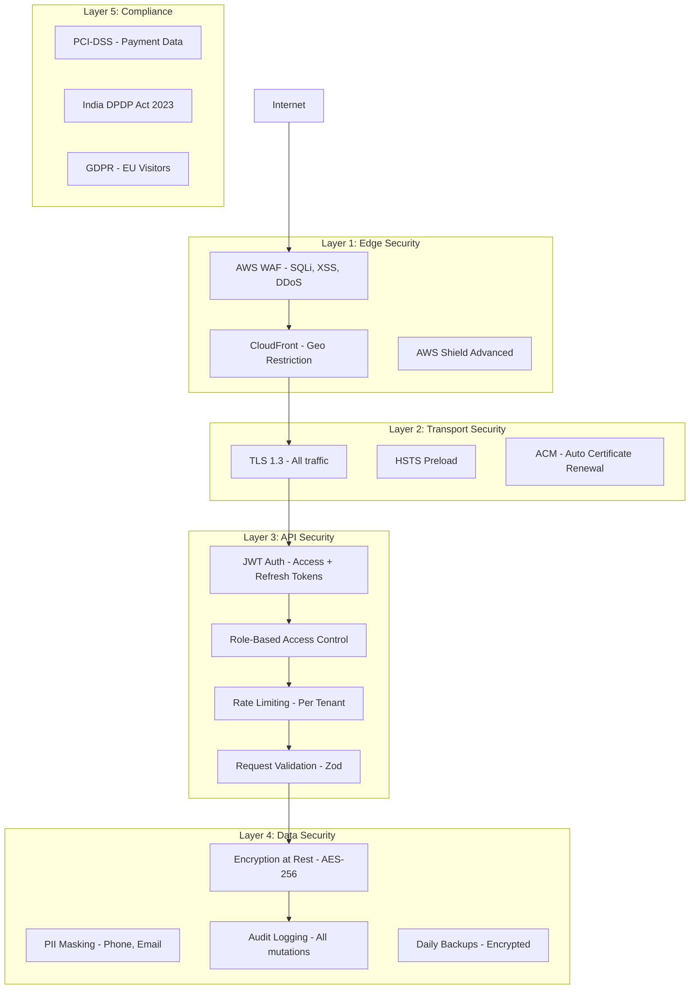

### 9.2 Authentication Flow

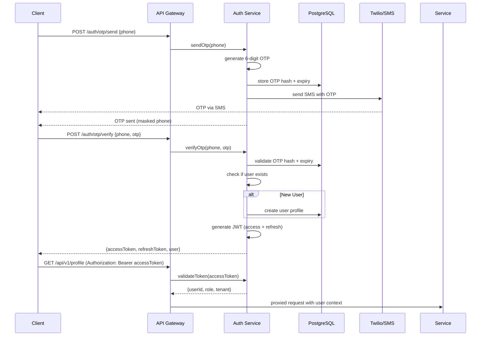

### 9.3 Data Privacy (India DPDP Act 2023)

| Requirement | Implementation |
|---|---|
| Consent Management | Granular consent checkboxes (data collection, marketing, sharing) |
| Data Subject Rights | API endpoints for data access, correction, deletion |
| Data Localization | All data stored in AWS India (ap-south-1) |
| Breach Notification | Automated alert system with 72-hour notification SLA |
| Data Retention | Configurable retention policies (default 3 years) |
| Anonymization | PII anonymized for analytics datasets |

---

## 10. Infrastructure & Deployment

### 10.1 AWS Infrastructure Architecture

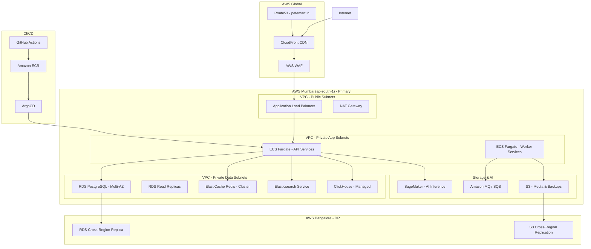

### 10.2 Deployment Architecture

| Environment | Purpose | Infrastructure | Cost/Month |
|---|---|---|---|
| **Development** | Feature development | Shared ECS, single RDS db.t4g.small | ~$150 |
| **Staging** | Integration testing | Scaled-down prod (1 AZ, 1 replica) | ~$400 |
| **Production** | Live traffic | Multi-AZ, auto-scaling, read replicas | ~$4,500 |
| **DR** | Disaster recovery | Cross-region replicas (cold standby) | ~$800 |
| **POC** | 8-merchant pilot | Free tier only | $0 |

### 10.3 Auto-Scaling Configuration

| Service | Min Instances | Max Instances | Scale-Up Trigger | Scale-Down Trigger |
|---|---|---|---|---|
| API Services | 2 (multi-AZ) | 20 | CPU > 70% for 3 min | CPU < 30% for 10 min |
| Worker Services | 1 | 10 | Queue depth > 100 | Queue depth < 10 |
| RDS | 1 writer + 1 reader | 1 writer + 5 readers | Connections > 80% | Connections < 40% |
| Redis | 1 (cluster mode) | 3 shards | Memory > 75% | Memory < 50% |

---

## 11. Multi-Store Cart & Consolidated Delivery

### 11.1 Cart Data Model

```json
{
  "cartId": "uuid",
  "userId": "uuid",
  "items": [
    {
      "storeId": "store-uuid-1",
      "storeName": "Chickpet Silks",
      "items": [
        {
          "productId": "prod-uuid",
          "variantId": "variant-uuid",
          "name": "Kanchipattu Silk Saree",
          "qty": 2,
          "unitPrice": 4500,
          "totalPrice": 9000,
          "mode": "A",
          "deliveryEligible": true
        }
      ],
      "subtotal": 9000,
      "deliveryFee": 30,
      "storeTotal": 9030
    },
    {
      "storeId": "store-uuid-2",
      "storeName": "Balepet Dry Fruits",
      "items": [
        {
          "productId": "prod-uuid-2",
          "variantId": null,
          "name": "Premium Almonds 1kg",
          "qty": 5,
          "unitPrice": 850,
          "totalPrice": 4250,
          "mode": "A",
          "deliveryEligible": true
        }
      ],
      "subtotal": 4250,
      "deliveryFee": 25,
      "storeTotal": 4275
    }
  ],
  "deliveryFeeCalculation": {
    "baseZoneRate": 30,
    "additionalStoreSurcharge": 25,
    "weightSurcharge": 10,
    "totalDeliveryFee": 65
  },
  "subtotal": 13250,
  "discount": 0,
  "grandTotal": 13315
}
```

### 11.2 Delivery Fee Formula

```
Delivery Fee = MAX(ZoneBaseRate[store1], ZoneBaseRate[store2], ...) 
             + (₹25 × (N-1)) 
             + WeightSurcharge(total_kg)
```

Where:
- **Zone 1 (1-3 km)**: ₹20 base
- **Zone 2 (3-7 km)**: ₹30 base
- **Zone 3 (7+ km)**: ₹50 base
- **N**: Number of distinct stores in the cart
- **Weight Surcharge**: ₹5/kg above 5kg

### 11.3 Consolidation Flow

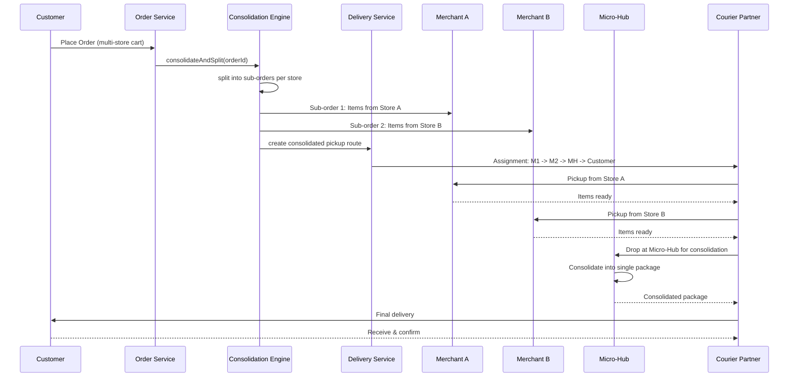

---

## 12. WhatsApp Integration Architecture

### 12.1 WhatsApp Business API Integration

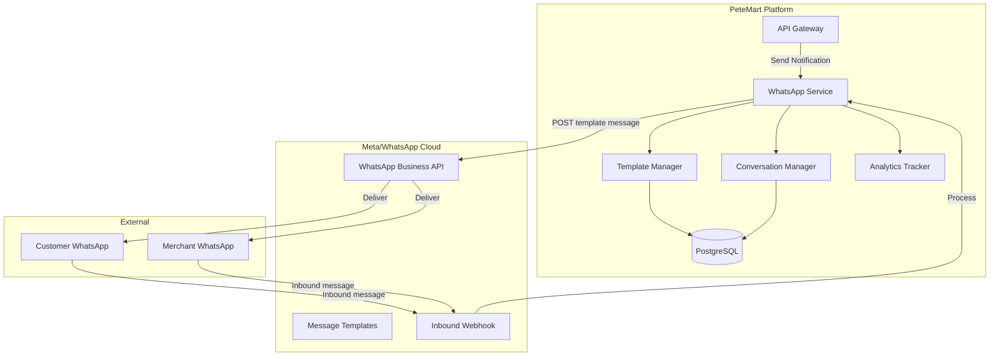

### 12.2 WhatsApp Message Templates

| Template Name | Purpose | Components | Trigger |
|---|---|---|---|
| `order_confirmation` | Order placed | Order #, items, total, ETA | payment.captured |
| `order_shipped` | Order shipped | Tracking link, ETA | delivery.assigned |
| `order_delivered` | Delivered | Rate experience link | delivery.completed |
| `otp_verification` | Login OTP | OTP code, expiry | auth.otp.sent |
| `merchant_new_order` | New order alert | Order #, items, customer | order.created |
| `merchant_payout` | Weekly payout | Amount, order count | payout.processed |
| `enquiry_response` | Auto-reply to enquiry | Product info, store hours | whatsapp.enquiry |
| `abandoned_cart` | Cart recovery | Cart items, discount code | 24h no checkout |

### 12.3 WhatsApp Flow (Mode B)

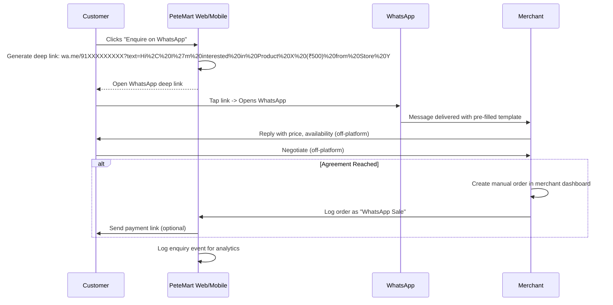

---

## 13. AI Features Architecture

### 13.1 Virtual Try-On Pipeline

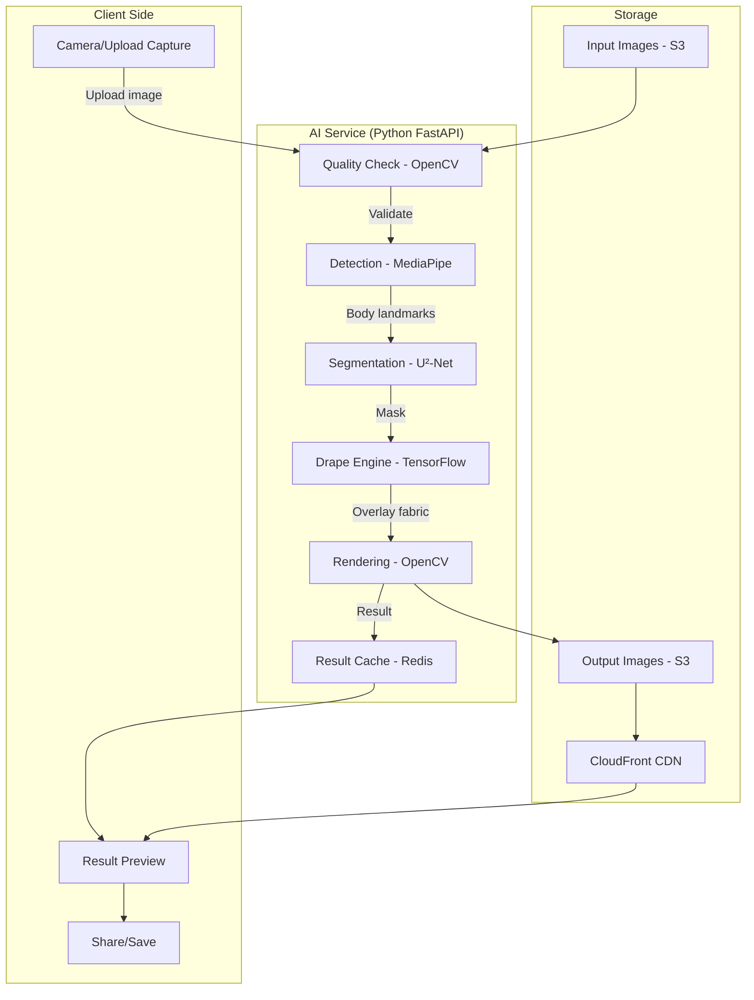

### 13.2 Recommendation Engine

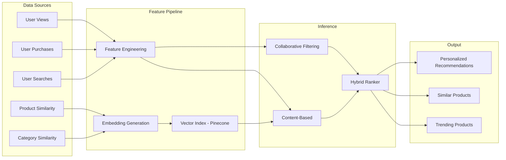

### 13.3 Live Bullion Rate Integration

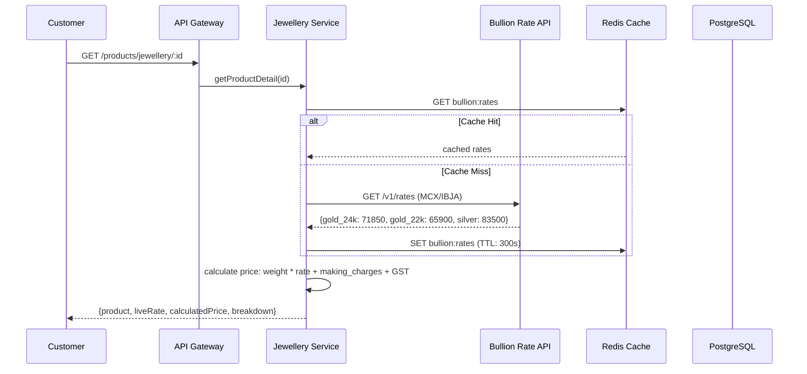

---

## 14. Analytics & Observability

### 14.1 Analytics Stack

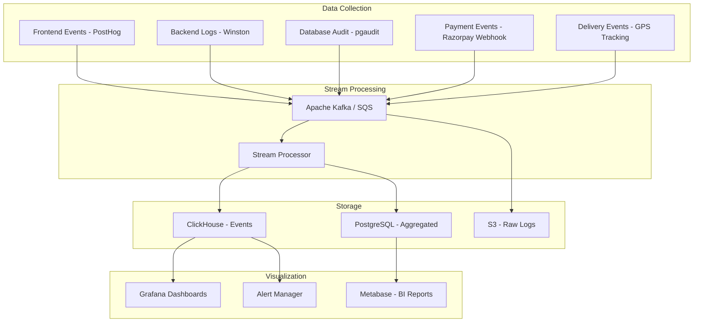

### 14.2 Key Metrics Dashboard

| Dashboard | Metrics | Refresh | Audience |
|---|---|---|---|
| **Platform Overview** | GMV, Orders, Active Merchants, Revenue | Real-time | Admin |
| **Merchant Analytics** | Sales, Views, Conversion, Top SKUs | 5 min | Merchant |
| **Delivery Performance** | Avg delivery time, On-time %, Zone breakdown | 1 min | Ops |
| **Customer Analytics** | Acquisition, Retention, Churn, LTV | 1 hour | Marketing |
| **Infrastructure** | CPU, Memory, Latency, Error Rate | 10 sec | Engineering |
| **Business KPIs** | MRR, ARR, Commission Revenue, Subscriptions | 1 hour | Executive |

### 14.3 Alerting Rules

| Alert | Condition | Severity | Channel |
|---|---|---|---|
| High API Latency | P95 > 500ms for 5 min | Critical | PagerDuty + Slack |
| Error Rate Spike | 5xx > 1% for 2 min | Critical | PagerDuty + Slack |
| Payment Failure Rate | > 5% in 5 min | Critical | PagerDuty + Slack |
| RDS Connection Saturation | > 80% for 10 min | Warning | Slack |
| Low Disk Space | < 10% remaining | Warning | Slack |
| Merchant Churn Spike | > 10% monthly churn | Warning | Email + Slack |

---

## 15. Scaling Strategy (5,000+ Merchants)

### 15.1 Horizontal Scaling Architecture

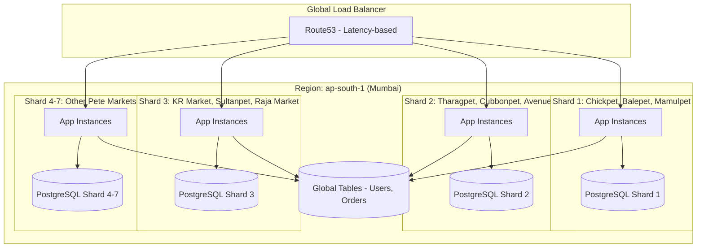

### 15.2 Scaling Thresholds & Actions

| Threshold | Action | Cost Impact |
|---|---|---|
| 100 merchants | Single RDS + 2 ECS tasks | ~$500/mo |
| 500 merchants | Add read replicas (2), increase ECS to 4 tasks | ~$1,200/mo |
| 1,000 merchants | Add Redis cluster, Elasticsearch, ClickHouse | ~$2,500/mo |
| 2,500 merchants | Shard by market area, add 2nd AZ | ~$4,500/mo |
| 5,000 merchants | Full sharding, multi-region read replicas | ~$8,000/mo |
| 10,000+ merchants | City-level sharding, dedicated infra per city | ~$15,000/mo |

---

## 16. Multi-City Expansion Architecture

### 16.1 City Deployment Pattern

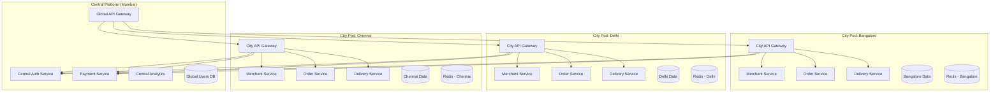

### 16.2 City Expansion Checklist

| Step | Activity | Duration | Cost |
|---|---|---|---|
| 1 | Market research & merchant outreach | 4 weeks | ₹2L |
| 2 | Legal & compliance (state-specific) | 3 weeks | ₹1.5L |
| 3 | Infrastructure provisioning (Terraform) | 1 week | ₹50K |
| 4 | City pod deployment (CI/CD) | 1 week | ₹30K |
| 5 | Localization (language, currency) | 2 weeks | ₹1L |
| 6 | Delivery partner onboarding | 4 weeks | ₹3L |
| 7 | Merchant onboarding campaign | 8 weeks | ₹5L |
| 8 | Soft launch & monitoring | 2 weeks | ₹50K |

---

## 17. Testing Architecture

### 17.1 Testing Pyramid

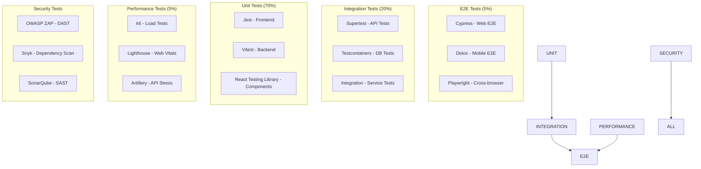

### 17.2 Test Automation Pipeline

```yaml
# .github/workflows/test-pipeline.yml
name: Test Pipeline
on: [push, pull_request]

jobs:
  unit-tests:
    runs-on: ubuntu-latest
    steps:
      - uses: actions/checkout@v4
      - uses: actions/setup-node@v4
      - run: npm ci
      - run: npm run test:unit
      - run: npm run test:coverage
      - uses: codecov/codecov-action@v3

  integration-tests:
    runs-on: ubuntu-latest
    services:
      postgres:
        image: postgres:16
        env:
          POSTGRES_DB: petemart_test
        options: >-
          --health-cmd pg_isready
          --health-interval 10s
      redis:
        image: redis:7
    steps:
      - uses: actions/checkout@v4
      - run: npm ci
      - run: npm run test:integration

  e2e-tests:
    runs-on: ubuntu-latest
    steps:
      - uses: actions/checkout@v4
      - run: npm ci
      - run: npm run build
      - run: npm run test:e2e
      - uses: actions/upload-artifact@v4
        if: failure()
        with:
          name: cypress-screenshots
          path: cypress/screenshots

  performance-tests:
    runs-on: ubuntu-latest
    steps:
      - uses: actions/checkout@v4
      - run: npm ci
      - run: npm run build
      - run: npm run test:load

  security-scan:
    runs-on: ubuntu-latest
    steps:
      - uses: actions/checkout@v4
      - run: npm ci
      - run: npx snyk test
      - run: npx sonar-scanner
```

### 17.3 Test Coverage Requirements

| Layer | Coverage Target | Critical Paths |
|---|---|---|
| Backend Unit Tests | >85% | Order flow, Payment, Auth |
| Backend Integration Tests | >70% | API endpoints, DB operations |
| Frontend Unit Tests | >80% | Components, hooks, utils |
| E2E Tests | All critical flows | Browse → Cart → Checkout → Payment → Tracking |
| API Tests | 100% of endpoints | All REST + GraphQL operations |
| Load Tests | 2x expected peak | 20,000 concurrent users |

---

## 18. Costing Model

### 18.1 Production Cost Breakdown (5,000 Merchants)

| Category | Service | Configuration | Monthly Cost (₹) |
|---|---|---|---|
| **Compute** | ECS Fargate (API) | 10 tasks × 2vCPU × 4GB | ₹1,20,000 |
| | ECS Fargate (Workers) | 5 tasks × 1vCPU × 2GB | ₹35,000 |
| | SageMaker (AI) | 1 ml.t3.medium | ₹15,000 |
| **Database** | RDS PostgreSQL | db.r6g.large Multi-AZ | ₹45,000 |
| | RDS Read Replicas | 2 × db.r6g.large | ₹50,000 |
| | ElastiCache Redis | cache.r6g.large cluster | ₹25,000 |
| | Elasticsearch | 3 × t3.medium.search | ₹30,000 |
| | ClickHouse | Managed (Altinity) | ₹20,000 |
| **Storage** | S3 Standard | 500GB + 100GB backup | ₹5,000 |
| | CloudFront CDN | 1TB transfer | ₹8,000 |
| **Network** | ALB | Per hour + LCU | ₹12,000 |
| | NAT Gateway | Per hour + data | ₹5,000 |
| | Route53 | Hosted zone + queries | ₹2,000 |
| **Third-Party** | Razorpay | 2% on transactions | Variable |
| | Algolia | Pro plan (1M records) | ₹25,000 |
| | Google Maps API | Premium plan | ₹15,000 |
| | Twilio/Msg91 | SMS + WhatsApp | ₹20,000 |
| | SendGrid/AWS SES | Email (100K/mo) | ₹5,000 |
| | Datadog | Pro APM + Logs | ₹30,000 |
| | Sentry | Team plan | ₹8,000 |
| **DevOps** | GitHub Actions | 10K min/mo | ₹5,000 |
| | Docker Registry | ECR storage | ₹2,000 |
| **Total** | | | **~₹4,92,000/mo** |

### 18.2 Cost Optimization Levers

| Lever | Savings | Impact |
|---|---|---|
| Reserved Instances (1-year) | 30% on compute | ~₹50K/mo savings |
| Spot Instances for workers | 60% on worker compute | ~₹20K/mo savings |
| RDS Reserved (3-year) | 40% on database | ~₹45K/mo savings |
| S3 Lifecycle Policies | 20% on storage | ~₹1K/mo savings |
| CloudFront Savings Plan | 15% on CDN | ~₹1K/mo savings |
| **Optimized Total** | | **~₹3,75,000/mo** |

### 18.3 Revenue vs Cost Projection

| Metric | Year 1 | Year 2 | Year 3 |
|---|---|---|---|
| Merchants | 500 | 2,500 | 5,000 |
| Monthly GMV | ₹10 Cr | ₹50 Cr | ₹100 Cr |
| Commission Revenue | ₹30L/mo | ₹1.5 Cr/mo | ₹3 Cr/mo |
| Subscription Revenue | ₹5L/mo | ₹25L/mo | ₹50L/mo |
| **Total Revenue** | **₹35L/mo** | **₹1.75 Cr/mo** | **₹3.5 Cr/mo** |
| Infrastructure Cost | ₹1.5L/mo | ₹3L/mo | ₹5L/mo |
| Team Cost | ₹15L/mo | ₹25L/mo | ₹35L/mo |
| Marketing Cost | ₹5L/mo | ₹10L/mo | ₹15L/mo |
| **Total Cost** | **₹21.5L/mo** | **₹38L/mo** | **₹55L/mo** |
| **Gross Margin** | **~38%** | **~78%** | **~84%** |

---

## 19. POC Architecture (8-Merchant Pilot)

### 19.1 POC Scope

The POC targets a **8-merchant pilot** across **2 Pete markets** (Chickpet + Balepet) with **zero infrastructure cost** using free tiers.

### 19.2 POC Architecture Diagram

```mermaid
graph TD
    subgraph "Free Tier Infrastructure"
        VERCEL[Vercel Hobby - Web Frontend]
        EXPO[Expo - Mobile App (Development)]
        SUPABASE[Supabase Free - Database + Auth + Storage]
        GITHUB[GitHub Pages - Static Assets]
        RAILWAY[Railway $5 Credit - Backend API]
    end

    subgraph "Free External Services"
        RAZORPAY[Razorpay Test Mode]
        TWILIO[Twilio Trial - SMS]
        GOOGLE_MAPS[Google Maps Free Tier]
        WHATSAPP[WhatsApp Business - Free]
        GITHUB_CI[GitHub Actions - Free]
    end

    subgraph "POC Features"
        FEAT1[Mode A: Direct Purchase]
        FEAT2[Mode B: WhatsApp Enquiry]
        FEAT3[Mode C: Visit Store]
        FEAT4[Basic Merchant Dashboard]
        FEAT5[Single-Store Cart]
        FEAT6[Basic Order Tracking]
        FEAT7[Merchant Onboarding]
    end

    VERCEL --> SUPABASE
    VERCEL --> RAILWAY
    EXPO --> RAILWAY
    RAILWAY --> SUPABASE
    RAILWAY --> RAZORPAY
    RAILWAY --> TWILIO
    RAILWAY --> GOOGLE_MAPS
    VERCEL --> WHATSAPP
    GITHUB --> GITHUB_CI
    GITHUB_CI --> VERCEL
    GITHUB_CI --> EXPO

    FEAT1 --> VERCEL
    FEAT1 --> EXPO
    FEAT2 --> WHATSAPP
    FEAT3 --> GOOGLE_MAPS
    FEAT4 --> VERCEL
    FEAT5 --> RAILWAY
    FEAT6 --> RAILWAY
    FEAT7 --> SUPABASE
```

### 19.3 POC vs Production Mapping

| Component | POC (Free Tier) | Production |
|---|---|---|
| Web Frontend | Vercel Hobby (1 domain, 100GB bandwidth) | Vercel Pro + CloudFront CDN |
| Mobile App | Expo Go (development builds) | React Native + App Store/Play Store |
| Backend API | Railway ($5 credit) | AWS ECS Fargate (auto-scaling) |
| Database | Supabase Free (500MB, 2 users) | RDS PostgreSQL Multi-AZ |
| Auth | Supabase Auth (50K users) | Custom JWT + Auth Service |
| Storage | Supabase Storage (1GB) | S3 + CloudFront |
| Search | PostgreSQL LIKE/ILIKE | Algolia / Elasticsearch |
| Cache | In-memory (limited) | Redis Cluster |
| Analytics | Supabase analytics | ClickHouse + Grafana |
| Monitoring | Railway logs | Datadog + Sentry |
| CI/CD | GitHub Actions (free) | GitHub Actions + ArgoCD |
| AI Features | Not in POC | SageMaker + TensorFlow |

### 19.4 POC Cost Breakdown

| Service | Free Tier Limit | Actual Usage | Cost |
|---|---|---|---|
| Vercel Hobby | 100GB bandwidth, 1 team | ~5GB/mo | ₹0 |
| Railway | $5 credit (one-time) | ~$3/mo compute | ₹0 |
| Supabase Free | 500MB DB, 1GB storage | ~100MB DB | ₹0 |
| GitHub Actions | 2,000 min/mo | ~500 min/mo | ₹0 |
| GitHub Pages | 1GB, 100GB bandwidth | Static assets | ₹0 |
| Razorpay Test | Unlimited test mode | Test transactions | ₹0 |
| Google Maps Free | $200/mo credit | ~$50/mo usage | ₹0 |
| Twilio Trial | $15 credit | ~$10/mo SMS | ₹0 |
| WhatsApp Business | Free (Meta) | Basic messaging | ₹0 |
| **Total POC Cost** | | | **₹0/mo** |

---

## 20. Implementation Roadmap

### 20.1 Phase Plan

| Phase | Duration | Milestone | Key Features |
|---|---|---|---|
| **P0: Foundation** | Weeks 1-4 | Platform skeleton | Auth, Merchant onboarding, Basic catalog |
| **P1: Core Commerce** | Weeks 5-10 | MVP Launch (Tier 0) | Mode A checkout, Single-store cart, Payment |
| **P2: Multi-Mode** | Weeks 11-14 | Multi-Mode Commerce | Mode B/C, Multi-store cart, Delivery zones |
| **P3: Intelligence** | Weeks 15-20 | Analytics & AI | AI try-on, Recommendations, Bullion rates |
| **P4: Scale** | Weeks 21-28 | Platform Maturity | National shipping, Multi-city, 5K merchants |
| **P5: Visionary** | Weeks 29-36 | Next-Gen | Virtual walk, Live bazaar, Co-shopping |

### 20.2 Sprint Allocation by Team

| Team | Sprint 1-4 | Sprint 5-8 | Sprint 9-12 | Sprint 13-16 | Sprint 17-20 |
|---|---|---|---|---|---|
| **Frontend (Web)** | Landing, Auth, Merchant dash | Product catalog, Cart UI | Checkout flow, Order tracking | AI try-on UI, Analytics dash | Admin dash, i18n |
| **Frontend (Mobile)** | Navigation, Auth screens | Product browse, Cart | Checkout, Payment, Tracking | Camera, Try-on, Push | Offline mode, Performance |
| **Backend API** | Auth service, Merchant CRUD | Product API, Cart service | Order service, Payment webhooks | Delivery service, Notification | Analytics, Admin API |
| **AI/ML** | Infrastructure setup | Model training (try-on) | Model deployment | Recommendation engine | Performance optimization |
| **Infrastructure** | AWS setup, CI/CD pipeline | RDS, Redis, Elasticsearch | Auto-scaling, Monitoring | DR setup, Security audit | Multi-region deployment |
| **QA** | Test framework setup | Unit + Integration tests | E2E tests, Load tests | Security tests | UAT, Regression |

---

## Appendix A: Guardrail Compliance

| Guardrail | Requirement | Implementation |
|---|---|---|
| **Security** | PCI-DSS Level 4 | Razorpay handles all card data; no raw PCI data stored |
| **Privacy** | India DPDP Act 2023 | Consent management, data localization, 72h breach notification |
| **Accessibility** | WCAG 2.1 AA | Semantic HTML, ARIA labels, keyboard navigation, color contrast |
| **Performance** | LCP < 2.5s | SSR, lazy loading, image optimization, CDN |
| **Uptime** | 99.9% SLA | Multi-AZ deployment, auto-scaling, health checks |
| **Backup** | Daily + Point-in-time | RDS automated backups (35-day retention), S3 cross-region |
| **DR** | RPO < 1 hour, RTO < 4 hours | Cross-region DB replica, S3 CRR, IaC recovery |

## Appendix B: Environment Configuration

| Variable | Dev | Staging | Production |
|---|---|---|---|
| Node Env | development | staging | production |
| Log Level | debug | info | warn |
| DB Instance | db.t4g.small | db.t4g.medium | db.r6g.large |
| Redis | Single | Cluster (2 nodes) | Cluster (3 shards) |
| ECS Tasks | 1 | 2 | 10 (auto-scale) |
| Backup Frequency | None | Daily | Continuous |
| Monitoring | Console | Datadog | Datadog + PagerDuty |

---

*End of Architecture Blueprint — PeteMart Enterprise System Design v1.0*
</｜DSML｜parameter>
</｜DSML｜invoke>
</｜DSML｜tool_c
