# PeteMart — Architecture Diagrams Compendium

**Document Version:** 1.0  
**Author:** Architect Agent (Senior Enterprise Solution Architect)  
**Date:** 2026-06-15  

---

## Table of Contents

1. [System Context Diagram (C4 Level 1)](#1-system-context-diagram-c4-level-1)
2. [Container Diagram (C4 Level 2)](#2-container-diagram-c4-level-2)
3. [Component Diagrams (C4 Level 3)](#3-component-diagrams-c4-level-3)
4. [Entity Relationship Diagram](#4-entity-relationship-diagram)
5. [Order Processing Sequence Diagram](#5-order-processing-sequence-diagram)
6. [Deployment Architecture Diagram](#6-deployment-architecture-diagram)
7. [POC Architecture Diagram](#7-poc-architecture-diagram)
8. [Data Flow Diagram](#8-data-flow-diagram)
9. [Network Architecture Diagram](#9-network-architecture-diagram)
10. [CI/CD Pipeline Diagram](#10-cicd-pipeline-diagram)

---

## 1. System Context Diagram (C4 Level 1)

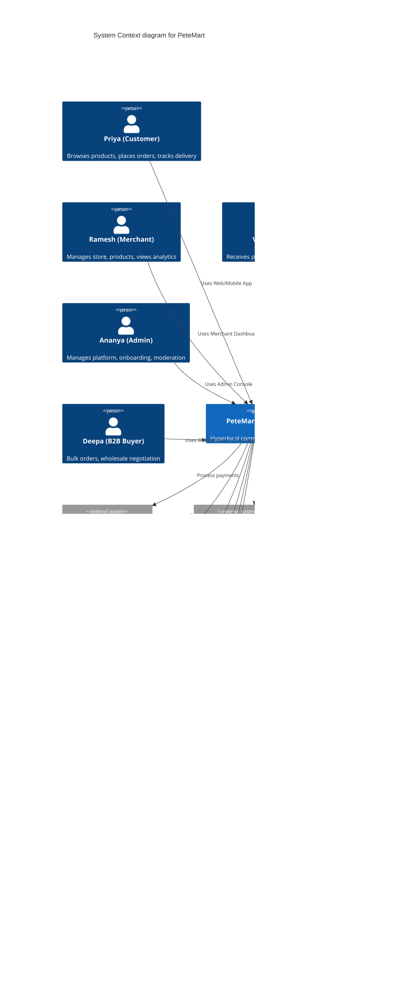

---

## 2. Container Diagram (C4 Level 2)

```mermaid
C4Container
  title Container diagram for PeteMart Platform

  Person(customer, "Customer", "Priya")
  Person(merchant, "Merchant", "Ramesh")
  Person(courier, "Courier", "Vinay")
  Person(admin, "Admin", "Ananya")

  System_Boundary(petemart_platform, "PeteMart Platform") {
    Container(web_app, "Web Application", "Next.js 14, React, Tailwind", "Responsive web app for customers, merchants, admin")
    Container(mobile_app, "Mobile Application", "React Native (Expo)", "iOS/Android apps for customers & couriers")
    Container(api_gateway, "API Gateway", "Kong / AWS API Gateway", "Rate limiting, auth, routing, request validation")
    
    Container_Boundary(microservices, "Microservices (Node.js/Go)") {
      Container(auth_svc, "Auth Service", "Node.js + Supabase Auth", "OTP, JWT, SSO, RBAC")
      Container(catalog_svc, "Catalog Service", "Node.js", "Products, categories, search, inventory")
      Container(order_svc, "Order Service", "Go", "Cart, checkout, order lifecycle, multi-store")
      Container(payment_svc, "Payment Service", "Node.js + Razorpay", "Payments, refunds, escrow, settlements")
      Container(delivery_svc, "Delivery Service", "Go", "Zone calc, routing, courier assign, tracking")
      Container(merchant_svc, "Merchant Service", "Node.js", "Onboarding, subscriptions, microsites, analytics")
      Container(admin_svc, "Admin Service", "Node.js", "Config, moderation, reports, feature flags")
      Container(notification_svc, "Notification Service", "Node.js", "Push, email, SMS, WhatsApp")
      Container(ai_svc, "AI Service", "Python (FastAPI)", "Virtual try-on, recommendations")
      Container(analytics_svc, "Analytics Service", "Python + ClickHouse", "Real-time metrics, dashboards")
    }
    
    Container(message_queue, "Message Queue", "RabbitMQ / Redis", "Async job processing, event bus")
    Container(cache, "Cache Layer", "Redis Cluster", "Session cache, rate limiter, API cache")
    Container(database, "Primary Database", "Supabase PostgreSQL", "Transactional data, PostGIS for geo")
    Container(dwh, "Data Warehouse", "ClickHouse / BigQuery", "Analytics, reporting, OLAP")
    Container(object_store, "Object Store", "Supabase Storage / S3", "Product images, try-on results, videos")
    Container(search, "Search Engine", "MeiliSearch", "Full-text search, faceted filters")
  }

  System_Ext(razorpay, "Razorpay", "Payment Gateway")
  System_Ext(whatsapp, "WhatsApp API", "Messaging")
  System_Ext(googlemaps, "Google Maps", "Geo services")
  System_Ext(shiprocket, "ShipRocket", "National shipping")
  System_Ext(jitsi, "Jitsi Server", "Video calls")
  System_Ext(bullion_api, "IBJA API", "Bullion rates")
  System_Ext(openai_api, "OpenAI / SD", "AI image gen")
  System_Ext(cloudflare, "Cloudflare", "CDN + WAF")
  System_Ext(sentry, "Sentry", "Error monitoring")

  Rel(customer, web_app, "Uses", "HTTPS")
  Rel(customer, mobile_app, "Uses", "HTTPS")
  Rel(merchant, web_app, "Uses", "HTTPS")
  Rel(courier, mobile_app, "Uses", "HTTPS")
  Rel(admin, web_app, "Uses", "HTTPS")

  Rel(web_app, api_gateway, "API calls", "REST/GraphQL")
  Rel(mobile_app, api_gateway, "API calls", "REST/GraphQL")
  Rel(api_gateway, auth_svc, "Auth routes")
  Rel(api_gateway, catalog_svc, "Catalog routes")
  Rel(api_gateway, order_svc, "Order routes")
  Rel(api_gateway, payment_svc, "Payment routes")
  Rel(api_gateway, delivery_svc, "Delivery routes")
  Rel(api_gateway, merchant_svc, "Merchant routes")
  Rel(api_gateway, admin_svc, "Admin routes")
  Rel(api_gateway, notification_svc, "Notification routes")
  Rel(api_gateway, ai_svc, "AI routes")
  Rel(api_gateway, analytics_svc, "Analytics routes")

  Rel(catalog_svc, database, "Read/Write")
  Rel(order_svc, database, "Read/Write")
  Rel(payment_svc, database, "Read/Write")
  Rel(delivery_svc, database, "Read/Write")
  Rel(merchant_svc, database, "Read/Write")
  Rel(admin_svc, database, "Read/Write")
  
  Rel(catalog_svc, search, "Index/Search")
  Rel(order_svc, message_queue, "Publish events")
  Rel(payment_svc, message_queue, "Publish events")
  Rel(delivery_svc, message_queue, "Publish events")
  Rel(notification_svc, message_queue, "Consume events")
  Rel(analytics_svc, message_queue, "Consume events")
  Rel(catalog_svc, cache, "Cache products")
  Rel(order_svc, cache, "Cache cart")
  
  Rel(payment_svc, razorpay, "Payment API")
  Rel(notification_svc, whatsapp, "WhatsApp API")
  Rel(delivery_svc, googlemaps, "Maps API")
  Rel(delivery_svc, shiprocket, "Shipping API")
  Rel(ai_svc, openai_api, "Image API")
  Rel(catalog_svc, bullion_api, "Rate fetch")
  Rel(web_app, jitsi, "Video call")
  Rel(mobile_app, jitsi, "Video call")
```

---

## 3. Component Diagrams (C4 Level 3)

### 3.1 Catalog Service Components

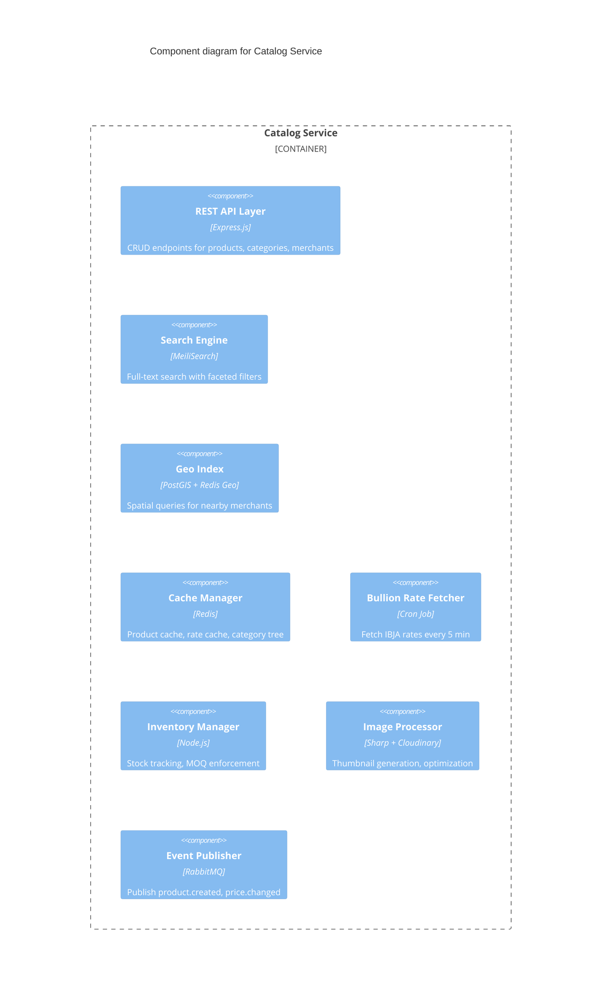

### 3.2 Order Service Components

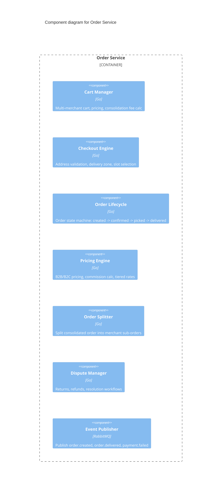

### 3.3 Delivery Service Components

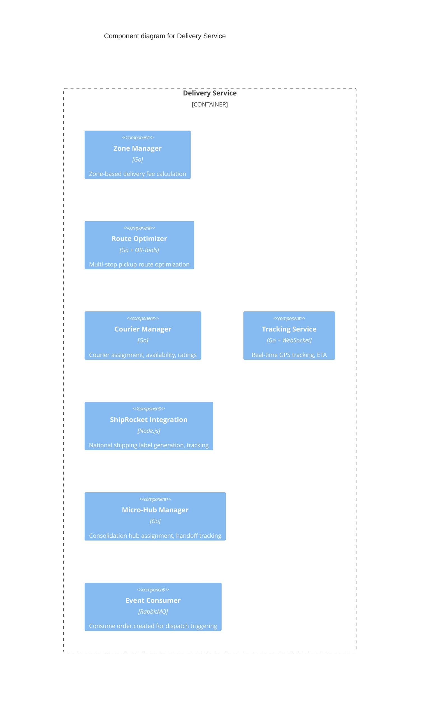

---

## 4. Entity Relationship Diagram

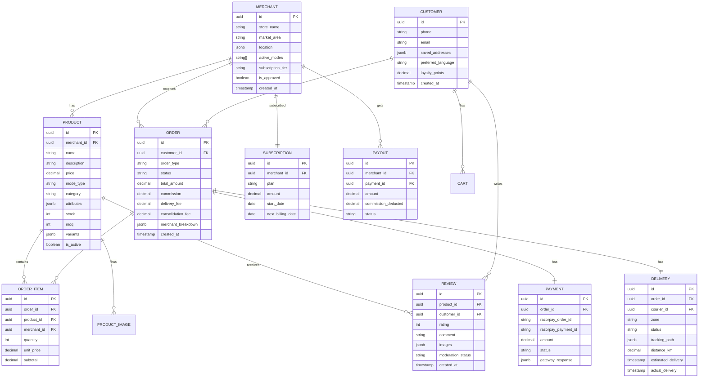

---

## 5. Order Processing Sequence Diagram

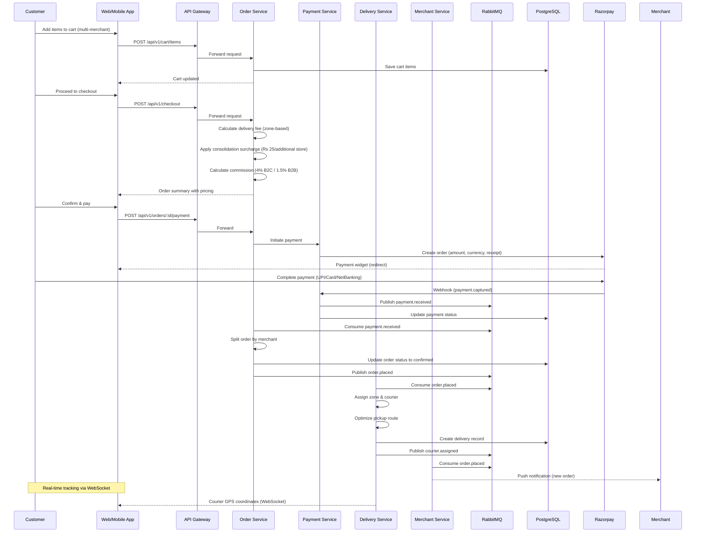

---

## 6. Deployment Architecture Diagram

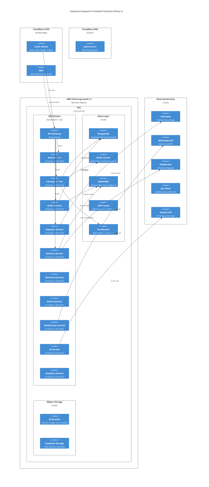

---

## 7. POC Architecture Diagram

```mermaid
C4Container
  title POC Architecture (Phase 0 — 8 Merchants, Zero Cost)

  Person(customer, "Customer", "Priya")
  Person(merchant, "Merchant", "Ramesh")
  Person(admin, "Admin", "Ananya")

  System_Boundary(poc_platform, "PeteMart POC Platform") {
    Container(web_app, "Web Application", "Next.js 14 (Vercel Hobby)", "Customer + Merchant + Admin UIs")
    Container(mobile_app, "Mobile App", "Expo Go (development)", "Android customer app via Expo")
    
    Container(api_server, "API Server", "Node.js (Railway $5 credit)", "Combined API for all services")
    Container(database, "Database", "Supabase Free Tier", "PostgreSQL 500MB, Auth, Storage")
    Container(cache_queue, "Cache/Queue", "Railway Redis add-on", "Session cache, job queue")
  }

  System_Ext(razorpay, "Razorpay Test Mode", "Payment sandbox")
  System_Ext(whatsapp, "WhatsApp", "Manual deep links")
  System_Ext(googlemaps, "Google Maps", "Free tier geocoding")
  System_Ext(supabase_auth, "Supabase Auth", "Free tier auth")

  Rel(customer, web_app, "Uses", "HTTPS")
  Rel(customer, mobile_app, "Uses", "HTTPS (Expo Go)")
  Rel(merchant, web_app, "Uses", "HTTPS")
  Rel(admin, web_app, "Uses", "HTTPS")

  Rel(web_app, api_server, "API calls", "REST")
  Rel(mobile_app, api_server, "API calls", "REST")
  Rel(api_server, database, "Read/Write", "SQL")
  Rel(api_server, cache_queue, "Cache")
  Rel(api_server, razorpay, "Test payments")
  Rel(api_server, whatsaap, "Deep links generation")
  Rel(api_server, googlemaps, "Geocoding API")
  Rel(api_server, supabase_auth, "Auth")
```

---

## 8. Data Flow Diagram

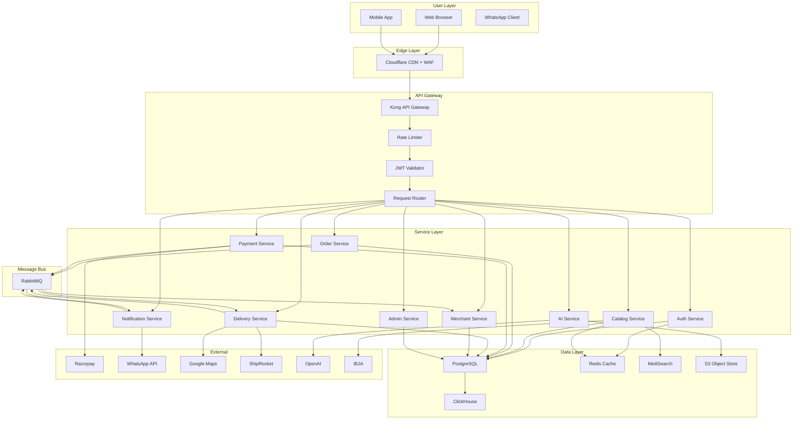

---

## 9. Network Architecture Diagram

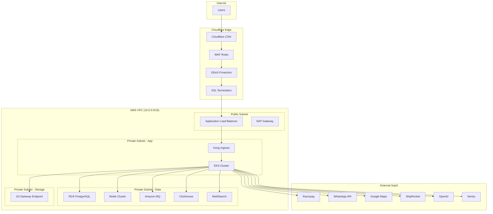

---

## 10. CI/CD Pipeline Diagram

```mermaid
graph LR
    A[Git Push] --> B[GitHub Actions Trigger]
    B --> C[Lint & Type Check]
    C --> D[Unit Tests]
    D --> E[Build Stage]
    E --> F[Integration Tests]
    F --> G[Security Scan]
    G --> H[Deploy to Staging]
    H --> I[E2E Tests on Staging]
    I --> J[Performance Check]
    J --> K[Deploy to Production]
    K --> L[Smoke Tests on Prod]
    L --> M[Health Check & Monitoring]

    style A fill:#333,color:white
    style D fill:#4CAF50,color:white
    style F fill:#2196F3,color:white
    style J fill:#FF9800,color:white
    style K fill:#f44336,color:white
    style M fill:#9C27B0,color:white
    
    N[Rollback Trigger] -.->|On Failure| A
    L -.->|Failed| N
    M -.->|Alerts| N
```

---

*End of Diagrams Compendium*