# PeteMart — Full Product Architecture Blueprint

**Document Version:** 1.0  
**Author:** Architect Agent (Senior Enterprise Solution Architect)  
**Status:** Final  
**Date:** 2026-06-15  
**Derived From:** PRD v2.0, Business Revenue Model v1.4, prd_config.json

---

## Table of Contents

1. [Architecture Overview & Philosophy](#1-architecture-overview--philosophy)
2. [System Context (C4 Level 1)](#2-system-context-c4-level-1)
3. [Container Architecture (C4 Level 2)](#3-container-architecture-c4-level-2)
4. [Component Architecture (C4 Level 3)](#4-component-architecture-c4-level-3)
5. [Technology Stack](#5-technology-stack)
6. [API Strategy & Contract Catalog](#6-api-strategy--contract-catalog)
7. [Data Architecture](#7-data-architecture)
8. [Infrastructure & Deployment](#8-infrastructure--deployment)
9. [Security Framework](#9-security-framework)
10. [Scaling Strategy (5,000+ Merchants, Multi-City)](#10-scaling-strategy)
11. [Integration Architecture](#11-integration-architecture)
12. [Testing Architecture](#12-testing-architecture)
13. [Cost Model — Full Production](#13-cost-model--full-production)
14. [Implementation Roadmap](#14-implementation-roadmap)

---

## 1. Architecture Overview & Philosophy

### Guiding Principles
1. **API-First Design** — All capabilities exposed via RESTful/gRPC APIs before UI
2. **Event-Driven Core** — Asynchronous message-driven architecture for order processing, notifications, analytics
3. **Cloud-Native** — Containerized microservices on Kubernetes, auto-scaling, multi-region readiness
4. **Offline-First Mobile** — React Native apps with local-first data sync for delivery partners
5. **Security by Design** — Zero-trust network policy, encrypted at rest/transit, PCI-DSS compliant payment
6. **Cost-Aware Scaling** — Tiered infrastructure matching growth phases (8 → 500 → 5,000+ merchants)

### Architecture Style: **Modular Monolith → Event-Driven Microservices**

```
Phase 1 (8 merchants): Modular monolith on Vercel + Supabase
Phase 2 (500 merchants): Microservices with message queue
Phase 3 (5,000+ merchants): Full event-driven microservices + Kubernetes
```

### Key Architectural Decisions (ADRs)

| ADR ID | Decision | Rationale |
|--------|----------|-----------|
| ADR-001 | Next.js 14 App Router for web | SSR/SSG hybrid for SEO, React Server Components for perf |
| ADR-002 | React Native for mobile (iOS/Android) | Code sharing, Expo managed workflow, hot reload |
| ADR-003 | Supabase (PostgreSQL) as primary DB | Real-time subscriptions, Row Level Security, PostGIS for geo |
| ADR-004 | RabbitMQ / Redis for message queue | Lightweight, proven, cost-effective at Phase 1-2 |
| ADR-005 | Razorpay as sole payment gateway | Indian market leader, UPI/card/net banking, escrow support |
| ADR-006 | AWS EKS (Kubernetes) for Phase 3 | Multi-region, auto-scaling, service mesh (Istio) |
| ADR-007 | Cloudflare CDN + WAF | Edge caching, DDoS protection, SSL termination |
| ADR-008 | Bullion rates via IBJA/IndiaBulls API | Real-time gold/silver rates for jewellery |
| ADR-009 | Jitsi as embedded video call | Open-source WebRTC, self-hosted, no per-minute cost |
| ADR-010 | ShipRocket for national shipping | Pan-India logistics integration, 18,000+ pin codes |

---

## 2. System Context (C4 Level 1)

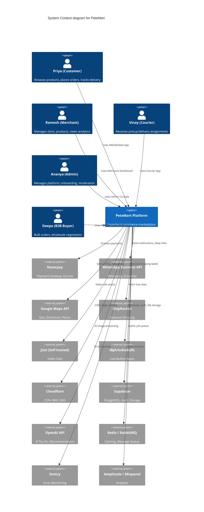

---

## 3. Container Architecture (C4 Level 2)

```mermaid
C4Container
  title Container diagram for PeteMart Platform

  Person(customer, "Customer", "Priya")
  Person(merchant, "Merchant", "Ramesh")
  Person(courier, "Courier", "Vinay")
  Person(admin, "Admin", "Ananya")

  System_Boundary(petemart_platform, "PeteMart Platform") {
    Container(web_app, "Web Application", "Next.js 14, React, Tailwind", "Responsive web app for customers, merchants, admin")
    Container(mobile_app, "Mobile Application", "React Native (Expo)", "iOS/Android apps for customers & couriers")
    Container(api_gateway, "API Gateway", "Kong / AWS API Gateway", "Rate limiting, auth, routing, request validation")
    
    Container_Boundary(microservices, "Microservices (Node.js/Go)") {
      Container(auth_svc, "Auth Service", "Node.js + Supabase Auth", "OTP, JWT, SSO, RBAC")
      Container(catalog_svc, "Catalog Service", "Node.js", "Products, categories, search, inventory")
      Container(order_svc, "Order Service", "Go", "Cart, checkout, order lifecycle, multi-store")
      Container(payment_svc, "Payment Service", "Node.js + Razorpay", "Payments, refunds, escrow, settlements")
      Container(delivery_svc, "Delivery Service", "Go", "Zone calc, routing, courier assignment, tracking")
      Container(merchant_svc, "Merchant Service", "Node.js", "Onboarding, subscriptions, microsites, analytics")
      Container(admin_svc, "Admin Service", "Node.js", "Config, moderation, reports, feature flags")
      Container(notification_svc, "Notification Service", "Node.js", "Push, email, SMS, WhatsApp notifications")
      Container(ai_svc, "AI Service", "Python (FastAPI)", "Virtual try-on, recommendations, image processing")
      Container(analytics_svc, "Analytics Service", "Python + ClickHouse", "Real-time metrics, merchant dashboards, reports")
    }
    
    Container(message_queue, "Message Queue", "RabbitMQ / Redis", "Async job processing, event bus")
    Container(cache, "Cache Layer", "Redis Cluster", "Session cache, rate limiter, API cache")
    Container(database, "Primary Database", "Supabase PostgreSQL", "Transactional data, PostGIS for geo")
    Container(dwh, "Data Warehouse", "ClickHouse / BigQuery", "Analytics, reporting, OLAP")
    Container(object_store, "Object Store", "Supabase Storage / S3", "Product images, try-on results, videos")
    Container(search, "Search Engine", "MeiliSearch / Typesense", "Full-text search, faceted filters")
  }

  System_Ext(razorpay, "Razorpay", "Payment Gateway")
  System_Ext(whatsapp, "WhatsApp API", "Messaging")
  System_Ext(googlemaps, "Google Maps", "Geo services")
  System_Ext(shiprocket, "ShipRocket", "National shipping")
  System_Ext(jitsi, "Jitsi Server", "Video calls")
  System_Ext(bullion_api, "IBJA API", "Bullion rates")
  System_Ext(openai_api, "OpenAI / SD", "AI image gen")
  System_Ext(cloudflare, "Cloudflare", "CDN + WAF")
  System_Ext(sentry, "Sentry", "Error monitoring")

  Rel(customer, web_app, "Uses", "HTTPS")
  Rel(customer, mobile_app, "Uses", "HTTPS")
  Rel(merchant, web_app, "Uses", "HTTPS")
  Rel(courier, mobile_app, "Uses", "HTTPS")
  Rel(admin, web_app, "Uses", "HTTPS")

  Rel(web_app, api_gateway, "API calls", "REST/GraphQL")
  Rel(mobile_app, api_gateway, "API calls", "REST/GraphQL")
  Rel(api_gateway, auth_svc, "Auth routes", "gRPC/REST")
  Rel(api_gateway, catalog_svc, "Catalog routes", "gRPC/REST")
  Rel(api_gateway, order_svc, "Order routes", "gRPC/REST")
  Rel(api_gateway, payment_svc, "Payment routes", "gRPC/REST")
  Rel(api_gateway, delivery_svc, "Delivery routes", "gRPC/REST")
  Rel(api_gateway, merchant_svc, "Merchant routes", "gRPC/REST")
  Rel(api_gateway, admin_svc, "Admin routes", "gRPC/REST")
  Rel(api_gateway, notification_svc, "Notification routes", "gRPC/REST")
  Rel(api_gateway, ai_svc, "AI routes", "REST")
  Rel(api_gateway, analytics_svc, "Analytics routes", "REST")

  Rel(catalog_svc, database, "Read/Write")
  Rel(order_svc, database, "Read/Write")
  Rel(payment_svc, database, "Read/Write")
  Rel(delivery_svc, database, "Read/Write")
  Rel(merchant_svc, database, "Read/Write")
  Rel(admin_svc, database, "Read/Write")
  
  Rel(catalog_svc, search, "Index/Search")
  Rel(order_svc, message_queue, "Publish events")
  Rel(payment_svc, message_queue, "Publish events")
  Rel(delivery_svc, message_queue, "Publish events")
  Rel(notification_svc, message_queue, "Consume events")
  Rel(analytics_svc, message_queue, "Consume events")
  Rel(catalog_svc, cache, "Cache products")
  Rel(order_svc, cache, "Cache cart")
  
  Rel(payment_svc, razorpay, "Payment API")
  Rel(notification_svc, whatsapp, "WhatsApp API")
  Rel(delivery_svc, googlemaps, "Maps API")
  Rel(delivery_svc, shiprocket, "Shipping API")
  Rel(ai_svc, openai_api, "Image API")
  Rel(catalog_svc, bullion_api, "Rate fetch")
  Rel(web_app, jitsi, "Video call")
  Rel(mobile_app, jitsi, "Video call")
```

---

## 4. Component Architecture (C4 Level 3)

### 4.1 Catalog Service Components

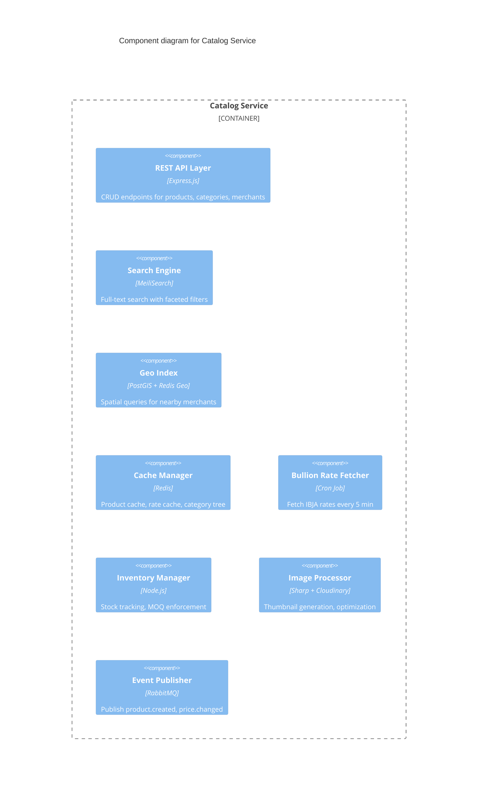

### 4.2 Order Service Components

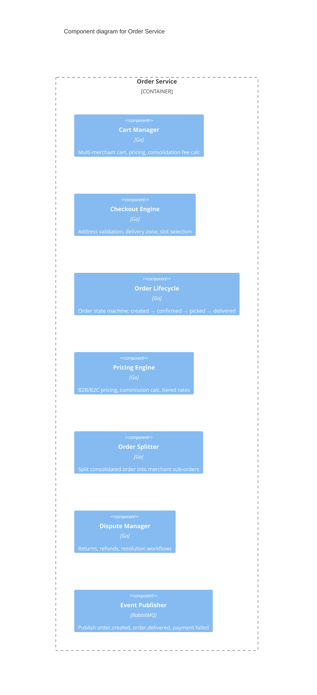

### 4.3 Delivery Service Components

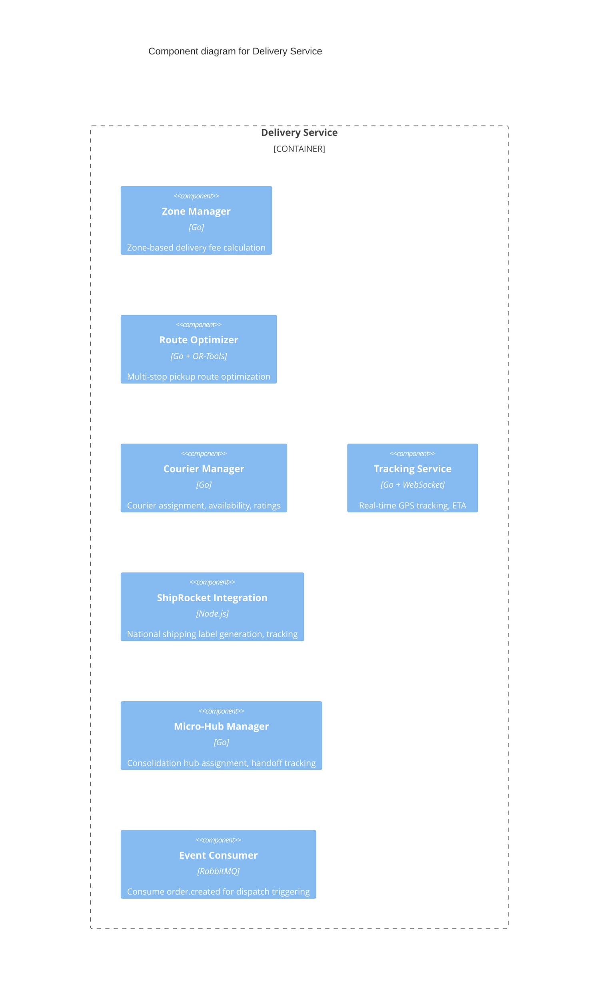

---

## 5. Technology Stack

### 5.1 Frontend Stack

| Layer | Technology | Version | Purpose |
|-------|-----------|---------|---------|
| Web Framework | Next.js | 14.x | React Server Components, SSR, App Router |
| UI Library | React | 18.x | Component architecture |
| Styling | Tailwind CSS | 3.x | Utility-first styling |
| Component Library | shadcn/ui + Radix | Latest | Accessible, composable UI primitives |
| State Management | Zustand + TanStack Query | Latest | Client state + server state |
| Form Handling | React Hook Form + Zod | Latest | Form validation |
| Mobile Framework | React Native (Expo) | 50.x | iOS/Android native apps |
| PWA | Next.js PWA | Latest | Installable web app |

### 5.2 Backend Stack

| Layer | Technology | Purpose |
|-------|-----------|---------|
| Primary API | Node.js (Express/Fastify) | Business logic microservices |
| High-Performance Services | Go (Gin/Fiber) | Order, delivery, payment services |
| AI Services | Python (FastAPI) | Virtual try-on, recommendations |
| API Gateway | Kong / AWS API Gateway | Rate limiting, auth, routing |
| GraphQL Layer | Apollo GraphQL (optional) | Aggregated data fetching |

### 5.3 Data Stack

| Component | Technology | Purpose |
|-----------|-----------|---------|
| Primary Database | Supabase PostgreSQL | Transactions, auth, real-time |
| Data Warehouse | ClickHouse (self-hosted/cloud) | Analytics, merchant reports |
| Cache | Redis Cluster | Session, rate limiting, product cache |
| Search | MeiliSearch / Typesense | Full-text search, faceted filters |
| Message Queue | RabbitMQ | Async event processing |
| Object Storage | Supabase Storage / AWS S3 | Images, videos |
| CDN | Cloudflare | Edge caching, image optimization |

### 5.4 DevOps & Infrastructure

| Component | Technology | Purpose |
|-----------|-----------|---------|
| Container Orchestration | AWS EKS (Kubernetes) | Microservice deployment |
| CI/CD | GitHub Actions | Build, test, deploy pipeline |
| IaC | Terraform | Infrastructure as Code |
| Monitoring | Sentry + Grafana + Prometheus | Error tracking, metrics |
| Logging | ELK Stack / Grafana Loki | Centralized logging |
| DNS + Security | Cloudflare | CDN, WAF, DDoS protection |
| Secrets Management | AWS Secrets Manager / Doppler | API keys, credentials |

---

## 6. API Strategy & Contract Catalog

### 6.1 API Design Principles

- **RESTful** for CRUD operations (`/api/v1/products`, `/api/v1/orders`)
- **GraphQL** for complex aggregations (merchant dashboard, admin reports)
- **WebSocket** for real-time tracking (delivery GPS, order status)
- **gRPC** for inter-service communication (high-performance internal APIs)
- **OpenAPI 3.0** for contract-first API documentation
- **Rate Limiting**: 100 req/min per user, 1000 req/min per merchant, 5000 req/min per admin

### 6.2 API Endpoint Catalog

#### Customer-Facing APIs

| Endpoint | Method | Description | Auth |
|----------|--------|-------------|------|
| `/api/v1/auth/otp` | POST | Send login OTP | None |
| `/api/v1/auth/verify` | POST | Verify OTP, get JWT | None |
| `/api/v1/categories` | GET | List product categories | Optional |
| `/api/v1/markets` | GET | List Pete markets | Optional |
| `/api/v1/merchants` | GET | List/search merchants | Optional |
| `/api/v1/merchants/:id` | GET | Merchant detail + products | Optional |
| `/api/v1/merchants/:id/microsite` | GET | Merchant microsite data | Optional |
| `/api/v1/products` | GET | Search/filter products | Optional |
| `/api/v1/products/:id` | GET | Product detail | Optional |
| `/api/v1/products/:id/tryon` | POST | Process virtual try-on | Required |
| `/api/v1/bullion/rates` | GET | Live gold/silver rates | Optional |
| `/api/v1/cart` | GET/POST/PUT/DELETE | Cart operations | Required |
| `/api/v1/checkout` | POST | Initiate checkout | Required |
| `/api/v1/orders` | GET/POST | List/create orders | Required |
| `/api/v1/orders/:id` | GET | Order detail + tracking | Required |
| `/api/v1/orders/:id/payment` | POST | Process payment | Required |
| `/api/v1/delivery/zones` | GET | Check delivery eligibility | Optional |
| `/api/v1/reviews` | GET/POST | Product/merchant reviews | Required |
| `/api/v1/coupons/validate` | POST | Validate promo code | Required |
| `/api/v1/referrals` | POST | Create referral | Required |

#### Merchant-Facing APIs

| Endpoint | Method | Description |
|----------|--------|-------------|
| `/api/v1/merchant/products` | CRUD | Product management |
| `/api/v1/merchant/orders` | GET | Incoming orders |
| `/api/v1/merchant/orders/:id/status` | PATCH | Update order status |
| `/api/v1/merchant/analytics` | GET | Sales & performance metrics |
| `/api/v1/merchant/subscription` | GET/PUT | Plan management |
| `/api/v1/merchant/payouts` | GET | Settlement history |
| `/api/v1/merchant/modes` | GET/PUT | Interaction mode configuration |

#### Admin-Facing APIs

| Endpoint | Method | Description |
|----------|--------|-------------|
| `/api/v1/admin/merchants` | CRUD | Merchant management |
| `/api/v1/admin/merchants/:id/approve` | POST | Approve store |
| `/api/v1/admin/analytics` | GET | Platform-wide analytics |
| `/api/v1/admin/feature-flags` | CRUD | Feature toggle management |
| `/api/v1/admin/config` | GET/PUT | Dynamic platform config |
| `/api/v1/admin/reviews/moderation` | GET/PUT | Review moderation queue |
| `/api/v1/admin/white-label` | PUT | White-label theming |

#### Courier-Facing APIs

| Endpoint | Method | Description |
|----------|--------|-------------|
| `/api/v1/courier/orders` | GET | Assigned pickups/deliveries |
| `/api/v1/courier/orders/:id/status` | PATCH | Update delivery status |
| `/api/v1/courier/orders/:id/location` | PUT | Update GPS location |
| `/api/v1/courier/payouts` | GET | Earnings & settlement |

### 6.3 Webhook Catalog

| Event | Trigger | Destination | Format |
|-------|---------|-------------|--------|
| `order.placed` | Order created | Merchant dashboard (real-time) | JSON |
| `order.picked_up` | Courier picked up | Customer notification | JSON |
| `order.delivered` | Delivery confirmed | Merchant + Customer | JSON |
| `payment.received` | Payment confirmed | Merchant settlement | JSON |
| `payment.failed` | Payment declined | Customer notification | JSON |
| `merchant.approved` | Admin approved store | Merchant welcome email | JSON |
| `subscription.renewed` | Auto-renewal | Merchant invoice | JSON |
| `review.submitted` | Customer review | Admin moderation queue | JSON |

---

## 7. Data Architecture

### 7.1 Entity Relationship Diagram (Core)

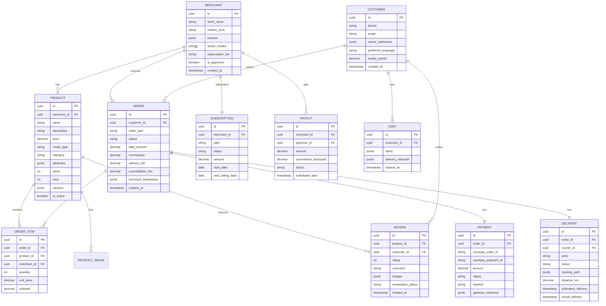

### 7.2 Database Schema — Supabase PostgreSQL

**Estimated Database Size at Scale (5,000 merchants):**
- Merchants: 5,000 rows (~10 MB)
- Products: 500,000 rows (100 avg per merchant) (~500 MB)
- Customers: 100,000 rows (~100 MB)
- Orders: 5M rows (1,000 avg per merchant/year) (~5 GB)
- Order Items: 15M rows (~10 GB)
- Payments: 5M rows (~5 GB)
- Reviews: 250,000 rows (~250 MB)
- Sessions/Cache: ~1 GB (Redis)

**Total Estimated Storage: ~22 GB + media assets (S3: ~500 GB)**

### 7.3 Data Flow — Order Processing

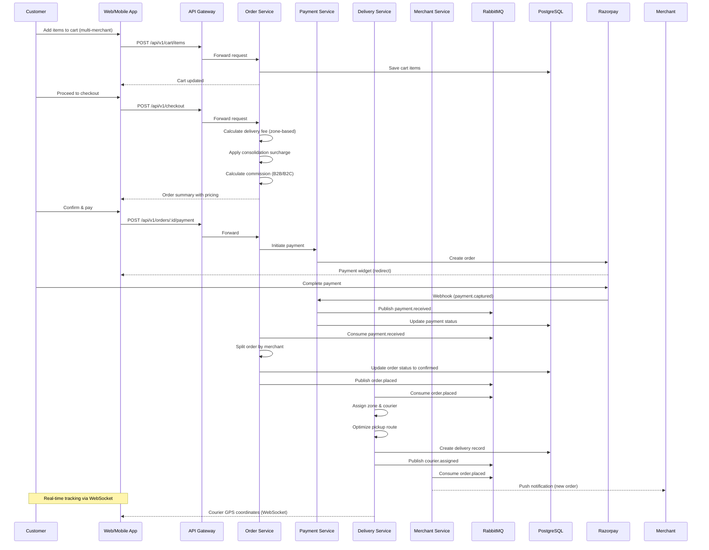

---

## 8. Infrastructure & Deployment

### 8.1 Deployment Architecture (Phase 3 — Production at Scale)

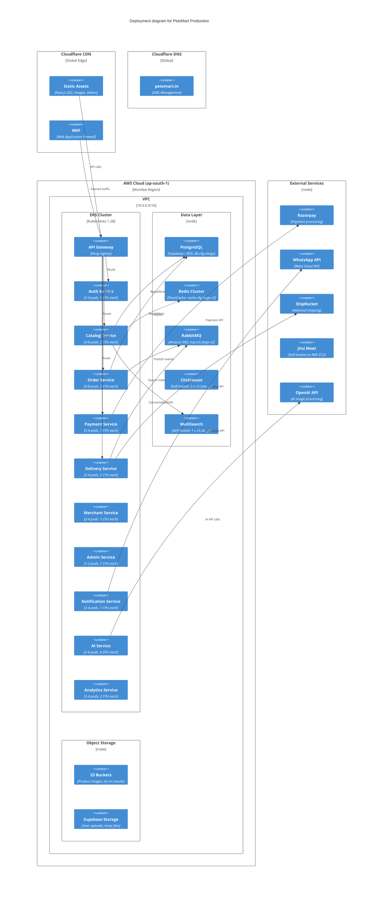

### 8.2 Scaling Strategy

| Phase | Merchants | Infrastructure | Monthly Cost (INR) |
|-------|-----------|----------------|-------------------|
| Phase 0 (POC) | 8 | Supabase Free + Vercel Hobby + Railway | ₹0 |
| Phase 1 (Launch) | 100 | Supabase Pro + Vercel Pro + Railway Pro | ₹15,000 |
| Phase 2 (Growth) | 500 | AWS EKS (small) + RDS + ElastiCache | ₹1,20,000 |
| Phase 3 (Scale) | 2,000 | AWS EKS (med) + RDS Multi-AZ + Redis Cluster | ₹4,50,000 |
| Phase 4 (Vision) | 5,000+ | AWS EKS (large) + Multi-region + Auto-scale | ₹12,00,000 |

### 8.3 Multi-City Expansion Strategy

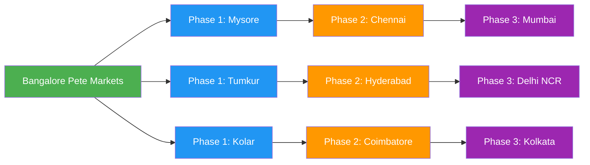

---

## 9. Security Framework

### 9.1 Authentication & Authorization

| Layer | Mechanism | Implementation |
|-------|-----------|----------------|
| Customer | OTP-based (phone) + JWT | Supabase Auth + Phone Auth |
| Merchant | OTP + Email + JWT | Supabase Auth + RBAC |
| Admin | Email/Password + 2FA | Supabase Auth + TOTP |
| Courier | Phone OTP + limited JWT | Supabase Auth + Role-based |
| API Keys | HMAC-signed tokens | For third-party integrations |
| Session | Redis-based + JWT refresh | 7-day expiry, rotate refresh tokens |

### 9.2 Authorization (RBAC)

| Role | Permissions |
|------|------------|
| `customer` | Browse, search, cart, checkout, review, track |
| `b2b_buyer` | Customer + bulk pricing, MOQ negotiation |
| `merchant` | Product CRUD, order management, analytics, payouts |
| `courier` | View assignments, update status, GPS tracking |
| `admin` | Full platform management, moderation, config |
| `super_admin` | All + infra config, billing, audit logs |

### 9.3 Data Security

- **At Rest**: AES-256 encryption (PostgreSQL pgcrypto + S3 SSE-S3)
- **In Transit**: TLS 1.3 (all APIs, WebSocket WSS)
- **PII**: Phone numbers, addresses encrypted at column level
- **Payment**: PCI-DSS compliant via Razorpay (no raw card data stored)
- **Audit Logs**: All admin/merchant actions logged to `audit_log` table

### 9.4 API Security

- Rate limiting: Kong API Gateway (100 req/min per IP/user)
- JWT validation at gateway level
- CORS restricted to `*.petemart.in`
- SQL injection prevention via parameterized queries (Supabase)
- XSS prevention via Content-Security-Policy headers
- DDoS protection via Cloudflare WAF

### 9.5 Compliance

| Regulation | Applicability | Measure |
|-----------|---------------|---------|
| IT Act 2000 (India) | All user data | Data localization, consent |
| DPDP Act 2023 (India) | PII of Indian citizens | Data processing agreement |
| PCI-DSS | Payment data | Razorpay compliance (SAQ A) |
| GDPR (if EU users) | Customer data | Privacy policy, data export |

---

## 10. Scaling Strategy (5,000+ Merchants, Multi-City)

### 10.1 Horizontal Scaling Triggers

| Metric | Threshold | Action |
|--------|-----------|--------|
| CPU > 70% | 5 min average | Add pod (HPA) |
| Memory > 75% | 5 min average | Add pod (HPA) |
| Request latency > 500ms | 1 min avg | Add pod + check queries |
| Queue depth > 10,000 | RabbitMQ | Add consumer pods |
| DB connections > 80% | Supabase/RDS | Add read replicas |
| Search index > 10M docs | MeiliSearch | Shard index |

### 10.2 Database Scaling

- **Phase 1-2**: Supabase Pro (8 GB RAM, 8 CPU) — single instance
- **Phase 3**: AWS RDS PostgreSQL — Multi-AZ with read replicas (x2)
- **Phase 4**: Amazon Aurora PostgreSQL — Serverless v2, auto-scale
- **Sharding**: By city/region at Phase 4

### 10.3 Caching Strategy

| Cache Type | TTL | Storage | Technology |
|-----------|-----|---------|------------|
| Product detail | 5 min | Redis | Key-value |
| Category tree | 1 hour | Redis | Sorted sets |
| Merchant list | 10 min | Redis | Hash |
| Bullion rates | 5 min | Redis | String (atomic update) |
| Session data | 7 days | Redis | Key-value with expiry |
| API rate limit | 1 min | Redis | Sorted sets (sliding window) |
| Static assets | 1 day | Cloudflare CDN | Edge cache |
| Product images | 7 days | Cloudflare + S3 | Optimized variants |

### 10.4 Multi-Region Deployment (Phase 4+)

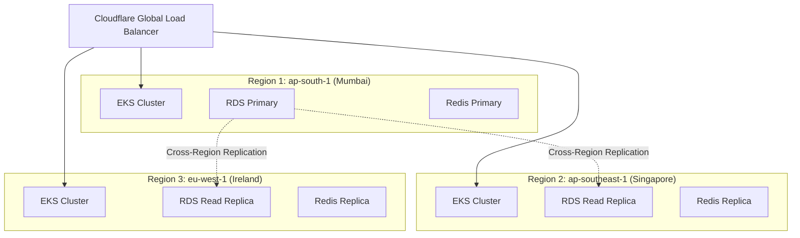

---

## 11. Integration Architecture

### 11.1 Razorpay Integration

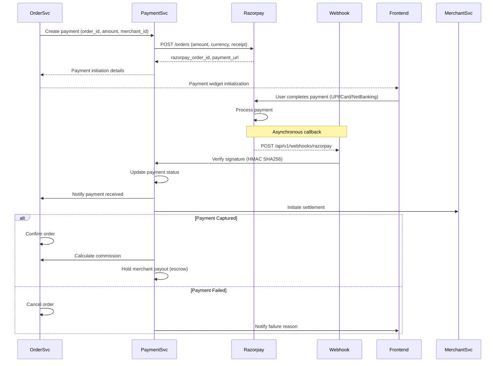

### 11.2 WhatsApp Cloud API Integration

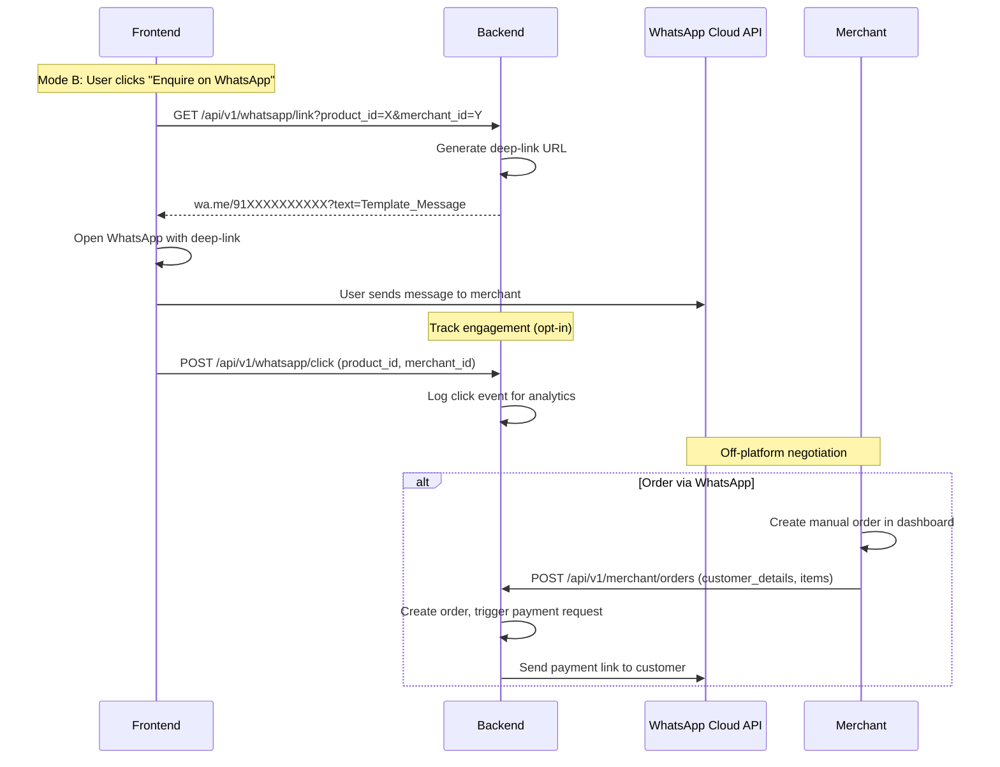

### 11.3 ShipRocket Integration (National Shipping)

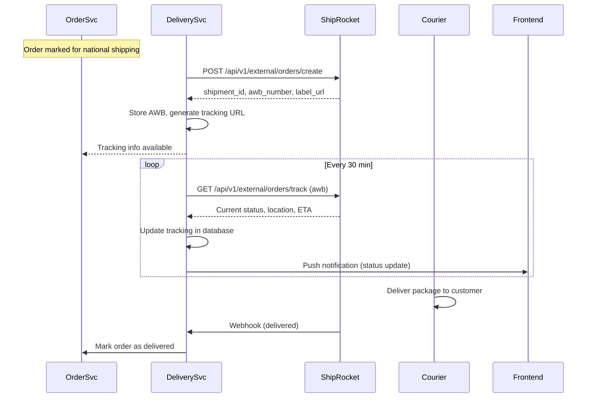

### 11.4 Jitsi Video Call Integration

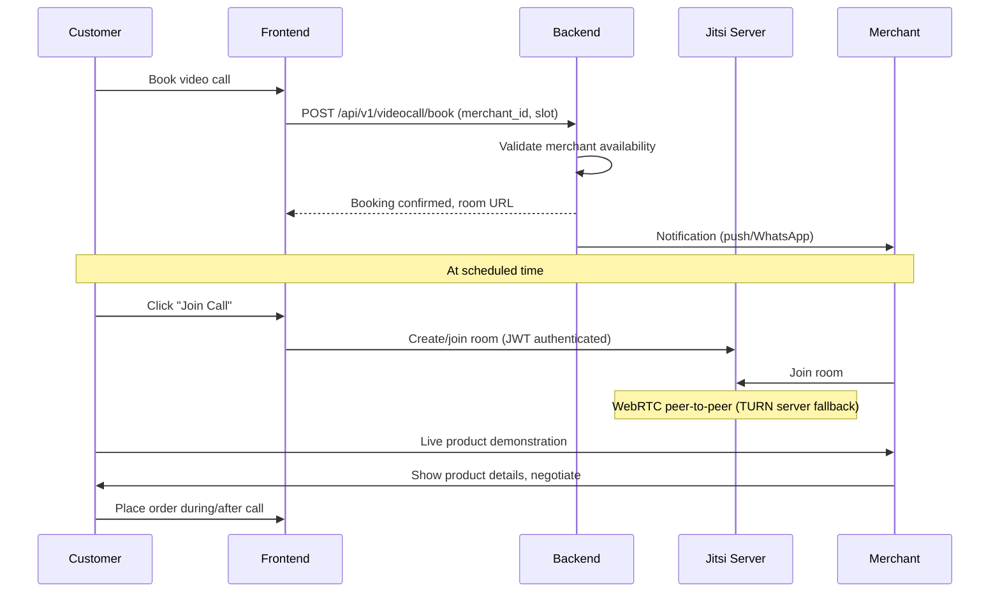

### 11.5 AI Virtual Try-On Integration

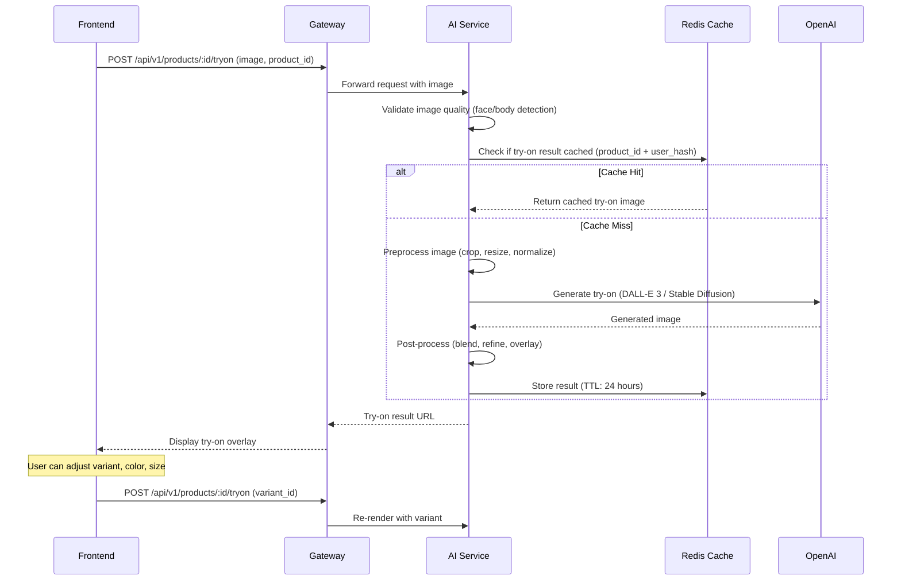

---

## 12. Testing Architecture

### 12.1 Multi-Layer Testing Strategy

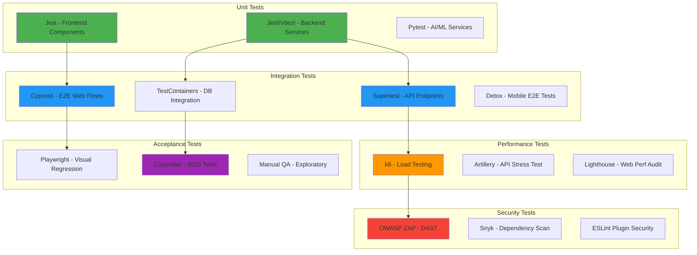

### 12.2 Testing Framework Details

| Test Type | Tool | Scope | Frequency | CI/CD Gate |
|-----------|------|-------|-----------|------------|
| Unit (Frontend) | Jest + React Testing Library | Components, hooks, utils | Every commit | Required |
| Unit (Backend) | Vitest/Jest | Service logic, models | Every commit | Required |
| API Integration | Supertest + TestContainers | Endpoints, DB | Every PR | Required |
| E2E (Web) | Cypress / Playwright | Critical user flows | Every PR | Required |
| E2E (Mobile) | Detox / Maestro | Native flows | Daily build | Required |
| Load Test | k6 | API endpoints, checkout | Weekly | Warning |
| Security Scan | OWASP ZAP + Snyk | All endpoints, deps | Weekly | Required |
| Visual Regression | Percy / Chromatic | UI components | Every PR | Warning |
| BDD | Cucumber + Gherkin | Feature validation | Sprint end | Required |

### 12.3 CI/CD Pipeline


---

## 13. Cost Model — Full Production

### 13.1 Monthly Infrastructure Cost (Phase 3: 2,000 merchants)

| Category | Service | Configuration | Monthly Cost (USD) | Monthly Cost (INR) |
|----------|---------|---------------|--------------------|--------------------|
| **Compute** | AWS EKS (Kubernetes) | 6 x t3.medium (2 vCPU, 4 GB) | $360 | ₹30,000 |
| **Compute** | AWS EKS (AI/GPU) | 2 x g4dn.xlarge (GPU) | $650 | ₹54,000 |
| **Database** | AWS RDS PostgreSQL | db.r6g.large (2 vCPU, 16 GB) | $250 | ₹20,800 |
| **Database** | RDS Read Replica | db.r6g.large x 2 | $500 | ₹41,600 |
| **Cache** | AWS ElastiCache Redis | cache.r6g.large x 3 | $350 | ₹29,000 |
| **Queue** | Amazon MQ (RabbitMQ) | mq.m5.large x 2 | $400 | ₹33,300 |
| **Storage** | AWS S3 | 500 GB + CDN transfer | $50 | ₹4,200 |
| **CDN** | Cloudflare Pro | $20/month | $20 | ₹1,660 |
| **Search** | MeiliSearch (self-hosted) | 1 x c5.xlarge | $85 | ₹7,000 |
| **Analytics** | ClickHouse (self-hosted) | 2 x c5.2xlarge | $340 | ₹28,300 |
| **Monitoring** | Sentry + Grafana | Pro plan + self-hosted | $100 | ₹8,300 |
| **CI/CD** | GitHub Actions | 2,000 min/month | $20 | ₹1,660 |
| **Email** | SendGrid / AWS SES | 100K emails/month | $20 | ₹1,660 |
| **SMS** | Twilio / MSG91 | 50K SMS/month | $150 | ₹12,500 |
| **WhatsApp** | Meta Cloud API | 100K conversations | $200 | ₹16,600 |
| **Maps** | Google Maps API | 100K requests/month | $50 | ₹4,200 |
| **AI** | OpenAI API | Try-on + recommendations | $500 | ₹41,600 |
| **ShipRocket** | Shipping API | 5K shipments/month | $100 | ₹8,300 |
| **Reserve** | Buffer/Overhead | 20% buffer | $800 | ₹66,600 |

| **Total (Phase 3)** | | | **~$4,945** | **~₹4,11,000** |

### 13.2 Annual Infrastructure Cost Projection

| Phase | Monthly Cost (INR) | Annual Cost (INR) |
|-------|--------------------|--------------------|
| Phase 0 (POC — 8 merchants) | ₹0 | ₹0 |
| Phase 1 (Launch — 100 merchants) | ₹15,000 | ₹1,80,000 |
| Phase 2 (Growth — 500 merchants) | ₹1,20,000 | ₹14,40,000 |
| Phase 3 (Scale — 2,000 merchants) | ₹4,11,000 | ₹49,32,000 |
| Phase 4 (Vision — 5,000+ merchants) | ₹12,00,000 | ₹1,44,00,000 |

### 13.3 Annual Operational Cost (Non-Infra)

| Category | Year 1 (INR) | Year 2 (INR) |
|----------|-------------|-------------|
| Engineering Team (8-12 members) | ₹1,20,00,000 | ₹1,50,00,000 |
| Design Team (2 members) | ₹18,00,000 | ₹24,00,000 |
| Operations (3 members) | ₹18,00,000 | ₹24,00,000 |
| Marketing | ₹12,00,000 | ₹36,00,000 |
| Legal & Compliance | ₹3,00,000 | ₹5,00,000 |
| Office & Admin | ₹6,00,000 | ₹9,00,000 |
| **Total Ops** | **₹1,77,00,000** | **₹2,48,00,000** |

### 13.4 Revenue Projection vs Cost

| Phase | Monthly GMV (INR) | Revenue (INR) | Infra Cost (INR) | Ops Cost (INR) | Net (INR) |
|-------|-------------------|--------------|------------------|----------------|-----------|
| POC (8 merchants) | ₹5,00,000 | ₹15,000 | ₹0 | ₹3,00,000 | -₹2,85,000 |
| Launch (100) | ₹50,00,000 | ₹1,50,000 | ₹15,000 | ₹5,00,000 | -₹3,65,000 |
| Growth (500) | ₹3,00,00,000 | ₹9,00,000 | ₹1,20,000 | ₹10,00,000 | -₹2,20,000 |
| Scale (2,000) | ₹15,00,00,000 | ₹45,00,000 | ₹4,11,000 | ₹20,00,000 | ₹20,89,000 |
| Vision (5,000) | ₹50,00,00,000 | ₹1,50,00,000 | ₹12,00,000 | ₹40,00,000 | ₹98,00,000 |

---

## 14. Implementation Roadmap

### Phase 0 (POC): Weeks 1-6 — 8 Merchants

| Week | Milestone | Deliverables |
|------|-----------|-------------|
| 1-2 | Foundation | Supabase setup, Next.js boilerplate, API skeleton, auth |
| 3-4 | Core Features | Product catalog, merchant microsite, Mode B/C, cart |
| 5-6 | Checkout & Launch | Mode A checkout, Razorpay integration, 8 merchants live |

### Phase 1 (Launch): Months 2-4 — 100 Merchants

| Month | Milestone | Deliverables |
|-------|-----------|-------------|
| 2 | Merchant Dashboard | Full onboarding flow, subscription management, analytics |
| 3 | Mobile Apps | React Native iOS/Android (customer), courier app |
| 4 | Delivery Network | Zone-based delivery, multi-store consolidation, courier app |

### Phase 2 (Growth): Months 5-8 — 500 Merchants

| Month | Milestone | Deliverables |
|-------|-----------|-------------|
| 5 | AI Features | Virtual try-on (apparel + jewellery), recommendations |
| 6 | Advanced Commerce | Bulk ordering, ShipRocket integration, B2B workflows |
| 7 | Admin Platform | Feature flags, white-label, review moderation, dynamic config |
| 8 | Performance | Kubernetes migration, Redis clustering, MeiliSearch, CDN |

### Phase 3 (Scale): Months 9-14 — 2,000 Merchants

| Month | Milestone | Deliverables |
|-------|-----------|-------------|
| 9-10 | Infrastructure | Full EKS deployment, auto-scaling, multi-AZ RDS |
| 11-12 | Advanced Features | Video calls (Jitsi), live bullion rates, Pete Street VR |
| 13-14 | Multi-City | Mysore/Tumkur expansion, regional settings, local support |

### Phase 4 (Vision): Months 15-24 — 5,000+ Merchants

| Quarter | Milestone | Deliverables |
|---------|-----------|-------------|
| Q1 2028 | Scale Operations | Pan-India expansion, multiple cities, regional teams |
| Q2 2028 | Advanced AI | Live bazaar streaming, co-shopping, AR virtual walk |
| Q3 2028 | Ecosystem | Third-party integrations, API marketplace for developers |
| Q4 2028 | Enterprise | White-label franchise model, enterprise SLAs, dedicated support |

---

## Appendix A: ADR Log

| ADR | Decision | Rationale | Date |
|-----|----------|-----------|------|
| ADR-001 | Next.js 14 App Router | SSR/SSG hybrid, RSC for perf | 2026-06-10 |
| ADR-002 | React Native (Expo) | Code sharing, hot reload, managed | 2026-06-10 |
| ADR-003 | Supabase PostgreSQL + Row Level Security | Real-time, auth, geo | 2026-06-10 |
| ADR-004 | RabbitMQ over Kafka | Simpler ops, sufficient throughput | 2026-06-10 |
| ADR-005 | Razorpay single PG | Indian market, UPI, escrow | 2026-06-10 |
| ADR-006 | AWS EKS (Phase 3) | Multi-region, Istio, mature | 2026-06-10 |
| ADR-007 | Cloudflare CDN + WAF | Edge, DDoS, SSL, cost-effective | 2026-06-10 |
| ADR-008 | IBJA/IndiaBulls for bullion | Official Indian bullion rates | 2026-06-10 |
| ADR-009 | Jitsi self-hosted | Zero per-minute cost, open source | 2026-06-10 |
| ADR-010 | MeiliSearch > Algolia | Self-hosted, cost control at scale | 2026-06-10 |
| ADR-011 | ClickHouse > BigQuery | Self-hosted analytics, cost at scale | 2026-06-10 |
| ADR-012 | Go for order/payment services | Performance, concurrency | 2026-06-10 |

## Appendix B: Architecture Quality Attributes

| Attribute | Target | Measure |
|-----------|--------|---------|
| Availability | 99.9% (Phase 3+), 99.5% (Phase 1-2) | Uptime monitoring |
| Performance | P95 < 200ms API, < 2s page load | Lighthouse, APM |
| Scalability | 5,000 merchants, 100K customers, 1M orders/month | Load testing |
| Security | OWASP Top 10 compliant | ZAP scans, penetration testing |
| Maintainability | < 4 hours incident resolution | PagerDuty, runbooks |
| Cost Efficiency | < 10% of GMV on infra | FinOps dashboards |

---

*End of Full Product Architecture Blueprint*