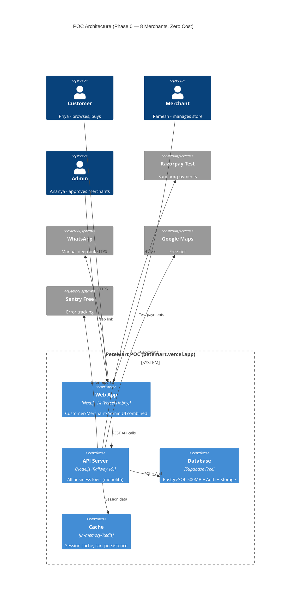
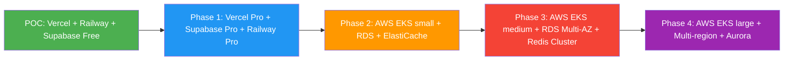

# PeteMart — POC Architecture & Scope Document

**Document Version:** 1.0  
**Author:** Architect Agent (Senior Enterprise Solution Architect)  
**Date:** 2026-06-15  

---

## 1. POC Overview

### Goal
Validate core product-market fit with **8 real merchants** from Chickpet market using minimal infrastructure (zero-cost platform).

### Duration: 6 Weeks
- **Week 1-2:** Foundation & Setup
- **Week 3-4:** Core Feature Implementation  
- **Week 5-6:** Checkout Integration & Go-Live

### Success Criteria
1. 8 merchants onboarded with active store microsites
2. 50+ products cataloged across merchants
3. Complete Mode A checkout flow with Razorpay sandbox
4. Mode B WhatsApp enquiry deep-links functional
5. Mode C Google Maps directions functional
6. At least 1 multi-store consolidated order processed
7. Admin can approve/manage all merchants

---

## 2. POC Technology Stack (Zero Cost)

| Component | Technology | Tier | Limits |
|-----------|-----------|------|--------|
| **Web Hosting** | Vercel Hobby | Free | 100 GB bandwidth, 6000 build min/mo |
| **API Backend** | Railway.app | $5 credit | 500 hours/mo compute |
| **Database** | Supabase Free | Free | 500 MB DB, 1 GB storage, 50K users |
| **Auth** | Supabase Auth | Free | 50K monthly active users |
| **File Storage** | Supabase Storage | Free | 1 GB storage |
| **Mobile Dev** | Expo Go | Free | Development builds only |
| **CI/CD** | GitHub Actions | Free | 2000 min/month public repos |
| **Domain** | Vercel Subdomain | Free | petemart.vercel.app |
| **Monitoring** | Sentry Free | Free | 5K events/month |
| **Payments** | Razorpay Test Mode | Free | Sandbox environment |
| **Maps** | Google Maps Free | Free | $200 credit/month ($28K requests) |

### Total POC Monthly Cost: ₹0

---

## 3. POC Scope Mapping to PRD Requirements

### IN SCOPE (P0 Critical — Must Have)

| Req ID | Feature | Status |
|--------|---------|--------|
| REQ-UI-001 | Landing Page with Pete Tapestry | ✅ |
| REQ-UI-002 | Product Catalog & Search | ✅ |
| REQ-UI-003 | Mode A Product Card & In-App Cart | ✅ |
| REQ-UI-004 | Mode B WhatsApp Enquiry Button | ✅ |
| REQ-UI-005 | Mode C Visit Store Interface | ✅ |
| REQ-UI-006 | Multi-Store Checkout Flow | ✅ |
| REQ-UI-007 | Order Tracking Dashboard (basic) | ✅ |
| REQ-UI-008 | Merchant Store Microsite | ✅ |
| REQ-UI-011 | Merchant Onboarding Dashboard | ✅ |
| REQ-UI-013 | Multi-Language / i18n (Kannada + English) | ✅ |
| REQ-UI-017 | Jewellery Product Card with Live Rates (test) | ✅ |
| REQ-UI-019 | Multi-City Selector (Bangalore only) | ✅ |
| REQ-UI-021 | Merchant Review & Feedback (basic) | ✅ |

**API Layer:** REQ-API-001 (Product), REQ-API-002 (Cart), REQ-API-003 (Checkout), REQ-API-004 (WhatsApp), REQ-API-005 (Maps), REQ-API-006 (Auth), REQ-API-007 (Orders)

**Backend/Data:** REQ-BE-001 (Product CRUD), REQ-BE-002 (Order), REQ-BE-003 (Cart), REQ-BE-004 (Merchant), REQ-BE-005 (Auth), REQ-BE-006 (Notifications basic), REQ-BE-009 (Search), REQ-BE-015 (Geo)

**Commerce:** REQ-COM-001 (Subscriptions), REQ-COM-002 (Razorpay), REQ-COM-003 (Commission calc), REQ-COM-004 (Delivery fee)

### OUT OF SCOPE (P1+ — Post-POC)

| Req ID | Feature | Postponed To |
|--------|---------|-------------|
| REQ-UI-009 | Mobile App iOS | Phase 1 (Month 3) |
| REQ-UI-010 | Mobile App Android | Phase 1 (Month 3) |
| REQ-UI-015 | AI Virtual Try-On Apparel | Phase 2 (Month 5) |
| REQ-UI-016 | AI Virtual Try-On Jewellery | Phase 2 (Month 5) |
| REQ-UI-018 | White-Label Branding | Phase 1 (Month 4) |
| REQ-UI-022 | Pete Street Virtual Walk | Phase 3 (Month 11) |
| REQ-UI-023 | Live Bazaar | Phase 4 (Q2 2028) |
| REQ-UI-024 | Co-Shopping | Phase 4 (Q3 2028) |
| REQ-COM-009 | Video Call | Phase 2 (Month 6) |
| REQ-COM-010 | National Shipping (ShipRocket) | Phase 2 (Month 6) |
| REQ-BE-018 | AI Image Processing | Phase 2 (Month 5) |

---

## 4. POC Architecture Diagram



---

## 5. POC Database Schema (Subset)

```sql
-- Core tables for POC

CREATE TABLE merchants (
  id UUID PRIMARY KEY DEFAULT gen_random_uuid(),
  store_name TEXT NOT NULL,
  owner_name TEXT NOT NULL,
  phone TEXT UNIQUE NOT NULL,
  market_area TEXT NOT NULL,
  address TEXT,
  location JSONB, -- {lat, lng}
  active_modes TEXT[] DEFAULT '{"mode_a","mode_b","mode_c"}',
  subscription_tier TEXT DEFAULT 'starter',
  is_approved BOOLEAN DEFAULT false,
  whatsapp_number TEXT,
  created_at TIMESTAMPTZ DEFAULT now()
);

CREATE TABLE products (
  id UUID PRIMARY KEY DEFAULT gen_random_uuid(),
  merchant_id UUID REFERENCES merchants(id),
  name TEXT NOT NULL,
  description TEXT,
  price DECIMAL(10,2) NOT NULL,
  wholesale_price DECIMAL(10,2),
  mode_type TEXT NOT NULL DEFAULT 'mode_a',
  category TEXT,
  subcategory TEXT,
  images TEXT[],
  stock INT DEFAULT 0,
  moq INT DEFAULT 1,
  is_active BOOLEAN DEFAULT true,
  attributes JSONB,
  created_at TIMESTAMPTZ DEFAULT now()
);

CREATE TABLE customers (
  id UUID PRIMARY KEY DEFAULT gen_random_uuid(),
  phone TEXT UNIQUE NOT NULL,
  name TEXT,
  email TEXT,
  saved_addresses JSONB,
  preferred_language TEXT DEFAULT 'en',
  created_at TIMESTAMPTZ DEFAULT now()
);

CREATE TABLE orders (
  id UUID PRIMARY KEY DEFAULT gen_random_uuid(),
  customer_id UUID REFERENCES customers(id),
  status TEXT DEFAULT 'pending',
  total_amount DECIMAL(10,2),
  delivery_fee DECIMAL(10,2),
  consolidation_fee DECIMAL(10,2),
  commission DECIMAL(10,2),
  delivery_address JSONB,
  payment_status TEXT DEFAULT 'pending',
  created_at TIMESTAMPTZ DEFAULT now()
);

CREATE TABLE order_items (
  id UUID PRIMARY KEY DEFAULT gen_random_uuid(),
  order_id UUID REFERENCES orders(id),
  product_id UUID REFERENCES products(id),
  merchant_id UUID REFERENCES merchants(id),
  quantity INT NOT NULL,
  unit_price DECIMAL(10,2) NOT NULL,
  subtotal DECIMAL(10,2) NOT NULL
);

CREATE TABLE payments (
  id UUID PRIMARY KEY DEFAULT gen_random_uuid(),
  order_id UUID REFERENCES orders(id),
  razorpay_order_id TEXT,
  razorpay_payment_id TEXT,
  amount DECIMAL(10,2),
  status TEXT,
  method TEXT,
  created_at TIMESTAMPTZ DEFAULT now()
);

-- Enable Row Level Security on all tables
ALTER TABLE merchants ENABLE ROW LEVEL SECURITY;
ALTER TABLE products ENABLE ROW LEVEL SECURITY;
ALTER TABLE customers ENABLE ROW LEVEL SECURITY;
ALTER TABLE orders ENABLE ROW LEVEL SECURITY;
ALTER TABLE order_items ENABLE ROW LEVEL SECURITY;
ALTER TABLE payments ENABLE ROW LEVEL SECURITY;
```

---

## 6. POC API Endpoints

| Method | Endpoint | Description | POC Scope |
|--------|----------|-------------|-----------|
| POST | /api/v1/auth/otp | Send OTP | ✅ |
| POST | /api/v1/auth/verify | Verify OTP | ✅ |
| GET | /api/v1/markets | List markets | ✅ |
| GET | /api/v1/merchants | List merchants | ✅ |
| GET | /api/v1/merchants/:id | Merchant detail | ✅ |
| GET | /api/v1/merchants/:id/microsite | Microsite data | ✅ |
| GET | /api/v1/products | Search products | ✅ |
| GET | /api/v1/products/:id | Product detail | ✅ |
| POST | /api/v1/cart/items | Add to cart | ✅ |
| GET | /api/v1/cart | Get cart | ✅ |
| DELETE | /api/v1/cart/items/:id | Remove from cart | ✅ |
| POST | /api/v1/checkout | Initiate checkout | ✅ |
| POST | /api/v1/orders | Create order | ✅ |
| GET | /api/v1/orders | List orders | ✅ |
| GET | /api/v1/orders/:id | Order detail | ✅ |
| POST | /api/v1/orders/:id/payment | Process payment | ✅ |
| POST | /api/v1/webhooks/razorpay | Payment callback | ✅ |
| POST | /api/v1/merchant/products | Add product | ✅ |
| GET | /api/v1/merchant/products | List merchant products | ✅ |
| PUT | /api/v1/merchant/products/:id | Update product | ✅ |
| GET | /api/v1/merchant/orders | Merchant orders | ✅ |
| PUT | /api/v1/merchant/orders/:id/status | Update order status | ✅ |
| GET | /api/v1/admin/merchants | All merchants | ✅ |
| PUT | /api/v1/admin/merchants/:id/approve | Approve merchant | ✅ |
| GET | /api/v1/delivery/zones | Zone info | ✅ |

---

## 7. POC Deployment Configuration

### Vercel (petemart.vercel.app)
- **Framework**: Next.js 14
- **Build Command**: `npm run build`
- **Output Directory**: `.next`
- **Environment Variables**:
  - `NEXT_PUBLIC_API_URL=https://petemart-api.railway.app`
  - `NEXT_PUBLIC_SUPABASE_URL=...`
  - `NEXT_PUBLIC_SUPABASE_ANON_KEY=...`

### Railway (petemart-api.railway.app)
- **Runtime**: Node.js 20
- **Start Command**: `npm start`
- **Environment Variables**:
  - `SUPABASE_URL=...`
  - `SUPABASE_SERVICE_KEY=...`
  - `RAZORPAY_KEY_ID=...`
  - `RAZORPAY_KEY_SECRET=...`
  - `REDIS_URL=...`
  - `SENTRY_DSN=...`
  - `JWT_SECRET=...`

---

## 8. POC Testing Strategy

| Test Type | Tool | Scope |
|-----------|------|-------|
| Unit Tests | Jest + Vitest | Components, API utils, services |
| API Tests | Supertest | All 25 POC endpoints |
| E2E Web | Cypress | Browse → Cart → Checkout flow |
| Payment | Razorpay Test | Sandbox UPI/Card flow |

---

## 9. POC Risk Mitigation

| Risk | Impact | Mitigation |
|------|--------|------------|
| Supabase Free tier 500MB limit | Data cap | Only 8 merchants, ~50 products, ~200 orders — well within limit |
| Railway $5 credit runs out | API downtime | Estimated usage: ~200 hours/mo (under 500 limit). Monitor dashboard |
| Vercel bandwidth limit | Slow loads | Optimize images, enable ISR caching |
| Razorpay sandbox issues | Payment flow broken | Local mock for unit tests, fallback to test card |
| Expo Go limitations | No native push, limited plugins | Accept for POC, plan React Native CLI migration for Phase 1 |

---

## 10. POC to Production Migration Path



### Migration Checklist
- [ ] Replace Railway with AWS ECS/Fargate (Phase 2)
- [ ] Migrate Supabase to RDS PostgreSQL (Phase 2)
- [ ] Add Redis Cluster (Phase 2)
- [ ] Add API Gateway (Kong) (Phase 2)
- [ ] Add RabbitMQ message queue (Phase 2)
- [ ] Add MeiliSearch (Phase 2)
- [ ] Add ClickHouse data warehouse (Phase 3)
- [ ] Add Cloudflare CDN + WAF (Phase 3)
- [ ] Add GPU nodes for AI service (Phase 3)
- [ ] Multi-region deployment (Phase 4)

---

*End of POC Scope Document*