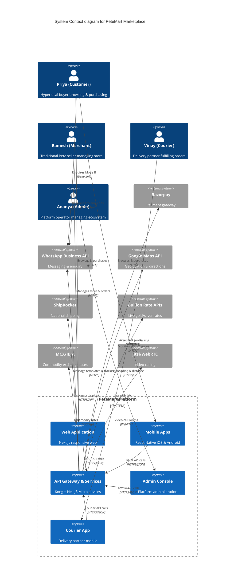
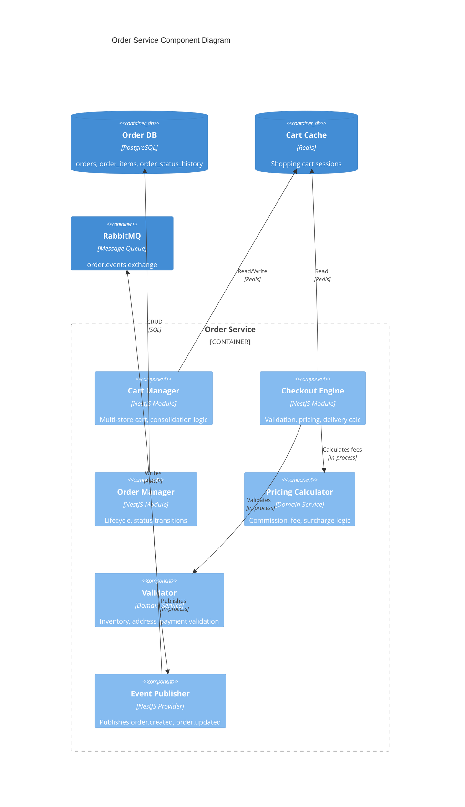
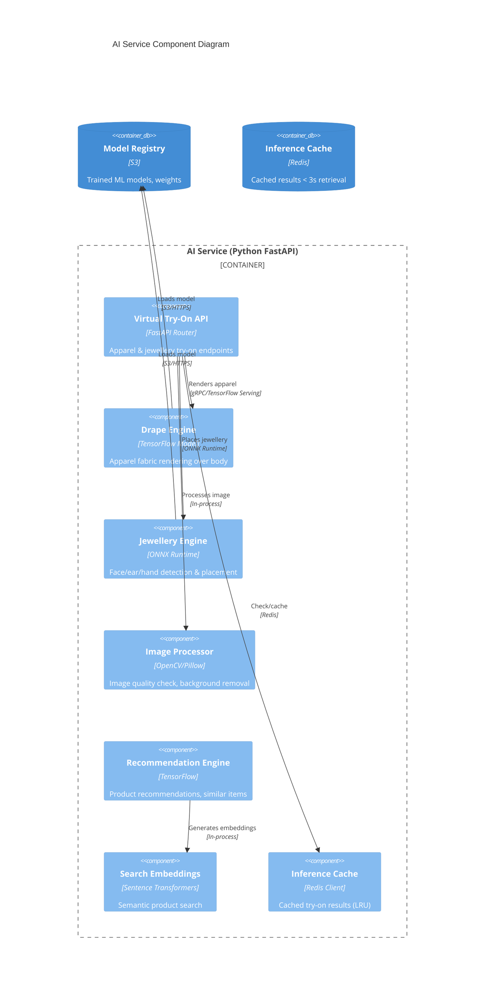
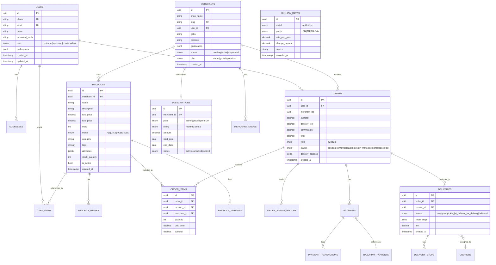
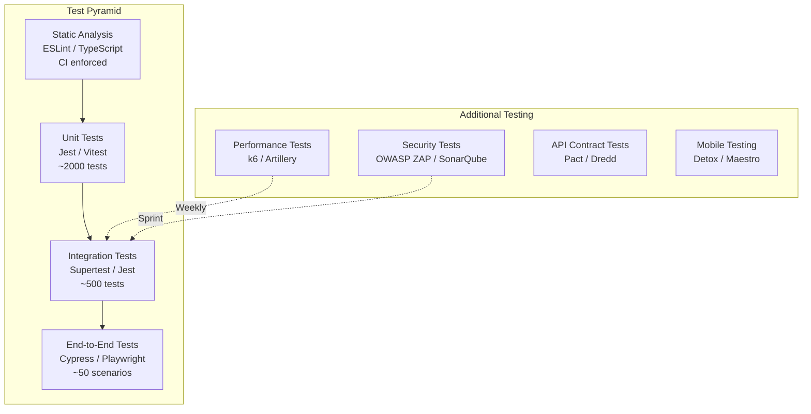

# PeteMart — Full Product Enterprise Architecture Blueprint

**Document Version:** 1.0  
**Author:** Senior Enterprise Solution Architect (Agent 03)  
**Date:** 2026-06-15  
**Derived From:** PRD v2.0, Idea Proposal v1.3, Business Revenue Model v1.4, PRD Config v1.0  
**Status:** Final (Approved for Engineering)  

---

## Table of Contents
1. [Executive Summary](#1-executive-summary)
2. [Architecture Principles & Philosophy](#2-architecture-principles--philosophy)
3. [System Context (C4 Level 1)](#3-system-context-c4-level-1)
4. [Container Architecture (C4 Level 2)](#4-container-architecture-c4-level-2)
5. [Component Architecture (C4 Level 3) — Key Containers](#5-component-architecture-c4-level-3--key-containers)
6. [Technology Stack Selection](#6-technology-stack-selection)
7. [API Strategy & Contract Design](#7-api-strategy--contract-design)
8. [Data Architecture & Schema Design](#8-data-architecture--schema-design)
9. [Infrastructure Architecture & Deployment](#9-infrastructure-architecture--deployment)
10. [Security Architecture](#10-security-architecture)
11. [AI/ML Architecture (Virtual Try-On, Bullion Rates, Recommendations)](#11-aiml-architecture)
12. [WhatsApp Integration Architecture](#12-whatsapp-integration-architecture)
13. [Multi-Store Cart & Consolidated Delivery Architecture](#13-multi-store-cart--consolidated-delivery-architecture)
14. [Analytics & Data Pipeline Architecture](#14-analytics--data-pipeline-architecture)
15. [Testing Architecture](#15-testing-architecture)
16. [Scaling Strategy (5,000+ Merchants, Multi-City)](#16-scaling-strategy)
17. [Costing Model — Full Production](#17-costing-model--full-production)
18. [Implementation Roadmap (Phased)](#18-implementation-roadmap-phased)
19. [Appendix: Requirement Traceability Matrix](#19-appendix-requirement-traceability-matrix)

---

## 1. Executive Summary

PeteMart is a **hyperlocal digital commerce marketplace** targeting **5,000+ traditional physical merchants** across **21 historic Pete markets of Old Bangalore**, expanding to multi-city operations. The architecture is designed as an **API-first, event-driven, cloud-native** platform supporting:

- **4 Persona Ecosystems**: Customers (B2C/B2B), Merchants, Delivery Partners, Platform Admins
- **3 Interaction Modes**: Mode A (Direct Purchase), Mode B (WhatsApp Enquiry), Mode C (Visit Store)
- **5 Application Surfaces**: Responsive Web (Next.js), iOS Native (React Native), Android Native (React Native), Courier App, Admin Dashboard
- **4 Channels**: Web, Mobile (iOS/Android), WhatsApp, Physical Store (digitally enabled)

**Key Architectural Decisions:**
- **Frontend**: Next.js (Web) + React Native (Mobile) — shared component library
- **Backend**: Node.js/TypeScript with NestJS microservices on Kubernetes
- **Database**: PostgreSQL (primary) + Redis (cache/queue) + MongoDB (product catalog)
- **AI**: Dedicated ML inference service via TensorFlow Serving + ONNX Runtime
- **Messaging**: RabbitMQ for event-driven architecture
- **Search**: Elasticsearch for full-text product/merchant search
- **API Gateway**: Kong API Gateway with rate limiting, auth, observability
- **Infrastructure**: AWS EKS (Kubernetes), RDS PostgreSQL, ElastiCache Redis, S3 for media
- **Cost at 5,000 merchants**: ~₹8.2L/month (~$9,800/month) at full scale

---

## 2. Architecture Principles & Philosophy

### 2.1 Guiding Principles

| Principle | Description | Application |
|---|---|---|
| **API-First** | All functionality exposed via RESTful APIs before UI | Every feature has an API contract; UIs are API consumers |
| **Event-Driven** | Async message passing for cross-service communication | Order → Notification → Courier dispatch → Analytics pipeline |
| **Cloud-Native** | Horizontal scaling, containerized microservices | Kubernetes orchestration, auto-scaling HPA |
| **Offline-First** | Mobile apps work with degraded connectivity | SQLite local cache, sync on connectivity |
| **Multi-Tenant** | Isolated merchant data with shared infrastructure | Row-level security in PostgreSQL, merchant_id on all tables |
| **Observability** | Every transaction traced, every metric captured | OpenTelemetry, Prometheus, Grafana, ELK stack |
| **Secure by Default** | Defense in depth, zero-trust network | API Gateway auth, JWT, RBAC, encryption at rest/transit |
| **Cost-Optimized** | Resource usage aligned to traffic patterns | Auto-scaling, spot instances, CDN caching, read replicas |

### 2.2 Architecture Style

```
                    ┌─────────────────────────────────────────────┐
                    │           Edge Layer (CloudFront/CDN)        │
                    └──────────────────┬──────────────────────────┘
                                       │
                    ┌──────────────────▼──────────────────────────┐
                    │         Kong API Gateway Layer               │
                    │   Rate Limiting | Auth | Routing | Logging   │
                    └──┬───────────┬───────────┬─────────────────┘
                       │           │           │
              ┌────────▼──┐ ┌─────▼─────┐ ┌───▼──────────┐
              │ Web App   │ │ Mobile    │ │ Admin/3rd    │
              │ (Next.js) │ │ (RN API)  │ │ Party APIs   │
              └───────────┘ └───────────┘ └──────────────┘
                                       │
              ┌────────────────────────▼──────────────────────┐
              │         Microservices Layer (Kubernetes)       │
              │  Order | Product | Merchant | Payment | User   │
              │  Notification | Delivery | AI | Analytics      │
              └──┬──────────┬──────────┬──────────┬──────────┘
                 │          │          │          │
        ┌────────▼──┐ ┌────▼────┐ ┌───▼────┐ ┌───▼────────┐
        │PostgreSQL │ │ Redis   │ │Elastic │ │  RabbitMQ  │
        │ (Primary) │ │ (Cache) │ │(Search)│ │  (Events)  │
        └───────────┘ └─────────┘ └────────┘ └────────────┘
```

---

## 3. System Context (C4 Level 1)



---

## 4. Container Architecture (C4 Level 2)

```mermaid
C4Container
  title Container Diagram for PeteMart Platform

  Person(customer, "Customer", "End user browsing & buying")
  Person(merchant, "Merchant", "Store owner managing catalog")
  Person(delivery, "Courier", "Delivery partner")
  Person(admin, "Admin", "Platform operator")

  System_Boundary(petemart, "PeteMart Platform") {
    Container(cdn, "CDN", "CloudFront", "Static asset delivery, caching")
    Container(gateway, "API Gateway", "Kong", "Rate limiting, auth, routing, logging")
    
    Container(web, "Web App", "Next.js + Tailwind", "SSR React app for customer & merchant")
    Container(mobile, "Mobile App", "React Native", "iOS & Android native apps")
    Container(adminui, "Admin Console", "Next.js", "Platform admin dashboard")
    Container(courierui, "Courier App", "React Native", "Delivery partner mobile app")

    Container_Boundary(services, "Microservices") {
      Container(usr_svc, "User Service", "NestJS", "Auth, profiles, addresses")
      Container(prd_svc, "Product Service", "NestJS", "Catalog, inventory, search")
      Container(ord_svc, "Order Service", "NestJS", "Cart, checkout, order lifecycle")
      Container(mer_svc, "Merchant Service", "NestJS", "Store, subscription, metrics")
      Container(pay_svc, "Payment Service", "NestJS", "Razorpay integration, reconciliation")
      Container(dlv_svc, "Delivery Service", "NestJS", "Courier dispatch, route optimization")
      Container(not_svc, "Notification Service", "NestJS", "Push, email, SMS, WhatsApp")
      Container(ai_svc, "AI Service", "Python FastAPI", "Try-on, recommendations, search")
      Container(anl_svc, "Analytics Service", "NestJS", "Events, metrics, reporting")
      Container(bull_svc, "Bullion Service", "NestJS", "Live gold/silver rate fetching & caching")
    }

    ContainerDb(pg, "PostgreSQL", "RDS", "Primary database — users, orders, payments")
    ContainerDb(redis, "Redis", "ElastiCache", "Session, cache, rate limiting, queue")
    ContainerDb(es, "Elasticsearch", "AWS OpenSearch", "Product & merchant full-text search")
    ContainerDb(mongo, "MongoDB", "Atlas/DocumentDB", "Product catalog flexible schema")
    ContainerDb(s3, "S3", "AWS S3", "Images, product photos, try-on results")
    ContainerDb(pg_replica, "PostgreSQL Read Replica", "RDS", "Read scaling for analytics queries")
    Container(mq, "RabbitMQ", "Amazon MQ", "Event bus for async messaging")
  }

  System_Ext(razorpay, "Razorpay", "Payment gateway")
  System_Ext(whatsapp_api, "WhatsApp Business API", "Messaging")
  System_Ext(gmaps, "Google Maps", "Geocoding, distance matrix")

  Rel(customer, cdn, "Loads Web App", "HTTPS")
  Rel(customer, web, "Browse & purchase", "HTTPS")
  Rel(customer, mobile, "Browse & purchase", "HTTPS")
  Rel(merchant, web, "Manage store", "HTTPS")
  Rel(merchant, mobile, "Manage store", "HTTPS")
  Rel(delivery, courierui, "Accept deliveries", "HTTPS")
  Rel(admin, adminui, "Platform Ops", "HTTPS")

  Rel(web, gateway, "API calls", "HTTPS")
  Rel(mobile, gateway, "API calls", "HTTPS")
  Rel(adminui, gateway, "API calls", "HTTPS")
  Rel(courierui, gateway, "API calls", "HTTPS")

  Rel(gateway, usr_svc, "Routes /api/users/*", "Internal")
  Rel(gateway, prd_svc, "Routes /api/products/*", "Internal")
  Rel(gateway, ord_svc, "Routes /api/orders/*", "Internal")
  Rel(gateway, mer_svc, "Routes /api/merchants/*", "Internal")
  Rel(gateway, pay_svc, "Routes /api/payments/*", "Internal")
  Rel(gateway, dlv_svc, "Routes /api/delivery/*", "Internal")
  Rel(gateway, not_svc, "Routes /api/notifications/*", "Internal")
  Rel(gateway, ai_svc, "Routes /api/ai/*", "Internal")
  Rel(gateway, anl_svc, "Routes /api/analytics/*", "Internal")
  Rel(gateway, bull_svc, "Routes /api/bullion/*", "Internal")

  Rel(usr_svc, pg, "Read/write", "SQL")
  Rel(prd_svc, mongo, "Read/write catalog", "MongoDB protocol")
  Rel(prd_svc, es, "Index/search", "REST")
  Rel(ord_svc, pg, "Read/write orders", "SQL")
  Rel(pay_svc, pg, "Read/write payments", "SQL")
  Rel(mer_svc, pg, "Read/write merchants", "SQL")
  Rel(dlv_svc, pg, "Read/write delivery", "SQL")

  Rel(usr_svc, redis, "Cache sessions", "Redis protocol")
  Rel(prd_svc, redis, "Cache catalog", "Redis protocol")
  Rel(ord_svc, redis, "Cache cart", "Redis protocol")
  Rel(bull_svc, redis, "Cache live rates", "Redis protocol")

  Rel(ord_svc, mq, "Publish order.events", "AMQP")
  Rel(not_svc, mq, "Consume notifications", "AMQP")
  Rel(dlv_svc, mq, "Consume delivery.assign", "AMQP")
  Rel(anl_svc, mq, "Consume analytics.events", "AMQP")

  Rel(pay_svc, razorpay, "Process payments", "HTTPS")
  Rel(not_svc, whatsapp_api, "Send templates", "HTTPS")
  Rel(dlv_svc, gmaps, "Distance API", "HTTPS")
```



---

## 5. Component Architecture (C4 Level 3) — Key Containers

### 5.1 Order Service Components



### 5.2 AI Service Components



---

## 6. Technology Stack Selection

### 6.1 Frontend

| Layer | Technology | Justification |
|---|---|---|
| Web Framework | **Next.js 14 (App Router)** | SSR, ISR, SEO-optimized, React Server Components |
| UI Library | **Tailwind CSS + shadcn/ui** | Utility-first, rapid prototyping, accessible components |
| State Management | **Zustand + React Query** | Lightweight, server state sync, caching |
| i18n | **next-intl** | Multi-language support (Kannada, Hindi, English, Tamil, Telugu) |
| PWA | **next-pwa** | Offline browsing, install prompts |
| WebRTC | **daily-js / Jitsi Meet SDK** | Video call appointments |
| Maps | **Leaflet + Google Maps React Wrapper** | Cost-effective mapping with Google fallback |

### 6.2 Mobile (React Native)

| Layer | Technology | Justification |
|---|---|---|
| Framework | **React Native (CLI) 0.73+** | Shared code with web, native performance |
| Navigation | **React Navigation 6** | Stack, tab, drawer navigation |
| Offline | **WatermelonDB + NetInfo** | Local-first data, sync on reconnect |
| Push | **Firebase Cloud Messaging** | Cross-platform push notifications |
| Camera | **react-native-vision-camera** | Try-on photo capture |
| Maps | **react-native-maps** | Native map integration for Mode C |
| Animations | **react-native-reanimated** | Smooth 60fps transitions |

### 6.3 Backend / API

| Layer | Technology | Justification |
|---|---|---|
| API Framework | **NestJS (Node.js)** | Modular, decorators, OpenAPI out-of-box |
| API Gateway | **Kong (Open Source)** | Rate limiting, auth, routing, observability |
| Language | **TypeScript** | Type safety, shared types with frontend |
| Validation | **class-validator + Zod** | Request/response validation |
| ORM | **Prisma** | Type-safe database access, migrations |
| Auth | **JWT (access + refresh) + OAuth2** | Stateless authentication |
| Message Queue | **RabbitMQ (Amazon MQ)** | Reliable async event processing |
| Search | **Elasticsearch (AWS OpenSearch)** | Full-text product/merchant search |

### 6.4 AI / ML

| Layer | Technology | Justification |
|---|---|---|
| AI Framework | **Python FastAPI** | Async, automatic OpenAPI, high perf ML serving |
| Model Serving | **TensorFlow Serving + ONNX Runtime** | Production-grade model inference |
| Try-On Models | **VITON-HD / DCTON (fine-tuned)** | Virtual try-on for apparel |
| Jewellery Detection | **YOLOv8 + MediaPipe** | Face/ear/hand landmark detection |
| Embeddings | **Sentence-Transformers (all-MiniLM-L6-v2)** | Semantic search |
| GPU Inference | **AWS SageMaker / EKS GPU nodes** | Cost-effective GPU scaling |

### 6.5 Database / Storage

| Type | Technology | Purpose |
|---|---|---|
| Primary RDBMS | **PostgreSQL 16 (AWS RDS)** | Users, orders, payments, merchants |
| Document Store | **MongoDB (AWS DocumentDB)** | Product catalog, flexible attributes |
| Cache | **Redis 7 (AWS ElastiCache)** | Sessions, cart, rate limiting, inference cache |
| Search | **Elasticsearch (AWS OpenSearch)** | Full-text product & merchant search |
| Object Storage | **AWS S3 + CloudFront** | Images, try-on results, static assets |
| Time Series | **TimescaleDB (PostgreSQL extension)** | Analytics, metrics, bullion rate history |
| Read Replica | **RDS Read Replica** | Analytics query offloading |

### 6.6 Infrastructure

| Layer | Technology | Justification |
|---|---|---|
| Container Orchestration | **AWS EKS (Kubernetes)** | Production-grade orchestration, auto-scaling |
| CI/CD | **GitHub Actions + ArgoCD** | GitOps workflow |
| Monitoring | **Prometheus + Grafana + OpenTelemetry** | Full observability |
| Logging | **ELK Stack (Elasticsearch, Logstash, Kibana)** | Centralized logging |
| Alerting | **PagerDuty + Slack Webhooks** | Incident response |
| CDN | **AWS CloudFront** | Global low-latency asset delivery |
| DNS | **Route53** | DNS management |
| Secrets | **AWS Secrets Manager** | Secure credential storage |

---

## 7. API Strategy & Contract Design

### 7.1 API Design Principles

1. **RESTful resource-oriented design** with consistent naming
2. **OpenAPI 3.1** specification for all endpoints
3. **Versioned** via URL prefix (`/api/v1/`, `/api/v2/`)
4. **Paginated** list endpoints with cursor-based pagination
5. **Standard error format**: `{ error: { code, message, details } }`
6. **Idempotency keys** for order/payment creation
7. **Rate limiting** per tenant: 1000 req/min (standard), 5000 req/min (premium)

### 7.2 Core API Endpoints

| Service | Endpoint Group | Examples |
|---|---|---|
| **User** | `/api/v1/users` | `POST /auth/login`, `POST /auth/register`, `GET /profile`, `PUT /addresses` |
| **Product** | `/api/v1/products` | `GET /?market=&category=&mode=`, `GET /:id`, `GET /:id/try-on` |
| **Merchant** | `/api/v1/merchants` | `GET /:slug`, `GET /:id/products`, `POST /register`, `PUT /subscription` |
| **Cart** | `/api/v1/cart` | `POST /add`, `PUT /update`, `DELETE /:item`, `GET /summary` |
| **Order** | `/api/v1/orders` | `POST /checkout`, `GET /:id`, `GET /history`, `PUT /:id/status` |
| **Payment** | `/api/v1/payments` | `POST /initiate`, `POST /razorpay/webhook`, `GET /:id` |
| **Delivery** | `/api/v1/delivery` | `POST /assign`, `GET /:id/track`, `PUT /:id/status`, `GET /zones` |
| **Notification** | `/api/v1/notifications` | `POST /send`, `PUT /device-token`, `GET /history` |
| **AI** | `/api/v1/ai` | `POST /try-on`, `POST /recommendations`, `GET /similar/:id` |
| **Bullion** | `/api/v1/bullion` | `GET /rates?metal=gold&purity=24k`, `GET /history?days=7` |
| **Analytics** | `/api/v1/analytics` | `GET /merchant/:id/sales`, `GET /admin/revenue`, `GET /customer/:id/history` |
| **Admin** | `/api/v1/admin` | `GET /merchants/pending`, `PUT /merchants/:id/approve`, `GET /system/health` |

### 7.3 Webhook Events (Event-Driven)

| Event | Publisher | Consumers | Description |
|---|---|---|---|
| `order.created` | Order Service | Notification, Delivery, Analytics | New order placed |
| `order.payment_confirmed` | Payment Service | Order, Notification, Analytics | Payment successful |
| `order.shipped` | Delivery Service | Order, Notification | Courier picked up |
| `order.delivered` | Delivery Service | Order, Notification, Analytics | Order delivered |
| `merchant.registered` | Merchant Service | Admin, Notification | New merchant signup |
| `merchant.subscription_changed` | Merchant Service | Billing, Analytics | Plan upgrade/downgrade |
| `product.out_of_stock` | Product Service | Merchant, Notification | Stock depleted |
| `bullion.rate_updated` | Bullion Service | Product (if cached) | Rate change > 1% |
| `payment.dispute` | Payment Service | Admin, Merchant | Payment dispute raised |

---

## 8. Data Architecture & Schema Design

### 8.1 Database ERD (Core Entities)



### 8.2 Key Schema Decisions

1. **PostgreSQL for transactional data**: Users, orders, payments, deliveries — strong consistency required
2. **MongoDB for product catalog**: Flexible schema for different product categories (textiles have different attributes than electronics)
3. **JSONB for flexible attributes**: Product attributes, merchant preferences, delivery metadata — schema-less where needed
4. **TimescaleDB hypertables for bullion rates**: Time-series optimized for live rate history
5. **Row-Level Security (RLS)**: Merchant data isolation in shared tables
6. **Soft deletes**: `deleted_at` timestamp for all critical entities
7. **Audit triggers**: `created_by`, `updated_by` on all mutable tables

---

## 9. Infrastructure Architecture & Deployment

### 9.1 AWS Production Architecture

```mermaid
C4Deployment
  title Deployment Diagram for PeteMart Production

  Deployment_Node(aws, "AWS Cloud", "ap-south-1 (Mumbai)") {
    Deployment_Node(vpc, "VPC (10.0.0.0/16)", "Production VPC") {
      
      Deployment_Node(public_subnets, "Public Subnets (3 AZ)", "us-east-1a, b, c") {
        Deployment_Node(cdn, "CloudFront", "CDN") {
          Container(static_assets, "Static Assets", "S3 + CloudFront")
        }
        Deployment_Node(alb, "ALB", "Application Load Balancer") {
          Container(alb_route, "HTTPS Routing", "SSL termination, path routing")
        }
        Container(gateway_node, "Kong API Gateway", "Kong on EKS")
      }

      Deployment_Node(private_subnets, "Private Subnets (3 AZ)", "EKS Node Groups") {
        Deployment_Node(eks, "EKS Cluster", "Kubernetes v1.28") {
          Deployment_Node(system_ns, "System Namespace") {
            Container(ingress, "Ingress Controller", "nginx-ingress")
            Container(monitoring, "Prometheus/Grafana", "Monitoring stack")
            Container(logging, "FluentBit", "Log shipping to ELK")
          }
          Deployment_Node(app_ns, "Application Namespace") {
            Container(user_pods, "User Service", "NestJS, 3 replicas")
            Container(product_pods, "Product Service", "NestJS, 3 replicas")
            Container(order_pods, "Order Service", "NestJS, 3 replicas")
            Container(payment_pods, "Payment Service", "NestJS, 2 replicas")
            Container(delivery_pods, "Delivery Service", "NestJS, 2 replicas")
            Container(notification_pods, "Notification Service", "NestJS, 2 replicas")
            Container(ai_pods, "AI Service", "Python FastAPI, 2 replicas (+ GPU)")
            Container(merchant_pods, "Merchant Service", "NestJS, 2 replicas")
            Container(analytics_pods, "Analytics Service", "NestJS, 2 replicas")
            Container(bullion_pods, "Bullion Service", "NestJS, 1 replica")
          }
          Deployment_Node(worker_ns, "Worker Namespace") {
            Container(event_workers, "Event Workers", "Bull/RabbitMQ consumers, 5 replicas")
            Container(cron_jobs, "CronJobs", "Subscription billing, rate fetching, cleanup")
          }
        }
      }

      Deployment_Node(data_subnets, "Data Subnets (3 AZ)", "Managed Services") {
        ContainerDb(rds_primary, "RDS PostgreSQL", "db.r6g.large → db.r6g.4xlarge")
        ContainerDb(rds_replica, "RDS Read Replica", "db.r6g.large for analytics")
        ContainerDb(redis_cluster, "ElastiCache Redis", "cache.r6g.large cluster mode")
        ContainerDb(mq_broker, "Amazon MQ RabbitMQ", "mq.m5.large cluster")
        ContainerDb(opensearch, "AWS OpenSearch", "2 x r6g.large.search data nodes")
        ContainerDb(documentdb, "DocumentDB", "db.r6g.large, 3 replicas")
        ContainerDb(s3_buckets, "S3 Buckets", "Media, exports, backups, models")
      }
    }
  }

  Deployment_Node(courier_app_device, "Courier App", "Android/iOS Device") {
    Container(courier_mobile, "Courier Mobile App", "React Native")
  }

  Deployment_Node(customer_device, "Customer Device", "Browser/Mobile") {
    Container(customer_browser, "Web Browser", "Next.js App")
    Container(customer_mobile, "Mobile App", "React Native")
  }

  Rel(customer_device, cdn, "Loads app", "HTTPS")
  Rel(cdn, alb, "Routes API calls", "HTTPS")
  Rel(alb, gateway_node, "Routes traffic", "HTTPS")
  Rel(gateway_node, eks, "Service routing", "Internal")
  Rel(product_pods, opensearch, "Search indexing", "REST")
  Rel(product_pods, documentdb, "Catalog CRUD", "MongoDB protocol")
  Rel(order_pods, rds_primary, "Order CRUD", "SQL")
  Rel(order_pods, redis_cluster, "Cart cache", "Redis")
  Rel(order_pods, mq_broker, "Publish events", "AMQP")
  Rel(ai_pods, s3_buckets, "Load models", "S3 HTTPS")
```

### 9.2 Auto-Scaling Configuration

| Service | Min Replicas | Max Replicas | CPU Threshold | Memory Threshold |
|---|---|---|---|---|
| User Service | 2 | 8 | 70% | 80% |
| Product Service | 2 | 10 | 60% | 75% |
| Order Service | 2 | 12 | 65% | 80% |
| Payment Service | 2 | 6 | 70% | 75% |
| Delivery Service | 2 | 8 | 65% | 80% |
| Notification Service | 2 | 10 | 70% | 70% |
| AI Service (CPU) | 2 | 6 | 70% | 75% |
| AI Service (GPU) | 1 | 4 | GPU 60% | 80% |
| Event Workers | 3 | 15 | Queue depth driven | — |

---

## 10. Security Architecture

### 10.1 Security Layers

```
┌─────────────────────────────────────────────────────────────────────┐
│                        Security Layers                               │
├─────────────────────────────────────────────────────────────────────┤
│  Layer 1: Network Security (VPC, Subnets, Security Groups, WAF)      │
├─────────────────────────────────────────────────────────────────────┤
│  Layer 2: API Security (Kong rate limiting, JWT auth, CORS, CSRF)    │
├─────────────────────────────────────────────────────────────────────┤
│  Layer 3: Application Security (Input validation, RBAC, RLS)         │
├─────────────────────────────────────────────────────────────────────┤
│  Layer 4: Data Security (Encryption at rest/transit, key rotation)   │
├─────────────────────────────────────────────────────────────────────┤
│  Layer 5: Auth Security (JWT, OAuth2, MFA for admins, device trust)  │
├─────────────────────────────────────────────────────────────────────┤
│  Layer 6: Audit & Compliance (CloudTrail, audit logs, GDPR/DPDP)     │
└─────────────────────────────────────────────────────────────────────┘
```

### 10.2 Authentication & Authorization

| Aspect | Implementation |
|---|---|
| **Customer Auth** | Phone OTP (primary) + Google OAuth + Email/Password |
| **Merchant Auth** | Phone OTP + Email/Password + WhatsApp OTP |
| **Admin Auth** | Email/Password + MFA (TOTP) + IP whitelisting |
| **Courier Auth** | Phone OTP + device fingerprint |
| **Token Strategy** | Access token (15min expiry) + Refresh token (7 day rotate) |
| **API Auth** | JWT Bearer token via Kong |
| **RBAC Roles** | `customer`, `merchant`, `courier`, `admin`, `super_admin` |
| **Row-Level Security** | PostgreSQL RLS policies on merchant_id/user_id |

### 10.3 Data Protection

| Measure | Implementation |
|---|---|
| **Encryption at Rest** | AWS EBS encryption, RDS encryption, S3 SSE-S3 |
| **Encryption in Transit** | TLS 1.3 for all external + internal traffic |
| **PII Masking** | Phone/email masked in logs, support tools |
| **Payment Data** | No raw card data stored — Razorpay tokenization only |
| **GDPR/DPDP** | Data export API, account deletion workflow, consent management |
| **Password Policy** | bcrypt (cost 12), minimum 8 chars, no common passwords |

### 10.4 API Rate Limiting

| Tier | Rate Limit | Burst | Applied To |
|---|---|---|---|
| Anonymous | 30 req/min | 50 | All unauthenticated endpoints |
| Customer | 200 req/min | 300 | `/api/v1/products`, `/api/v1/search` |
| Customer (peak) | 60 req/min | 100 | `/api/v1/orders`, `/api/v1/payments` |
| Merchant | 500 req/min | 750 | `/api/v1/merchants/*` |
| Admin | 1000 req/min | 2000 | `/api/v1/admin/*` |
| Courier | 300 req/min | 500 | `/api/v1/delivery/*` |
| Premium Merchant | 1000 req/min | 1500 | All merchant endpoints |
| Webhook (Razorpay) | 100 req/min | IP whitelisted | `/api/v1/payments/webhook` |

---

## 11. AI/ML Architecture

### 11.1 Virtual Try-On Pipeline

```
User Upload/Capture → Image Validation → Body/Face Detection → 
    ┌── Apparel: Drape Engine (VITON-HD) → Texture Mapping → Size Scaling
    └── Jewellery: Landmark Detection → 3D Placement → Color Matching
→ Result Compositing → Cache (Redis) → Return to Client
```

**Performance Targets:**
- P50 latency: < 2 seconds
- P95 latency: < 4 seconds
- Cache hit rate: > 60% for popular products
- GPU utilization: > 70% during peak

### 11.2 Live Bullion Rate Architecture

```
Bullion Sources (MCX, IBJA, IndiaBulls)
        │
        ▼
Bullion Service (cron: every 60 seconds)
        │
        ├──→ Validate rate (> 0, < 1M, not stale)
        ├──→ Store in TimescaleDB (hypertable)
        ├──→ Cache in Redis (TTL: 120s)
        ├──→ Compare with last rate → PUBLISH if change > 0.5%
        │
        ▼
Product Service (consumes rate updates)
        ├──→ Recalculate jewellery product prices
        └──→ Push update to connected clients via WebSocket
```

### 11.3 Recommendation Engine

| Model | Input | Output | Refresh |
|---|---|---|---|
| **Similar Products** | Product embedding | Top-10 similar items | Real-time |
| **Frequently Bought Together** | Order history | Co-purchase pairs | Daily batch |
| **Personalized Feed** | User history + browse | Ranked product list | Real-time (online) + Daily (offline) |
| **Trending in Market** | Market-level events | Trending products | Hourly |

---

## 12. WhatsApp Integration Architecture

### 12.1 Architecture

```
Customer clicks "Enquire on WhatsApp" (Mode B)
        │
        ▼
Product Service → Generates deep-link URL:
    https://wa.me/91{merchant_phone}?text=I'm%20interested%20in%20{product_name}%20(Rs.{price})%20from%20{shop_name}%20-%20PeteMart
        │
        ▼
Customer's device → Opens WhatsApp app
        │
        ▼
Customer ↔ Merchant negotiate off-platform
        │
        ▼
(Optional) Merchant creates manual order via dashboard
        │
        ▼
System logs: whatsapp_enquiry event (product_id, merchant_id, timestamp)
```

### 12.2 WhatsApp Business API Integration

| Feature | Implementation | Requirement ID |
|---|---|---|
| **Deep Link Generation** | URL template with encoded params | REQ-API-004 |
| **Click Tracking** | Pixel/webhook on link click | REQ-BE-006 |
| **Message Templates** | Pre-approved WhatsApp Business templates | REQ-API-004 |
| **Order Confirmation** | WhatsApp notification on Mode A order | REQ-BE-006 |
| **OTP Login** | WhatsApp OTP for merchant login | REQ-API-008 |
| **Catalog Sharing** | WhatsApp Business catalog sync (future) | REQ-API-004 |
| **Rate Limits** | 1000 template messages/day (Tier 1) → Scale with WhatsApp | — |

---

## 13. Multi-Store Cart & Consolidated Delivery Architecture

### 13.1 Cart Data Model

```json
{
  "cart_id": "uuid",
  "user_id": "uuid",
  "items": [
    {
      "product_id": "uuid",
      "merchant_id": "uuid",
      "quantity": 2,
      "unit_price": 500,
      "mode": "A"
    },
    {
      "product_id": "uuid",
      "merchant_id": "uuid",
      "quantity": 1,
      "unit_price": 15000,
      "mode": "A"
    }
  ],
  "merchant_count": 2,
  "consolidation_fee": 25,
  "delivery_zone": "zone_1",
  "delivery_fee": 40,
  "total_estimate": 15565
}
```

### 13.2 Delivery Fee Calculation Engine

```
function calculateDeliveryFee(items, address):
    merchants = unique_merchants(items)
    zone = get_delivery_zone(address, merchants[0].location)
    
    // Base rate = max zone rate among all merchants
    base_rate = get_zone_base_rate(zone, items_is_b2b())
    
    // Consolidation surcharge
    additional_stores = max(0, len(merchants) - 1)
    consolidation_surcharge = additional_stores * 25
    
    // Weight surcharge
    total_weight = sum(items.weight)
    weight_surcharge = calculate_weight_surcharge(total_weight, is_b2b)
    
    return base_rate + consolidation_surcharge + weight_surcharge
```

### 13.3 Courier Dispatch Flow

```
Order Confirmed → Payment Success
        │
        ▼
Delivery Service → Create delivery manifest
        │
        ├──→ Calculate optimal pickup route (Google Maps Route API)
        ├──→ Assign to nearest available courier (round-robin + proximity)
        ├──→ Push notification to courier app
        │
        ▼
Courier App → Shows multi-stop route:
    Stop 1: Merchant A (pickup) → Stop 2: Merchant B (pickup) → 
    Stop 3: Micro-Hub (consolidation) → Stop N: Customer (delivery)
        │
        ▼
Each pickup: Courier scans QR code → Updates status → Customer notified
        │
        ▼
Final delivery → Customer confirms → Courier paid
```

---

## 14. Analytics & Data Pipeline Architecture

### 14.1 Event Analytics Pipeline

```
Application Events (Order, Payment, Browse, Search, etc.)
        │
        ▼
RabbitMQ → Event Workers → Batch to S3 (Parquet)
        │
        ▼
AWS Athena / Trino → SQL Analytics
        │
        ▼
Grafana Dashboards → Admin & Merchant views
```

### 14.2 Analytics Service Capabilities

| Dashboard | Audience | Metrics |
|---|---|---|
| **Merchant Sales** | Merchant | Daily sales, top products, mode split (A/B/C), revenue, delivery stats |
| **Platform Revenue** | Admin | MRR, commission collected, subscription revenue, delivery revenue |
| **Customer Insights** | Admin | Active users, repeat rate, cart abandonment, top search terms |
| **Delivery Performance** | Admin | On-time %, avg delivery time, courier utilization, zone-wise stats |
| **AI Performance** | Admin | Try-on requests, latency P50/P95, cache hit rate, GPU utilization |
| **Market Trends** | Admin | Pete-wise GMV, trending categories, seasonal patterns |

---

## 15. Testing Architecture

### 15.1 Multi-Layer Testing Strategy



### 15.2 Testing Responsibilities

| Test Type | Tool | Coverage Target | Frequency | Owner |
|---|---|---|---|---|
| **Unit Tests** | Jest (JS/TS), Pytest (Python) | > 85% | Every commit | Dev |
| **Integration Tests** | Supertest, TestContainers | > 70% | Every PR | Dev |
| **E2E Tests** | Cypress (Web), Detox (Mobile) | Critical paths | Nightly | QA |
| **API Contract Tests** | Pact (CDC), Dredd | 100% of endpoints | Every deploy | Dev |
| **Performance Tests** | k6, Artillery | Peak load + 2x | Weekly | QA |
| **Security Scans** | OWASP ZAP, SonarQube | All endpoints | Daily | DevOps |
| **Accessibility** | axe-core, Lighthouse | WCAG 2.1 AA | Every PR | Dev |
| **Mobile E2E** | Detox, Maestro | Critical flows | Nightly | QA |

### 15.3 Test Environments

| Environment | Purpose | Config | Data |
|---|---|---|---|
| **Local** | Dev inner loop | Docker Compose | Seed data (synthetic) |
| **Development** | Integration testing | EKS (small) | Synthetic + anonymized subset |
| **Staging** | Pre-prod validation | Mirror of prod (50% size) | Anonymized prod copy |
| **Performance** | Load testing | EKS (medium) | Scaled synthetic data |
| **Production** | Live | Full prod | Real data |

---

## 16. Scaling Strategy

### 16.1 Scaling Thresholds

| Stage | Merchants | Monthly Orders | Infrastructure | Monthly Cost |
|---|---|---|---|---|
| **Launch (Mo 1-3)** | 50-100 | 1,000 | 2 x m6g.large EKS nodes, db.r6g.large | ₹65,000 |
| **Growth (Mo 4-6)** | 100-500 | 10,000 | 4 x m6g.xlarge EKS, db.r6g.2xlarge | ₹1.8L |
| **Scale (Mo 7-12)** | 500-2,000 | 50,000 | 8 x m6g.2xlarge, db.r6g.4xlarge + read replica | ₹4.2L |
| **Enterprise (Yr 2)** | 2,000-5,000 | 200,000 | 16 x m6g.2xlarge, db.r6g.8xlarge + Multi-AZ | ₹8.2L |
| **Multi-City (Yr 2-3)** | 5,000-15,000 | 500,000+ | Regional replication, 32+ nodes | ₹18L+ |

### 16.2 Scaling Mechanisms

| Component | Scaling Strategy |
|---|---|
| **Web Frontend** | Next.js ISR + CDN caching → Horizontal pod autoscaling |
| **API Services** | HPA based on CPU + request rate + queue depth |
| **PostgreSQL** | Vertical (larger instance) → Read replicas → Sharding (by merchant_id hash) |
| **Redis** | Cluster mode → Sharding across node groups |
| **Elasticsearch** | Increase shard count → Add data nodes → Cross-cluster search |
| **RabbitMQ** | Cluster with mirrored queues → Federation for multi-region |
| **AI Inference** | GPU node pool → Auto-scaling based on queue depth → Model distillation for throughput |
| **Image Storage** | S3 + CloudFront → Image optimization pipeline → WebP/AVIF auto-conversion |

### 16.3 Multi-City Expansion Strategy

```
City Deployment Pattern:
    ┌──────────────────────────────────────────────┐
    │         Global Control Plane (Mumbai)         │
    │     User Service, Merchant Service, Admin     │
    └──┬───────────────┬──────────────────┬────────┘
       │               │                  │
       ▼               ▼                  ▼
┌──────────────┐ ┌──────────────┐ ┌──────────────┐
│ Bangalore Hub│ │ Chennai Hub  │ │ Hyderabad Hub│
│ (ap-south-1) │ │ (ap-south-1) │ │ (ap-south-1) │
├──────────────┤ ├──────────────┤ ├──────────────┤
│ Product Svc  │ │ Product Svc  │ │ Product Svc  │
│ Order Svc    │ │ Order Svc    │ │ Order Svc    │
│ Delivery Svc │ │ Delivery Svc │ │ Delivery Svc │
│ Postgres     │ │ Postgres     │ │ Postgres     │
│ (city-local) │ │ (city-local) │ │ (city-local) │
└──────────────┘ └──────────────┘ └──────────────┘
```

---

## 17. Costing Model — Full Production

### 17.1 Monthly Infrastructure Cost (5,000 Merchants)

| Category | Service | Config | Monthly Cost (₹) |
|---|---|---|---|
| **Compute** | EKS Node Group (CPU) | 8 x m6i.2xlarge (8 vCPU, 32 GB) | ₹2,10,000 |
| **Compute** | EKS GPU Node | 2 x g5.xlarge (1 GPU) | ₹85,000 |
| **Database** | RDS PostgreSQL | db.r6g.4xlarge (16 vCPU, 128 GB) | ₹1,20,000 |
| **Database** | RDS Read Replica | db.r6g.2xlarge (8 vCPU, 64 GB) | ₹55,000 |
| **Database** | ElastiCache Redis | cache.r6g.xlarge cluster (3 nodes) | ₹45,000 |
| **Database** | DocumentDB | db.r6g.2xlarge (3 replicas) | ₹60,000 |
| **Database** | OpenSearch | 2 x r6g.large.search | ₹35,000 |
| **Storage** | S3 + CloudFront | 500 GB media + CDN | ₹15,000 |
| **Messaging** | Amazon MQ (RabbitMQ) | mq.m5.large | ₹25,000 |
| **Networking** | ALB + NAT Gateway | — | ₹30,000 |
| **Monitoring** | Prometheus + Grafana | Self-hosted on EKS | ₹5,000 |
| **AI Inference** | SageMaker (optional GPU) | 1 x ml.g5.xlarge | ₹40,000 |
| **Third-Party** | Razorpay (2% PG fee) | On transaction volume | Variable |
| **Third-Party** | Google Maps API | Geocoding + Distance Matrix | ₹20,000 |
| **Third-Party** | WhatsApp Business API | Per conversation | ₹15,000 |
| **Third-Party** | Twilio/SNS (SMS OTP) | ~50,000 OTPs/month | ₹5,000 |
| **Third-Party** | Sentry (Error Tracking) | Team plan | ₹8,000 |
| **Total Estimated** | | | **~₹7,78,000** |

### 17.2 Annual Cost Breakdown

| Year | Scale | Monthly | Annual |
|---|---|---|---|
| **Year 1 (Months 1-6)** | 50-500 merchants | ₹1,20,000 | ₹7,20,000 |
| **Year 1 (Months 7-12)** | 500-2,000 merchants | ₹3,50,000 | ₹21,00,000 |
| **Year 2** | 2,000-5,000 merchants | ₹7,78,000 | ₹93,36,000 |
| **Year 3 (Multi-City)** | 5,000-15,000 merchants | ₹15,00,000+ | ₹1,80,00,000+ |

### 17.3 Development Team Cost (Monthly)

| Role | Count | Monthly Cost (₹) |
|---|---|---|
| Senior Full-Stack Engineers | 4 | ₹5,60,000 |
| Mobile Engineers (React Native) | 2 | ₹2,40,000 |
| Backend/API Engineers | 3 | ₹3,60,000 |
| ML/AI Engineer | 1 | ₹1,50,000 |
| DevOps Engineer | 1 | ₹1,20,000 |
| QA Engineer | 1 | ₹80,000 |
| UI/UX Designer | 1 | ₹1,00,000 |
| Product Manager | 1 | ₹1,50,000 |
| **Total** | **14** | **₹17,60,000** |

### 17.4 Revenue Model vs Cost

| Revenue Stream | Year 1 Projection | Year 2 Projection |
|---|---|---|
| Subscription (Starter: 40%, Growth: 40%, Premium: 20%) | ₹1.2 Cr | ₹4.8 Cr |
| Commission (Mode A: 1.5% B2B / 4% B2C) | ₹0.5 Cr | ₹2.5 Cr |
| Delivery Fee Platform Share (15%) | ₹0.3 Cr | ₹1.5 Cr |
| Catalog Upload Service (₹10/product) | ₹0.1 Cr | ₹0.4 Cr |
| **Total Revenue** | **₹2.1 Cr** | **₹9.2 Cr** |
| **Infra + Team Cost** | **₹1.8 Cr** | **₹4.5 Cr** |
| **Gross Margin** | **~14%** | **~51%** |

---

## 18. Implementation Roadmap (Phased)

### Phase 1: Foundation (Months 1-2)
**Focus:** Platform core, 50 merchants, Mode A only
- [x] Next.js web app (landing, browse, catalog)
- [x] User auth (phone OTP + JWT)
- [x] Product service (CRUD, search)
- [x] Order service (single-store cart + checkout)
- [x] Razorpay payment integration
- [x] Merchant onboarding dashboard
- [x] Admin console basics
- [x] PostgreSQL + Redis setup
- [x] Kong API Gateway
- [x] CI/CD pipeline (GitHub Actions)

### Phase 2: Channels (Months 3-4)
**Focus:** Mobile apps, Mode B/C, multi-store cart
- [ ] React Native mobile apps (iOS + Android)
- [ ] Mode B WhatsApp deep link
- [ ] Mode C Google Maps + store facade
- [ ] Multi-store cart + consolidation logic
- [ ] Delivery service + zone management
- [ ] Courier app (React Native)
- [ ] Push notifications (FCM)
- [ ] Multi-language i18n (KN, HI, EN, TA, TE)

### Phase 3: Intelligence (Months 5-6)
**Focus:** AI features, analytics, scaling
- [ ] AI Virtual Try-On (apparel + jewellery)
- [ ] Live bullion rate integration
- [ ] Elasticsearch full-text search
- [ ] Recommendation engine
- [ ] Merchant analytics dashboard
- [ ] Admin analytics dashboard
- [ ] Event-driven analytics pipeline
- [ ] Performance optimization + CDN caching
- [ ] Auto-scaling configuration

### Phase 4: Enterprise (Months 7-9)
**Focus:** Premium features, national shipping, video calls
- [ ] Video call appointment scheduling (Jitsi)
- [ ] White-label branding engine
- [ ] National shipping (ShipRocket integration)
- [ ] Feature flags + kill switch
- [ ] Review & moderation workflow
- [ ] Subscription billing automation
- [ ] 360° product rotation view
- [ ] Multi-city geographic selector
- [ ] B2B bulk ordering with MOQ enforcement

### Phase 5: Visionary (Months 10-12)
**Focus:** Advanced experiences, scale to 2,000+
- [ ] Pete Street Virtual Walk (360° street view)
- [ ] Live Bazaar streaming
- [ ] Shop Together co-shopping
- [ ] Loyalty points & rewards program
- [ ] Customer try-on gallery
- [ ] Pete Tapestry heritage landing page
- [ ] Performance testing at 2000+ merchant scale
- [ ] Disaster recovery drills
- [ ] Penetration testing + security audit

---

## 19. Appendix: Requirement Traceability Matrix

| Requirement ID | Title | Priority | Service | Feature Group |
|---|---|---|---|---|
| REQ-UI-001 | Landing Page with Pete Tapestry | P0 | Web App | Browse & Discovery |
| REQ-UI-002 | Product Catalog & Search | P0 | Product Service | Browse & Discovery |
| REQ-UI-003 | Mode A Product Card & In-App Cart | P0 | Order Service | Mode A |
| REQ-UI-004 | Mode B WhatsApp Enquiry Button | P0 | Product Service | Mode B |
| REQ-UI-005 | Mode C Visit Store Interface | P0 | Web/Mobile | Mode C |
| REQ-UI-006 | Multi-Store Checkout Flow | P0 | Order Service | Checkout |
| REQ-UI-007 | Order Tracking Dashboard | P1 | Order/Delivery | Tracking |
| REQ-UI-008 | Merchant Store Microsite | P0 | Merchant Service | Storefront |
| REQ-UI-009 | Mobile App (iOS) | P1 | Mobile App | Channel |
| REQ-UI-010 | Mobile App (Android) | P1 | Mobile App | Channel |
| REQ-UI-011 | Merchant Onboarding Dashboard | P0 | Merchant Service | Onboarding |
| REQ-UI-012 | Admin/Operator Dashboard | P1 | Admin Console | Admin |
| REQ-UI-013 | Multi-Language / i18n | P0 | Web/Mobile | Internationalization |
| REQ-UI-014 | Merchant Sales & Analytics Dashboard | P1 | Analytics Service | Analytics |
| REQ-UI-015 | AI Virtual Try-On (Apparel) | P1 | AI Service | AI Features |
| REQ-UI-016 | AI Virtual Try-On (Jewellery) | P1 | AI Service | AI Features |
| REQ-UI-017 | Live Bullion Rate Integration | P0 | Bullion Service | Jewellery |
| REQ-API-001 | Product Search API | P0 | Product Service | API Layer |
| REQ-API-002 | Cart Management API | P0 | Order Service | API Layer |
| REQ-API-003 | Checkout & Payment API | P0 | Order/Payment | API Layer |
| REQ-API-004 | WhatsApp Deep Link API | P0 | Product Service | API Layer |
| REQ-API-005 | Geolocation & Maps API | P0 | Delivery Service | API Layer |
| REQ-API-006 | Merchant Store API | P0 | Merchant Service | API Layer |
| REQ-API-007 | Order Tracking API | P1 | Delivery Service | API Layer |
| REQ-API-008 | Auth & User API | P0 | User Service | API Layer |
| REQ-API-009 | Push Notification API | P1 | Notification Service | API Layer |
| REQ-API-010 | Admin & Configuration API | P1 | Admin Service | API Layer |
| REQ-API-011 | Settlement & Payout API | P1 | Payment Service | API Layer |
| REQ-API-012 | Bullion Rate API | P0 | Bullion Service | API Layer |
| REQ-API-013 | National Shipping API (ShipRocket) | P1 | Delivery Service | API Layer |
| REQ-BE-001 | Merchant Database Schema | P0 | Merchant Service | Data Layer |
| REQ-BE-002 | Order Lifecycle Management | P0 | Order Service | Data Layer |
| REQ-BE-003 | Delivery Fee Calculation Engine | P0 | Delivery Service | Data Layer |
| REQ-BE-004 | Merchant Approval Workflow | P0 | Merchant Service | Data Layer |
| REQ-BE-005 | Payment Reconciliation / Settlement | P1 | Payment Service | Data Layer |
| REQ-BE-006 | Notification Service | P1 | Notification Service | Data Layer |
| REQ-BE-007 | Multi-Store Consolidation Engine | P0 | Order Service | Data Layer |
| REQ-BE-008 | Subscription Management | P1 | Merchant Service | Data Layer |
| REQ-BE-009 | Full-Text Search Index | P0 | Product Service | Data Layer |
| REQ-BE-010 | Audit Trail & Logging | P0 | All Services | Security |
| REQ-BE-011 | Rate Limiting & Throttling | P0 | Kong Gateway | Security |
| REQ-COM-001 | Merchant Subscription Plans | P0 | Merchant Service | Monetization |
| REQ-COM-002 | Mode A Commission Engine | P0 | Payment Service | Monetization |
| REQ-COM-003 | Mode B/C Zero Commission | P0 | Analytics Service | Monetization |
| REQ-COM-004 | Delivery Fee Split (85/15) | P0 | Delivery Service | Monetization |
| REQ-COM-005 | Razorpay Payment Gateway | P0 | Payment Service | Monetization |
| REQ-COM-006 | Settlement/Payout to Merchants | P1 | Payment Service | Monetization |
| REQ-COM-007 | Coupon & Promo Codes | P1 | Order Service | Monetization |
| REQ-COM-008 | Catalog Upload Fee (₹10/product) | P1 | Merchant Service | Monetization |
| REQ-COM-009 | Premium Features (Video Call, 360 View) | P1 | Multiple Services | Monetization |
| REQ-COM-010 | National Shipping Fee | P1 | Delivery Service | Monetization |
| REQ-INFRA-001 | Cloud Infrastructure Setup (AWS) | P0 | DevOps | Infrastructure |
| REQ-INFRA-002 | CI/CD Pipeline | P0 | DevOps | Infrastructure |
| REQ-INFRA-003 | Monitoring & Alerting | P0 | DevOps | Infrastructure |
| REQ-INFRA-004 | Backup & Restore Strategy | P0 | DevOps | Infrastructure |
| REQ-INFRA-005 | Disaster Recovery Plan | P0 | DevOps | Infrastructure |
| REQ-INFRA-006 | SSL/TLS Certificate Management | P0 | DevOps | Security |
| REQ-INFRA-007 | Secrets Management | P0 | DevOps | Security |
| REQ-INFRA-008 | WAF & DDoS Protection | P0 | DevOps | Security |
| REQ-INFRA-009 | VPC & Network Security | P0 | DevOps | Security |
| REQ-INFRA-010 | Database Encryption & RLS | P0 | DevOps | Security |
| REQ-INFRA-011 | Feature Flag & Kill Switch | P1 | Admin Service | Infrastructure |

---

*End of PeteMart Full Product Architecture Blueprint v1.0*