# PeteMart — Architecture Diagrams (C4 Model)

**Document Version:** 1.0  
**Author:** Agent 03 — Senior Enterprise Solutions Architect  
**Date:** 2026-06-15

---

## 1. System Context Diagram (C4 Level 1)

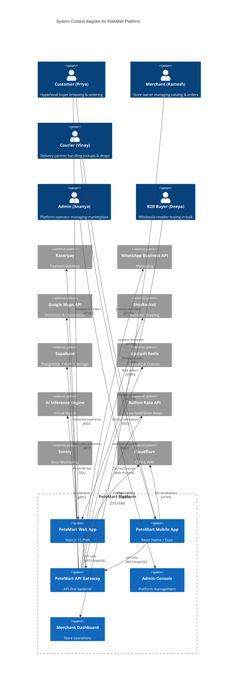

---

## 2. Container Diagram (C4 Level 2)

```mermaid
C4Container
    title Container diagram for PeteMart Platform

    Person(customer, "Customer", "Hyperlocal buyer")
    Person(merchant, "Merchant", "Store owner")

    System_Boundary(petemart, "PeteMart Platform") {
        Container(webapp, "Web Application", "Next.js 15 + shadcn/ui", "SSR PWA for desktop & mobile web")
        Container(mobileapp, "Mobile Application", "React Native / Expo", "iOS & Android native apps")
        Container(apigateway, "API Gateway", "Next.js API Routes + Express", "Rate-limiting, auth, routing")
        
        Container_Boundary(services, "Microservices") {
            Container(authsvc, "Auth Service", "Node.js", "OTP auth, JWT, RBAC")
            Container(ordersvc, "Order Service", "Node.js", "Cart, checkout, lifecycle")
            Container(merchantsvc, "Merchant Service", "Node.js", "Catalog, inventory, microsite")
            Container(paymentsvc, "Payment Service", "Node.js", "Razorpay integration, settlement")
            Container(deliverysvc, "Delivery Service", "Node.js", "Zone calc, route optimization")
            Container(notifsvc, "Notification Service", "Node.js", "Push, SMS, WhatsApp, email")
            Container(aisvc, "AI Service", "Python FastAPI", "Virtual try-on, recommendations")
            Container(analyticsvc, "Analytics Service", "Node.js", "CDP, reports, dashboards")
        }

        ContainerDb(postgres, "Primary Database", "PostgreSQL (Supabase/Aurora)", "Orders, merchants, products, users")
        ContainerDb(redis, "Redis Cache", "Upstash / ElastiCache", "Session, cart, rate limits, queues")
        ContainerDb(storage, "Object Storage", "Supabase Storage / S3", "Product images, store photos")
        ContainerDb(search, "Search Index", "MeiliSearch / Typesense", "Full-text product search")
    }

    System_Ext(razorpay, "Razorpay", "Payment Gateway")
    System_Ext(whatsapp, "WhatsApp Cloud API", "Meta")
    System_Ext(maps, "Google Maps", "Geolocation")
    System_Ext(ship, "ShipRocket", "National logistics")
    System_Ext(bullion, "Bullion API", "Gold/Silver rates")

    Rel(customer, webapp, "HTTPS", "Browse, Order")
    Rel(customer, mobileapp, "HTTPS", "Browse, Order")
    Rel(merchant, webapp, "HTTPS", "Dashboard")
    
    Rel(webapp, apigateway, "REST/WS", "All API calls")
    Rel(mobileapp, apigateway, "REST/WS", "All API calls")
    
    Rel(apigateway, authsvc, "Internal", "Auth & RBAC")
    Rel(apigateway, ordersvc, "Internal", "Orders & cart")
    Rel(apigateway, merchantsvc, "Internal", "Merchants & products")
    Rel(apigateway, paymentsvc, "Internal", "Payments")
    Rel(apigateway, deliverysvc, "Internal", "Delivery")
    Rel(apigateway, notifsvc, "Internal", "Notifications")
    Rel(apigateway, aisvc, "Internal", "AI features")
    Rel(apigateway, analyticsvc, "Internal", "Analytics")

    Rel(authsvc, postgres, "SQL", "Users, roles")
    Rel(ordersvc, postgres, "SQL", "Orders, cart")
    Rel(ordersvc, redis, "Redis", "Cart cache")
    Rel(merchantsvc, postgres, "SQL", "Products, merchants")
    Rel(merchantsvc, search, "HTTP", "Search indexing")
    Rel(paymentsvc, postgres, "SQL", "Transactions")
    Rel(paymentsvc, razorpay, "REST", "Payment processing")
    Rel(deliverysvc, postgres, "SQL", "Zones, routes")
    Rel(deliverysvc, maps, "REST", "Geocoding")
    Rel(notifsvc, whatsapp, "REST", "Notifications")
    Rel(aisvc, postgres, "SQL", "Model metadata")
    Rel(analyticsvc, postgres, "SQL", "Analytics data")

    Rel(merchantsvc, storage, "S3 API", "Images")
    Rel(webapp, storage, "CDN", "Static assets")
```

---

## 3. Data Flow Diagram — Multi-Store Checkout

```mermaid
flowchart TD
    A[Customer Adds Items] --> B{Cart Contains Multiple Merchants?}
    B -->|Yes| C[Group Items by Merchant]
    B -->|No| D[Single Merchant Checkout]
    C --> E[Calculate Per-Merchant Subtotal]
    E --> F[Determine Max Zone Base Rate]
    F --> G[Apply Consolidation Surcharge: ₹25 × (N-1)]
    G --> H[Apply Weight Surcharges]
    H --> I[Calculate Total: Base + Consolidation + Weight + PG Fee]
    I --> J[Present Consolidated Order Summary]
    J --> K[Payment via Razorpay]
    K --> L{Single Payment Success?}
    L -->|Yes| M[Create Per-Merchant Orders]
    M --> N[Notify All Merchants]
    N --> O[Assign Courier: Multi-Stop Route]
    O --> P[Courier Picks Up: Merchant A → B → C]
    P --> Q[Micro-Hub Consolidation]
    Q --> R[Single Drop Delivery to Customer]
    L -->|No| S[Payment Failed - Retry]

    style A fill:#4F46E5,color:#fff
    style I fill:#7C3AED,color:#fff
    style K fill:#059669,color:#fff
    style R fill:#DC2626,color:#fff
```

---

## 4. Deployment Diagram — Production

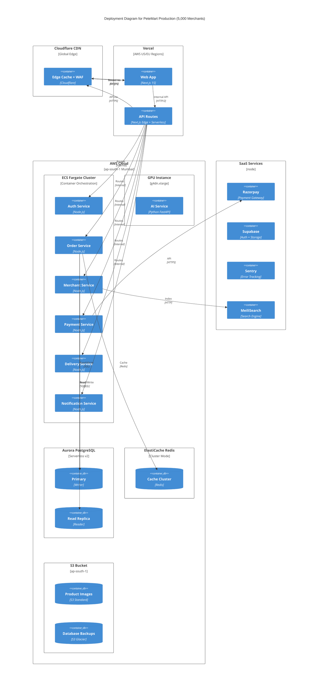

---

## 5. POC Architecture Diagram

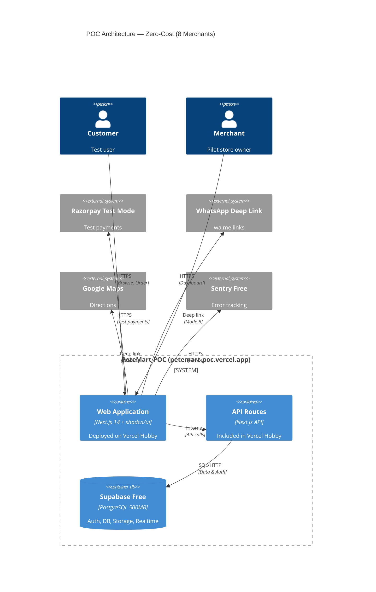

---

## 6. CI/CD Pipeline Diagram

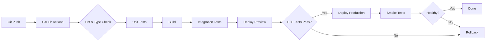

---

## 7. Payment Flow Sequence Diagram

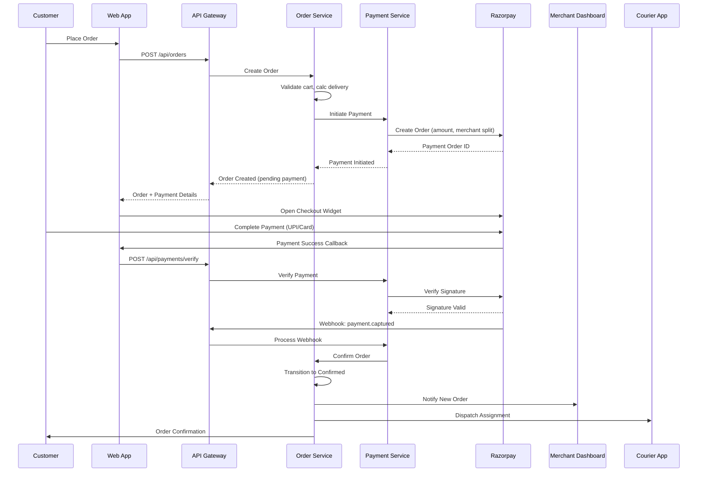

---

## 8. Entity Relationship Diagram

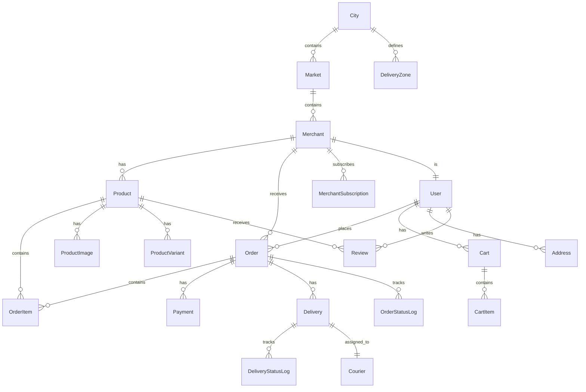

---

## 9. Multi-City Expansion Diagram

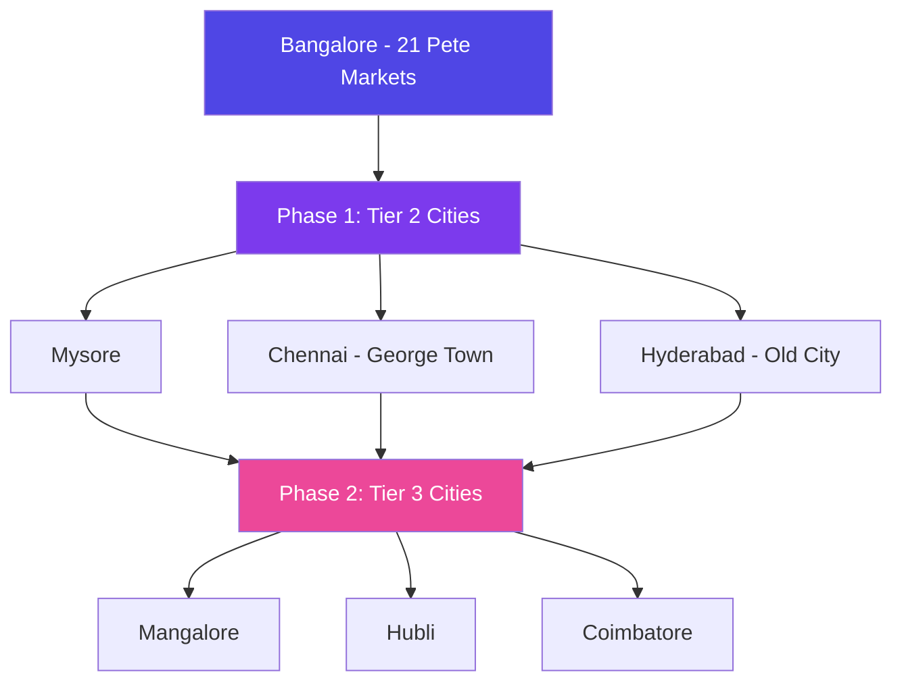

---

## 10. AI Virtual Try-On Pipeline

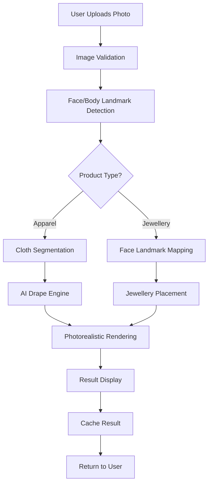

---

## 11. WhatsApp Integration Flow

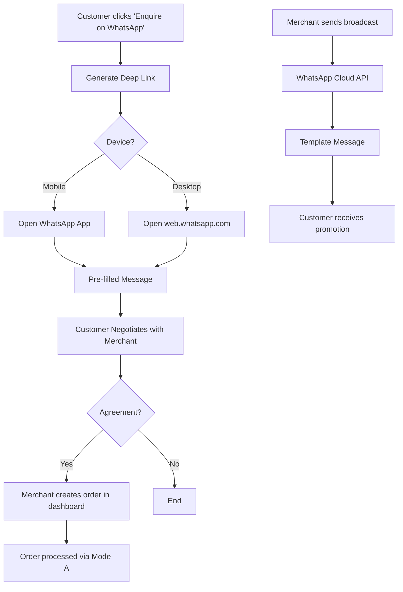

---

## 12. Search Architecture

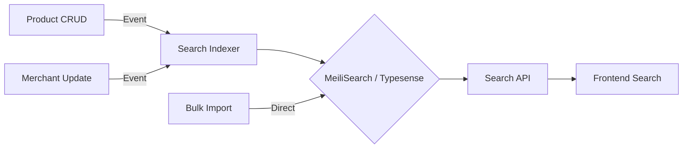

---

*End of Diagrams Document*
