# PeteMart — Enterprise Production Architecture Blueprint

**Document Version:** 1.0  
**Author:** Agent 03 — Senior Enterprise Solutions Architect  
**Date:** 2026-06-15  
**Status:** Final  
**Derived From:** PRD v2.0 (111 Requirements), Idea Proposal v1.3, Business Revenue Model v1.4, Epic Story Map v1.0, Workflow Maps v1.0, MVP Scope v1.0

---

## Table of Contents

1. [Executive Summary](#1-executive-summary)
2. [Architecture Principles & Constraints](#2-architecture-principles--constraints)
3. [System Context (C4 Level 1)](#3-system-context-c4-level-1)
4. [Container Architecture (C4 Level 2)](#4-container-architecture-c4-level-2)
5. [Component Architecture (C4 Level 3)](#5-component-architecture-c4-level-3)
6. [Technology Stack](#6-technology-stack)
7. [API Strategy & Design](#7-api-strategy--design)
8. [Data Architecture](#8-data-architecture)
9. [Security Framework](#9-security-framework)
10. [Infrastructure & Deployment](#10-infrastructure--deployment)
11. [Scaling Strategy (0 → 5,000+ Merchants)](#11-scaling-strategy-0--5000-merchants)
12. [AI/ML Architecture](#12-aiml-architecture)
13. [Multi-Channel Strategy](#13-multi-channel-strategy)
14. [Testing Architecture](#14-testing-architecture)
15. [Monitoring & Observability](#15-monitoring--observability)
16. [Disaster Recovery & Business Continuity](#16-disaster-recovery--business-continuity)
17. [Cost Model — Production](#17-cost-model--production)
18. [Implementation Roadmap](#18-implementation-roadmap)

---

## 1. Executive Summary

PeteMart is a hyperlocal digital commerce marketplace targeting **5,000+ traditional physical merchants** across **21 historic Pete markets of Old Bangalore**, expanding to multiple Indian cities. The platform supports **three interaction modes** (Direct Purchase A, WhatsApp Enquiry B, Visit Store C), **multi-store cart consolidation**, **zone-based hyperlocal delivery**, and **AI-powered features** (virtual try-on, live bullion rates).

This architecture blueprint defines a **production-grade, cloud-native, API-first system** designed for:

- **Scale**: 5,000+ merchants → 50,000+ → multi-city (500K+ users)
- **Reach**: Web (Next.js PWA) + Mobile (React Native/Expo) + WhatsApp
- **Reliability**: 99.9% uptime, <500ms API P95, multi-region DR
- **Cost Efficiency**: Tiered infrastructure scaling with auto-scaling
- **Security**: RBAC, RLS, GDPR/DPDP compliance, PCI-DSS via Razorpay
- **AI Features**: Virtual try-on, bullion rate integration, analytics CDP

### Key Architectural Decisions

| Decision | Choice | Rationale |
|----------|--------|-----------|
| **Frontend** | Next.js 15 (Web) + React Native/Expo (Mobile) | Shared TypeScript types, SSR for SEO, code reuse |
| **Backend** | Next.js API Routes + Node.js Microservices | Unified API layer, gradual extraction to microservices |
| **Database** | Supabase (PostgreSQL) → Aurora PostgreSQL | Start free, scale with pgBouncer + read replicas |
| **Cache** | Redis (Upstash) | Sub-millisecond cart/price lookups, session store |
| **Queue** | BullMQ + Redis | Order processing, notification dispatch, async tasks |
| **AI** | Replicate + Hugging Face + Custom ONNX | Cost-effective inference, GPU auto-scaling |
| **Payments** | Razorpay | Indian market leader, subaccount routing, escrow |
| **Hosting** | Vercel → AWS ECS Fargate | Serverless start, containerized scale |
| **CDN** | Cloudflare | Global edge caching, DDoS protection, WAF |

---

## 2. Architecture Principles & Constraints

### Principles

1. **API-First Design**: All functionality exposed via REST/GraphQL APIs. Frontends are API consumers.
2. **Event-Driven**: Async communication via message queues for order processing, notifications, analytics.
3. **Tenant Isolation**: Row-Level Security (RLS) in PostgreSQL ensures merchant data isolation.
4. **Offline Resilience**: Mobile apps support offline-first with local SQLite + background sync.
5. **Progressive Enhancement**: Core functionality works without JavaScript. PWA for mobile web.
6. **Cost-Aware Scaling**: Auto-scale based on traffic patterns. Use serverless where possible.
7. **Security by Design**: Zero-trust network, encryption at rest/transit, regular penetration testing.

### Constraints

| Constraint | Detail |
|------------|--------|
| **Regulatory** | DPDP Act 2023 compliance, PCI-DSS via Razorpay, GST invoice mandate |
| **Merchant Tech Literacy** | Low-moderate; UI must support Kannada/Hindi, WhatsApp-first workflows |
| **Network** | Variable mobile connectivity in Pete lanes; offline resilience critical |
| **Payment** | 2% PG fee; Razorpay subaccount routing for merchant settlements |
| **Delivery** | Zone-based (0-3km, 3-7km, 7+km), consolidation surcharge ₹25/store |
| **Budget** | Zero-cost POC (₹0/mo), production scaling to ~₹4.2L/mo at 5K merchants |

---

## 3. System Context (C4 Level 1)

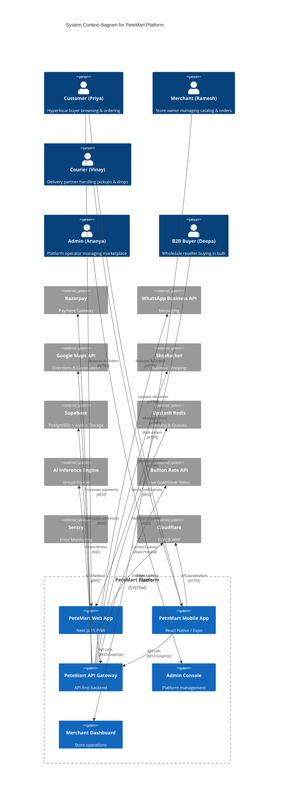

---

## 4. Container Architecture (C4 Level 2)

```mermaid
C4Container
    title Container diagram for PeteMart Platform

    Person(customer, "Customer", "Hyperlocal buyer")
    Person(merchant, "Merchant", "Store owner")

    System_Boundary(petemart, "PeteMart Platform") {
        Container(webapp, "Web Application", "Next.js 15 + shadcn/ui", "SSR PWA for desktop & mobile web")
        Container(mobileapp, "Mobile Application", "React Native / Expo", "iOS & Android native apps")
        Container(apigateway, "API Gateway", "Next.js API Routes + Express", "Rate-limiting, auth, routing")
        
        Container_Boundary(services, "Microservices") {
            Container(authsvc, "Auth Service", "Node.js", "OTP auth, JWT, RBAC")
            Container(ordersvc, "Order Service", "Node.js", "Cart, checkout, lifecycle")
            Container(merchantsvc, "Merchant Service", "Node.js", "Catalog, inventory, microsite")
            Container(paymentsvc, "Payment Service", "Node.js", "Razorpay integration, settlement")
            Container(deliverysvc, "Delivery Service", "Node.js", "Zone calc, route optimization")
            Container(notifsvc, "Notification Service", "Node.js", "Push, SMS, WhatsApp, email")
            Container(aisvc, "AI Service", "Python FastAPI", "Virtual try-on, recommendations")
            Container(analyticsvc, "Analytics Service", "Node.js", "CDP, reports, dashboards")
        }

        ContainerDb(postgres, "Primary Database", "PostgreSQL (Supabase/Aurora)", "Orders, merchants, products, users")
        ContainerDb(redis, "Redis Cache", "Upstash / ElastiCache", "Session, cart, rate limits, queues")
        ContainerDb(storage, "Object Storage", "Supabase Storage / S3", "Product images, store photos")
        ContainerDb(search, "Search Index", "MeiliSearch / Typesense", "Full-text product search")
    }

    System_Ext(razorpay, "Razorpay", "Payment Gateway")
    System_Ext(whatsapp, "WhatsApp Cloud API", "Meta")
    System_Ext(maps, "Google Maps", "Geolocation")
    System_Ext(ship, "ShipRocket", "National logistics")
    System_Ext(bullion, "Bullion API", "Gold/Silver rates")

    Rel(customer, webapp, "HTTPS", "Browse, Order")
    Rel(customer, mobileapp, "HTTPS", "Browse, Order")
    Rel(merchant, webapp, "HTTPS", "Dashboard")
    
    Rel(webapp, apigateway, "REST/WS", "All API calls")
    Rel(mobileapp, apigateway, "REST/WS", "All API calls")
    
    Rel(apigateway, authsvc, "Internal", "Auth & RBAC")
    Rel(apigateway, ordersvc, "Internal", "Orders & cart")
    Rel(apigateway, merchantsvc, "Internal", "Merchants & products")
    Rel(apigateway, paymentsvc, "Internal", "Payments")
    Rel(apigateway, deliverysvc, "Internal", "Delivery")
    Rel(apigateway, notifsvc, "Internal", "Notifications")
    Rel(apigateway, aisvc, "Internal", "AI features")
    Rel(apigateway, analyticsvc, "Internal", "Analytics")

    Rel(authsvc, postgres, "SQL", "Users, roles")
    Rel(ordersvc, postgres, "SQL", "Orders, cart")
    Rel(ordersvc, redis, "Redis", "Cart cache")
    Rel(merchantsvc, postgres, "SQL", "Products, merchants")
    Rel(merchantsvc, search, "HTTP", "Search indexing")
    Rel(paymentsvc, postgres, "SQL", "Transactions")
    Rel(paymentsvc, razorpay, "REST", "Payment processing")
    Rel(deliverysvc, postgres, "SQL", "Zones, routes")
    Rel(deliverysvc, maps, "REST", "Geocoding")
    Rel(notifsvc, whatsapp, "REST", "Notifications")
    Rel(aisvc, postgres, "SQL", "Model metadata")
    Rel(analyticsvc, postgres, "SQL", "Analytics data")

    Rel(merchantsvc, storage, "S3 API", "Images")
    Rel(webapp, storage, "CDN", "Static assets")
```

---

## 5. Component Architecture (C4 Level 3)

### 5.1 Order Service Components

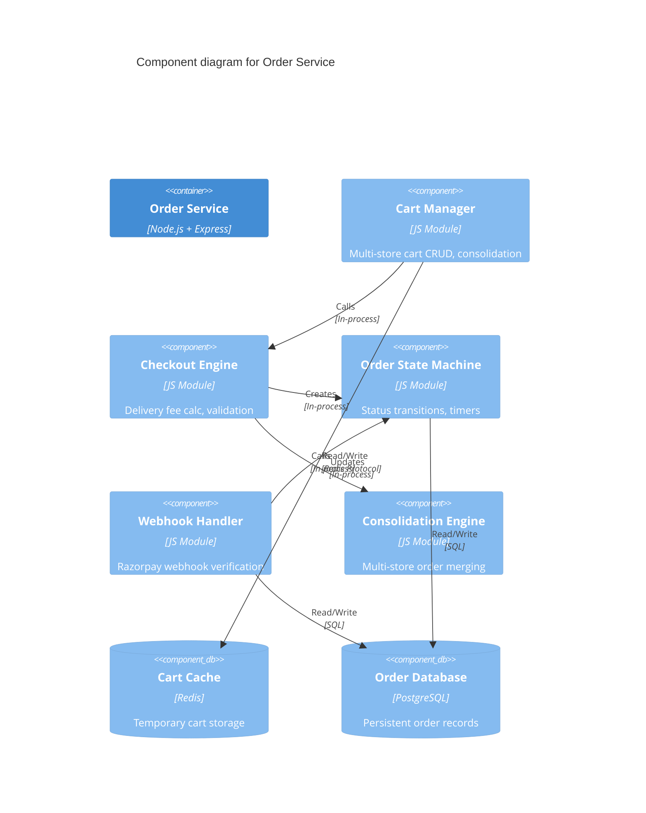

### 5.2 Payment Flow (Sequence)

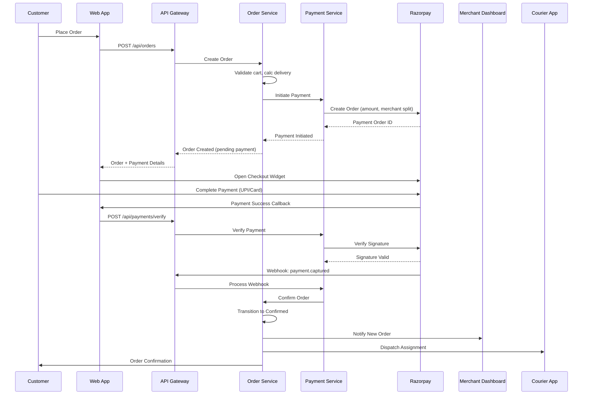

### 5.3 Multi-Store Consolidation Data Flow

```mermaid
flowchart TD
    A[Customer Adds Items] --> B{Cart Contains Multiple Merchants?}
    B -->|Yes| C[Group Items by Merchant]
    B -->|No| D[Single Merchant Checkout]
    C --> E[Calculate Per-Merchant Subtotal]
    E --> F[Determine Max Zone Base Rate]
    F --> G[Apply Consolidation Surcharge: ₹25 × (N-1)]
    G --> H[Apply Weight Surcharges]
    H --> I[Calculate Total: Base + Consolidation + Weight + PG Fee]
    I --> J[Present Consolidated Order Summary]
    J --> K[Payment via Razorpay]
    K --> L{Single Payment Success?}
    L -->|Yes| M[Create Per-Merchant Orders]
    M --> N[Notify All Merchants]
    N --> O[Assign Courier: Multi-Stop Route]
    O --> P[Courier Picks Up: Merchant A → B → C]
    P --> Q[Micro-Hub Consolidation]
    Q --> R[Single Drop Delivery to Customer]
    L -->|No| S[Payment Failed - Retry]
```

---

## 6. Technology Stack

### 6.1 Frontend

| Layer | Technology | Version | Purpose |
|-------|-----------|---------|---------|
| **Web Framework** | Next.js | 15.x | SSR, PWA, SEO |
| **UI Library** | shadcn/ui + Radix | Latest | Accessible component system |
| **Styling** | Tailwind CSS | 4.x | Utility-first styling |
| **State Management** | Zustand + TanStack Query | Latest | Client state + server cache |
| **Forms** | React Hook Form + Zod | Latest | Validation |
| **i18n** | next-intl | Latest | Multi-language (Kannada, Hindi, English) |
| **Animation** | Framer Motion | Latest | UI animations |
| **PWA** | next-pwa | Latest | Offline support |
| **Mobile** | React Native + Expo | 52+ | iOS & Android |
| **Expo Router** | File-based routing | Latest | Mobile navigation |

### 6.2 Backend

| Layer | Technology | Purpose |
|-------|-----------|---------|
| **API Framework** | Next.js API Routes → Express/Fastify | Gradual migration |
| **Auth** | Supabase Auth + JWT + OTP | Phone-based auth |
| **Database ORM** | Drizzle ORM | Type-safe SQL |
| **Message Queue** | BullMQ + Redis | Async processing |
| **Validation** | Zod | Runtime type safety |
| **Caching** | Upstash Redis / ElastiCache | Sub-ms lookups |
| **Search** | MeiliSearch / Typesense | Full-text search |
| **File Storage** | Supabase Storage → S3 | Image hosting |

### 6.3 AI/ML

| Feature | Technology | Hosting |
|---------|-----------|---------|
| **Virtual Try-On (Apparel)** | Replicate API / Custom ONNX | GPU-backed serverless |
| **Virtual Try-On (Jewellery)** | Face landmark detection + rendering | ONNX Runtime |
| **Recommendations** | Collaborative filtering + embeddings | PostgreSQL pgvector |
| **Analytics CDP** | RudderStack + ClickHouse | Event pipeline |
| **Image Optimization** | Cloudflare Images / Sharp | Edge processing |

### 6.4 Infrastructure

| Service | POC | Production (500 merchants) | Production (5,000 merchants) |
|---------|-----|---------------------------|------------------------------|
| **Hosting** | Vercel Hobby | Vercel Pro + AWS ECS | AWS ECS Fargate + CloudFront |
| **Database** | Supabase Free (500MB) | Supabase Pro (8GB) | Aurora PostgreSQL (Serverless v2) |
| **Cache** | In-memory (Next.js) | Upstash Redis (256MB) | ElastiCache Redis (5GB) |
| **Search** | PostgreSQL LIKE | MeiliSearch (1GB RAM) | Typesense Cluster (8GB) |
| **Storage** | Supabase Storage (1GB) | Supabase Storage (100GB) | S3 + CloudFront CDN |
| **CDN** | Vercel Edge | Cloudflare Pro | Cloudflare Enterprise |
| **Monitoring** | Sentry Free | Sentry Team | Datadog + Sentry Business |
| **CI/CD** | GitHub Actions | GitHub Actions + Vercel | GitHub Actions + AWS CodePipeline |

---

## 7. API Strategy & Design

### 7.1 API Architecture

```
┌─────────────────────────────────────────────────────────────┐
│                    API GATEWAY (Next.js/Express)             │
│  ┌──────────┐  ┌──────────┐  ┌──────────┐  ┌─────────────┐ │
│  │ Rate     │  │ Auth     │  │ Logging  │  │ Request     │ │
│  │ Limiter  │  │ Middleware│  │ Middleware│  │ Validation  │ │
│  └──────────┘  └──────────┘  └──────────┘  └─────────────┘ │
├─────────────────────────────────────────────────────────────┤
│  ┌──────────┐  ┌──────────┐  ┌──────────┐  ┌─────────────┐ │
│  │ REST     │  │ GraphQL  │  │ WebSocket│  │ Webhook     │ │
│  │ Endpoints│  │ (Analytics)│  │ (Tracking)│  │ Receivers   │ │
│  └──────────┘  └──────────┘  └──────────┘  └─────────────┘ │
└─────────────────────────────────────────────────────────────┘
```

### 7.2 API Endpoints

#### Public Endpoints (No Auth)

| Method | Endpoint | Description | Rate Limit |
|--------|----------|-------------|------------|
| GET | `/api/markets` | List all Pete markets | 100/min |
| GET | `/api/markets/:slug` | Market details with merchants | 100/min |
| GET | `/api/merchants/:slug` | Merchant microsite data | 100/min |
| GET | `/api/products` | Search/filter products | 200/min |
| GET | `/api/products/:id` | Product details | 200/min |
| GET | `/api/bullion/rates` | Live gold/silver rates | 60/min |
| POST | `/api/auth/otp/send` | Send OTP | 5/min per phone |
| POST | `/api/auth/otp/verify` | Verify OTP | 10/min per phone |

#### Customer Endpoints (Auth Required)

| Method | Endpoint | Description | Rate Limit |
|--------|----------|-------------|------------|
| GET | `/api/cart` | Get current cart | 60/min |
| POST | `/api/cart/items` | Add to cart | 30/min |
| PUT | `/api/cart/items/:id` | Update cart item | 30/min |
| DELETE | `/api/cart/items/:id` | Remove from cart | 30/min |
| POST | `/api/orders` | Place order | 10/min |
| GET | `/api/orders` | Order history | 30/min |
| GET | `/api/orders/:id` | Order details | 30/min |
| POST | `/api/payments/verify` | Verify payment | 10/min |
| GET | `/api/tracking/:id` | Live tracking | 30/min |

#### Merchant Endpoints (Merchant Auth)

| Method | Endpoint | Description | Rate Limit |
|--------|----------|-------------|------------|
| GET | `/api/merchant/dashboard` | Dashboard summary | 30/min |
| GET | `/api/merchant/products` | Product list | 60/min |
| POST | `/api/merchant/products` | Create product | 20/min |
| PUT | `/api/merchant/products/:id` | Update product | 20/min |
| DELETE | `/api/merchant/products/:id` | Delete product | 10/min |
| POST | `/api/merchant/products/bulk` | Bulk CSV upload | 5/min |
| GET | `/api/merchant/orders` | Order list | 30/min |
| PUT | `/api/merchant/orders/:id/status` | Update order status | 30/min |
| GET | `/api/merchant/analytics` | Sales analytics | 20/min |
| GET | `/api/merchant/payouts` | Payout history | 20/min |

#### Admin Endpoints (Admin Auth)

| Method | Endpoint | Description | Rate Limit |
|--------|----------|-------------|------------|
| GET | `/api/admin/dashboard` | Platform overview | 20/min |
| GET | `/api/admin/merchants` | Merchant list | 30/min |
| PUT | `/api/admin/merchants/:id/approve` | Approve merchant | 20/min |
| PUT | `/api/admin/merchants/:id/suspend` | Suspend merchant | 10/min |
| GET | `/api/admin/config` | Platform config | 20/min |
| PUT | `/api/admin/config` | Update config | 10/min |
| GET | `/api/admin/feature-flags` | Feature flags | 20/min |
| PUT | `/api/admin/feature-flags` | Toggle flag | 10/min |
| GET | `/api/admin/reports` | Revenue reports | 10/min |

### 7.3 API Response Format

```json
{
  "success": true,
  "data": { ... },
  "meta": {
    "page": 1,
    "per_page": 20,
    "total": 156,
    "total_pages": 8
  },
  "error": null
}
```

### 7.4 Error Response Format

```json
{
  "success": false,
  "data": null,
  "error": {
    "code": "VALIDATION_ERROR",
    "message": "Invalid product ID format",
    "details": [
      { "field": "product_id", "message": "Must be a valid UUID" }
    ]
  }
}
```

### 7.5 Webhook Events

| Event | Source | Destination | Description |
|-------|--------|-------------|-------------|
| `payment.captured` | Razorpay | API Gateway | Payment successful |
| `payment.failed` | Razorpay | API Gateway | Payment failed |
| `order.created` | Order Service | Notification Service | New order alert |
| `order.status_changed` | Order Service | All consumers | Status transition |
| `merchant.registered` | Auth Service | Admin Service | New merchant signup |
| `delivery.assigned` | Delivery Service | Courier App | Courier assigned |
| `delivery.status_update` | Courier App | Order Service | GPS + status update |

---

## 8. Data Architecture

### 8.1 Entity Relationship (Core)

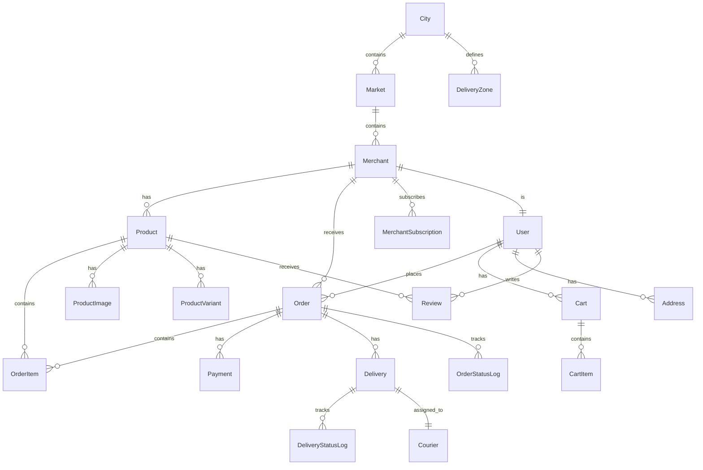

### 8.2 Core Database Schema

```sql
-- Users & Auth
CREATE TABLE users (
    id UUID PRIMARY KEY DEFAULT gen_random_uuid(),
    phone VARCHAR(15) UNIQUE NOT NULL,
    email VARCHAR(255),
    name VARCHAR(255),
    role VARCHAR(20) NOT NULL DEFAULT 'customer' 
        CHECK (role IN ('customer', 'merchant', 'admin', 'courier')),
    avatar_url TEXT,
    preferred_language VARCHAR(10) DEFAULT 'en',
    is_active BOOLEAN DEFAULT true,
    created_at TIMESTAMPTZ DEFAULT NOW(),
    updated_at TIMESTAMPTZ DEFAULT NOW()
);

-- Merchants
CREATE TABLE merchants (
    id UUID PRIMARY KEY DEFAULT gen_random_uuid(),
    user_id UUID REFERENCES users(id) UNIQUE NOT NULL,
    business_name VARCHAR(255) NOT NULL,
    business_slug VARCHAR(255) UNIQUE NOT NULL,
    market_id UUID REFERENCES markets(id),
    category VARCHAR(100),
    description TEXT,
    gstin VARCHAR(15),
    whatsapp_number VARCHAR(15),
    store_logo_url TEXT,
    store_banner_url TEXT,
    brand_color VARCHAR(7) DEFAULT '#4F46E5',
    latitude DECIMAL(10, 7),
    longitude DECIMAL(10, 7),
    address_line1 TEXT,
    address_line2 TEXT,
    city VARCHAR(100) DEFAULT 'Bangalore',
    pincode VARCHAR(10),
    is_verified BOOLEAN DEFAULT false,
    is_active BOOLEAN DEFAULT true,
    modes_enabled JSONB DEFAULT '["mode_a", "mode_b", "mode_c"]',
    subscription_tier VARCHAR(20) DEFAULT 'starter'
        CHECK (subscription_tier IN ('starter', 'growth', 'premium')),
    subscription_expires_at TIMESTAMPTZ,
    created_at TIMESTAMPTZ DEFAULT NOW(),
    updated_at TIMESTAMPTZ DEFAULT NOW()
);

-- Products
CREATE TABLE products (
    id UUID PRIMARY KEY DEFAULT gen_random_uuid(),
    merchant_id UUID REFERENCES merchants(id) NOT NULL,
    name VARCHAR(255) NOT NULL,
    description TEXT,
    hsn_code VARCHAR(8),
    category VARCHAR(100),
    retail_price DECIMAL(12, 2) NOT NULL,
    wholesale_price DECIMAL(12, 2),
    moq INTEGER DEFAULT 1,
    stock_quantity INTEGER DEFAULT 0,
    mode_a_enabled BOOLEAN DEFAULT false,
    mode_b_enabled BOOLEAN DEFAULT true,
    mode_c_enabled BOOLEAN DEFAULT true,
    is_published BOOLEAN DEFAULT false,
    weight_grams DECIMAL(10, 2),
    is_b2b_enabled BOOLEAN DEFAULT false,
    created_at TIMESTAMPTZ DEFAULT NOW(),
    updated_at TIMESTAMPTZ DEFAULT NOW()
);

-- Orders
CREATE TABLE orders (
    id UUID PRIMARY KEY DEFAULT gen_random_uuid(),
    user_id UUID REFERENCES users(id) NOT NULL,
    order_number VARCHAR(20) UNIQUE NOT NULL,
    status VARCHAR(30) DEFAULT 'pending'
        CHECK (status IN ('pending', 'confirmed', 'packing', 'picked_up', 
                          'in_transit', 'delivered', 'cancelled', 'refunded')),
    subtotal DECIMAL(12, 2) NOT NULL,
    delivery_fee DECIMAL(10, 2) DEFAULT 0,
    consolidation_surcharge DECIMAL(10, 2) DEFAULT 0,
    weight_surcharge DECIMAL(10, 2) DEFAULT 0,
    pg_fee DECIMAL(10, 2) DEFAULT 0,
    total_amount DECIMAL(12, 2) NOT NULL,
    commission_type VARCHAR(5) CHECK (commission_type IN ('b2c', 'b2b')),
    delivery_address_id UUID REFERENCES addresses(id),
    is_multi_merchant BOOLEAN DEFAULT false,
    merchant_count INTEGER DEFAULT 1,
    notes TEXT,
    created_at TIMESTAMPTZ DEFAULT NOW(),
    updated_at TIMESTAMPTZ DEFAULT NOW()
);

-- Order Items (supports multi-merchant)
CREATE TABLE order_items (
    id UUID PRIMARY KEY DEFAULT gen_random_uuid(),
    order_id UUID REFERENCES orders(id) NOT NULL,
    merchant_id UUID REFERENCES merchants(id) NOT NULL,
    product_id UUID REFERENCES products(id) NOT NULL,
    product_name VARCHAR(255) NOT NULL,
    quantity INTEGER NOT NULL,
    unit_price DECIMAL(12, 2) NOT NULL,
    total_price DECIMAL(12, 2) NOT NULL,
    variant_data JSONB,
    created_at TIMESTAMPTZ DEFAULT NOW()
);

-- Payments
CREATE TABLE payments (
    id UUID PRIMARY KEY DEFAULT gen_random_uuid(),
    order_id UUID REFERENCES orders(id) NOT NULL,
    razorpay_order_id VARCHAR(100),
    razorpay_payment_id VARCHAR(100),
    razorpay_signature VARCHAR(255),
    amount DECIMAL(12, 2) NOT NULL,
    currency VARCHAR(3) DEFAULT 'INR',
    status VARCHAR(20) DEFAULT 'initiated'
        CHECK (status IN ('initiated', 'processing', 'captured', 'failed', 'refunded')),
    payment_method VARCHAR(30),
    pg_fee DECIMAL(10, 2),
    created_at TIMESTAMPTZ DEFAULT NOW(),
    updated_at TIMESTAMPTZ DEFAULT NOW()
);

-- Delivery Zones
CREATE TABLE delivery_zones (
    id UUID PRIMARY KEY DEFAULT gen_random_uuid(),
    city_id UUID REFERENCES cities(id),
    zone_name VARCHAR(50) NOT NULL,
    min_distance_km DECIMAL(5, 2) NOT NULL,
    max_distance_km DECIMAL(5, 2) NOT NULL,
    retail_rate DECIMAL(10, 2) NOT NULL,
    wholesale_rate DECIMAL(10, 2) NOT NULL,
    courier_share_pct DECIMAL(5, 2) DEFAULT 85,
    platform_share_pct DECIMAL(5, 2) DEFAULT 15,
    is_active BOOLEAN DEFAULT true,
    created_at TIMESTAMPTZ DEFAULT NOW()
);

-- Feature Flags (Admin Configurable)
CREATE TABLE feature_flags (
    id UUID PRIMARY KEY DEFAULT gen_random_uuid(),
    flag_key VARCHAR(100) UNIQUE NOT NULL,
    flag_name VARCHAR(255) NOT NULL,
    description TEXT,
    is_enabled BOOLEAN DEFAULT false,
    enabled_for_roles JSONB DEFAULT '[]',
    enabled_for_merchant_ids JSONB DEFAULT '[]',
    percentage_rollout INTEGER DEFAULT 100,
    created_at TIMESTAMPTZ DEFAULT NOW(),
    updated_at TIMESTAMPTZ DEFAULT NOW()
);
```

### 8.3 Caching Strategy

| Cache Key Pattern | TTL | Storage | Purpose |
|-------------------|-----|---------|---------|
| `cart:{session_id}` | 24h | Redis | Guest cart |
| `cart:{user_id}` | 24h | Redis | User cart |
| `product:{id}` | 5min | Redis | Product details |
| `merchant:{slug}` | 5min | Redis | Merchant microsite |
| `market:{slug}` | 10min | Redis | Market page |
| `rates:bullion` | 30s | Redis | Live bullion rates |
| `session:{token}` | 7d | Redis | JWT session |
| `rate_limit:{ip}:{endpoint}` | 1min | Redis | Rate limiting |

### 8.4 Search Architecture

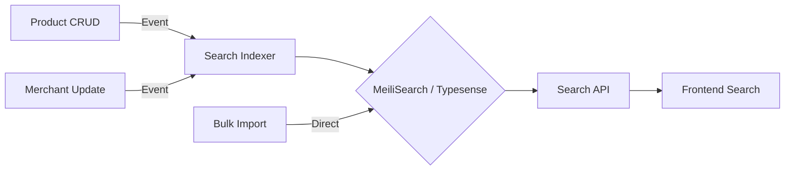

---

## 9. Security Framework

### 9.1 Authentication & Authorization

```
┌─────────────────────────────────────────────────────────┐
│                    AUTHENTICATION LAYER                   │
├─────────────────────────────────────────────────────────┤
│  ┌─────────────┐  ┌──────────────┐  ┌────────────────┐ │
│  │ Phone OTP   │  │ JWT Access   │  │ Refresh Token  │ │
│  │ (Supabase)  │  │ Token (15min)│  │ (7 days)       │ │
│  └─────────────┘  └──────────────┘  └────────────────┘ │
├─────────────────────────────────────────────────────────┤
│                    AUTHORIZATION LAYER                    │
├─────────────────────────────────────────────────────────┤
│  ┌─────────────┐  ┌──────────────┐  ┌────────────────┐ │
│  │ RBAC Roles  │  │ Row-Level    │  │ API Middleware │ │
│  │ cust/merch/ │  │ Security     │  │ Route Guards  │ │
│  │ admin/courier│  │ (PostgreSQL) │  │ (Next.js)     │ │
│  └─────────────┘  └──────────────┘  └────────────────┘ │
└─────────────────────────────────────────────────────────┘
```

### 9.2 Security Controls

| Control | Implementation | Detail |
|---------|---------------|--------|
| **OTP Rate Limiting** | Redis + Supabase | Max 3 OTP sends/hour per phone |
| **JWT Expiry** | 15min access + 7d refresh | Auto-rotate on refresh |
| **Passwordless** | Phone OTP only | No password storage risk |
| **RLS Policies** | PostgreSQL | Merchants see only their data |
| **API Rate Limiting** | Upstash Redis | Per-endpoint, per-IP, per-user |
| **CORS** | Whitelist origins | Only petemart.in domains |
| **Helmet.js** | HTTP headers | XSS, CSP, HSTS protection |
| **Input Validation** | Zod schemas | All API inputs validated |
| **SQL Injection** | Drizzle ORM | Parameterized queries |
| **Encryption at Rest** | PostgreSQL + S3 SSE | AES-256 |
| **Encryption in Transit** | TLS 1.3 | All traffic HTTPS |
| **Webhook Verification** | HMAC-SHA256 | Razorpay signature verify |
| **DDoS Protection** | Cloudflare WAF | Rate limiting + challenge |
| **Audit Logging** | `audit_logs` table | All admin actions logged |

### 9.3 RLS Policies Example

```sql
-- Merchants can only see their own products
CREATE POLICY merchant_products ON products
    FOR ALL
    USING (merchant_id = auth.uid());

-- Customers can see published products
CREATE POLICY customer_products ON products
    FOR SELECT
    USING (is_published = true);

-- Admin can see everything
CREATE POLICY admin_products ON products
    FOR ALL
    USING (auth.role() = 'admin');
```

---

## 10. Infrastructure & Deployment

### 10.1 Deployment Architecture

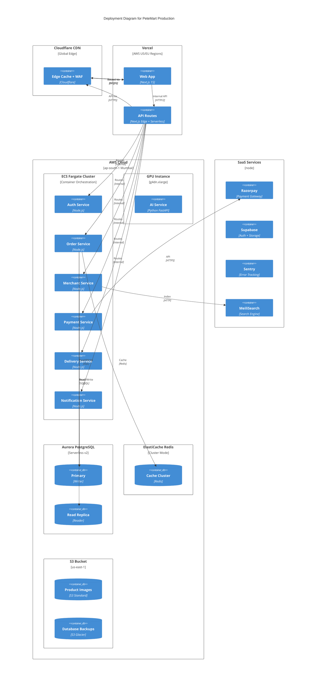

### 10.2 CI/CD Pipeline

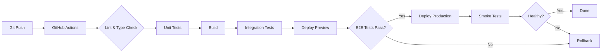

---

## 11. Scaling Strategy (0 → 5,000+ Merchants)

### 11.1 Scaling Thresholds

| Phase | Merchants | Daily Orders | DB Size | Infrastructure Cost/mo |
|-------|-----------|-------------|---------|----------------------|
| **POC** | 8 | ~20 | 10MB | ₹0 |
| **Launch** | 50 | ~150 | 100MB | ₹5,000 |
| **Growth** | 500 | ~2,500 | 2GB | ₹25,000 |
| **Scale** | 2,000 | ~12,000 | 10GB | ₹80,000 |
| **Enterprise** | 5,000+ | ~35,000 | 50GB+ | ₹4,20,000 |

### 11.2 Auto-Scaling Rules

| Service | Metric | Scale Out | Scale In | Min | Max |
|---------|--------|-----------|----------|-----|-----|
| **Web (Vercel)** | Requests/sec | >1000 rps | <200 rps | 0 | ∞ |
| **API (ECS)** | CPU > 70% | +2 tasks | -1 task | 2 | 20 |
| **Order Service** | Queue depth > 100 | +2 tasks | -1 task | 2 | 10 |
| **AI Service** | GPU util > 80% | +1 instance | -1 instance | 0 | 4 |
| **Database** | Connections > 80% | Add replica | Remove replica | 1 | 5 |
| **Redis** | Memory > 70% | Scale up node | Scale down | 1GB | 10GB |

### 11.3 Database Scaling Path

```
Phase 1 (POC):  Supabase Free (500MB, 2 connections)
     ↓
Phase 2 (50 merchants): Supabase Pro (8GB, 120 connections)
     ↓
Phase 3 (500 merchants): Supabase Team (16GB, pgBouncer)
     ↓
Phase 4 (2,000 merchants): Aurora Serverless v2 (ACU 8-64)
     ↓
Phase 5 (5,000+ merchants): Aurora Cluster (Writer + 3 Read Replicas + pgBouncer)
```

### 11.4 Multi-City Expansion

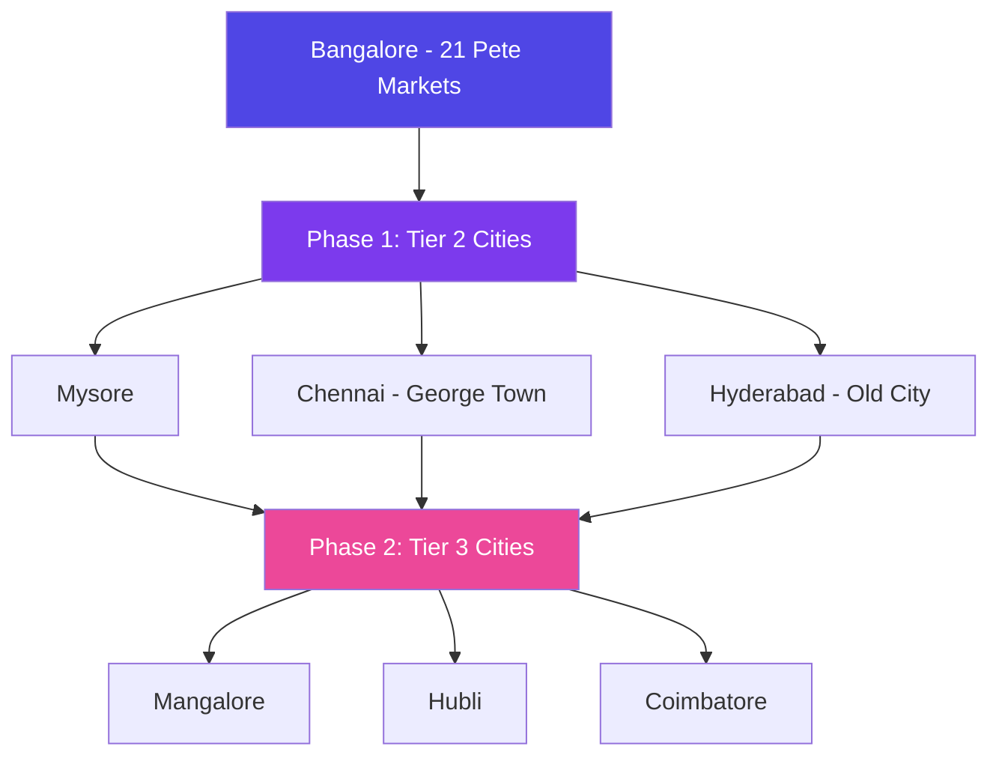

Each city expansion adds:
- New `cities` and `markets` records
- City-specific delivery zones
- Localized content (language, currency)
- City-specific admin operators

---

## 12. AI/ML Architecture

### 12.1 Virtual Try-On Pipeline

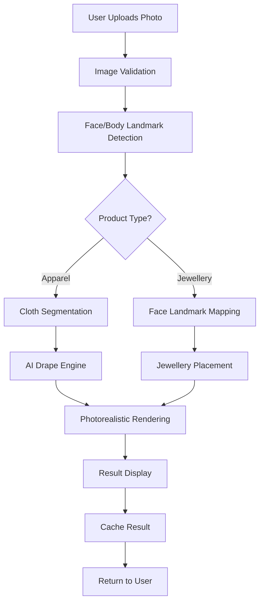

### 12.2 Recommendation Engine

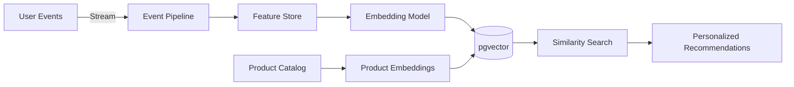

---

## 13. Multi-Channel Strategy

### 13.1 Channel Matrix

| Feature | Web App | Mobile App | WhatsApp | Admin |
|---------|---------|------------|----------|-------|
| Browse Products | ✅ SSR | ✅ Native | ❌ | ❌ |
| Search & Filter | ✅ | ✅ | ❌ | ❌ |
| Mode A (Buy) | ✅ | ✅ | ❌ | ❌ |
| Mode B (WhatsApp) | ✅ Deep Link | ✅ Deep Link | ✅ Chat | ❌ |
| Mode C (Visit) | ✅ Maps | ✅ Maps | ❌ | ❌ |
| Multi-Store Cart | ✅ | ✅ | ❌ | ❌ |
| Order Tracking | ✅ | ✅ + GPS | ✅ Status | ❌ |
| Payments | ✅ Razorpay | ✅ Razorpay | ❌ | ❌ |
| Merchant Dashboard | ✅ | ✅ | ❌ | ❌ |
| Admin Console | ✅ | ❌ | ❌ | ✅ |
| AI Try-On | ✅ WebRTC | ✅ Camera | ❌ | ❌ |
| Notifications | ✅ Push | ✅ Push | ✅ Template | ❌ |
| Reviews | ✅ | ✅ | ❌ | ✅ Moderate |

### 13.2 WhatsApp Integration

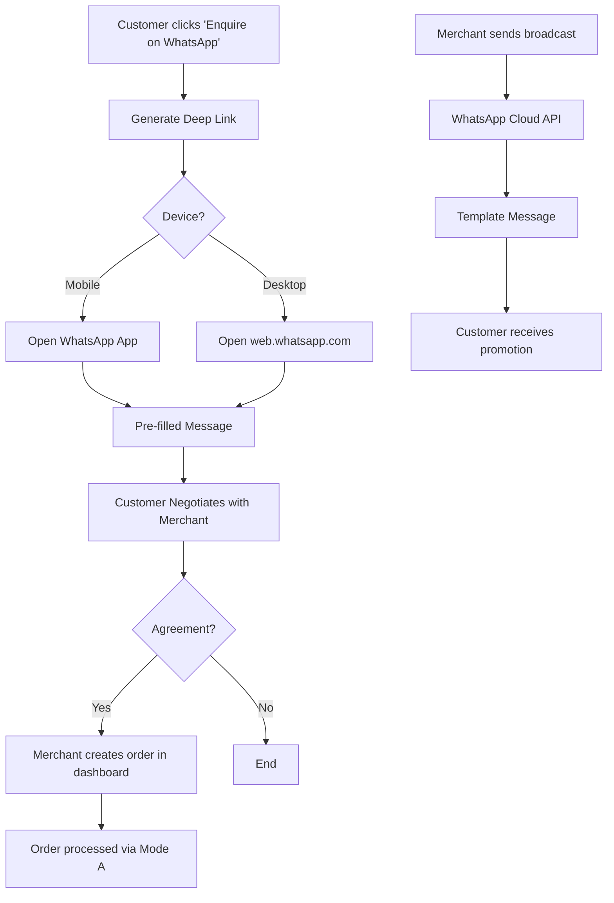

---

## 14. Testing Architecture

### 14.1 Testing Pyramid

```
            ╱╲
           ╱  ╲
          ╱ E2E╲           ← Playwright (critical paths)
         ╱ Tests╲
        ╱────────╲
       ╱          ╲
      ╱ Integration╲       ← Supertest + TestContainers
     ╱   Tests      ╲
    ╱────────────────╲
   ╱                  ╲
  ╱   Unit Tests       ╲    ← Vitest (components, utils, hooks)
 ╱                      ╲
╱────────────────────────╲
╱   Static Analysis       ╲  ← TypeScript, ESLint, SonarQube
╱──────────────────────────╲
```

### 14.2 Test Categories

| Category | Tool | Coverage Target | CI Stage |
|----------|------|----------------|----------|
| **Unit Tests** | Vitest + Testing Library | 85%+ lines | Pre-commit |
| **Component Tests** | Storybook + Testing Library | 80%+ stories | PR |
| **API Integration** | Supertest + TestContainers | 90%+ endpoints | PR |
| **E2E Tests** | Playwright | Critical paths 100% | Pre-deploy |
| **Visual Regression** | Percy/Chromatic | All components | PR |
| **Performance** | Lighthouse CI | LCP < 2.5s | Pre-deploy |
| **Security** | Snyk + Dependabot | No critical vulns | Weekly |
| **Accessibility** | axe-core + Stitch | WCAG 2.1 AA | PR |
| **Load Testing** | k6 | 1000 concurrent users | Pre-release |
| **Mutation Testing** | Stryker | 70%+ mutation score | Nightly |

### 14.3 Test Data Strategy

- **Seeds**: Realistic merchant/product data for 21 Pete markets
- **Factories**: Generated test data for unit/integration tests
- **Fixtures**: Pre-recorded API responses for deterministic tests
- **Test DB**: Isolated PostgreSQL instance (Supabase branch per PR)

---

## 15. Monitoring & Observability

### 15.1 Monitoring Stack

| Layer | Tool | Metrics |
|-------|------|---------|
| **APM** | Sentry Performance | P50/P95/P99 latency, error rates |
| **Logs** | Sentry + Vercel Logs | Structured JSON logs |
| **Metrics** | Vercel Analytics + Datadog | RPS, CPU, Memory, DB connections |
| **Uptime** | Better Uptime / Checkly | SLA monitoring, SSL expiry |
| **Alerts** | Sentry + PagerDuty | P0/P1 incident alerts |
| **Dashboards** | Datadog / Grafana | Real-time business + technical KPIs |

### 15.2 Key Metrics & Alerts

| Metric | Warning | Critical | Action |
|--------|---------|----------|--------|
| API P95 Latency | >500ms | >1s | Scale out, check DB |
| Error Rate | >1% | >5% | Rollback, page team |
| DB Connections | >70% | >90% | Add connection pool |
| Cart Checkout Success | <95% | <90% | Investigate payment flow |
| Order Placement Rate | <80% of expected | <60% | Alert on-call |
| Redis Memory | >70% | >85% | Evict or scale |
| Search Latency | >200ms | >500ms | Optimize index |

---

## 16. Disaster Recovery & Business Continuity

### 16.1 Backup Strategy

| Data | Frequency | Retention | Storage | RPO | RTO |
|------|-----------|-----------|---------|-----|-----|
| PostgreSQL DB | Hourly | 30 days | S3 Glacier | 1 hour | 2 hours |
| Product Images | Real-time | Forever | S3 + CloudFront | 0 | 5 min |
| Redis Cache | Snapshot/6h | 7 days | S3 | 6 hours | 30 min |
| Application Logs | Real-time | 90 days | S3 | 0 | 10 min |

### 16.2 Recovery Procedures

| Scenario | Procedure | RTO | RPO |
|----------|-----------|-----|-----|
| **Single instance failure** | Auto-restart via ECS | 30s | 0 |
| **AZ outage** | Multi-AZ failover (Aurora) | 5min | <1min |
| **Region outage** | Cross-region DR (secondary region) | 30min | 15min |
| **Data corruption** | Point-in-time recovery | 2h | 1h |
| **Full DB loss** | Restore from S3 backup | 4h | 1h |
| **Security breach** | Isolate + restore clean snapshot | 2h | 1h |

### 16.3 SLA Commitments

| Tier | Uptime | Support Response | Max Downtime/Month |
|-----|--------|-----------------|-------------------|
| **POC** | 99% (best effort) | 48h | 7.2h |
| **Launch** | 99.5% | 4h business | 3.6h |
| **Growth** | 99.9% | 1h | 43min |
| **Scale** | 99.95% | 30min | 22min |
| **Enterprise** | 99.99% | 15min | 4min |

---

## 17. Cost Model — Production

### 17.1 Monthly Infrastructure Cost (5,000 Merchants)

| Service | Plan | Monthly Cost (₹) | Notes |
|---------|------|-----------------|-------|
| **Frontend Hosting** | Vercel Enterprise | ₹1,50,000 | 5M+ requests/mo |
| **API Hosting** | AWS ECS Fargate (10 tasks) | ₹80,000 | 2 vCPU, 4GB each |
| **Database** | Aurora Serverless v2 | ₹60,000 | ACU 8-64, multi-AZ |
| **Cache** | ElastiCache Redis 5GB | ₹15,000 | Cluster mode |
| **Search** | Typesense Cloud (8GB) | ₹20,000 | Dedicated cluster |
| **Storage** | S3 + CloudFront | ₹10,000 | 500GB images |
| **CDN + WAF** | Cloudflare Enterprise | ₹25,000 | DDoS + WAF |
| **AI Inference** | Replicate + GPU | ₹30,000 | Virtual try-on |
| **Monitoring** | Datadog + Sentry | ₹15,000 | APM + logs |
| **CI/CD** | GitHub Actions | ₹5,000 | 10K min/mo |
| **Email/SMS** | Twilio + AWS SES | ₹10,000 | Notifications |
| **Total** | | **₹4,20,000** | ~$5,000/mo |

### 17.2 Annual Projection

| Year | Merchants | Monthly Cost | Annual Cost | Revenue (Est.) | Net |
|------|-----------|-------------|-------------|----------------|-----|
| Y1 | 500 | ₹25,000 | ₹3,00,000 | ₹60L | +₹57L |
| Y2 | 2,000 | ₹80,000 | ₹9,60,000 | ₹2.4Cr | +₹2.3Cr |
| Y3 | 5,000 | ₹4,20,000 | ₹50,40,000 | ₹6Cr | +₹5.5Cr |

---

## 18. Implementation Roadmap

### Phase 1: Foundation (Months 1-3)
- Core auth, merchant onboarding, product catalog
- Multi-store cart, checkout, Razorpay integration
- Mode A/B/C workflows
- Admin console basics
- **Target**: 50 merchants live

### Phase 2: Growth (Months 4-6)
- Mobile apps (Expo/React Native)
- Order tracking with GPS
- Reviews & ratings system
- Promo engine & loyalty
- Merchant analytics dashboard
- **Target**: 500 merchants live

### Phase 3: Scale (Months 7-9)
- AI Virtual Try-On (apparel + jewellery)
- Live bullion rates integration
- National shipping (ShipRocket)
- Multi-language support (Kannada, Hindi)
- White-label branding
- **Target**: 2,000 merchants live

### Phase 4: Expansion (Months 10-12)
- Multi-city expansion (Mysore, Chennai, Hyderabad)
- Video call appointments
- Pete Street Virtual Walk
- Live Bazaar streaming
- Co-shopping feature
- **Target**: 5,000+ merchants live

---

*End of Production Architecture Blueprint*
