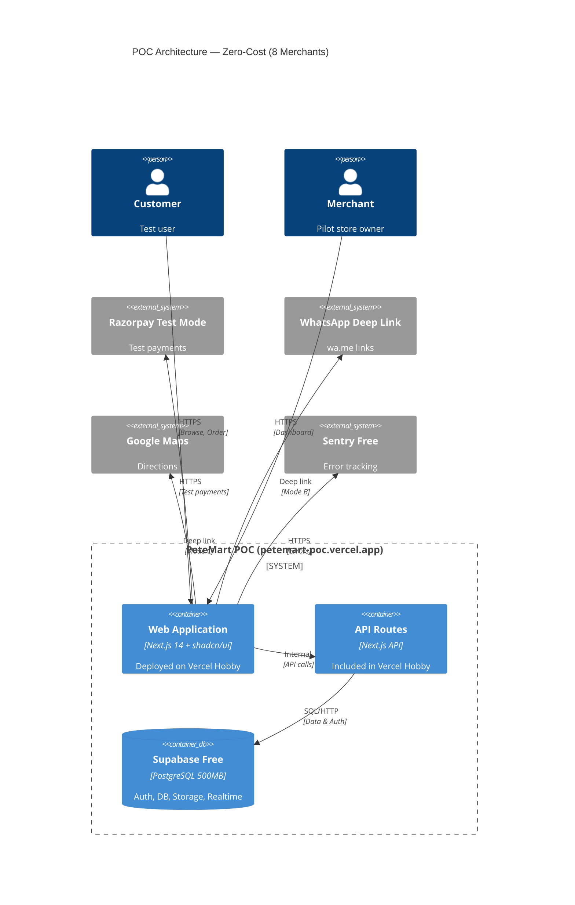

# PeteMart — POC Architecture & Scope

**Document Version:** 1.0  
**Author:** Agent 03 — Senior Enterprise Solutions Architect  
**Date:** 2026-06-15

---

## 1. POC Overview

The POC (Proof of Concept) is a **zero-cost implementation** targeting **8 pilot merchants** across Chickpet and Balepet markets. It validates the core PeteMart value proposition: multi-store cart, three interaction modes, and consolidated delivery — before investing in production infrastructure.

**POC URL:** `https://petemart-poc.vercel.app`  
**POC Duration:** 4 weeks (Sprints 1-2)  
**POC Budget:** ₹0/month (all free tiers)

---

## 2. POC Architecture (Zero-Cost)



---

## 3. POC Technology Stack (All Free Tiers)

| Layer | Technology | Free Tier Limit | POC Usage |
|-------|-----------|----------------|-----------|
| **Web Frontend** | Next.js 14 + shadcn/ui + Tailwind | Vercel Hobby: 100GB BW, 6000 build min | <1GB/mo, ~50 builds |
| **Mobile** | Expo Go (testing only) | Unlimited dev | 3 test devices |
| **Database** | Supabase PostgreSQL | 500MB DB, 5GB bandwidth | ~10MB data |
| **Auth** | Supabase Auth | 50K users, 100K MAU | ~100 users |
| **Storage** | Supabase Storage | 1GB storage, 2GB transfer | ~50MB product images |
| **Realtime** | Supabase Realtime | 200 concurrent connections | ~10 connections |
| **API** | Next.js API Routes | Included in Vercel Hobby | Included |
| **Payments** | Razorpay Test Mode | Unlimited test transactions | ~50 test orders |
| **AI** | N/A (deferred to production) | — | — |
| **CI/CD** | GitHub Actions | 2000 min/month | ~50 min/month |
| **Monitoring** | Sentry Free | 5K errors/month, 1 user | Minimal usage |
| **Domain** | `petemart-poc.vercel.app` | Free subdomain | Core URL |
| **Total Cost** | **₹0/month** | | |

---

## 4. POC Pilot Merchants (8)

| # | Merchant Name | Market | Category | Modes | Key Products |
|---|--------------|--------|----------|-------|-------------|
| 1 | Tarun Enterprises | Chickpet | Textiles Wholesale | B, C | Cotton fabrics, suitings |
| 2 | Sri Vari Traders | Balepet | Outdoor Equipment | A, B | Camping gear, sports |
| 3 | Samskruti Silks (Store 1) | Chickpet | Silk Sarees | A, B, C | Kanjivaram, Mysore silk |
| 4 | Samskruti Silks (Branch) | Chickpet | Silk Sarees | A, B, C | Wedding sarees |
| 5 | flowers2u | Balepet | Florist | A, B | Bouquets, arrangements |
| 6 | The Pastry Cafe | Balepet | Bakery & Cafe | A, C | Cakes, pastries |
| 7 | Sri Vinayaka Textorium | Balepet | Textiles | B, C | Dress materials |
| 8 | Sanjana Apparels | Balepet | Apparel | A, B, C | Readymade garments |

---

## 5. POC Features — In Scope vs Out of Scope

### ✅ IN SCOPE (POC)

**Customer Features:**
- Phone OTP registration and login
- Landing page with Pete Tapestry (21 markets)
- Product search with autocomplete and filters
- Product detail page with images, price, mode badges
- Multi-merchant shopping cart (up to 3 merchants)
- Consolidated checkout with delivery fee calculation
- Razorpay test payment (UPI, Card, NetBanking)
- Order confirmation and basic status tracking
- Order history page
- WhatsApp deep link (Mode B) for product enquiry
- Store visit interface (Mode C) with Google Maps
- Guest browsing (register at checkout)

**Merchant Features:**
- Registration wizard (phone → business details → plan → modes)
- Bank details entry + cancelled cheque upload
- Store microsite at `petemart-poc.vercel.app/shop/{slug}`
- Product CRUD (add/edit/delete)
- Bulk CSV product upload
- Order management (view, mark status)
- Dashboard overview (orders, revenue, products)
- Real-time order alerts

**Admin Features:**
- Email+password + OTP login
- Merchant approval queue (one-click approve/reject)
- Platform dashboard (merchants, orders, revenue)
- Feature flag management with kill switch
- Delivery zone configuration

### ❌ OUT OF SCOPE (POC — Deferred to Production)

| Feature | Production Phase |
|---------|-----------------|
| Native mobile apps (iOS/Android) | Phase 2 |
| Multi-language (i18n) | Phase 2 |
| AI Virtual Try-On | Phase 3 |
| Live bullion rates | Phase 3 |
| National shipping (ShipRocket) | Phase 3 |
| Video call appointments | Phase 4 |
| Pete Street Virtual Walk | Phase 4 |
| Live Bazaar streaming | Phase 4 |
| Co-shopping feature | Phase 4 |
| White-label branding | Phase 3 |
| Promo/coupon engine | Phase 2 |
| Loyalty points program | Phase 2 |
| Product reviews & ratings | Phase 2 |
| Push notifications | Phase 2 |
| Offline-first mobile | Phase 3 |
| Zero-downtime deployments | Phase 2 |

---

## 6. POC Success Criteria

| Metric | Target | Measurement |
|--------|--------|-------------|
| **Merchants Onboarded** | 8/8 with live stores | Admin dashboard count |
| **Products per Merchant** | ≥20 products | Database count |
| **Mode A Orders** | ≥10 test orders | Order service logs |
| **Mode B Enquiries** | ≥5 WhatsApp clicks | whatsapp_log table |
| **Mode C Clicks** | ≥5 Get Directions clicks | Analytics events |
| **Multi-Store Orders** | ≥3 orders (2+ merchants) | Consolidation log |
| **Page Load (LCP)** | <2.5s | Lighthouse CI |
| **API P95** | <300ms | Vercel Analytics |
| **Error Rate** | <1% | Sentry |
| **Uptime** | 99%+ | Vercel Status |

---

## 7. POC to Production Migration Path

```
POC (Week 1-4)                    Production (Month 2+)
───────────────                   ─────────────────────
petemart-poc.vercel.app    →      petemart.in (custom domain)
Vercel Hobby               →      Vercel Pro + AWS ECS
Supabase Free (500MB)      →      Supabase Pro (8GB)
In-memory cache            →      Upstash Redis (256MB)
PostgreSQL LIKE search     →      MeiliSearch (1GB)
Supabase Storage (1GB)     →      Supabase Storage (100GB)
Sentry Free                →      Sentry Team
8 merchants                →      50+ merchants
Manual deploy              →      CI/CD with auto-deploy
```

---

## 8. POC Risk Register

| Risk | Probability | Impact | Mitigation |
|------|------------|--------|------------|
| Merchant tech literacy too low | Medium | High | Concierge onboarding service |
| Razorpay subaccount creation fails | Low | High | Manual fallback with bank transfer |
| Delivery zone calc incorrect | Medium | Medium | Seed with simple zone config |
| Cart consolidation logic bugs | Medium | High | Extensive unit tests + demo |
| OTP delivery failure | Low | Medium | Email fallback, retry mechanism |
| Supabase free tier limits hit | Low | Medium | Monitor usage, upgrade if needed |
| Mobile responsiveness issues | Medium | Medium | Mobile-first design + testing |

---

*End of POC Scope Document*
