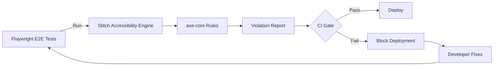

# PeteMart — Stitch Integration Guide

**Document Version:** 1.0  
**Author:** Agent 03 — Senior Enterprise Solutions Architect  
**Date:** 2026-06-15

---

## 1. What is Stitch?

Stitch is an accessibility testing tool that integrates with automated testing pipelines to ensure WCAG 2.1 AA compliance. It runs alongside Playwright/Cypress tests and reports accessibility violations as part of the CI/CD pipeline.

---

## 2. Stitch Integration Architecture



---

## 3. Integration Points

### 3.1 CI/CD Pipeline Integration

Stitch is integrated at two points:

1. **PR Gate**: Runs on every pull request against changed pages
2. **Pre-deploy Gate**: Runs full suite before production deployment

### 3.2 Test Configuration

```typescript
// stitch.config.ts
import { defineConfig } from '@stitch/runner';

export default defineConfig({
  runner: 'playwright',
  rules: ['wcag21a', 'wcag21aa'],
  output: {
    format: ['json', 'html', 'sarif'],
    directory: './reports/accessibility',
  },
  thresholds: {
    critical: 0,
    serious: 0,
    moderate: 5,
    minor: 10,
  },
  pages: [
    '/',
    '/markets/chickpet',
    '/shop/test-merchant',
    '/product/test-product',
    '/cart',
    '/checkout',
    '/orders',
    '/merchant/dashboard',
    '/admin',
    '/auth',
  ],
});
```

### 3.3 GitHub Actions Workflow

```yaml
# .github/workflows/accessibility.yml
name: Accessibility Tests
on:
  pull_request:
    paths:
      - 'app/**'
      - 'components/**'

jobs:
  a11y:
    runs-on: ubuntu-latest
    steps:
      - uses: actions/checkout@v4
      - uses: actions/setup-node@v4
        with:
          node-version: 20
      - run: npm ci
      - run: npm run build
      - run: npx playwright install --with-deps
      - name: Run Stitch Accessibility
        run: npx stitch run
      - name: Upload Report
        uses: actions/upload-artifact@v4
        if: always()
        with:
          name: a11y-report
          path: reports/accessibility/
      - name: Check Thresholds
        run: |
          if [ -f reports/accessibility/violations.json ]; then
            CRITICAL=$(cat reports/accessibility/violations.json | jq '.violations.critical')
            if [ "$CRITICAL" -gt 0 ]; then
              echo "❌ Critical violations found: $CRITICAL"
              exit 1
            fi
          fi
```

---

## 4. WCAG 2.1 AA Compliance Targets

| WCAG Principle | Target Score | Critical Rules |
|---------------|-------------|----------------|
| **Perceivable** | 100% pass | Image alt text, color contrast, captions |
| **Operable** | 100% pass | Keyboard nav, focus order, no traps |
| **Understandable** | 100% pass | Language tags, input labels, error IDs |
| **Robust** | 100% pass | ARIA attributes, semantic HTML |

---

## 5. Key Pages to Test

| Page | Route | Critical A11y Concerns |
|------|-------|----------------------|
| Landing Page | `/` | Carousel keyboard nav, alt text on market tiles |
| Market Explorer | `/markets/{slug}` | Filter controls, list semantics |
| Merchant Microsite | `/shop/{slug}` | Product grid focus order |
| Product Detail | `/product/{id}` | Image zoom, price announcements |
| Cart | `/cart` | Quantity controls, remove buttons |
| Checkout | `/checkout` | Form labels, error validation |
| Order History | `/orders` | Status badges, sort controls |
| Merchant Dashboard | `/merchant/dashboard` | Data tables, charts |
| Admin Console | `/admin` | Complex forms, data tables |
| Auth | `/auth` | OTP input, error states |

---

## 6. Common Violations & Fixes

| Violation | Component | Fix |
|-----------|-----------|-----|
| Missing alt text | Product images | Add descriptive alt text from product name |
| Low color contrast | Mode badges | Ensure 4.5:1 ratio for text |
| Missing form labels | Search input | Add `<label>` with `htmlFor` |
| Keyboard trap | Carousel | Add escape handler, focus management |
| Missing ARIA labels | Icon buttons | Add `aria-label` to all icon-only buttons |
| Focus order | Checkout form | Ensure logical tab order |
| Error identification | OTP input | Associate error messages with inputs |

---

## 7. Stitch in Development Workflow

```
Developer commits code
        ↓
GitHub Actions triggers lint + type check
        ↓
Unit tests run
        ↓
Build succeeds
        ↓
Stitch accessibility scan runs on preview deployment
        ↓
┌─────────────────────────────────────────────┐
│  Results:                                    │
│  ✅ No critical violations                   │
│  ✅ No serious violations                    │
│  ⚠️  3 moderate violations (threshold: 5)    │
│  ✅ Thresholds met — gate passes             │
└─────────────────────────────────────────────┘
        ↓
E2E tests run
        ↓
Deploy to production
```

---

*End of Stitch Integration Guide*
