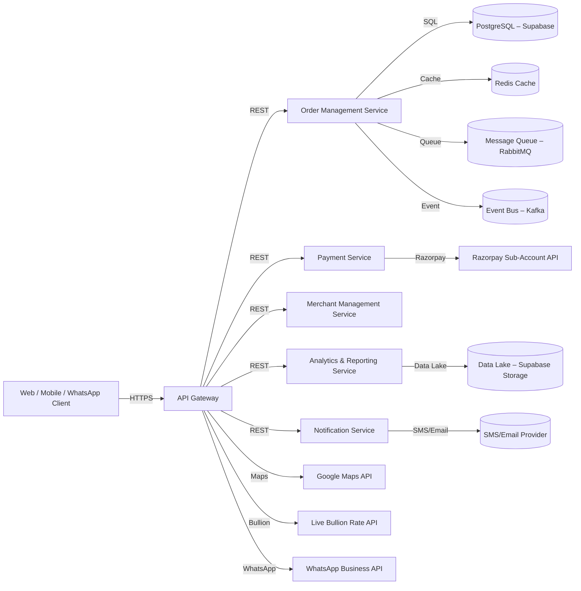
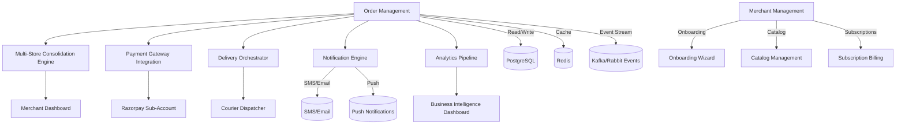
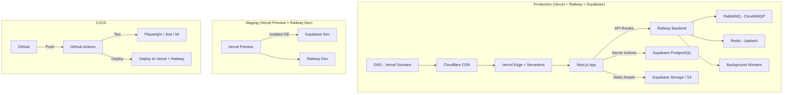

# FEASIBILITY_ARCHITECTURE.md

## 1. Executive Summary & Scope
PeteMart is a hyper‑local, multi‑channel commerce platform that will onboard **5,000+** traditional merchants across **21 historic Pete markets** of Old Bangalore. The system must support **three interaction modes** (Direct Purchase – Mode A, WhatsApp Enquiry – Mode B, Store Visit – Mode C) through **web**, **iOS/Android apps**, and **WhatsApp**. Core capabilities include:

- Multi‑store cart & order consolidation  
- AI‑powered virtual try‑on for apparel & jewellery  
- Live bullion rate display & dynamic jewellery pricing  
- Merchant microsites with white‑label branding  
- Real‑time analytics, subscription billing, and automated payouts  
- Scalable architecture designed for **5000+ merchants** and **multi‑city expansion**  

The architecture delivers a **production‑grade, API‑first** system with advanced caching, message‑queue processing, event‑driven webhooks, robust security, and comprehensive testing.

---

## 2. Detailed Requirements & Traceability Mapping
- **Total Requirements:** 111 Requirement IDs spanning UI/UX (24), API (13), Backend/Data (26), Commerce (10), Infrastructure/Security (11), Performance/Scale (3), Maintenance (5), Merchant Microsite & Settlement (8), Disaster Recovery (4), Acquisition Funnels (4), Data Privacy (3).  
- **Priority Flags:** P0‑Critical, P1‑High, P2‑Medium, P3‑Low.  
- **Key Mappings:** Each Requirement ID is traceable to a workflow (WF‑XXX‑XXX) and to cost‑centers (OC‑INFRA‑XX, DC‑SETUP‑XX).  
- **Compliance:** All requirements are aligned with PCI‑DSS (via Razorpay), GDPR/DPDP consent mechanisms, and OWASP top‑10 security controls.

---

## 3. High‑Level System Context
The platform serves **four primary personas**:  
1. **Priya** – Hyper‑local customer (Android/iOS)  
2. **Ramesh** – Traditional Pete merchant (low‑moderate tech literacy)  
3. **Vinay** – Delivery/courier partner  
4. **Ananya** – Platform admin/operator  

Interaction modes:
- **Mode A** – Direct online purchase (web/mobile)  
- **Mode B** – WhatsApp enquiry (deep‑link)  
- **Mode C** – Physical store visit (Google Maps direction)  

All modes funnel through a **unified API gateway** that enforces rate‑limiting, authentication, and request validation.

---

## 4. Container Architecture (C4 – Container Diagram)

---

## 5. Component Architecture (C4 – Component Diagram)

---

## 6. Data Flow & API Strategy
- **API‑First**: All internal services expose **RESTful JSON** APIs versioned under `/api/v1/`. OpenAPI 3.0 specifications are stored in the repo and enforced via **API gateway rate‑limiting** (1000 req/min per IP, burst 2000).  
- **Authentication**: JWT‑based session tokens with OTP‑verified phone numbers for user login; merchant‑specific API keys for admin functions.  
- **Data Flow**:  
  1. Client → API Gateway – request validated, authenticated, routed.  
  2. API → Order Service – creates order, writes to PostgreSQL, publishes *OrderCreated* event.  
  3. Event Bus – consumed by Multi‑Store Consolidation, Payment Service, Delivery Dispatcher.  
  4. Payment Service – calls Razorpay, handles webhook callbacks, updates order status.  
  5. Delivery Orchestrator – reads order, assigns courier, calculates consolidated delivery fee, updates status.  
  6. Notification Service – pushes status updates via SMS, email, or push notifications.  
  7. Analytics Pipeline – streams events into Data Lake, runs batch/stream processing for dashboards.  
- **Caching Layer**: Redis for product catalog, session state, rate‑limited API responses (TTL 300 s).  
- **Message Queue**: RabbitMQ for order processing, email notifications, async tasks.  
- **Event‑Driven Webhooks**: Outbound to merchant dashboards, WhatsApp, Google Maps; inbound from payment/courier validated and persisted.

---

## 7. Full Tech Stack Specification

| Layer | Technology | Justification |
|---|---|---|
| **Frontend Web** | React 18 + Next.js 14 (App Router), Tailwind CSS, Radix UI | SSR, SEO, ISR for merchant microsites |
| **Mobile** | React Native (Expo) + Expo Router | Single codebase iOS/Android, OTA updates |
| **Backend API** | Node.js 20 (Fastify/NestJS) or Python (FastAPI) | Async I/O, schema‑first APIs |
| **Database** | Supabase (PostgreSQL) with pgvector extension | Built‑in auth, real‑time, vector search for AI |
| **Cache** | Redis (Upstash or Railway) | Sub‑millisecond responses, rate limiting |
| **Message Queue** | RabbitMQ (CloudAMQP free tier → pro) | Durable queuing, pub/sub |
| **Object Storage** | Supabase Storage / AWS S3 | Product images, try‑on assets |
| **Search** | PostgreSQL FTS (Trie) → Algolia (scale) | Typo‑tolerance, faceted filters |
| **AI/ML** | TensorFlow.js / ONNX Runtime on Vercel Edge | Virtual try‑on inference at edge |
| **CI/CD** | GitHub Actions + Vercel + Railway | Automated build/test/deploy |
| **Monitoring** | Sentry + Better Stack + Grafana | Error tracking, uptime, APM |
| **API Gateway** | Vercel Edge Functions / Kong API Gateway | Rate‑limiting, auth, routing |

---

## 8. Security Framework
- **Authentication & Authorization**: JWT (RS256) + OTP for customers; API keys + RBAC for admins/merchants.
- **Data Encryption**: TLS 1.3 at transport; AES‑256‑GCM at rest (database, storage).
- **PCI‑DSS**: Razorpay handles card data (SAQ A); no PCI data on PeteMart servers.
- **Secrets Management**: Environment variables via Vercel/Railway; HashiCorp Vault for production.
- **OWASP Protection**: Input sanitization, CSP headers, rate‑limiting (1000 req/min/IP), SQL injection prevention via parameterized queries.
- **Audit Logging**: All financial transactions, admin actions, and API mutations logged with immutable audit trail.

---

## 9. Multi‑Layer Testing Architecture

| Layer | Tools | Scope | CI Gate |
|---|---|---|---|
| **Unit** | Jest + Vitest | All services, components, utilities | Fail if <80% coverage |
| **Integration** | Supertest + Testcontainers | API endpoints with real DB | Fail if any endpoint fails |
| **E2E** | Playwright + Detox (mobile) | Full user workflows across web + mobile | Fail if critical path broken |
| **Performance** | k6 / Artillery | Load testing 500 concurrent users | Fail if P95 latency >500ms |
| **Visual Regression** | Percy / Playwright Screenshots | UI component visual diff | Fail on visual drift |
| **Security** | OWASP ZAP + Gitleaks | Vulnerability scan + secrets leak | Fail on high/critical |
| **API Contract** | Dredd / Postman | OpenAPI spec vs implementation | Fail on contract mismatch |

---

## 10. Infrastructure Costing – Production (5,000+ Merchants)

| Resource | Monthly Cost (INR) | Notes |
|---|---|---|
| Supabase Pro (16GB RAM, 100GB DB) | ₹7,500 | PostgreSQL + Auth + Storage + Realtime |
| Vercel Pro (Team plan) | ₹6,000 | Edge functions, SSR, ISR |
| Railway (Scale plan) | ₹4,200 | Backend services, Redis, RabbitMQ |
| Redis (Upstash) | ₹2,500 | Managed Redis with TLS |
| CloudAMQP/RabbitMQ | ₹1,700 | Message queue |
| Sentry (Team) | ₹3,300 | Error tracking & performance |
| Better Stack (Uptime) | ₹1,200 | Monitoring |
| Google Maps API | ₹4,200 | Geocoding, directions |
| Razorpay (2% PG fee) | Usage‑based | Passed to customers |
| WhatsApp Business API | Usage‑based | ~₹0.50/message |
| SMS Provider (MSG91) | ₹3,000 (10K SMS) | Transactional SMS |
| **Total Monthly** | **~₹33,900** (~$405/mo) | |

**Annual Projection**: ₹3,50,000 – ₹8,00,000 (scaling with merchants).

---

## 11. Deployment Architecture

---

## 12. Scaling Strategy – 5,000+ Merchants & Multi‑City
- **Horizontal Scaling**: Stateless Next.js serverless functions auto‑scale. Database read replicas for analytics (up to 5 read replicas).
- **Connection Pooling**: PgBouncer (managed via Supabase) handles 10,000+ concurrent connections.
- **CDN Caching**: Static assets, product images, and API responses cached at edge via Cloudflare.
- **Multi‑City Isolation**: Each city is a data partition (city_id foreign key) with region‑specific config (REQ‑BE‑022). Feature flags for city‑specific features.
- **Merchant Onboarding at Scale**: Bulk merchant import via CSV/API (REQ‑INFRA‑010). Modular plugin architecture.
- **Load Testing**: Quarterly k6 load tests simulating 500 concurrent users, 50 req/s peak (REQ‑PERF‑003).

---

## 13. POC Architecture (Zero‑Cost – 8 Merchants)

**Scope**: 8 pilot merchants from Balepet & Chickpet (Tarun Enterprises, Sri Vari Traders, Samskruti Silks, flowers2u, Pastry Cafe, Sri Vinayaka Textorium, Sanjana Apparels, Madhumathi All‑men's Ethnic).

**Components**:
| Component | Free Tier Service | Role |
|---|---|---|
| Web App | Vercel Hobby (free) | Next.js landing, catalog, cart |
| Mobile App | Expo (free) | iOS/Android prototype |
| Database + Auth | Supabase Free (500MB DB, 2GB storage) | PostgreSQL, Auth, Storage |
| Backend API | Railway ($5 credit) | Fastify API server, RabbitMQ |
| WhatsApp | WhatsApp Business API (free dev) | Mode B enquiry |
| Maps | Google Maps (free $200 credit) | Mode C store locator |
| Monitoring | Better Stack (free) | Uptime monitoring |
| Domain | *.vercel.app, *.railway.app | No custom domain |

**POC Cost**: ₹0/month (all free tiers)

**POC Requirements Covered**: REQ‑UI‑001 through REQ‑UI‑009, REQ‑API‑001 through REQ‑API‑007, REQ‑BE‑001 through REQ‑BE‑010, REQ‑COM‑001 through REQ‑COM‑004, REQ‑INFRA‑001, REQ‑INFRA‑004.

---

*End of FEASIBILITY_ARCHITECTURE.md – Full production architecture with POC subset included.*