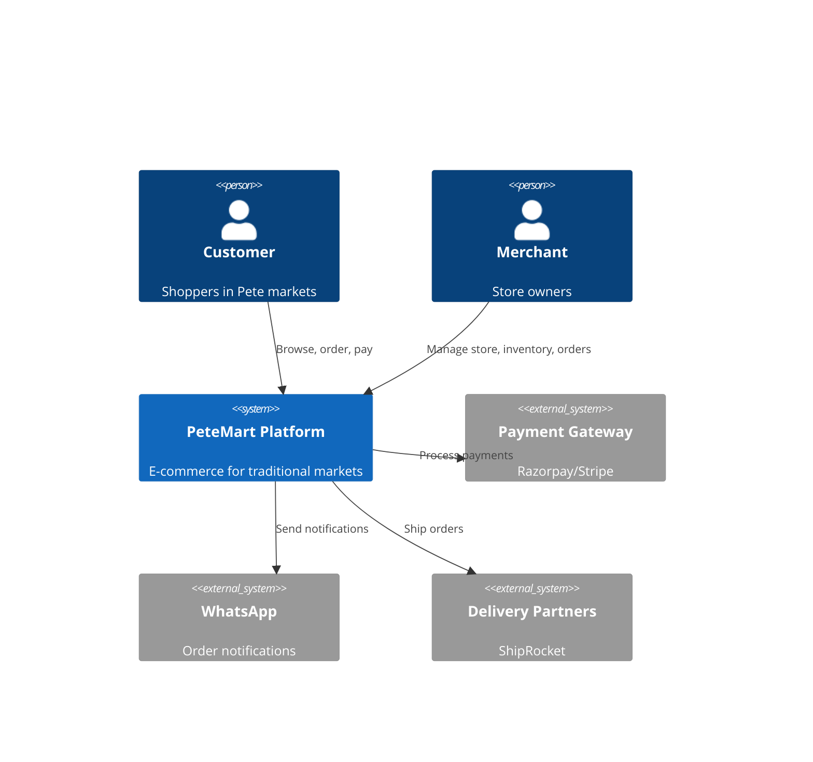
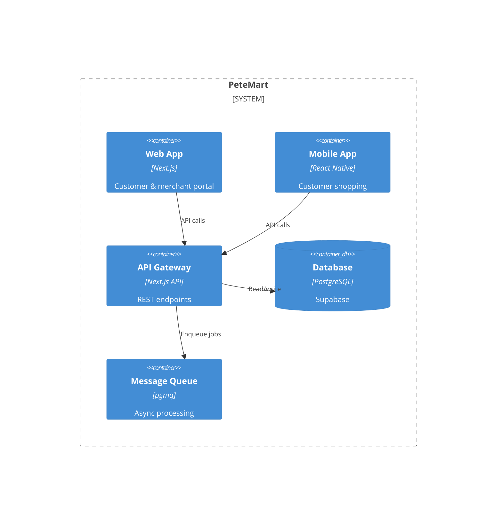
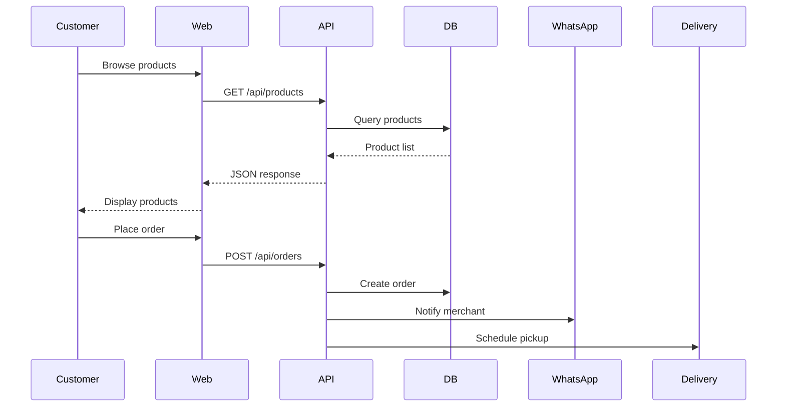
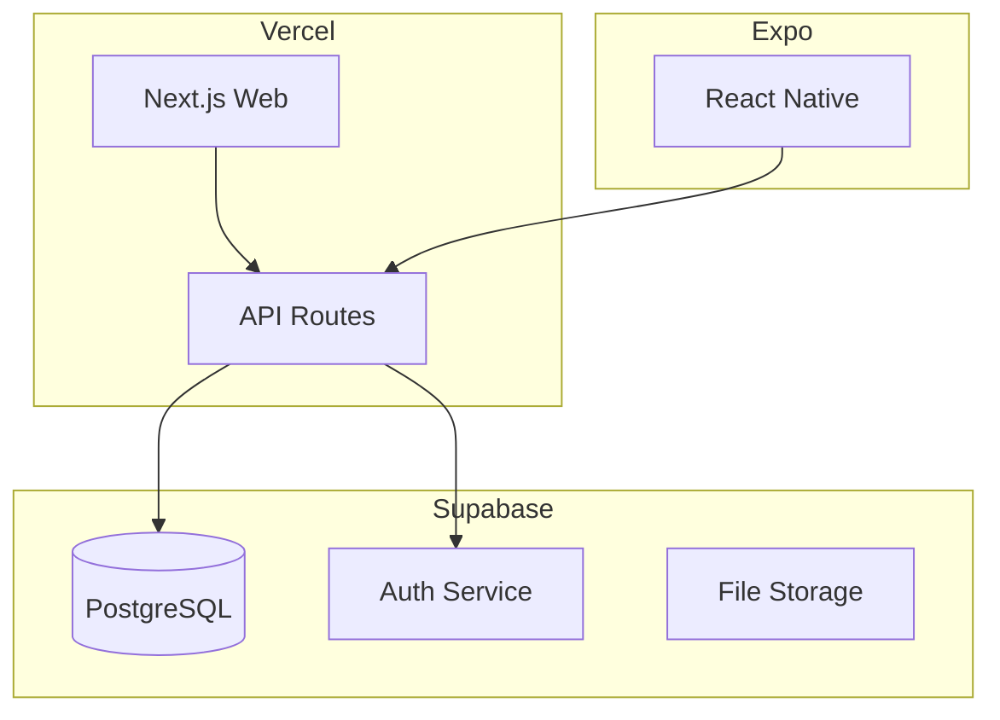
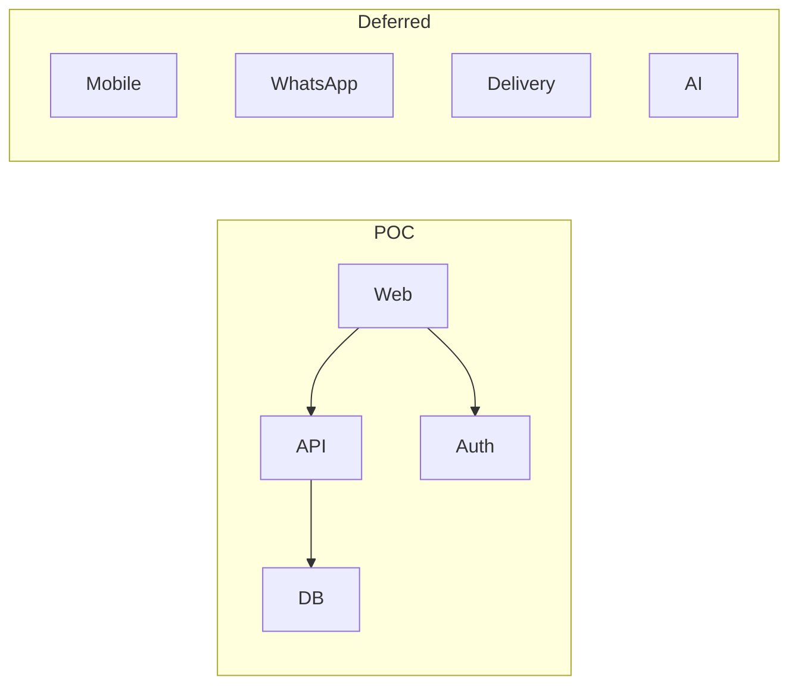

# Architectural Diagrams

**Generated**: 2026-06-15T03:59:33.058Z

## 1. System Context Diagram (C4)

## 2. Container Diagram

## 3. Data Flow Diagram

## 4. Deployment Diagram

## 5. POC Scope Diagram

