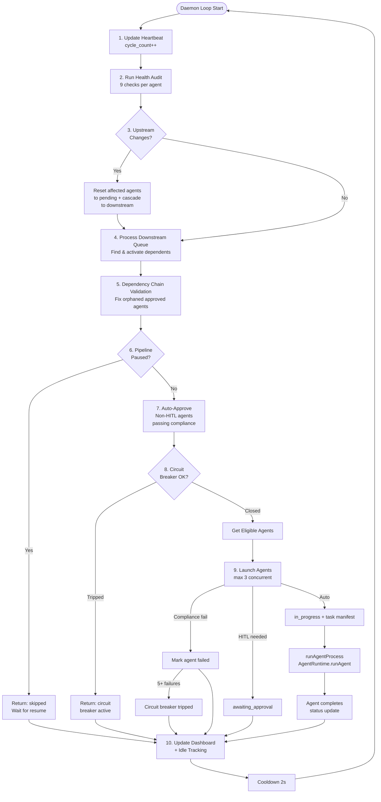

# Agent Run Architecture & Workflow Design

> **Date**: 2026-06-18
> **Framework**: PeteMart Agentic SDLC Framework v2.0
> **Focus**: End-to-end agent execution workflows, state transitions, compliance audits, artifact management, and LLM integration.

---

## Table of Contents

1. [System Overview](#1-system-overview)
2. [Supervisor Workflow (Daemon Loop)](#2-supervisor-workflow-daemon-loop)
3. [Agent Execution Workflow (AgentRuntime)](#3-agent-execution-workflow-agentruntime)
4. [LLM Provider Architecture](#4-llm-provider-architecture)
5. [State & Compliance System](#5-state--compliance-system)
6. [Artifact Management](#6-artifact-management)
7. [Loop Guardrails & Circuit Breaker](#7-loop-guardrails--circuit-breaker)
8. [Complete Workflow Diagrams](#8-complete-workflow-diagrams)
9. [State Machine Summary](#9-state-machine-summary)

---

## 1. System Overview

The PeteMart framework consists of **16 agents** (1 supervisor + 15 workers) orchestrated through a state-machine driven pipeline. The system is divided into two primary execution paths:

| Path | File | Entry Point | Purpose |
|------|------|------------|---------|
| **Supervisor Daemon** | `scripts/runtime/supervisorDaemon.js` | `daemonLoop()` | Continuous pipeline orchestration, health audits, compliance, scheduling |
| **Agent Runtime** | `scripts/runtime/AgentRuntime.js` | `runAgent(agentId, context)` | Single agent execution: prompt building, LLM interaction, tool calling, artifact writing |

Supporting files:

| File | Role |
|------|------|
| `scripts/runtime/LLMProvider.js` | LLM abstraction — resolves config, delegates to backend |
| `scripts/runtime/LLMOpenAIProvider.js` | OpenAI-compatible API calls (HTTP) |
| `scripts/runtime/LLMOpenCodeProvider.js` | opencode CLI subprocess calls |
| `scripts/runtime/SupervisorAgent.js` | Health audit, compliance audit, dashboard, state validation |
| `scripts/runtime/supervisorSingleton.js` | PID-based singleton lock for single-instance guarantee |
| `scripts/runtime/runAgentProcess.js` | Subprocess wrapper around AgentRuntime |
| `scripts/runtime/TraceLogger.js` | Span-based tracing (start_span / end) into PIPELINE_EVENTS.jsonl |
| `scripts/runtime/VerboseLogger.js` | File-based lifecycle logging with rotation |
| `scripts/supervisor_loop.js` | Lightweight supervisor CLI (single-cycle or watch) |
| `scripts/execute_agent_task.js` | Task manifest reader that invokes AgentRuntime |
| `scripts/start-pipeline.js` | CLI entry for pipeline start/stop/status |

---

## 2. Supervisor Workflow (Daemon Loop)

### Entry Point

```
node scripts/start-pipeline.js --watch
  └─> require('./runtime/supervisorDaemon').daemonLoop()
       OR
  └─> require('./supervisor_loop').runCycle()  // lightweight variant
```

### `supervisorDaemon.daemonLoop()` — Complete Cycle (10 Steps)

```
daemonLoop()
  │
  ├── [LOOP] while(true)
  │     │
  │     ├── Step 1: Heartbeat Update
  │     │   update daemon_last_heartbeat, daemon_status='running'
  │     │   increment cycle_count
  │     │   logEvent({ type: 'cycle_start' })
  │     │   └─> Files: STATE_MATRIX.json supervisor_control.agent_00_supervisor
  │     │
  │     ├── Step 2: Comprehensive Health Audit
  │     │   supervisor.runHealthAudit(state)
  │     │   ├── _checkArtifactFiles()    — files exist, non-empty, not stale
  │     │   ├── _checkAgentRunLog()      — scan AGENT_RUN_*.log for errors
  │     │   ├── _checkCheckpointCompleteness() — checkpoints started == completed
  │     │   ├── _checkLLMHealth()        — test LLM provider connection
  │     │   ├── _checkToolsAvailable()   — verify required tools registered
  │     │   ├── _checkDependencyIntegrity() — upstream deps resolved
  │     │   ├── _checkStuck()            — timeout detection (5min default)
  │     │   ├── _checkExecutionLimit()   — max_executions_per_agent (default 10)
  │     │   └── _checkUpstreamChanges()  — MD5 hash comparison of artifacts
  │     │   └─> Writes health flags to agent._health_flags
  │     │
  │     ├── Step 3: Upstream Change Detection
  │     │   For each agent where upstreamCheck.upstreamChanged === true:
  │     │     If agent.status === 'approved' | 'completed':
  │     │       → status = 'pending', approved = false, error = 'UPSTREAM_CHANGED'
  │     │       → cascading to downstream agents (findDownstreamAgents)
  │     │   └─> Files: agent_states[].status updated
  │     │
  │     ├── Step 4: Downstream Queue Processing
  │     │   readDownstreamQueue()
  │     │   findDownstreamAgents(state, completedAgentId)
  │     │   For each queued downstream agent:
  │     │     if dependenciesMet → status = 'pending'
  │     │   saveDownstreamQueue() — filter out completed agents
  │     │
  │     ├── Step 5: Dependency Chain Validation
  │     │   For each agent with status approved|completed|awaiting_approval|active|in_progress:
  │     │     if any dependency not approved|completed:
  │     │       → status = 'pending', error = 'DOWNSTREAM_CASCADE'
  │     │       → cascadeCount++
  │     │
  │     ├── Step 6: Pipeline Pause Check
  │     │   if pipeline_control.is_pipeline_paused → return { skipped: true }
  │     │
  │     ├── Step 7: Auto-Approve Non-HITL Agents
  │     │   supervisor.runComplianceAudit(state)
  │     │   For each awaiting_approval agent without requires_human_approval:
  │     │     if audit.allPassed → status = 'in_progress', launchAgentTask()
  │     │
  │     ├── Step 8: Circuit Breaker Check
  │     │   if circuit_breaker === 'TRIPPED' → return { skipped: true }
  │     │   getEligibleAgents(state):
  │     │     Filter: not supervisor, not disabled
  │     │     status ∉ {approved, completed, failed, in_progress, active, awaiting_input}
  │     │     execution_count < max_executions (10)
  │     │     dependenciesMet() — all upstream deps approved|completed
  │     │
  │     ├── Step 9: Launch Eligible Agents
  │     │   For each eligible agent (max 3 concurrent):
  │     │     - Run compliance audit (fatal failures → mark failed)
  │     │     - If requires_human_approval → status = 'awaiting_approval'
  │     │     - Else → status = 'in_progress', launchAgentTask()
  │     │       └─> Writes TASK_{agentId}.json manifest
  │     │       └─> Calls runAgentProcess(agentId, taskManifest)
  │     │            └─> new AgentRuntime().runAgent(agentId, context)
  │     │
  │     └── Step 10: Idle Cycle Tracking & Dashboard Update
  │         increment idle_cycles if no launches
  │         if idle_cycles >= max_idle_cycles (50) → log warning
  │         supervisor.updateDashboard(state, healthAudit)
  │         └─> Writes SUPERVISOR_DASHBOARD.json
  │
  └── Cooldown delay (2s default) → next cycle
```

### Key Functions Called in Supervisor Daemon Loop

| Function | Location | Purpose |
|----------|----------|---------|
| `supervisor.runHealthAudit(state)` | `SupervisorAgent.js:38` | Runs 9 health checks across all agents |
| `supervisor.runComplianceAudit(state)` | `SupervisorAgent.js:354` | Audits all compliance_checklist items |
| `getEligibleAgents(state)` | `supervisorDaemon.js:58` | Filters agents by status, deps, execution limit |
| `dependenciesMet(state, agent)` | `supervisorDaemon.js:50` | Verifies all upstream deps approved/completed |
| `findDownstreamAgents(state, agentId)` | `supervisorDaemon.js:82` | Finds all agents depending on a given agent |
| `launchAgentTask(agentId, state)` | `supervisorDaemon.js:367` | Writes TASK_{id}.json manifest |
| `runAgentProcess(agentId, taskManifest)` | `runAgentProcess.js:8` | Subprocess wrapper: creates AgentRuntime, calls runAgent |
| `supervisor.updateDashboard(state, health)` | `SupervisorAgent.js:521` | Generates SUPERVISOR_DASHBOARD.json |
| `supervisor.checkApprovalGates(state)` | `SupervisorAgent.js:492` | Checks GATE-TECH-STACK-01, GATE-COSTING-01, etc. |

### Supervisor State Files

| File | Content |
|------|---------|
| `STATE_MATRIX.json` | Master state: all agent states, pipeline control, supervisor metadata |
| `AGENT_REGISTRY.json` | Agent definitions: system prompts, deliverables, tools, checkpoints |
| `SUPERVISOR_DASHBOARD.json` | Compiled dashboard with health audit, per-agent status, events |
| `PIPELINE_EVENTS.jsonl` | Append-only event log (agent_state_change, agent_launched, compliance_failed, etc.) |
| `TASK_{agentId}.json` | Per-agent task manifest (created on launch, deleted after completion) |
| `SUPERVISOR_DAEMON.pid` | PID file for singleton enforcement |
| `DOWNSTREAM_QUEUE.json` | Queued downstream agents awaiting dependency resolution |
| `TRACEABILITY_MATRIX.json` | PRD requirement ID → agent mapping |

---

## 3. Agent Execution Workflow (AgentRuntime)

### `AgentRuntime.runAgent(agentId, context)` — Complete Execution Path

```
runAgent(agentId, context)
  │
  ├── 1. Initialize
  │     loadAgentDef(agentId) — reads AGENT_REGISTRY.json
  │     create AbortController, register in ACTIVE_RUNS
  │     TraceLogger.startSpan('agent_run')
  │     └─> Files: PIPELINE_EVENTS.jsonl (trace span)
  │
  ├── 2. Guardrail Check
  │     _checkGuardrails(agentId):
  │       if execution_count >= max_executions (10) → fail
  │     └─> On fail: status = 'failed', return early
  │
  ├── 3. Set State → in_progress
  │     state.agent_states[id].status = 'in_progress'
  │     state.agent_states[id].started_at = now
  │     state.agent_states[id].step_label = 'initializing'
  │     saveState(state)
  │     logEvent({ type: 'agent_started' })
  │     _updateStepLabel(agentId, 'initializing', resetCounters=true)
  │     └─> Files: STATE_MATRIX.json, PIPELINE_EVENTS.jsonl
  │
  ├── 4. Gather Dependency Context
  │     _gatherDependencyContext(agentDef):
  │       For each dependency path → read file content (max 50KB each)
  │       Concatenate into dependency context string
  │     TraceLogger.startSpan('gather_dependency_context')
  │     └─> Files: reads dependency artifact files from disk
  │
  ├── 5. Build System Prompt
  │     _buildSystemPrompt(agentDef, depContext, context):
  │       agentDef.system_prompt (from AGENT_REGISTRY.json)
  │       + Engineering Workflow (PLAN → TEST FIRST → BUILD → VERIFY)
  │       + Test-Driven Generation instructions
  │       + Dependency Context (upstream artifacts)
  │       + User Instruction (if provided)
  │     TraceLogger.startSpan('build_system_prompt')
  │
  ├── 6. Execute (Branch: Checkpointed or Standard)
  │     │
  │     ├── [CHECKPOINTED] if agentDef.checkpoints.length > 0
  │     │   _runCheckpointedPipeline(agentDef, basePrompt)
  │     │     For each checkpoint:
  │     │       Build checkpoint prompt (phase context + instructions + budget)
  │     │       _llmToolLoop(agentDef, prompt, budget, priorArtifacts, globalIter)
  │     │       Accumulate artifacts & content
  │     │       logEvent({ type: 'checkpoint_start/complete' })
  │     │
  │     └── [STANDARD] else
  │         _llmToolLoop(agentDef, systemPrompt, maxIterations=15)
  │
  ├── 7. LLM Tool Loop (_llmToolLoop)
  │     For iteration = 1..maxIterations (default 15):
  │     │
  │     ├── 7a. Reset compliance checklist (first iter only)
  │     │     Set all compliance_checklist[].passed = false
  │     │
  │     ├── 7b. Call LLM
  │     │     _updateStepLabel('LLM iteration N/15')
  │     │     resp = llm.complete(systemPrompt, messages, tools, { timeout, signal })
  │     │       └─> LLMProvider.complete() → LLMOpenAIProvider or LLMOpenCodeProvider
  │     │     logEvent({ type: 'llm_iteration' })
  │     │
  │     ├── 7c. Process Tool Calls (if resp.toolCalls.length > 0)
  │     │     For each tool call:
  │     │     │
  │     │     ├── Dedup Check (toolCallCache)
  │     │     │   if same (tool, args) called before → return cached result
  │     │     │   if same tool called 5x consecutive → StuckError (hard stop)
  │     │     │   if same tool called 3x → inject nudge message
  │     │     │
  │     │     ├── Tool Handler Dispatch
  │     │     │   _toolHandlers = {
  │     │     │     write_artifact:  _writeArtifact(args, agentDef),
  │     │     │     read_dependency: _readDependency(args),
  │     │     │     browse_files:    _browseFiles(args),
  │     │     │     read_file:       _readFile(args),
  │     │     │   }
  │     │     │
  │     │     ├── Tool Timeout (60s per tool)
  │     │     │   Promise.race([toolPromise, 60s timeout])
  │     │     │
  │     │     ├── File Edit Tracking
  │     │     │   if write_artifact called 3x on same file → inject nudge
  │     │     │
  │     │     └── Push tool result to messages array
  │     │         messages.push({ role: 'tool', tool_call_id, content })
  │     │
  │     ├── 7d. Process Text Response (if resp.content but no tool calls)
  │     │     Check for missing compliance files
  │     │     If missing files AND budget left → re-prompt LLM
  │     │     If all files written → break (done)
  │     │     If 3+ consecutive text-only → inject nudge
  │     │
  │     ├── 7e. Message Window Management
  │     │     If messages.length > 32: keep first 2 + last 30
  │     │
  │     └── 7f. Loop Detection
  │         consecutiveEmpty ≥ 3 → break
  │
  ├── 8. Handle LLM Errors
  │     If error contains '402' | 'Insufficient Balance':
  │       → status = 'failed', error = 'LLM provider: insufficient balance'
  │       → set circuit_breaker_tripped_at (after 5 consecutive)
  │     If error contains 'cancelled' | 'aborted':
  │       → status = 'cancelled'
  │     Otherwise:
  │       → status = 'failed', increment consecutive_failures
  │       → trip circuit breaker if ≥ 5 consecutive failures
  │
  ├── 9. Handle Empty Result
  │     If !result.content && (!result.artifacts || result.artifacts.length === 0):
  │       → status = 'failed', error = 'LLM returned empty content'
  │       → trip circuit breaker if ≥ 5 consecutive
  │
  ├── 10. Cross-Cutting Pipeline (_runPipeline)
  │     _updateStepLabel('processing results')
  │     │
  │     ├── 10a. Write Artifacts to Disk
  │     │     resolveWorkspaceRoot(agentDef, agentId)
  │     │     For each artifact in result.artifacts:
  │     │       Write file to sandbox directory
  │     │       (json → JSON.stringify, pptx/xlsx → binary, else → string)
  │     │
  │     ├── 10b. Auto-Generate Compliance Artifacts
  │     │     For each compliance_checklist item of type 'artifact':
  │     │       If file not produced by LLM → write auto-generated placeholder
  │     │       Archive any existing file → oldartifacts/
  │     │       Add placeholder to artifacts_emitted array
  │     │
  │     ├── 10c. Save Memory
  │     │     memory_store/{agentId}.json — last 50 runs
  │     │
  │     ├── 10d. Save Prompt Snapshot
  │     │     prompt_snapshots/{agentId}_{timestamp}/ — prompt + response preview
  │     │
  │     └── 10e. Update State
  │         step_label = 'completed'
  │         execution_count++
  │         artifacts_emitted updated
  │         last_run_id, last_run_duration_ms set
  │
  ├── 11. Determine Final Status
  │     If agentDef.requires_human_approval:
  │       → finalStatus = 'awaiting_approval'
  │     Else:
  │       → finalStatus = 'completed' (or 'failed' if errors)
  │     Set finalAgent.status = finalStatus
  │     saveState(state)
  │
  └── 12. Cleanup & Return
      TraceLogger.endSpan('agent_run')
      ACTIVE_RUNS.delete(agentId)
      return { agentId, runId, status, artifacts, content, usage, duration, complianceResult }
```

### Key Functions Called in AgentRuntime

| Function | Location | Purpose |
|----------|----------|---------|
| `loadAgentDef(agentId)` | `AgentRuntime.js:119` | Reads agent config from AGENT_REGISTRY.json |
| `_checkGuardrails(agentId)` | `AgentRuntime.js:771` | Verifies execution count within limits |
| `_gatherDependencyContext(agentDef)` | `AgentRuntime.js:756` | Reads upstream artifact files |
| `_buildSystemPrompt(agentDef, depCtx, ctx)` | `AgentRuntime.js:742` | Assembles full prompt with workflow instructions |
| `_runCheckpointedPipeline(agentDef, prompt)` | `AgentRuntime.js:307` | Multi-checkpoint execution for complex agents |
| `_llmToolLoop(agentDef, prompt, maxIter, ...)` | `AgentRuntime.js:369` | Core LLM interaction loop with tool execution |
| `_runPipeline(agentId, runId, agentDef, ...)` | `AgentRuntime.js:553` | Post-LLM: artifact writing, compliance, memory |
| `_writeArtifact(args, agentDef)` | `AgentRuntime.js:671` | Writes file to agent sandbox (with archival) |
| `_readDependency(args)` | `AgentRuntime.js:690` | Reads upstream artifact from disk |
| `_browseFiles(args)` | `AgentRuntime.js:699` | Lists directory contents |
| `_readFile(args)` | `AgentRuntime.js:705` | Reads any file from project (up to 50KB) |
| `_getMissingComplianceFiles(id, arts, prior)` | `AgentRuntime.js:787` | Checks which compliance files not yet written |
| `_runCompliance(agentDef, result, id)` | `AgentRuntime.js:780` | Runs compliance checklist against result |
| `_updateStepLabel(agentId, label, reset)` | `AgentRuntime.js:88` | Writes progress label to state |

---

## 4. LLM Provider Architecture

### Provider Resolution

```
LLMProvider (fromEnv/constructor)
  │
  ├── Reads config priority: constructor options → env vars → STATE_MATRIX llm_override
  │
  ├── Has API key or baseURL?
  │     YES → LLMOpenAIProvider (HTTP POST to /chat/completions)
  │       - Supports OpenAI, DeepSeek, Together, any OpenAI-compatible API
  │       - Configurable: apiKey, model, baseURL, maxTokens
  │       - Tool format: OpenAI tools[] array
  │       - Timeout: configurable (default 120s)
  │
  └── NO → LLMOpenCodeProvider (spawns opencode CLI subprocess)
      - Calls: opencode run "<prompt>" --model "<provider>/<model>"
      - Tool format: <function_call>name: <tool>\narguments: <JSON></function_call>
      - Timeout: configurable (default 120s)
      - emergencyCall(): fallback with spawnSync if spawn fails
      - Token estimation: character count / 3.5
```

### LLM Call Chain

```
AgentRuntime._llmToolLoop()
  └─> this.llm.complete(systemPrompt, messages, tools, options)
       └─> LLMProvider.complete()
            ├── this._backend.initialize() (if not initialized)
            ├── this._backend.complete(systemPrompt, messages, tools, options)
            │     ├── LLMOpenAIProvider.complete()
            │     │     POST https://{baseURL}/chat/completions
            │     │     Returns: { content, toolCalls, usage }
            │     │
            │     └── LLMOpenCodeProvider.complete()
            │           spawn('opencode', ['run', prompt, '--model', ...])
            │           Parse <function_call> from output
            │           Returns: { content, toolCalls, usage }
            │
            ├── this._logTokenUsage(prompt_tokens, completion_tokens, model)
            │     └─> token_spend_log.json (monthly aggregation)
            │     └─> STATE_MATRIX agent_states[id].active_llm update
            │
            └── On error → this._backend.emergencyCall() fallback
```

---

## 5. State & Compliance System

### Agent State Machine — States and Transitions

```
                    ┌──────────┐
                    │  idle     │
                    └─────┬────┘
                          │ (newly registered, never run)
                          ▼
                    ┌──────────┐
              ┌────>│ pending  │<─────────────────────┐
              │     └─────┬────┘                      │
              │           │ (eligible for launch)     │ upstream change detected
              │           ▼                           │
              │     ┌──────────────┐                  │
              │     │ in_progress  │                  │
              │     └──────┬───────┘                  │
              │            │                          │
              │     ┌──────┴───────┐                  │
              │     │              │                  │
              │     ▼              ▼                  │
              │  ┌─────────┐  ┌──────────┐           │
              │  │failed   │  │ awaiting_│           │
              │  └─────────┘  │ approval │           │
              │               └─────┬────┘           │
              │                     │ (HITL approve) │
              │                     ▼                │
              │               ┌──────────┐           │
              │               │in_progress│           │
              │               └─────┬────┘           │
              │                     │                │
              │                     ▼                │
              │               ┌───────────┐          │
              │               │ approved  │──────────┘
              │               │ completed │
              │               └───────────┘
              │
              └──(re-execution via force-queue)──────┘
                   supervisor_loop --agent=<id> sets to pending
```

### Compliance Checklist Execution

Compliance checks are executed at **three points** in the pipeline:

| Point | Where | Purpose |
|-------|-------|---------|
| **Pre-launch** | `supervisorDaemon.runCycle()` Step 9 | Prevents launching agents with fatal compliance failures |
| **Auto-approve** | `supervisorDaemon.runCycle()` Step 7 | Auto-approves non-HITL agents that pass compliance |
| **Post-execution** | `execute_agent_task.js:118` | After agent completes, runs compliance and may set to failed |

**Check Types:**

| Type | Examples | Auto-Evaluated? | Fatal? |
|------|----------|-----------------|--------|
| `artifact` | `artifact_exists(idea_proposal.md)` | Yes (file on disk) | Yes |
| `schema` | `cost_of_delivery schema present` | Partial | Yes |
| `data_completeness` | `all 21 markets represented` | No (LLM-dependent) | Yes |
| `workflow` | `feature_branch_used()` | No (human review) | No |
| `traceability` | `requirements_traceability_validated()` | No (human review) | No |
| `system_health` | `STATE_MATRIX.json valid JSON` | Yes | Yes |

### Compliance Audit Function (`SupervisorAgent._auditAll`)

```
For each agent in state.agent_states:
  For each check in agent.compliance_checklist:
    if check.type === 'artifact' && check.check starts with 'artifact_exists(':
      Extract filename from regex
      passed = agent.artifacts_emitted.some(a => a.includes(filename))
    else if check.type === 'workflow':
      passed = false  // always requires human verification
    else if check.type === 'traceability':
      passed = false  // always requires human verification
    else:
      passed = check.passed  // set by LLM or previous audit

  allPassed = all required checks passed
  auditResults[agentId] = { allPassed, items: [...] }
```

---

## 6. Artifact Management

### Artifact Writing Flow

```
AgentRuntime._writeArtifact(args, agentDef)
  │
  ├── 1. Resolve path
  │     sandbox = resolveWorkspaceRoot(agentDef, agentId)
  │     filePath = path.join(sandbox, args.name)
  │     depends on AGENT_WORKSPACE_MAP[agentId] or AGENT_REGISTRY workspace_root
  │
  ├── 2. Archive existing file (if exists)
  │     oldartifacts/{timestamp}_{filename}
  │
  ├── 3. Write file
  │     fs.writeFileSync(filePath, data, 'utf-8')
  │     └─> Binary files (pptx, xlsx) need base64 decode → Buffer
  │
  └── 4. Return artifact metadata
      return { artifact: { name, data, type } }
```

### Artifact Path Resolution

```
resolveWorkspaceRoot(agentDef, agentId)
  │
  ├── 1. if agentDef.workspace_root exists → use it
  ├── 2. else if AGENT_WORKSPACE_MAP[agentId] exists → use it
  └── 3. else → 'agents/03_execution_workspace/{agentId}/'

AGENT_WORKSPACE_MAP:
  00_supervisor_agent → 00_state_ledger/
  01_ideation_agent   → agents/01_front_office/01_ideation_agent/
  02_requirement_agent → agents/01_front_office/02_requirement_agent/
  03_architect_agent  → agents/02_engineering_specs/03_architect_agent/
  04_prototype_agent  → agents/02_engineering_specs/04_prototype_agent/
  05_program_mgmt_agent → agents/02_engineering_specs/05_program_mgmt_agent/
  06-15 agents        → agents/03_execution_workspace/{agentId}/
```

### Artifact State Tracking

```
After each run, in _runPipeline() and execute_agent_task.js:

  For each artifact in result.artifacts:
    fullPath = path.join(workspaceRoot, art.name).replace(/\\/g, '/')
    if not in agent.artifacts_emitted → push
  agent.last_artifact_emitted = agent.artifacts_emitted
  agent.execution_count++

  └─> Also tracked in memory_store/{agentId}.json (last 50 runs)
  └─> Prompt snapshots in prompt_snapshots/{agentId}_{timestamp}/
```

---

## 7. Loop Guardrails & Circuit Breaker

### Guardrail Parameters (from STATE_MATRIX.json)

```json
{
  "max_sequential_executions_per_agent": 10,
  "max_total_cycles_lifetime": 100,
  "circuit_breaker_threshold": 5,
  "cooldown_between_cycles_s": 2,
  "max_concurrent_agents": 3,
  "max_cycles_before_break": 1000,
  "max_idle_cycles": 50
}
```

### Guardrail Enforcement Points

| Guardrail | Checked In | Enforcement |
|-----------|-----------|-------------|
| Max executions per agent | `AgentRuntime._checkGuardrails()`, `getEligibleAgents()` | Blocks launch if ≥ 10 |
| Max cycles lifetime | `supervisor_loop.runCycle()` | Breaks pipeline at 100 |
| Circuit breaker (5 consecutive failures) | `AgentRuntime.runAgent()`, `supervisorDaemon.runCycle()` | Sets `circuit_breaker = 'TRIPPED'`, blocks all launches |
| Cooldown between cycles | `daemonLoop()` | `await new Promise(r => setTimeout(r, 2000))` |
| Max concurrent agents | `supervisorDaemon.runCycle()` | `eligible.slice(0, maxConcurrent)` |
| Agent stuck timeout | `SupervisorAgent._checkStuck()` | Flags if >5min since started_at or >2min on same step_label |
| Empty response loop | `AgentRuntime._llmToolLoop()` | Breaks after 3 consecutive empty iterations |
| Same-tool loop | `AgentRuntime._llmToolLoop()` | Nudge at 3, hard stop at 5 consecutive same-tool calls |
| File edit loop | `AgentRuntime._llmToolLoop()` | Nudge at 3 edits to same file |
| Read-only loop | `AgentRuntime._llmToolLoop()` | Nudge at 3 consecutive text-only responses |
| Tool timeout | `AgentRuntime._llmToolLoop()` | 60s Promise.race per tool invocation |

### Circuit Breaker Flow

```
consecutive_failures >= 5 ?
  │
  ├── AgentRuntime sets:
  │     state.supervisor_control.loop_guardrails.circuit_breaker_tripped_at = now
  │     state.supervisor_control.loop_guardrails.circuit_breaker_reason = "..."
  │
  ├── supervisorDaemon.runCycle() Step 8:
  │     if circuit_breaker === 'TRIPPED' → skip cycle, log event
  │
  └── Requires manual reset:
      Set circuit_breaker = 'CLOSED' and circuit_breaker_tripped_at = null in STATE_MATRIX.json
```

---

## 8. Complete Workflow Diagrams

### Diagram 1: Supervisor Daemon — Full Pipeline Cycle



### Diagram 2: AgentRuntime — Single Agent Execution

```mermaid
flowchart TB
    START([runAgent agentId]) --> INIT[1. Load AgentDef\nfrom AGENT_REGISTRY]
    INIT --> GUARD{2. Guardrail\nCheck}
    GUARD -->|Fail| FAIL[Return: failed\nguardrail violation]
    GUARD -->|Pass| SETSTATE[3. Set state:\nstatus=in_progress\nstarted_at=now]
    SETSTATE --> DEPS[4. Gather Dependencies\nRead upstream artifacts]
    DEPS --> PROMPT[5. Build System Prompt\nprompt + workflow + deps]
    PROMPT --> BRANCH{6. Has\nCheckpoints?}
    BRANCH -->|Yes| CHKPNT[Checkpointed Pipeline\nIterate checkpoints]
    BRANCH -->|No| TOOLOOP[Standard LLM Tool Loop]
    CHKPNT --> TOOLOOP
    TOOLOOP --> ITER{7. LLM Iteration\nN/15}
    ITER -->|Tool calls| DEDUP[Check dedup cache]
    DEDUP -->|Cache hit| CACHE[Return cached result\n→ messages]
    DEDUP -->|Cache miss| TOOL[Execute tool handler\n60s timeout per tool]
    TOOL -->|write_artifact| WRITE[Write file to sandbox\nArchive old version]
    TOOL -->|read_dependency| READ[Read upstream artifact]
    TOOL -->|browse_files| BROWSE[List directory]
    TOOL -->|read_file| RDFILE[Read project file]
    TOOL -->|Unknown| ERRTOOL[Error message to LLM]
    WRITE --> PUSH[Push tool result\nto messages array]
    READ --> PUSH
    BROWSE --> PUSH
    RDFILE --> PUSH
    ERRTOOL --> PUSH
    PUSH --> CHECKITER{Iter budget\nexhausted?}
    CHECKITER -->|No| ITER
    CHECKITER -->|Yes| PIPE[10. Cross-Cutting\nPipeline]
    ITER -->|Text content| MISSING[Check missing\ncompliance files]
    MISSING -->|Missing| REPROMPT[Re-prompt LLM\nfor missing files]
    REPROMPT --> ITER
    MISSING -->|All done| BREAK[Break loop]
    BREAK --> PIPE
    ITER -->|Empty| EMPTY[count++]
    EMPTY -->|≥3 empty| PIPE
    PIPE --> WRITEART[10a. Write artifacts\nto workspace]
    WRITEART --> AUTOGEN[10b. Auto-generate\ncompliance files\nif LLM skipped them]
    AUTOGEN --> MEM[10c. Save memory\nmemory_store/{id}.json]
    MEM --> SNAP[10d. Save snapshot\nprompt_snapshots/]
    SNAP --> STATE[10e. Update state\nexecution_count++\nartifacts_emitted]
    STATE --> FINAL{11. Requires\nHuman Approval?}
    FINAL -->|Yes| AWAIT[status = awaiting_approval]
    FINAL -->|No| COMPLETE[status = completed]
    COMPLETE --> RETURN[12. Return result\n{status, artifacts,\nusage, duration}]
    AWAIT --> RETURN
    FAIL --> RETURN
```

### Diagram 3: State & File Flow (End-to-End Data Flow)

```mermaid
flowchart LR
    subgraph Input
        A[AGENT_REGISTRY.json\nagent defs, prompts, tools, checkpoints]
        B[STATE_MATRIX.json\nagent states, compliance, guardrails]
    end

    subgraph Supervisor
        C[supervisorDaemon.js\ndaemonLoop]
        D[SupervisorAgent.js\nhealth audit, compliance]
        E[supervisor_loop.js\nsingle cycle runner]
    end

    subgraph Runtime
        F[AgentRuntime.js\nrunAgent]
        G[LLMProvider.js\nmodel routing]
        H[LLMOpenAIProvider.js\nHTTP API calls]
        I[LLMOpenCodeProvider.js\nopencode CLI calls]
    end

    subgraph Output
        J[Agent sandbox dirs\n*.md, *.json, *.pptx, *.xlsx]
        K[PIPELINE_EVENTS.jsonl\nall events + traces]
        L[SUPERVISOR_DASHBOARD.json\ncompiled dashboard]
        M[memory_store/{id}.json\nrun history]
        N[token_spend_log.json\nLLM costs]
        O[TASK_{id}.json\nlaunch manifests]
    end

    A --> C
    B --> C
    B --> F
    A --> F
    C -->|getEligibleAgents| D
    D -->|compliance audit| C
    C -->|launchAgentTask| O
    O --> F
    F -->|_writeArtifact| J
    F -->|_logEvent| K
    F -->|TraceLogger| K
    F -->|_logTokenUsage| N
    F -->|_saveState| B
    F -->|save memory| M
    F --> G
    G --> H
    G --> I
    C -->|updateDashboard| L
```

### Diagram 4: LLM Provider Resolution Flow

```mermaid
flowchart TB
    ENV[Environment:\nLLM_PROVIDER, LLM_MODEL,\nLLM_API_KEY, LLM_BASE_URL] --> RESOLVE
    STATE[STATE_MATRIX.json\nllm_override] --> RESOLVE
    RESOLVE[LLMProvider._resolveConfig] --> HASKEY{Has API key\nor baseURL?}
    HASKEY -->|Yes| OPENAI[LLMOpenAIProvider\nHTTP POST to /chat/completions]
    HASKEY -->|No| OPENCODE[LLMOpenCodeProvider\nspawn opencode CLI]
    OPENAI --> COMPLETE[LLMProvider.complete]
    OPENCODE --> COMPLETE
    COMPLETE --> USAGE[Log token usage\n→ token_spend_log.json\n→ STATE_MATRIX active_llm]
    USAGE --> RESULT[Return {content, toolCalls, usage}]
    COMPLETE --> ERROR{Error?}
    ERROR -->|Yes| FALLBACK{Has emergency?}
    FALLBACK -->|Yes| OPENCODE[Try emergencyCall\nspawnSync fallback]
    FALLBACK -->|No| RETURNERR[Return empty result]
```

---

## 9. State Machine Summary

### Agent Statuses

| Status | Meaning | Can Launch? | Next Status |
|--------|---------|-------------|-------------|
| `idle` | Never run, newly registered | Yes (if deps met) | `pending` |
| `pending` | Eligible for launch, waiting in queue | Yes (by supervisor) | `in_progress` |
| `in_progress` | Currently executing | No | `completed`, `failed`, `awaiting_approval` |
| `active` | Currently executing (alias) | No | Same as `in_progress` |
| `awaiting_approval` | Completed, needs HITL sign-off | No | `in_progress` (when approved) |
| `approved` | HITL approved | No (unless upstream changes) | `pending` (re-queue) |
| `completed` | Successfully finished | No (unless upstream changes) | `pending` (re-queue) |
| `failed` | Execution or compliance failure | No (manual reset needed) | `pending` (force-queue) |
| `cancelled` | Aborted by user/system | No | `pending` (force-queue) |
| `blocked` | Permanently blocked | No | Must be unblocked manually |
| `awaiting_input` | Waiting for user input | No | `pending` (when input received) |

### Supervisor Statuses

| Status | Meaning |
|--------|---------|
| `active` | Daemon is running, processing cycles |
| `idle` | Daemon not running |
| `paused` | Pipeline paused (is_pipeline_paused = true) |

### Circuit Breaker States

| State | Meaning | Effect |
|-------|---------|--------|
| `CLOSED` | Normal operation | Agent launches proceed |
| `TRIPPED` | 5+ consecutive failures | All launches blocked until manual reset |

---

## 10. File Layout Summary

```
project_root/
├── 00_state_ledger/
│   ├── STATE_MATRIX.json          ← Master state: agent_states[], supervisor_control, 
│   │                                guardrails, approval_gates, pr_tracking
│   ├── AGENT_REGISTRY.json        ← Agent definitions: prompts, deliverables, tools, 
│   │                                checkpoints, dependencies
│   ├── TRACEABILITY_MATRIX.json   ← PRD requirement ID → agent mapping
│   ├── PIPELINE_EVENTS.jsonl      ← Append-only event log (all agents + supervisor)
│   ├── SUPERVISOR_DASHBOARD.json  ← Compiled dashboard with health audit
│   ├── SUPERVISOR_DAEMON.pid      ← PID file for singleton enforcement
│   ├── TASK_{agentId}.json        ← Launch manifests (created/deleted per run)
│   ├── DOWNSTREAM_QUEUE.json      ← Cached downstream triggers
│   ├── token_spend_log.json       ← Monthly LLM cost aggregation
│   ├── memory_store/{agentId}.json ← Per-agent run history (last 50)
│   ├── prompt_snapshots/{id}_{ts}/ ← LLM prompt snapshots
│   ├── AGENT_RUN_{agentId}.log    ← Per-agent runtime logs
│   └── projects/petemart/STATE_MATRIX.json ← Project-specific state copy
│
├── agents/
│   ├── 01_front_office/
│   │   ├── 01_ideation_agent/     ← Agent 1 sandbox
│   │   └── 02_requirement_agent/  ← Agent 2 sandbox
│   ├── 02_engineering_specs/
│   │   ├── 03_architect_agent/    ← Agent 3 sandbox
│   │   ├── 04_prototype_agent/    ← Agent 4 sandbox
│   │   └── 05_program_mgmt_agent/ ← Agent 5 sandbox
│   └── 03_execution_workspace/
│       ├── 06_infra_devops_agent/ through 15_secrets_compliance_agent/
│       └── ...
│
├── scripts/
│   ├── supervisor_loop.js         ← Lightweight supervisor (watch/once/force)
│   ├── start-pipeline.js          ← CLI entry: --watch, --once, --status, --agent
│   ├── start-runtime.js           ← Alternative CLI: start, stop, status, run, dashboard
│   ├── execute_agent_task.js      ← Task executor (reads TASK_{id}.json)
│   └── runtime/
│       ├── AgentRuntime.js        ← Core agent execution engine (828 lines)
│       ├── SupervisorAgent.js     ← Supervisor health & compliance (568 lines)
│       ├── supervisorDaemon.js    ← Continuous daemon loop (466 lines)
│       ├── supervisorSingleton.js ← PID-based singleton manager
│       ├── runAgentProcess.js     ← Subprocess wrapper
│       ├── LLMProvider.js         ← LLM abstraction & routing
│       ├── LLMOpenAIProvider.js   ← OpenAI-compatible HTTP provider
│       ├── LLMOpenCodeProvider.js ← opencode CLI subprocess provider
│       ├── TraceLogger.js         ← Span-based tracing
│       ├── VerboseLogger.js       ← File lifecycle logging
│       └── error-handler.js       ← Error handling utilities
│
└── logs/
    └── lifecycle-{date}.log       ← Verbose lifecycle logging (rotated, keep 2)
```
