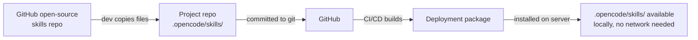
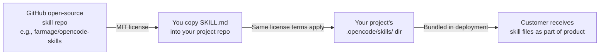

# Skills, MCP & RAG Integration Plan

## For the Agentic SDLC Framework

---

## 1. Why This Matters

The framework already has 15 agents, a supervisor, state management, and MCP server definitions. But agents operate with **static knowledge** (hardcoded system prompts + 4 built-in tools). They cannot:

- Discover and load specialized instructions at runtime (Skills)
- Connect to external systems dynamically (MCP)
- Recall past decisions or context across sessions (RAG)

This document defines how to add these three layers **generically** — so any project using the framework benefits, regardless of LLM provider, deployment environment, or available tooling.

---

## 2. Design Principles

### 2.1 Provider/Model Independence
Nothing in this design assumes OpenCode, Claude, GPT, or any specific LLM. The framework defines its own:
- **Skill format**: Markdown with YAML frontmatter (universal standard)
- **MCP client**: Uses the Model Context Protocol spec (vendor-neutral)
- **RAG pipeline**: Standard embedding + vector DB (any provider)

Each layer abstracts the LLM provider behind `AgentRuntime.js` — swap the model, keep the skills.

### 2.2 Graceful Degradation (Resilience First)
Every integration point must have a fallback:

| Layer | If Available | If Unavailable |
|---|---|---|
| **Skills** | Load skill → augment prompt | Use default system prompt (unchanged) |
| **MCP** | Register tools → agent can call them | Agent uses 4 built-in functions only |
| **RAG** | Query vector store → inject context | Skip RAG step, proceed without past context |

**No single failure should block agent execution.**

### 2.3 Configuration Over Convention
Everything is declared in JSON configuration files — not hardcoded. Deployers can:
- Remove MCP servers they don't have
- Disable RAG if no vector DB is available  
- Use a subset of skills
- Override everything per project

---

## 3. Layer 1: Skills

### 3.1 What Skills Are

A skill is a Markdown file with YAML frontmatter that teaches an agent *how to do something*. It is NOT a tool or API — it's instructions.

```yaml
---
name: code-review-checklist
description: Standardized code review workflow for agent 07a-d, 08, 13
compatibility: universal
metadata:
  audience: code-agents
  phase: pre-commit
---

## What this skill provides
- Review checklist for logic errors, security, performance, style
- Step-by-step review workflow
- Common anti-patterns to flag

## When to use
Use this when the agent is asked to review code changes before commit.
```

### 3.2 Skill Registry (`SKILL_REGISTRY.json`)

Each project has a skill registry that maps agents to their required and optional skills:

```json
{
  "_schema_version": "1.0",
  "project": "petemart",
  "default_skills": {
    "all_agents": ["output-formatting", "compliance-basics"],
    "code_agents": ["code-review-checklist", "pre-commit-gate"]
  },
  "agent_skills": {
    "01_ideation_agent": {
      "required": ["market-research-methodology", "uvp-design"],
      "optional": ["competitor-analysis", "cost-modeling"],
      "fallback_prompt": "Conduct market research using general best practices."
    },
    "03_architect_agent": {
      "required": ["c4-modeling", "architecture-decision-records"],
      "optional": ["cost-modeling", "security-architecture", "diagram-generation"]
    },
    "07a_ui_agent": {
      "required": ["frontend-patterns", "responsive-design"],
      "optional": ["accessibility-audit", "localization"],
      "mcp_servers": ["playwright", "puppeteer"]
    },
    "08_qa_agent": {
      "required": ["test-strategy", "playwright-patterns"],
      "optional": ["security-testing", "performance-benchmarking"],
      "mcp_servers": ["playwright", "sonarqube"]
    }
  },
  "skill_paths": {
    "default": ".opencode/skills/universal/",
    "project": "00_state_ledger/projects/petemart/skills/",
    "fallback": ".opencode/skills/universal/"
  }
}
```

### 3.3 Resolution Order (Resilience)

When a skill is requested, the framework resolves in this order:

```
1. Project-specific: 00_state_ledger/projects/{project}/skills/{name}/SKILL.md
2. Universal:         .opencode/skills/universal/{name}/SKILL.md
3. Built-in fallback: AgentRuntime's hardcoded default prompt
```

If ALL paths fail → agent runs with its default system prompt (no augmentation).

### 3.4 Runtime Hook (Provider-Independent)

In `AgentRuntime.js`, before building the LLM prompt:

```javascript
function loadSkillContext(agentId, project) {
  const registry = readJSON('SKILL_REGISTRY.json');
  const agentSkills = registry.agent_skills[agentId];
  const loaded = [];

  // 1. Load required skills
  for (const skillName of (agentSkills?.required || [])) {
    const content = resolveAndReadSkill(skillName, project);
    if (content) loaded.push(content);
  }

  // 2. Load optional skills (skip if not found)
  for (const skillName of (agentSkills?.optional || [])) {
    const content = resolveAndReadSkill(skillName, project);
    if (content) loaded.push(content);
    // No error — optional skills can be missing
  }

  // 3. Inject into prompt
  return loaded.length > 0
    ? `## Loaded Skills\n${loaded.join('\n\n')}`
    : '';
}
```

---

## 4. Layer 2: MCP Integration

### 4.1 Current State

`MCP_SERVERS.json` defines 8 servers with 57 tools. But:
- Only SonarQube is wired in `opencode.json`
- `AgentRuntime.js` does NOT connect to any MCP server
- Per-agent tool assignments (`agents[]` arrays) are empty

### 4.2 Proposed: Dynamic MCP Client

A lightweight MCP client that runs inside the framework — not dependent on OpenCode's MCP support:

```javascript
// scripts/runtime/MCPClient.js
class MCPClient {
  constructor(config) {
    this.servers = new Map(); // serverId -> { transport, tools }
  }

  async connect(serverDef) {
    // Supports two transports:
    if (serverDef.type === 'local') {
      // Spawn subprocess, communicate via stdio JSON-RPC
      this.servers.set(serverDef.id, await StdioTransport.connect(serverDef));
    } else if (serverDef.type === 'remote') {
      // Connect via SSE or Streamable HTTP
      this.servers.set(serverDef.id, await HTTPTransport.connect(serverDef));
    }
  }

  async listTools(serverId) { /* MCP tools/list */ }
  async callTool(serverId, toolName, args) { /* MCP tools/call */ }
  async disconnect(serverId) { /* cleanup */ }
}
```

### 4.3 Agent Integration

In `AgentRuntime.js`, before the LLM call:

```javascript
async function registerMCPTools(agentId, mcpClient) {
  const registry = readJSON('SKILL_REGISTRY.json');
  const agentConfig = registry.agent_skills[agentId];
  const serverIds = agentConfig?.mcp_servers || [];
  const tools = [];

  for (const serverId of serverIds) {
    try {
      const serverTools = await mcpClient.listTools(serverId);
      tools.push(...serverTools.map(t => ({
        ...t,
        serverId, // track origin for routing responses
      })));
    } catch (err) {
      log(`MCP server "${serverId}" unavailable: ${err.message}`);
      // GRACEFUL DEGRADATION — agent continues without this server's tools
    }
  }

  return tools;
}
```

### 4.4 Deployment Resilience

| Scenario | Behavior |
|---|---|
| MCP server not installed | `connect()` fails → `listTools()` throws → logged, skipped |
| MCP server crashes mid-session | Next `callTool()` returns error → agent retries or skips |
| Network down (remote MCP) | Connection timeout → server excluded from tool list |
| No MCP servers configured | `mcp_servers: []` → agent uses 4 built-in functions only |
| MCP server removed in future | Config update removes from `MCP_SERVERS.json` → no code change |

**The agent ALWAYS works without MCP.** Tools are augmentation, not requirements.

### 4.5 Multi-Project MCP Config

```json
// 00_state_ledger/projects/petemart/mcp-config.json
{
  "project": "petemart",
  "servers": {
    "github": { "type": "local", "command": ["npx", "-y", "@modelcontextprotocol/server-github"], "enabled": true },
    "supabase": { "type": "local", "command": ["npx", "-y", "@anthropic/mcp-supabase"], "enabled": true },
    "sentry": { "type": "remote", "url": "https://mcp.sentry.dev/mcp", "enabled": false }
  }
}
```

Each project enables/disables MCP servers independently. A new project can use a different subset.

---

## 5. Layer 3: RAG Integration

### 5.1 What RAG Provides

Agents retrieve **relevant past context** before executing:
- Past state transitions and decisions (from `traces.jsonl`)
- Previous conversation context (from `context_lake/`)
- Known defects and resolutions (from `qa-dashboard/`)
- Architecture decisions (from `docs/`)

### 5.2 Architecture (Provider-Independent)

```
[AgentRuntime.runAgent()]
    │
    ├── 1. Build query from task + agentId
    │
    ├── 2. Call RAG_PIPELINE (via local script or MCP server)
    │     │
    │     ├── Embed query (text-embedding-3-small / any embedding model)
    │     ├── Vector search (Chroma / Supabase pgvector / LanceDB)
    │     └── Return top-k results
    │
    ├── 3. If results → inject as "[PAST CONTEXT]" section in prompt
    │
    └── 4. Proceed with LLM call
```

### 5.3 RAG Pipeline Script

```javascript
// scripts/rag-pipeline.js — standalone, no OpenCode dependency
const EMBEDDING_MODEL = process.env.EMBEDDING_MODEL || 'text-embedding-3-small';
const VECTOR_DB = process.env.VECTOR_DB || 'chroma'; // chroma, supabase, lancedb
const TOP_K = parseInt(process.env.RAG_TOP_K || '5');

async function query(query_text, project, agentId) {
  const embedding = await embed(query_text, EMBEDDING_MODEL);
  const results = await vectorSearch(embedding, {
    project,          // scope to project
    agentId,          // prefer same-agent results
    topK: TOP_K,
    maxTokens: 2000,  // limit per result to control context cost
  });
  return results;
}
```

### 5.4 Resilience

| Scenario | Behavior |
|---|---|
| Vector DB not configured | RAG step skipped, `context_lake` used as fallback text search |
| Embedding API down | Use BM25 keyword fallback on `traces.jsonl` |
| No relevant results found | Return empty, agent proceeds without past context |
| Index empty (first run) | No results — agent works normally |
| Project has no RAG config | Disabled entirely |

### 5.5 Fallback Chain

```
RAG query
  ├── Vector DB (primary) → return embeddings results
  ├── Keyword search (fallback) → regex match on traces.jsonl
  └── No results → skip RAG, agent proceeds
```

---

## 6. How Agents Use Skills + MCP + RAG Together

### Full Flow (AgentRuntime.runAgent)

```
1. Load agent definition from AGENT_REGISTRY.json
2. Build base system prompt

3. [RAG] Query vector store with task description
   ├── Success → inject top-3 results as "[PAST CONTEXT]"
   └── Fail/empty → skip

4. [SKILLS] Load skill registry for this agent
   ├── For each required skill:
   │   ├── Resolve path (project → universal → built-in)
   │   ├── Found? → load SKILL.md content
   │   └── Not found? → log warning, use fallback_prompt text
   ├── For each optional skill:
   │   ├── Found? → load
   │   └── Not found? → skip silently
   └── Inject loaded skills as "[LOADED SKILLS]" section

5. [MCP] Register tools
   ├── For each MCP server in agent's config:
   │   ├── Connect → list tools → register in LLM tool list
   │   └── Fail → log, skip (agent still works)
   └── Built-in tools always available (write_artifact, etc.)

6. Call LLM with:
   ├── System prompt (from AGENT_REGISTRY)
   ├── LOADED SKILLS section
   ├── PAST CONTEXT section
   ├── Available MCP tools (if any)
   └── User task

7. Process response, handle tool calls, write artifacts
```

### Per-Agent Behavior Matrix

```json
{
  "01_ideation_agent": {
    "skills": ["market-research", "uvp-design"],
    "mcp": ["web-search", "firecrawl"],
    "rag": "Past market analysis for same market area"
  },
  "03_architect_agent": {
    "skills": ["c4-modeling", "architecture-decisions"],
    "mcp": ["github"],
    "rag": "Previous architecture decisions for similar requirements"
  },
  "07a_ui_agent": {
    "skills": ["frontend-patterns", "responsive-design"],
    "mcp": ["playwright", "puppeteer"],
    "rag": "Past UI implementation patterns"
  },
  "08_qa_agent": {
    "skills": ["test-strategy", "playwright-patterns"],
    "mcp": ["playwright", "sonarqube"],
    "rag": "Previously found defects in this area"
  },
  "13_maintenance_agent": {
    "skills": ["debugging-patterns", "hotfix-workflow"],
    "mcp": ["github", "sentry"],
    "rag": "How similar errors were resolved before"
  },
  "14_finops_agent": {
    "skills": ["cost-analysis"],
    "mcp": [],
    "rag": "Past cost impact of scaling decisions"
  },
  "15_secrets_compliance_agent": {
    "skills": ["secrets-scanning", "compliance-checklist"],
    "mcp": ["github"],
    "rag": "Previously flagged compliance issues"
  }
}
```

---

## 7. Provider/Model Independence

### 7.1 Why This Matters

If the framework is deployed 6 months from now with a different LLM (e.g., Llama 5, Claude 5, GPT-6), everything should still work. The integration layers must not assume:

- A specific LLM's tool-calling format
- A specific MCP client implementation
- A specific skill-loading mechanism
- A specific embedding model

### 7.2 Abstraction Layers

```
┌─────────────────────────────────────────────────────┐
│                  AgentRuntime.js                     │
│  (Framework core — no provider imports)              │
├─────────────────────────────────────────────────────┤
│                                                       │
│  SkillLoader │ MCPClient │ RAGPipeline               │
│  (JSON config)│ (MCP stdio/HTTP)│ (embed + vector DB)│
│                                                       │
├─────────────────────────────────────────────────────┤
│                                                       │
│  LLMProvider.js  (translation layer)                 │
│  ├── OpenAI-compatible / Anthropic / Google / Llama  │
│  └── Maps internal tool format → provider's format    │
│                                                       │
└─────────────────────────────────────────────────────┘
```

### 7.3 What Makes It Provider-Independent

| Concern | Implementation | Why It's Generic |
|---|---|---|
| Skills | Plain Markdown + YAML | Any LLM can read markdown instructions |
| MCP | MCP Protocol (JSON-RPC over stdio/HTTP) | Vendor-neutral protocol |
| RAG | Embedding API + vector DB query | Any embedding model, any DB |
| Tool format | Internal tool schema → mapped per-provider | LLMProvider translates |
| System prompts | From AGENT_REGISTRY.json | Just text — no provider-specific syntax |

### 7.4 LLMProvider Translation Layer

```javascript
// scripts/runtime/LLMProvider.js
class LLMProvider {
  async chat(messages, tools, options) {
    const provider = options.provider || process.env.LLM_PROVIDER || 'opencode';

    const internalTools = tools.map(t => ({
      name: t.name,
      description: t.description,
      inputSchema: t.inputSchema,
    }));

    switch (provider) {
      case 'opencode':
      case 'openai':
        return this.callOpenAICompatible(messages, internalTools, options);
      case 'anthropic':
        return this.callAnthropic(messages, internalTools, options);
      case 'google':
        return this.callGoogle(messages, internalTools, options);
      case 'local':
        return this.callLocal(messages, internalTools, options);
      default:
        return this.callOpenAICompatible(messages, internalTools, options);
    }
  }
}
```

---

## 8. Deployment & Runtime Resilience

### 8.1 Configuration-Driven Degradation

All three layers are controlled by project-level JSON config. Deployers can independently disable any layer:

```json
// 00_state_ledger/projects/petemart/integration-config.json
{
  "project": "petemart",
  "skills": {
    "enabled": true,
    "strict": false,        // false = optional skills can be missing
    "fallback_to_prompt": true
  },
  "mcp": {
    "enabled": true,
    "connection_timeout_ms": 5000,
    "require_all": false    // false = skip failing servers
  },
  "rag": {
    "enabled": false,       // disabled until vector DB is set up
    "embedding_model": "text-embedding-3-small",
    "vector_db": "chroma",
    "top_k": 3,
    "fallback_search": true // use keyword search if vector DB unavailable
  }
}
```

### 8.2 What Happens When Something Is Missing

| Missing | Behavior | Effect on Agent |
|---|---|---|
| All skills unavailable | Agent uses default system prompt | None — works as today |
| One required skill missing | Log warning, use fallback_prompt text | Minimal — loses some guidance |
| One optional skill missing | Silent skip | None |
| All MCP servers down | Agent uses 4 built-in functions | Limited — no external tool access |
| Some MCP servers down | Log error, skip failed servers | Partial — other MCPs still work |
| Vector DB unavailable | Fallback to keyword search | Slightly less relevant results |
| Embedding API down | Skip RAG entirely | No past context — agent still works |
| `integration-config.json` missing | All three layers default to disabled | Works as current framework |

### 8.3 Startup Validation (Degrees of Readiness)

When the framework starts for a project, it logs readiness:

```
[BOOT] Project: petemart
[BOOT] Skills: ENABLED (12 registered, 2 unavailable — degraded)
[BOOT] MCP:    ENABLED (5/8 servers connected — degraded)
[BOOT] RAG:    DISABLED (no vector DB configured)
[BOOT] Agent runtime: OPERATIONAL
```

---

## 9. Implementation Checklist

### Phase 1 — Foundation (3-4 days)
- [ ] Create `scripts/runtime/SkillLoader.js` — reads SKILL_REGISTRY.json, resolves skill paths, loads SKILL.md content
- [ ] Create `scripts/runtime/MCPClient.js` — dynamic MCP client with stdio/HTTP transports
- [ ] Create `scripts/runtime/RAGPipeline.js` — embedding + vector search with fallback chain
- [ ] Add `integration-config.json` per project (schema + validation)
- [ ] Update `AgentRuntime.js` to call all three layers before LLM call

### Phase 2 — Content (2-3 days)
- [ ] Create `SKILL_REGISTRY.json` schema and populate for petemart project
- [ ] Convert existing `.antigravity/skills/` to OpenCode skill format
- [ ] Create universal skills: `code-review-checklist`, `compliance-basics`, `output-formatting`, `pre-commit-gate`
- [ ] Create agent-specific skills for all 15 agents
- [ ] Wire MCP servers in `opencode.json` (GitHub, Supabase, Sentry, others)

### Phase 3 — RAG Data Ingestion (2-3 days)
- [ ] Create `scripts/rag-ingest.js` — batch embeds traces.jsonl, context_lake, memory_store
- [ ] Create `scripts/rag-ingest-watch.js` — watch mode for real-time ingestion
- [ ] Wire `context_lake/capture.py` to push to vector store
- [ ] Populate initial vector index with existing trace data

### Phase 4 — Multi-Project Generic Layer (2 days)
- [ ] Template project initialization: `node scripts/init-project.js --name <project>`
- [ ] Template `SKILL_REGISTRY.json`, `MCP_SERVERS.json`, `integration-config.json`
- [ ] Document in `docs/project-setup-guide.md`

---

## 10. Deployment Resilience: Missing MCP Servers & Skills

### 10.1 The Core Concern

> *"If the product is deployed somewhere outside our control and a specific MCP server (e.g., GitHub MCP, Sentry MCP) is not available, how does the agent that depends on it work?"*

### 10.2 MCP Servers: Never a Hard Dependency

**Design rule:** Every agent's `mcp_servers` list in the skill registry is a *wishlist*, not a *requirement*.

#### Scenario: Agent 08 (QA) expects GitHub + SonarQube MCP, but only SonarQube is available

```
AgentRuntime tries to connect:
  ├── github → connect fails (not installed) → log warning → SKIP
  ├── sonarqube → connect success → register 5 tools
  └── Result: Agent 08 has 4 built-in tools + 5 SonarQube tools
                 → Can still review code, run tests, analyze quality
                 → Cannot create PRs or inspect repos (loses GitHub tools)
                 → NEVER blocks or crashes
```

**What happens to the agent's behavior:**

| MCP Server Status | Tools Available | Agent Can Still Do |
|---|---|---|
| All MCPs available | 4 built-in + 57 MCP tools | Everything |
| Some MCPs missing | 4 built-in + subset of MCPs | Partial external access |
| All MCPs missing | 4 built-in tools only | Read/write state, analyze files, generate code — same as today |
| MCP server removed mid-deployment (updated config) | Server removed from config → framework never tries to connect → clean skip | |

**How to remove a server at deployment:** Just edit the project's `MCP_SERVERS.json` or `integration-config.json`:

```json
// Before:
"github": { "type": "local", "command": ["npx", "-y", "@modelcontextprotocol/server-github"], "enabled": true }

// After (disabled — agent won't try to connect):
"github": { "enabled": false }

// After (removed entirely — framework sees no entry, skips silently):
// (entry deleted)
```

No code changes. No agent modifications. No pipeline restart needed.

### 10.3 Skills: Ship with the Product, Not Fetched at Runtime

**Critical design rule:** Skills are **local files bundled with the deployment**, not fetched from GitHub or any external source at runtime.

#### Where Skills Live in a Deployed Product

```
petemart-agentic-framework/
├── .opencode/
│   └── skills/
│       ├── universal/              ← Bundled with product
│       │   ├── code-review/        Always available
│       │   │   └── SKILL.md        No network required
│       │   ├── compliance-audit/
│       │   │   └── SKILL.md
│       │   └── output-formatting/
│       │       └── SKILL.md
│       └── projects/
│           └── petemart/           ← Bundled with product
│               ├── market-research/
│               │   └── SKILL.md
│               └── architecture-decisions/
│                   └── SKILL.md
```

**How skills get into the deployment:**



**Skills are never fetched at runtime.** They are:
1. Curated/vendored during development (copied from open-source repos)
2. Committed to the project's git repository
3. Included in the deployment build artifact
4. Read from local disk by the framework at runtime

#### If GitHub Is Unavailable

| Scenario | Impact on Skills |
|---|---|
| GitHub down during development | Cannot browse open-source repos for new skills. Existing skills already in repo work fine. |
| GitHub down during CI/CD | The build runs from code already in the repo. No issue. |
| GitHub down in production | Zero impact. Skills are on local disk, not fetched from GitHub. |
| Production server has no internet | Skills work. They're local files. |
| New project needs skills | Skills are copied from the template or another project's `.opencode/skills/` directory. |

#### What If a Specific Skill File Is Missing?

```
SkillLoader tries to load:
  ├── Resolve path: .opencode/skills/projects/petemart/market-research/SKILL.md
  ├── File not found
  ├── Try fallback: .opencode/skills/universal/research-methodology/SKILL.md
  │   ├── Found? → Use it
  │   └── Not found? → Use agent's hardcoded fallback_prompt text
  └── Agent runs normally (loses that skill's guidance, gains nothing)
```

**The agent never crashes because a skill is missing.** It just loses that specific instruction set.

### 10.4 Example: A Real Deployment Scenario

Company X deploys the Petemart framework for their internal SDLC. They have:

**Available:**
- `filesystem` MCP (built-in)
- `web-search` MCP (they have a search API key)

**Not Available:**
- `github` MCP (they use GitLab, not GitHub)
- `sonarqube` MCP (they use a different static analysis tool)
- `sentry` MCP (they use their own error tracking)

**What happens:**

```
[Booting project "acme-sdlc"]
  Skills: ENABLED (18/20 available — 2 project-specific not found, using fallback prompts)
  MCP:    PARTIAL (filesystem + web-search connected; github, sonarqube, sentry skipped)
  RAG:    DISABLED (no vector DB configured — optional)
  Status: OPERATIONAL (all agents functional, reduced external tool access)
```

Agent 08 (QA) runs with: 4 built-in tools + web-search (can search docs but can't query SonarQube). It still tests, reviews code, and generates reports. It just can't fetch SonarQube metrics.

Agent 03 (Architect) runs with: 4 built-in tools + web-search. It designs architecture, generates diagrams, writes specs. It doesn't have GitHub to look at past PRs, but it reads local state files instead.

**Every agent still works.** They're just less powerful without the optional MCP servers.

### 10.5 Operational Rule Summary

| Rule | Rationale |
|---|---|
| Never require a specific MCP server for an agent to function | MCP is augmentation, not dependency |
| Never fetch skills from the network at runtime | Skills are local files, bundled with deployment |
| Always provide a `fallback_prompt` for each required skill | Missing skill → agent still gets some guidance |
| Log availability at startup | Deployers see what's missing without guessing |
| Config-driven enable/disable | No code changes to add/remove servers or skills |
| Every agent works with 0 MCP servers and 0 skills | The 4 built-in functions + system prompt are sufficient |

---

## 11. MCP Server Tier Analysis & Selection

### 11.1 Tier Classification

Not all MCP servers are equal. Some are maintained by large organizations with stable APIs. Others are community projects that may disappear. This section classifies every server in the framework by risk level.

| Tier | Label | Definition | What Happens If It Disappears |
|---|---|---|---|
| **T1** | Built-in | Part of the runtime itself, no external dependency | Cannot disappear — ships with framework |
| **T2** | Stable | Maintained by a major org (Microsoft, Google, GitHub, Anthropic), backed by a stable API | API may change but service won't vanish overnight |
| **T3** | Conditional | Useful but requires specific infra (DB, SaaS account) | Falls back gracefully — agent works without it |
| **T4** | Experimental | Community project, no SLA, may break without notice | Must not be required by any agent |

### 11.2 Server-by-Server Classification

| MCP Server | Tier | Maintainer | Risk Level | Fallback If Missing |
|---|---|---|---|---|
| **Filesystem** | T1 | Framework runtime | None — ships with code | N/A — always present |
| **Web Search** | T1 | Framework runtime | None — built-in | N/A — always present |
| **Web Fetch** | T1 | Framework runtime | None — built-in | N/A — always present |
| **GitHub** | T2 | Anthropic/OpenAI (`@modelcontextprotocol`) | Low — widely used, MS-owned platform | Agent reads local state files instead of querying GitHub |
| **Playwright E2E** | T2 | Microsoft | Low — mature project, well-funded | Agent uses built-in testing instructions (no browser automation) |
| **Puppeteer Browser** | T2 | Google | Low — Chrome team maintained | Agent uses built-in browse_files instead |
| **SonarQube Cloud** | T2 | SonarSource | Low — commercial SaaS, stable API | Agent uses code-review skill (manual analysis instead of automated) |
| **PostgreSQL** | T3 | Various (Supabase, Neon, custom) | Medium — depends on DB being present | Agent uses SQL-focused skill instead of live querying |
| **Sentry** | T3 | Functional Software, Inc. | Low — public company, stable MCP | Agent uses debugging skill instead of live error fetch |
| **Jira** | T3 | Atlassian | Medium — MCP is community, not official | Agent reads local AGENT_MESSAGES / state files instead |
| **Vercel** | T3 | Vercel Inc. | Low — official MCP from Vercel | Agent writes deployment notes to artifact instead of deploying |
| **Firecrawl** | T4 | Community | Medium-high — startup, could pivot | Agent uses built-in web-search + web-fetch instead |
| **Context7** | T4 | Community (Upstash) | Medium — free tier may change | Agent uses built-in web-search for docs lookup |
| **Typefully** | T4 | Community | Higher — niche service | Agent generates content as artifact, not posted live |

### 11.3 MCP Servers That Should Ship with the Framework (T1)

These are not optional. They are part of the runtime and must always be present:

| Server | Why It's Mandatory | What It Does |
|---|---|---|
| `filesystem` | Agent needs to read/write state files, artifacts, configs | Read/write files in workspace |
| `web-search` | Agents need to research markets, docs, libraries | Search the web via built-in search |
| `web-fetch` | Agents need to fetch URLs, APIs, documentation | HTTP GET requests |

**Fallback for T1:** None needed. They ship with the framework binary.

### 11.4 MCP Servers That Are Strongly Recommended (T2)

These provide significant value but the framework works without them:

| Server | What Agent Loses Without It | Mitigation |
|---|---|---|
| `github` | Cannot inspect PRs, commits, create branches | Agent reads local state files, artifact history |
| `playwright` | Cannot run E2E browser tests | QA agent uses unit tests + manual instructions |
| `sonarqube` | Cannot fetch automated code quality metrics | Code-review skill provides manual review checklist |
| `puppeteer` | Cannot take screenshots or render pages | Agent uses browse_files to examine code instead |

### 11.5 MCP Servers That Are Safe to Skip (T3-T4)

These are entirely optional. Many deployments will never use them:

| Server | Typical Use Case | Alternative |
|---|---|---|
| `postgresql` | Live schema inspection, query execution | Backend DB agent reads schema files |
| `sentry` | Live error feed from production | Maintenance agent reads log files |
| `jira` | Live ticket management | Agent reads local subtasks.jsonl |
| `vercel` | One-click deployment | Agent writes deployment instructions as artifact |
| `firecrawl` | Advanced web scraping | web-fetch + web-search combo |
| `context7` | LLM docs lookup | web-search can find documentation |
| `typefully` | Social media posting | Marketing agent generates content, manual post |

### 11.6 How an Agent Adapts When a T2 MCP Server Is Missing

```
Agent 08 (QA) configured for: [playwright, sonarqube, github]

At deployment:
├── playwright → CONNECTED (server available)
├── sonarqube  → FAILED (no API key configured)
├── github     → FAILED (company uses GitLab)

AgentRuntime registers:
├── 4 built-in tools
├── ~4 playwright tools (run test, capture screenshot, etc.)
└── 0 sonarqube tools
    └── 0 github tools

Agent's system prompt automatically adjusts:
┌─ Before: "Use SonarQube to analyze code quality."
└─ After:  "SonarQube is unavailable. Use code review checklist instead."
```

**The prompt adjustment** comes from the skill layer — when `sonarqube` MCP is registered as unavailable, the framework loads the `sonarqube-unavailable.md` fallback skill (or the agent's generic `code-review` skill) which contains instructions for manual quality analysis.

---

## 12. Skills Licensing & Customer Visibility

### 12.1 Licensing Obligations for Bundled Skills

Skills are SKILL.md files — they are documentation/instructions, not executable code. However, they may have license terms.

#### When You Copy a Skill from an Open-Source Repo



**License types commonly found on skills:**

| License | Can Bundle in Product? | Requirement |
|---|---|---|
| **MIT** | Yes | Include the license notice (attribution) |
| **Apache 2.0** | Yes | Include the license notice + notice file |
| **CC-BY-4.0** | Yes | Credit the author |
| **CC0** (public domain) | Yes | None |
| **Proprietary / All Rights Reserved** | No | Cannot bundle without permission |

#### Practical Approach

```yaml
# .opencode/skills/universal/code-review/SKILL.md
---
name: code-review-checklist
description: Standardized code review workflow
license: MIT
source: https://github.com/farmage/opencode-skills
---
```

Each skill carries its license in the frontmatter. The framework can:
1. Log all skills and their licenses at build time
2. Generate a `SKILLS_LICENSES.md` file listing every bundled skill + source + license
3. Include this in the deployment artifact

#### Licensing Process for Each Skill Added to the Framework

```
1. Developer finds skill on GitHub
2. Check the license (frontmatter or repo LICENSE file)
   ├── Permissive (MIT, Apache, CC0) → can bundle
   └── Restrictive (GPL, proprietary) → do NOT bundle, write equivalent from scratch
3. Copy SKILL.md + references/ into project's .opencode/skills/
4. Add source URL and license to skill frontmatter
5. Commit to project repo
```

### 12.2 Can Customers See What Skills Are Used?

**Yes — by design.** The skill registry is transparent.

#### What Customers Can See

| What | Where | How |
|---|---|---|
| List of all skills | `SKILL_REGISTRY.json` | Config file in deployment |
| Per-agent skill assignments | `SKILL_REGISTRY.json` → `agent_skills` | JSON structure shows which skills each agent uses |
| Skill content | `.opencode/skills/*/SKILL.md` | Plain markdown files — readable by anyone |
| Skill origin + license | Skill frontmatter (`source`, `license` fields) | Visible at the top of each SKILL.md |
| MCP server config | `MCP_SERVERS.json` or `integration-config.json` | Shows enabled/disabled status per deployment |
| What's available at startup | Boot log | Printed to stdout on framework start |

#### Example: What a Customer Sees in Their Deployed Instance

```json
// 00_state_ledger/projects/acme/integration-config.json (excerpt)
{
  "skills": {
    "market-research-methodology": {
      "name": "Market Research Methodology",
      "used_by": ["01_ideation_agent"],
      "license": "MIT",
      "source": "https://github.com/farmage/opencode-skills"
    },
    "code-review-checklist": {
      "name": "Code Review Checklist",
      "used_by": ["07a_ui_agent", "07b_api_agent", "07c_backend_db_agent", "08_qa_agent"],
      "license": "MIT",
      "source": "https://github.com/VoltAgent/awesome-agent-skills"
    }
  }
}
```

#### Visibility Controls

| Concern | How It's Handled |
|---|---|
| Customer sees skill content | Yes — SKILL.md files are plain text, deployed as-is |
| Customer sees skill origin | Yes — `source` field in frontmatter shows GitHub URL |
| Customer sees skill license | Yes — `license` field in frontmatter |
| Can a customer modify skills? | Yes — they can edit SKILL.md files in their deployment |
| Can a customer add their own skills? | Yes — add to `.opencode/skills/` and update `SKILL_REGISTRY.json` |
| Can skills be hidden? | No — they are markdown files on disk, always readable |
| What about proprietary/custom skills? | Written by your team for your project, owned by you, no external license needed |

**This transparency is a feature, not a bug.** Customers can:
- Audit which instructions their agents follow
- Customize or extend skills for their specific needs
- Verify that no unauthorized skills are injected
- Understand where each skill came from (trust verification)
